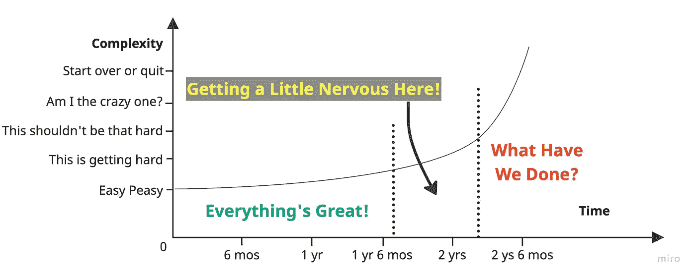
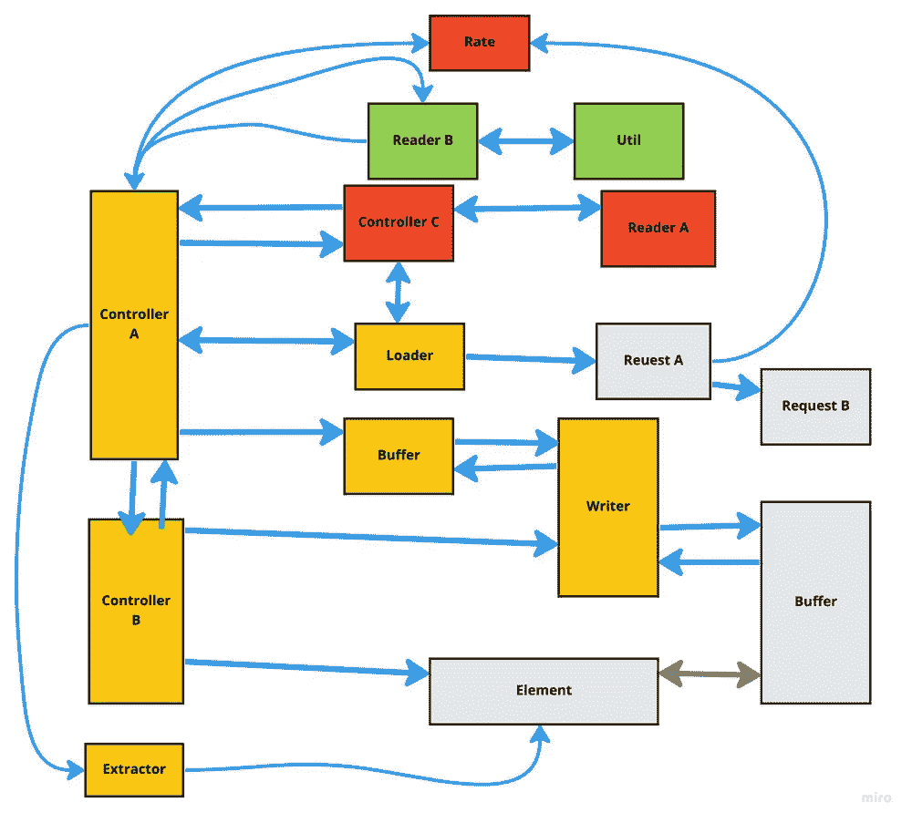
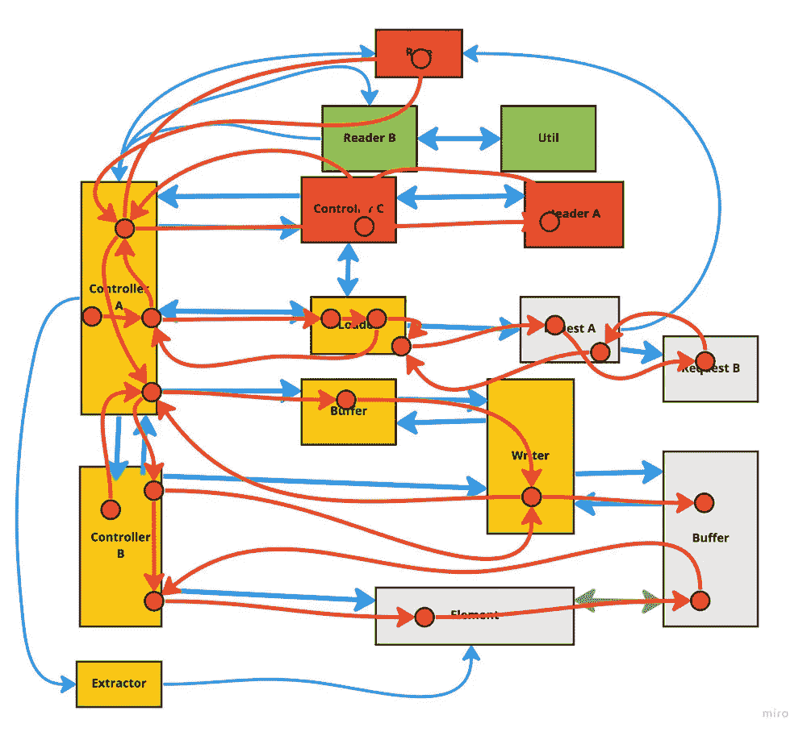
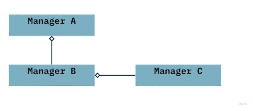
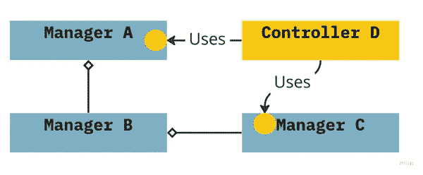

# 代码复杂性曲棍球棒

> 原文：<https://betterprogramming.pub/the-code-complexity-hockey-stick-bd4985d9fc33>

## 面向对象的设计经常导致严重的复杂性。为什么？


照片由[马太·亨利](https://burst.shopify.com/@matthew_henry?utm_campaign=photo_credit&amp;utm_content=Picture+of+Ready+For+The+Slap+Shot+%E2%80%94+Free+Stock+Photo&amp;utm_medium=referral&amp;utm_source=credit)从[爆出](https://burst.shopify.com/ice?utm_campaign=photo_credit&amp;utm_content=Picture+of+Ready+For+The+Slap+Shot+%E2%80%94+Free+Stock+Photo&amp;utm_medium=referral&amp;utm_source=credit)。被作者修改(很差)。

我为网络制作视频播放器。从外面看，这样的球员似乎很简单；在你的页面上贴上一个 html 标签，指向一个媒体文件，稍微用力一点，你就可以开始了。试试看。我谅你也不敢。

不要忘记拼接广告，处理自定义字幕，并考虑所有不同设备上的所有不同浏览器。哦，还有跟踪和寻找，全屏和实现一个良好的用户界面和…我希望你得到图片。

视频播放器被证明是不平凡的，因为它们包含了以不可预测的方式相互作用的各种各样的功能。几乎所有我用过的视频播放器，包括几个我自己制作的，最终都被自己的重量压垮了。他们有耦合问题。它们不太容易扩展。玩家团队陷入修复模糊问题的困境。随着时间的推移，新特性变得越来越复杂和脆弱。

像视频播放器这样的应用程序——有许多相互关联的状态——很容易成为复杂的曲棍球棒图的牺牲品:



丹尼尔·尼兰德制图

你们中有多少人熟悉这个过程？事情是这样的:

你很幸运能参与一个全新的项目，在最初的一两年里一切都很顺利。发展很快。功能从指尖滚下，几乎没有疏忽。但是事情发生了——而且可能是突然发生的。问题接踵而来。修复一段代码通常会破坏其他东西。再过一两年，你就变得疑神疑鬼，一丝不苟。你用我的猫晚上出去的天赋批准了 PRs 像敌人领地上的突击队员一样窥视每个角落。

哎哟！你已经被曲棍球棒的商业一端击垮了。

# 控制器经理糊涂了

我一次又一次地看到复杂的客户端应用程序使用相同的通用模式(我这里的*不是指 web 应用程序，就像 React 或 Angular 中的大多数页面一样——而是指视频播放器)。这是一种我从未在任何软件架构书籍中见过的设计模式，尽管我相信它是[模型-视图-控制器](https://en.wikipedia.org/wiki/Model%E2%80%93view%E2%80%93controller)模式的扩展。我称之为控制器-管理器-混乱模式(CMM)。*

当您试图通过扩展 MVC 的控制器部分来处理复杂的业务逻辑，从而应用“好的”面向对象设计的原则时，CMM 就会发生。你最终会得到几个神级的控制者和一群支持经理、工厂、引擎和物品——整个奥林匹斯山都是次要的神。这些类中的每一个，如果构建得“好”，都会努力封装自己的状态。

但是这些类有凝聚力吗？没有那么多。五千行代码(是的，我亲眼见过)对一个单一的长期状态做了随机的事情，这没有任何内聚性。

我们姑且称之为:一场该死的灾难。

我不讨厌这里。人们正在尽最大努力。软件架构书籍过分关注后端，几乎不可能将所有最新的创新转化为对大规模前端应用程序有意义的东西。谷歌一下。大多数书籍和文章要么写得很差，要么专注于 React。React 和 Redux 很棒，但它们不是为处理我们的用例而构建的。

那么我们如何填补这一空白呢？首先，我们必须理解为什么控制器-管理器-混淆把我们带入了一个复杂性的角落。

这是一个典型的 CMM 应用的图表。



名称稍有改变的实际 CMM 图。

这个应用程序是如何工作的非常清楚…不！(这是复兴 X 世代迷因的安全空间吗？)

实际上，我很高兴与这个应用程序一起工作，它制作得并不差。它在很多事情上都做得很好，但几年后，它屈服于曲棍球棒。维护和扩展变得非常困难。

问题是:像这样的应用程序是由封装了长期状态的类组成的。为了完成任何事情，每个控制器和管理器都必须在关键时刻与应用程序的其他部分共享其内部状态。所有这些都是非常面向对象的，似乎是合乎逻辑的事情。

但这是一种慢性死亡。这种设计在两个重要方面扼杀了你的应用程序。

# 应用死亡角。1:消息传递变得不灵活

请看下面的代码，它只是实例化广告管理器的函数的一小部分(基于真实代码，但为了混淆和简化而进行了更改):

```
...
this.adPlugin?.setAds(ads!);
if (ads?.importSys?.csai_type) {
   if (popPlaybackData.adsConfig) {
      popPlaybackData.adInsertConfig.isTlManRequired = true;
   }
   this.timelineAdsPlugin = new TimelineAdsPlugin(
      new JsonABProvider(),
      this.session,
      initialPlaybackData.type,
      this.pauseAdvsDispatcher!,
      initialPlaybackData
   );
   this.timelineAdsPlugin.setAds(ads!);
}
if (popPlaybackData.adsFailoverReason) {
   warn(`Error Fetching Ads data. Destroying Adverts Manager:`);
   this.destroy();
   return popPlaybackData;
}
const modPlaybackData = await this.modifyPlaybackData(popPlaybackData);this.adPolicyMan?.init(this.session.onPbTimelineUpdated.bind(this.session));this.abProvider?.setPlaybackData(modPlaybackData);return modPlaybackData;
```

我不是挑出这段代码作为特别糟糕的。对于任何包含对其他类的引用的类来说，这都是非常典型的。它是做什么的？有些成员类是有条件创建的。运行这段代码时，有些可能存在，也可能不存在，但是如果它们存在，我们将尝试初始化它们。数据被传递。甚至还有一点业务逻辑——如果 ads 发生故障，就摧毁管理器。

执行的顺序很明确…或者是？这里拉开了多少个子模块的序幕？所有这些状态将用于什么？要开始理解这段特定代码中的应用程序数据，您首先需要打开一个由管理器和特殊用途类组成的完整生态系统。您必须递归地跟踪每个函数调用，弄清楚它做什么，并理解返回值。

这是执行的流程。在这样的应用程序中很容易迷失方向。通常，理解程序的任何特定特性的认知负荷对于普通的开发人员来说都太大了。(也许这就是他们称之为神课的原因？)

但那又怎样？申请很复杂。依赖会发生。忍气吞声，学习代码。

如果我们再也不需要修改代码，这种态度可能是好的。

然而，在现实世界中，应用程序是不断发展的。旧的特征必须被修改。必须添加新功能。这几乎总是涉及修改通过代码传递的消息的*顺序*和*格式*。

回头看看上面的代码。那些电话的*顺序*可以修改吗？嗯，也许吧？考虑函数调用中的所有函数调用和所有需要设置的状态。如果我们不只是能够切换第 150 行和第 151 行，而是需要取出一段位于第 151 行实例化的类深处的目标代码，并将该代码放在第 150 行之前，但其余的代码必须留在原处，那该怎么办？你将如何开始划分这些东西？这并不是一个不常见的重构，但是你的执行流变得越古怪，代码就越容易出现不可预测的错误。

数据的*格式*也是一样。假设我们向现有的代码库添加了一个特性，该特性要求添加全新类型的数据。你如何传递这些新数据？如果它需要在应用程序的五个不同的不相关部分中随机使用呢？你只是增加更多的参数吗？注射？

重点来了。当您将类嵌入到其他类中并直接调用那些函数时，您不能不僵化您的执行流程。你需要折断骨头才能弯曲手臂。

# 应用死亡角。2:执行流程变得依赖于国家的结构

让我们跟随应用程序的执行流程，有点像在奇妙的航行中坐在潜艇里。在 CMM 模式中，它可能看起来像这样:



应用程序的流程像旋风一样绕着应用程序旋转。它必须走这条曲折的道路，因为这就是面向对象设计的工作方式，对吗？一个合适的类封装了它的状态，所以没有人需要处理细节。阿门。

这是一颗定时炸弹。如果应用程序状态作为一个整体变得足够复杂(如 web 播放器)，这种设计就会崩溃。一直都是。

但是崩溃的原因是微妙的。它是这样工作的:

我们倾向于用头脑中的一组初始用例来构建我们的程序。假设管理器 A 中的数据必须访问管理器 B 来异步完成一些工作。当经理 B 施展魔法时，它反过来调用经理 C，经理 C 做其他事情。你把这一切都联系起来，你按照执行的顺序烘烤并不重要。a 和 C 互不了解。你得到了封装。你甚至可能有凝聚力。世界是美好的。



现在，一年过去了。你的产品负责人带着一个新功能来找你，这个新功能需要以一种完全不同的方式与经理 A 和 C 中的数据进行交互。A 和 C 彼此之间什么都不知道，所以现在你需要想出如何实现这个功能。

有几种方法可以解决这个问题。也许你创建了一个新的控制器 D，它通过注入管理器 A 和管理器 C 来处理这个特性。当控制器 D 需要做它的事情时，它先点击 A，然后点击 C，(或者 C 然后点击 A，等等)，也许调用新生成的函数，让 A 和 C 修改它们自己的内部状态(封装，宝贝)。



不过，重要的是:现在有了跨三个不同类的单个特性的代码。这些类不再具有凝聚力(如果曾经有过的话)。一个类有很多特点。一个要素有许多类。耦合随之而来。

您可以暂时摆脱这种类型的分布式逻辑。但是，当您添加跨越有状态类的特性时，耦合会组合增长——甚至是指数增长。耦合越多，遇到绑定的可能性就越大。

绑定是由不兼容状态造成的逻辑缺陷。是耦合的无意后果。这些绑定表现为一个实际的 bug 动物园，但是最难修复和发现的是异步问题，其中状态从需要它的进程中被意外地改变，或者其中您不能预测状态被修改的顺序。

在一个复杂的系统中，这些束缚变得几乎不可能解开。但是你可以试试…

假设你遇到了这些束缚中的一种，通过顽强意志的纯粹力量，你找到了它的根源。你站在团队面前说，“还记得我们去年放进去的控制器 D 吗？”会议陷入沉默。去年他们中有多少人实际上参与了这个项目？

“嗯，”你说，“这是最奇怪的事情。该问题是由对经理 A 的函数调用以及产品真正需要的新功能引起的，但它仅在菲律宾满月时发生。”

似乎没人对你的谢洛克式侦查感兴趣。去他们的。你继续说，“除非完全重写，否则我们无法重构经理 D。”除了产品经理，大家都笑得很紧张。“但是，没问题，”你说。“我们只要插上‘isfullmoonphilipines’的旗帜，就可以继续前进。

疲惫的掌声。什么会出错？

这些绑定是面向对象设计的一个特征，尤其是在控制器-管理器-混乱模式中看到的类型。无论我们如何努力把我们的红宝石拖鞋合在一起，我们都不能希望它们离开。可以注射。你可以尝试书中的每一种设计模式。你只是在拖延不可避免的事情。最终，系统的复杂性将淹没拯救它的所有努力——这是一个失控的依赖性的问题。

所以，既然你还在读，我希望你至少已经有点相信，用控制器-管理器-混乱模式构建应用程序就像《杀死比尔》中的最后一个场景，基思·卡拉丹意识到乌玛·瑟曼已经对他做了五点手掌爆炸心脏，他只剩下五步可活了——而你的项目已经采取了，什么？两步？三个？

你心中应该有一个问题在燃烧。

我们怎样才能超越这个垃圾设计秀呢？我们如何才能拥有一个真正可扩展、可伸缩、内聚和解耦的复杂应用程序？怎么会？

抱歉，我不知道。

JK！嘿，我是第一个承认构建大规模应用程序不容易的人。在我的下一篇文章中，我将深入理解耦合，以及架构、业务逻辑和状态之间的关系。

在那之前，祝你编码愉快。