# 命令设计模式

> 原文：<https://betterprogramming.pub/the-command-design-pattern-2313909122b5>

## 它是什么，我们如何应用它？

卡斯帕·卡米尔·鲁宾在 [Unsplash](https://unsplash.com/s/photos/java?utm_source=unsplash&utm_medium=referral&utm_content=creditCopyText) 上拍摄的照片

有 23 个经典的设计模式，在原书*设计模式:可重用面向对象软件的元素*中有描述。这些模式为软件开发中经常重复出现的特定问题提供解决方案。

在这篇文章中，我将描述命令模式，以及如何和何时应用它。

# 指挥模式:基本理念

> *在面向对象编程中，* ***命令模式*** *是一种行为设计模式，在这种模式中，一个对象被用来封装执行一个动作或在以后触发一个事件所需的所有信息。这些信息包括方法名、拥有该方法的对象以及方法参数的值*
> 
> *将一个请求封装成一个对象，从而让你参数化具有不同请求的客户端，队列或日志请求，并支持可撤销的操作*
> 
> 设计模式:可重用面向对象软件的元素

在这个模式中，抽象的`Command`类被声明为执行操作的接口。这个`Command`类定义了一个名为`execute`的方法，它必须在每个具体的命令中实现。这个`execute` 方法是`Receiver`对象和动作之间的桥梁。`Receiver`知道如何执行与请求相关的操作(任何类都可以是`Receiver`)。该模式中的另一个相关组件是`Invoker`类，它要求必须执行的命令。

下面是这个模式的 UML 图:

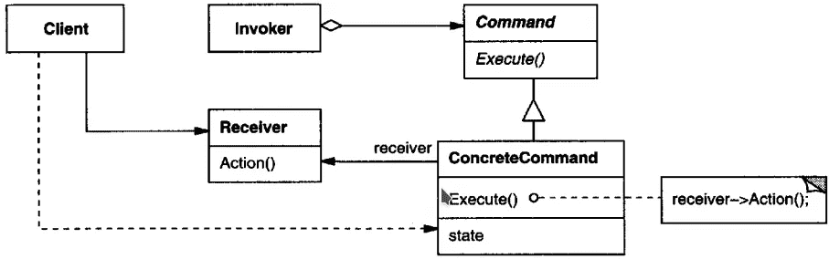

在以下情况下应使用命令模式:

*   您需要一个具有独立于原始请求的生命周期的命令，或者如果您想要排队，在不同的时间指定和执行请求。
*   您需要撤消/重做操作。可以存储命令的执行结果，以逆转其效果。重要的是`Command`类实现了 undo 和 redo 方法。
*   您需要围绕基于原始操作的高级操作来构建系统。

命令模式有几个优点，概括起来有以下几点:

*   它将调用操作的类从知道如何执行操作的对象中分离出来。
*   它允许您通过提供一个队列系统来创建一系列命令。
*   实现扩展来添加新命令很容易，并且不需要更改现有代码就可以完成。
*   您还可以使用命令模式定义一个回滚系统——就像在向导示例中一样，我们可以编写一个回滚方法。
*   严格控制调用命令的方式和时间。
*   代码更容易使用、理解和测试,因为命令简化了代码。

# 问题:股票市场

我现在将向您展示如何使用 JavaScript/TypeScript 实现这种模式。在我们的例子中，我编了一个问题，其中有一个名为`Agent`的类定义了属性:`stockTrade`；还有一次行动`placeOrder`。这个类是客户端/上下文和`StockTrader`之间的桥梁。`placeOrder`方法负责决定应该执行什么动作。例如，如果`orderType`是`buy`或`sell`，该方法应该调用`StockTrader`中的动作。下面的 UML 图显示了我刚刚描述的场景。

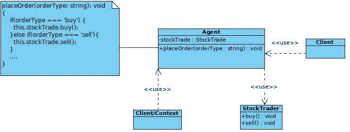

以下是`client`和`Agent`代码:

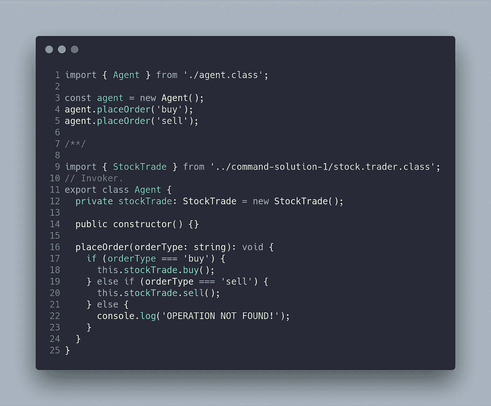

最相关的代码味道是与来自`StockTrade`的动作/命令相关联的`placeOrder`方法。有不同的技术可以避免这种代码味道。在这种情况下，`Command`模式是一个很好的解决方案，因为我们想要记录命令的历史。

最后，这里是`StockTrade`类:

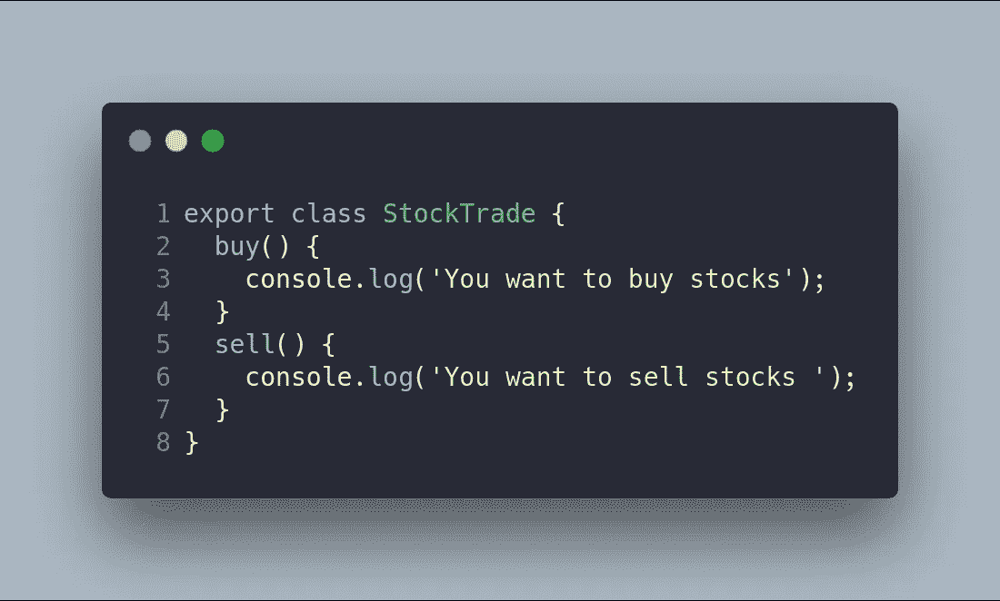

结果如下:

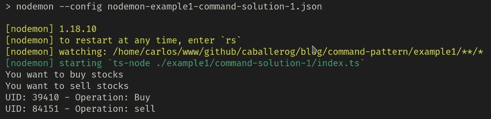

# 股市问题:解决方案

将命令从`Agent`类中分离出来的想法是为每个命令创建一组类。然而，这些命令共享一个公共接口，允许我们根据每个具体的命令来执行操作。

这就是为什么我们创建了`Order`抽象类，它将有一个名为`execute`的抽象方法。该方法将从`Agent`类(调用者)中调用。此外，`Agent`类将有一个命令列表来获取命令的历史。

通过这种方式，代理将知道必须对其接收的对象执行哪个操作的责任委托给了其他人。主要的变化是`Agent`类不再接收原始属性作为参数(字符串),因为它没有语义值。相反，`Agent`类现在将接收一个命令对象作为参数，它提供语义值。

使用命令模式的新 UML 图如下所示:

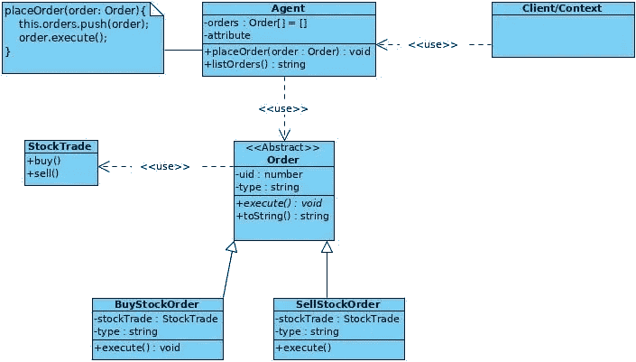

下面是与`client`相关的代码:

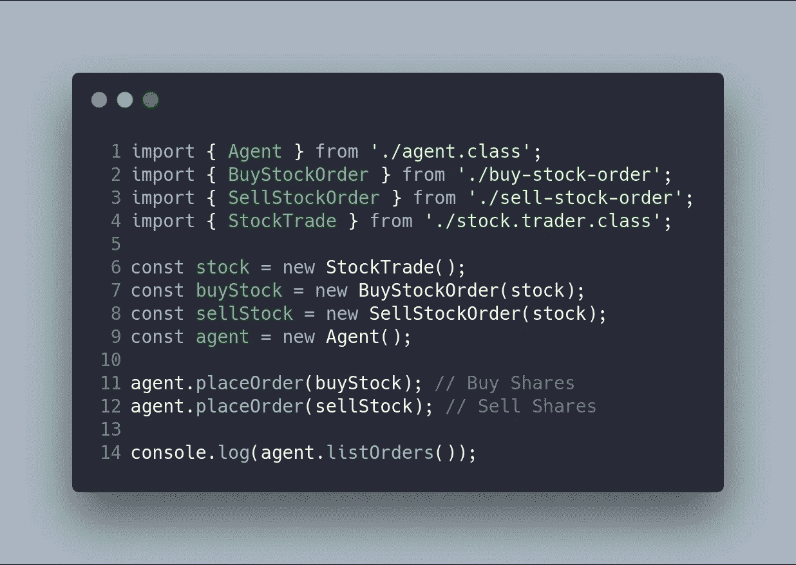

在这种情况下，每个`order`使用 DI(依赖注入)接收`StockTrade`。`Agent`使用`placeOrder`方法调用命令，该命令通过`execute`方法执行操作。

下面是与`Agent`相关的代码:

您可能会注意到，通过使用`order.execute`方法避免了`if-elseif-else`控制结构，该方法将责任委托给每个命令。

以下是与`Order`和每个订单相关的代码:

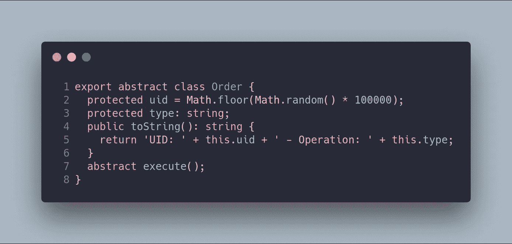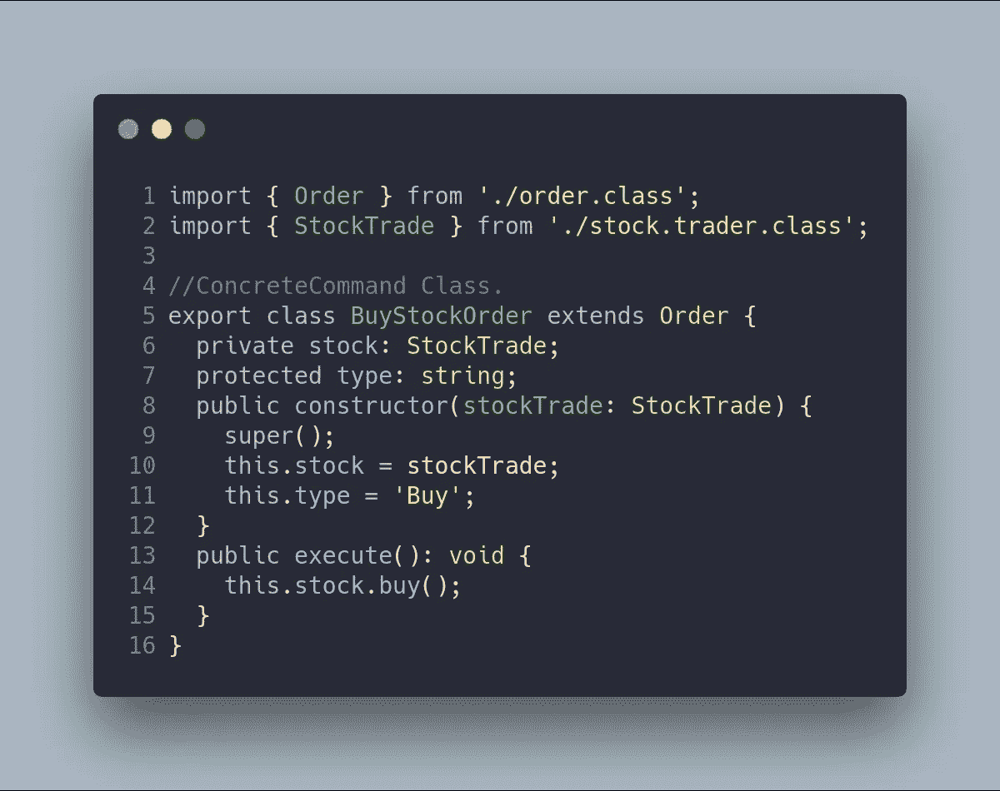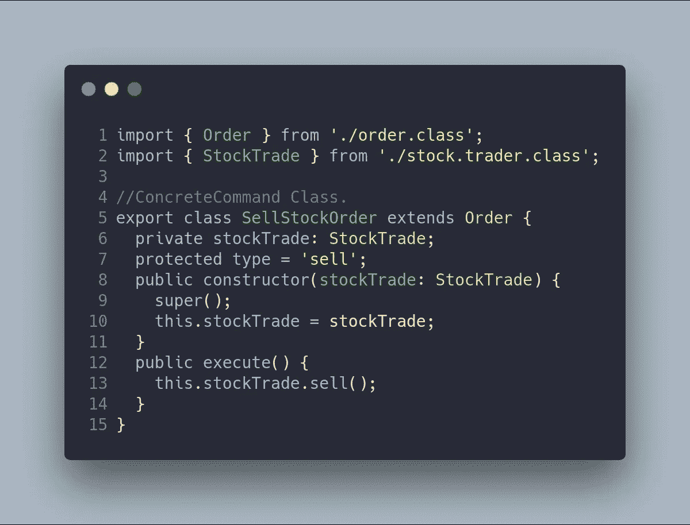

在该命令中没有修改`StockTrade`类。在程序执行过程中进行这些修改后，结果如下:

`npm run example1-problem`
`npm run example1-command-solution1`

# 例子:一个机器人——R2D2

使用命令模式解决的另一个有趣的例子是当有几个命令要为机器人执行时。

例如，一组命令如 **SaveSecret** 、 **Clean** 和 **Move** 是向一个著名的机器人 R2D2 发出的。您可以在下面的 UML 图中看到这一点:

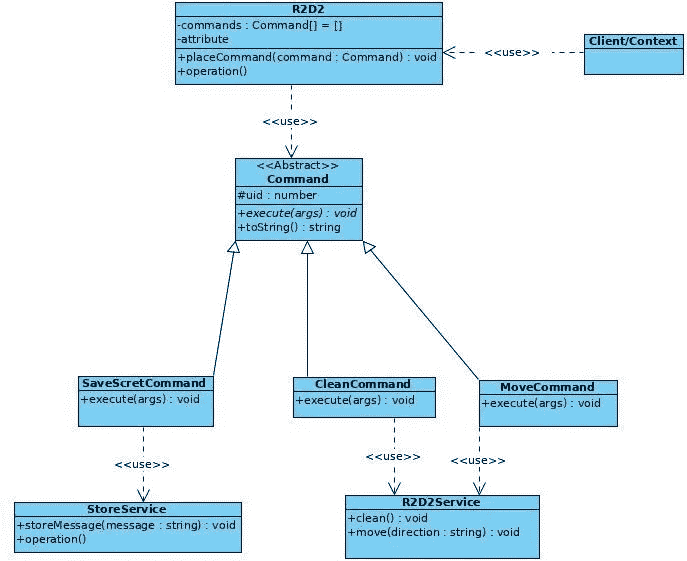

这是与客户端相关的代码:

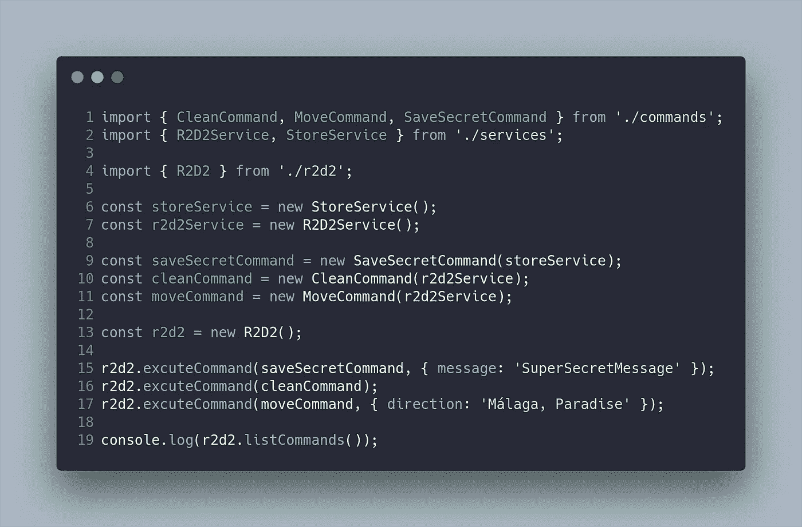

在这个例子中，有三个命令:`saveSecretCommand`、`cleanCommand`和`moveCommand`，两个服务:`StoreService`和`R2D2Service`以及一个代理:`R2D2`。

代理使用`executeCommand`方法调用订单，该方法接收两个参数:**命令**和**参数以执行前面的命令**。

这是与 R2D2 相关的代码:

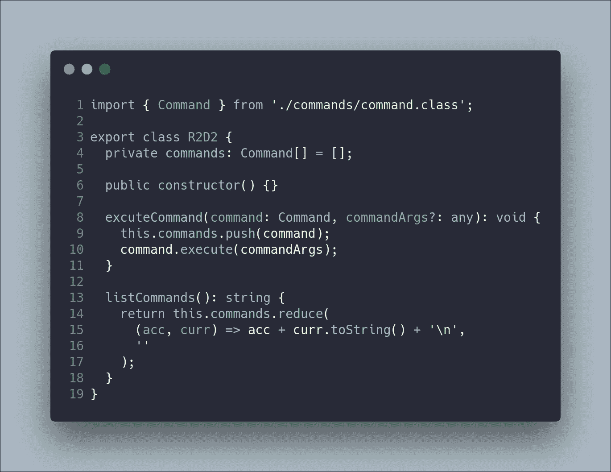

R2D2 有一个命令列表，可以通过`listCommands`方法列出，并使用`commands`数据结构存储。最后，`executeCommand`方法负责调用每个命令的 execute 方法。

因此，下一步是创建与命令(抽象类)和每个具体命令相关的代码:

最后，每个命令调用负责该动作的服务。在这种情况下，我们使用了两个不同的服务来说明不是所有的命令都将责任委托给同一个服务或类。

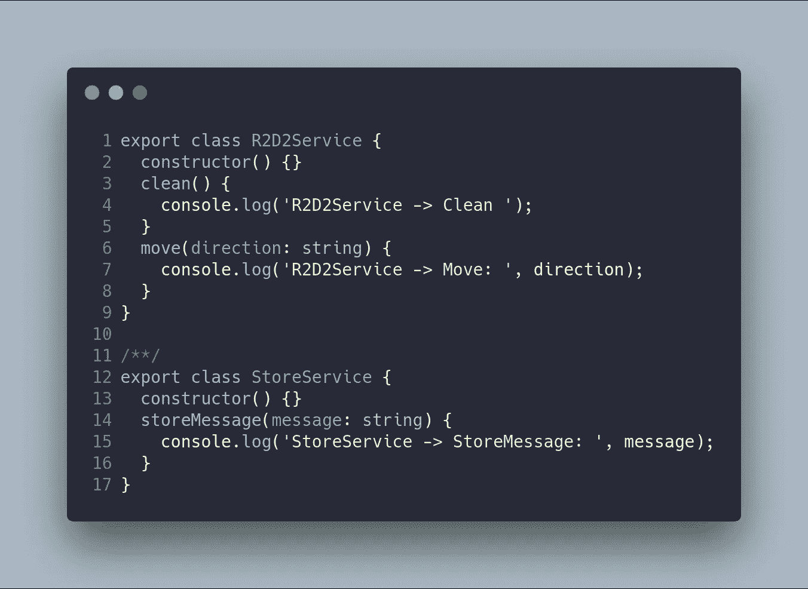

这是结果:

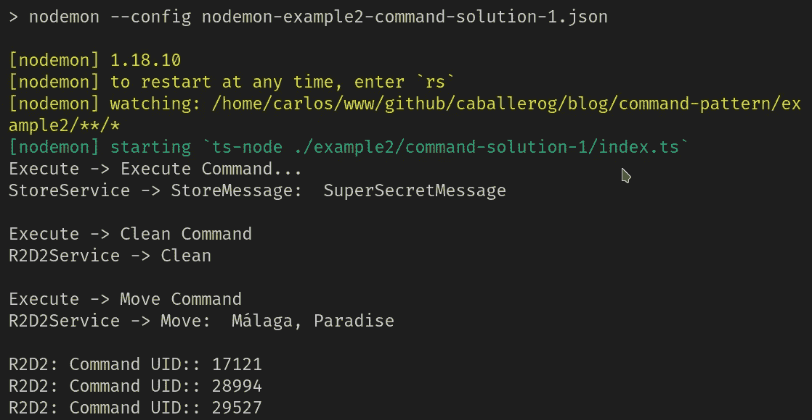

在应用命令模式之后，我创建了一个 npm 脚本来运行这里的示例。

`npm run example2-command-solution-1`

命令模式可以帮助您避免项目中的复杂性，因为您将命令封装在一个特定的类中，该类可以在任何时候添加/删除或更改，包括执行时间。

最重要的事情不是实现我向你展示的模式，而是能够识别这个特定模式可以解决的问题，以及你何时可以或不可以实现所述模式。这一点至关重要，因为实现会因您使用的编程语言而异。

这个帖子的 GitHub 分支是[https://GitHub . com/Caballerog/blog/tree/master/command-pattern](https://github.com/Caballerog/blog/tree/master/command-pattern)