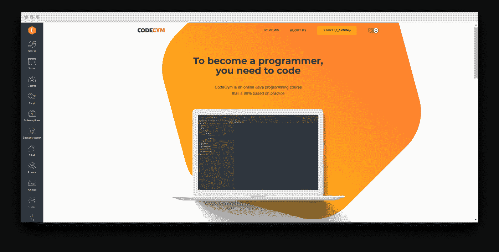
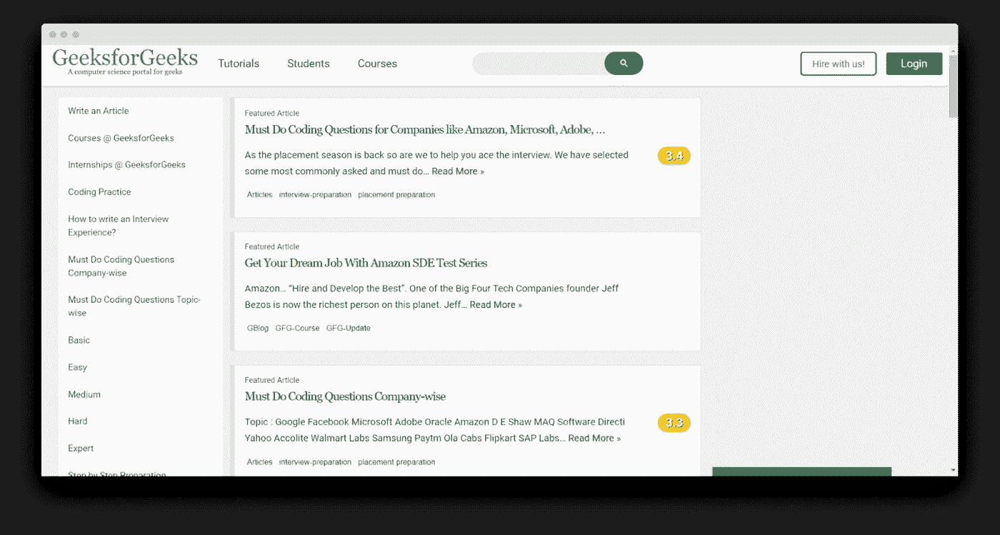
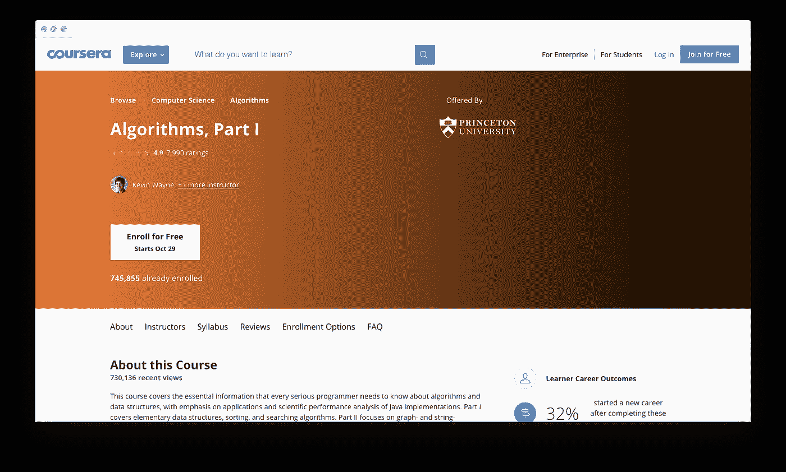

# 所有新手程序员都会犯的常见 Java 学习错误

> 原文：<https://betterprogramming.pub/the-common-java-learning-mistakes-all-newbie-programmers-make-b87a8d43f678>

## 现在就学习错误，这样你就可以自己避免它们


制造者在 [Unsplash](https://unsplash.com/?utm_source=unsplash&utm_medium=referral&utm_content=creditCopyText) 上 [NESA 的照片](https://unsplash.com/@nesabymakers?utm_source=unsplash&utm_medium=referral&utm_content=creditCopyText)

朋友们，我有好消息告诉你们！现在是学习编程的最佳时机，对自学者来说，这是一个天堂。今天比 10 年或 20 年前容易得多。今天，我们几乎可以无限制地访问关于语言和库的不同信息。有成千上万的在线课程、视频教程和论坛，我们可以在那里找到答案，寻求帮助或建议。

然而，学生们仍然会像 10 年或 20 年前一样犯错。这是人类的天性，不可避免。然而，如果你从一开始就做对了，那么“菜鸟错误”的数量是可以最小化的。

在本文中，我描述了每个编程学生最常犯的错误。一而再、再而三地犯这些错误，潜在的程序员往往会失去学习的动力，认为自己没有能力，顶多耽误学业。有了正确的方法，他们将找到学习编程的最佳方式，并在一年内成为软件开发人员，如果不是更快的话。适当的初始技术会帮你买到最有价值的东西:时间。

我将解释如何设置这些技术来减少一些新程序员经历的失败的痛苦。这些错误的收集是基于我个人的经验以及我的学生的经验(我不仅是一名实践软件开发人员，也是一名 Java 导师)。我们开始吧。

# 1.新手不够编码

下一个想法极其重要:编程是一项实践活动。每一个实践活动都需要，嗯…实践！

不演奏一种乐器，你不可能成为一名小提琴手(即使是最差的小提琴手)。仅仅通过阅读《如何游泳:1000 条和 1 条建议》这本书，你不可能成为一名游泳运动员。同样的故事与我们的话题相呼应:你不可能通过学习大量的理论和编写一点点代码来成为一名程序员。

如果我们像学习编程一样学习走路，我们将面临无法站立的风险。说真的。

还有什么更符合逻辑的呢？学习编程的最好方法就是写代码！

然而，这并不是每个人都清楚的。学生们忘记了编程是一种实践，并把它视为一门学术学科的学习。他们钻研理论丛林，什么都不懂，失去动力，最后荒废学业。

当然，理论知识很重要。你还需要学习编程理论。但是，知识部分，尤其是在最初的步骤中，不应该超过 20%。

## 取而代之做什么

从你学习 Java 的第一天开始写代码。很多很多代码！最好的方法是找到一个简单问题或包含它们的好的实践课程的集合，并把它们拿到手。你不应该在读完基础知识之后写程序，而是同时写。一遍又一遍地做。这是第一条规则。

# 2.一些新手学习混乱和不一致

在我的教学生涯中，我见过各种各样的学生。他们中的一些人热衷于编程。他们几乎可以立即抓住主题。哇…我在学习期间一点也不像他们！

另一方面，有些人吸收知识没有那么快。他们中的一些人似乎是真正的慢性子。但有时，我不得不说，第二类人逐渐赶上了第一类人，有时甚至超过了他们。

另一种情况也时有发生:一个学生的宝石不再出现在课堂上，不再发作业，然后就消失了。

我分析了所有“学生突然失踪”的案例，意识到退学学生最常见的问题不是“天生能力水平低”，而是学习不规律。

原因因人而异，但以下是主要原因:

1.  工作很忙
2.  家庭义务
3.  怠惰
4.  失去动力
5.  不知道下一步该做什么

## 取而代之做什么

根据前两个原因做一些事情是很复杂的，但是如果你真的想成为一名程序员，那么有规律地将编程融入你的生活是极其重要的。想想你可以为你的梦想牺牲什么来实现它。

以下是我学生的一些例子:

“在我学习期间，我放弃购物，使用快递服务，每周腾出几个小时来满足我的需要。”

“当我开始学习 Java 时，我退出了我最喜欢的唱诗班。唱诗班每周花四个小时，外加学习新的部分和自己唱诵。老实说，我非常想念它。但是现在我是一个 Java 开发者，回到了我的唱诗班！我对此感到无比高兴！”

“我决定开发自己的安卓游戏，所以暂时停止了在别人的游戏里消磨时间。”

“我减少了看电视的时间，把遛狗的任务交给了我的妻子和孩子。”

“我开始用地铁代替汽车上下班。所以我每天早上和晚上都有 40 分钟的时间进行编程。”

“我开始起得比较早，带着笔记本电脑，去一家咖啡馆吃早餐，在那里学习 Java。那是多么美好的时光啊！”

处理三到四个原因要容易得多。尤其重要的是要制定一个适当的时间表，并定期学习。根据我的观察，最成功的学生每天学习 ***两到四个小时，每周休息一天*** 。很难，但还是可以接受的:每隔一天一小时。

尽量不要辍学超过一周。就像《爱丽丝镜中奇遇记》一样。如果你留下来，你就慢慢后退。为了保持在同一个地方，你需要竭尽全力。如果你想得到更多，你必须学习至少两倍的速度！

考虑一下，如果你已经一个星期没有编程了，你已经后退了一大步。一个月过去了——两个月——突然你不得不从头开始。

# 3.有些初学者没有明确的目标或时间表。他们只是为了学习而学习

记得在上一节中，学生放弃学习的原因之一是，“我不知道下一步该做什么。”这对于主要从视频和文章中学习的自学者来说是很常见的。自然，他们还不知道下一个打开的视频是什么。

有些人就是喜欢学习的过程。当然，这是拓宽你视野的好方法，也可能是一个好的爱好，但是这些人经常浪费时间从一个爱好跳到另一个爱好。

## 取而代之做什么

如果你想成为一名软件开发人员，你需要重新考虑你对学习的态度，让它不是一个目标，而是一条通往目标的道路。

如果是自学的话，认识到动作的先后顺序是很重要的。决定学什么，按什么顺序学。从哪里可以得到学习计划？

当然，你最好的办法是找到适合你的合适的在线 Java 课程并遵循它们。如果做不到这一点，就去论坛看看哪些开放课程、书籍、教程是最常推荐的。查阅这些书籍、教程和课程的目录，用它们来建立你的学习计划。最好的策略是把它写出来，或者抄下主要话题，先处理那些。

# 4.一些新手想一次学会所有的东西

很多时候，学生试图理解每一行代码或语言是如何工作的，但现在这样做还为时过早。

例如，这一行突出的代码:

```
System.out.println (“hello world!”);
```

在这里，您可以看到每个未来的 Java 开发人员将要输入的第一行。它负责显示短语“hello world！”到控制台。如果一个刚写完第一个程序的学生开始为“系统”是什么和为什么“出来”而烦恼，他们很可能什么也不懂，会浪费很多时间。然而，如果他们在学习了 Java 和 OOP 的基础知识之后达到这一点，I/O 流的组织将会更容易理解。

## 取而代之做什么

当然，对于一个自学的学生来说，这是一个非常困难的时刻——确定什么是不可理解的，因为太早，什么是不可理解的，因为你没有付出足够的努力。所有好的课程和教材都是建立在“不断加深的重复”的原则之上的。先对题目进行粗浅的研究，然后你再多次回归，兼顾学生的新知。

问自己一个问题:

*   现在获得这些知识很重要吗？
*   你能在不了解其性质的情况下使用一个不可理解的物体吗？

如果真的很重要，在论坛上问个问题。清楚地表达问题，用简单的语言描述你以前的经历。例如:“我已经学习 Java 一个月了，我知道基本的结构和 OOP，但我不能理解这个。”

# 5.有些新手会窒息，因为他们有一百万种不同的资源

免费获取任何信息是很棒的。但是除了好处之外，它也产生了一个问题。总有一些学生不知道在哪里停下来，所以他们不断地寻找更好的资源，更详细和易懂的文章，更有趣的视频等等。原来初学者花的时间不是学习，而是收集资源、文章、视频。结果，他们没有时间处理它们，也失去了动力。或者相反，他们开始以一种无法摆脱的方式钻研这个或那个话题，变成了第四个问题。

## 取而代之做什么

如果你有一个学 Java 或者教 Java 的朋友或者任何人向你寻求好的 Java 资源的推荐，问问他们。如果你没有，无论如何都要问…在网上论坛上！

或者至少阅读指南并选择资源进行尝试。选择一两个主要来源和一至三个辅助资源作为重点。

例如:

*   一门带任务的课程
*   一两本教程或一本书
*   证明文件

如果你不得不经常谷歌，改变你的资源。如果你觉得搜索一篇有趣的文章或视频像漫无目的地浏览社交网络页面一样吸引你，那就放弃吧。

既然是 Java 导师，我就给出我的推荐吧。以下是我推荐给我的学生的资源，尤其是那些自学 Java 的学生。

## 课程

*   code gym——一个非常好的网站，提供 Java 课程，帮助新手避免这里描述的许多错误。它最有价值的地方是大量的任务、检查代码正确性的验证器，以及帮助您理解哪里做错了的“自动顾问”。课程几乎涵盖了 Java Core 的所有章节，有很好的学习计划。



*   [geeks forgeeks](https://www.geeksforgeeks.org/java/)——一个门户网站，也有优秀的课程、许多不同级别的任务和文章。尽量不要不知所措——内容相当广泛。当你学习 Java 的基础知识时，我建议你练习算法和数据结构。这对每一个未来的程序员都是非常有用的。



*   [Coursera](https://www.coursera.org/learn/algorithms-part1) —凯文·韦恩和罗伯特·塞奇威克教授的普林斯顿大学算法课程。



## 书

**从头开始:**

*   Kathy Sierra 的《Head First Java》&Bert Bates——这是一本适合新手的好书，有很好的方案和图形。非常适合初学者。
*   **《Java 核心第一册—基础》** —非常清晰详细的一本书。不要被大体积吓倒。一切都写得清清楚楚，几乎没有多余的信息。然而，有时缺乏实例。
*   **《不耐烦者的核心 Java》**作者凯·s·霍斯特曼——我推荐这本书给任何懂得不同编程语言但正在从头开始学习 Java 的人。

在下一个层面，当你已经编写了大量代码并解决了大量问题，并且希望更深入地了解一切是如何工作的时候，我推荐以下两本经典书籍:

*   布鲁斯·埃凯尔的《用 Java 思考》和约书亚·布洛赫的《有效的 Java》。这些作者对 Java 了如指掌，并将这些秘密知识分享给你。

## 文章资源

*   当然，Medium 在这里特别有用。
*   [Java 杂志](https://blogs.oracle.com/javamagazine/)——不适合完全的新手，但你会从这本书中发现很多。

## 证明文件

任何 Java 开发人员的基础。从开始学习 OOP 和集合的那一刻起，一定要阅读 Oracle 文档。它非常有用。

三个好的 Java 理论教程，适合从绝对初学者到高级学员的所有人: [Tutorialspoint](https://www.tutorialspoint.com/java) 、 [w3schools](https://www.w3schools.com/java/java_encapsulation.asp) 、[Java point](https://www.javatpoint.com/)。

让我提一下，这些只是在我看来已经得到证明的建议。选择一些适合你的。

# 6.一些新手正在循环复杂的任务

本质上，这是第四个问题的延续。这个人解决不了问题，一次又一次地尝试，而不是前进。他们经常失去动力，放弃学业。给自己定的标准比自己的水平高一点点是好的。这里的关键词是一个**一点点**。那些自学的人并不总是能够确定这个标准。

## 取而代之做什么

如果你三次试图解决这个问题，去寻求帮助，或者继续做其他的工作。如果你还在尝试，向自己解释你的解决方案有什么问题。你设法描述这个问题了吗？太好了，在论坛上发个问题。如果你做不到，那就推迟任务。过一段时间就可以绕回来解决了。这比完全停止学习要有效得多。