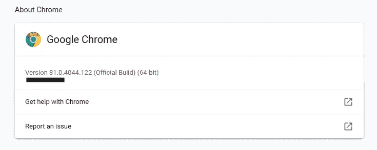
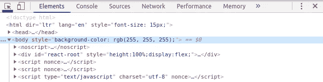
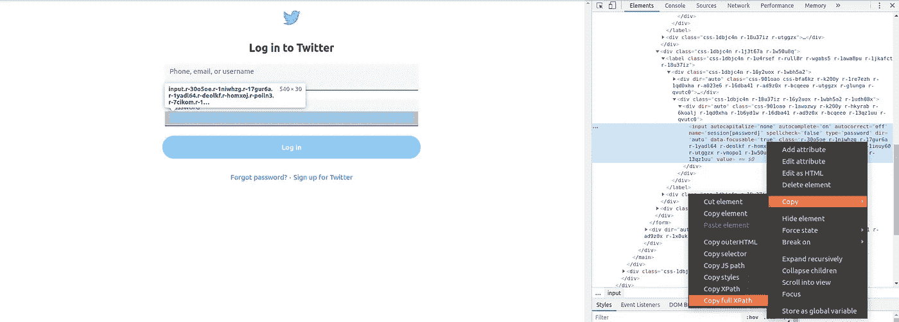

# 完整的数据挖掘管道

> 原文：<https://betterprogramming.pub/the-complete-data-mining-pipeline-1f661e30d94f>

## 从用 Selenium 抓取 Twitter 到用 PostgreSQL 存储数据


照片由[马修·施瓦茨](https://unsplash.com/@cadop?utm_source=medium&utm_medium=referral)在 [Unsplash](https://unsplash.com?utm_source=medium&utm_medium=referral) 上拍摄

最近，我一直在思考情绪分析改善我们生活的潜力。我决定建立一个情绪分析模型，根据人们在社交媒体上的帖子来评估他们的心理健康状况。

这个想法以前肯定有人做过，但我想把它作为一个练习来做。我认为这是一个有用的模型，可以用在我未来的项目中。和任何其他机器学习项目一样，我首先需要的是数据。很多很多数据。

社交媒体每天都充斥着新帖子，但挑战在于如何获取所有这些数据。当然，你可以手动登录你喜欢的社交媒体，开始手动提取，在这个过程中投入大量时间。或者你可以*自动化*这个过程，利用这段时间做一些更有用的事情。永远不要低估懒惰的力量！

今天，我将带您了解如何通过使用`Selenium`从互联网中提取数据并将其存储在数据库中，例如`PostgreSQL`，来收集所有数据。本教程的各个部分是独立有用的:网页抓取部分可以独立于数据库使用。

# 创建虚拟环境

如果您已经有了创建虚拟环境的方法，请跳过这一部分。我们将使用`virtualenv`，但是如果您愿意，也可以随意使用`anaconda` 。虚拟环境允许我们管理不同于 Python 项目的其他库。安装在虚拟环境中的库在其他任何地方都不可用，为了使用，它还必须安装在外部。

首先，让我们确保安装了最新版本的`pip`。运行以下命令:

```
$ **python3 -m pip install --user -U pip** Collecting pip
[...]
Succesfully installed pip-20.0.2
```

现在让我们用下面的命令安装`virtualenv`:

```
$ **python3 -m pip install --user -U virtualenv** Collecting virtualenv
[...]
Succesfully installed virtualenv
```

前往您计划遵循本教程的文件夹，运行下一个命令来创建一个虚拟环境，比如说，`venv`:

```
$ **virtualenv -p python3 venv**
Running virtualenv with interpreter /usr/local/bin/python3
[...]
Installing setuptools, pip, wheel... done.
```

每次计划使用环境时，都必须使用以下命令激活它:

```
$ **source venv/bin/activate** (venv)$
```

要停用:

```
(venv)$ **deactivate**
$
```

现在，我们已经建立并运行了虚拟环境，让我们开始讨论 web 抓取。

# 用硒刮网

对于本教程，我决定从我的 twitter feed 获取数据:发布推文的用户身份、发布日期、赞数、转发和回复次数以及推文本身的内容。Twitter 有一个 API，可以用来提取相同的信息，但不是任何人都可以使用它，因为它必须由 Twitter 授予您。并非互联网上的所有网站都有 API，因此 selenium 将永远是一个强大的工具。

但是什么是`selenium`？`Selenium`自动化浏览器，就这么简单。我们可以使用`selenium`来模仿我们并自动完成这项任务，而不必手动登录 Twitter 并浏览你订阅的所有推文。可以使用其他库，比如`BeautifulSoup`，但是如果你需要模拟一个用户，你需要`Selenium`。

在我们继续之前，我们必须用下面的命令安装`Selenium`库:

```
(venv)$ **pip install selenium** Collecting selenium
[...]
Succesfully installed selenium-3.141.0
```

## 安装 ChromeDriver

我们已经安装了 selenium，但是我们需要为它配置 selenium web 驱动程序。我打算用谷歌 Chrome，但 selenium 和 Firefox 一样好用。首先，我们需要找出我们使用的是哪个版本的 Chrome。在您的搜索栏中键入以下内容:

```
chrome://settings/help
```

您应该会看到您的 Chrome 版本:



现在我们从[这里](https://chromedriver.chromium.org/downloads)下载相应的`ChromeDriver`版本。因为我有版本 81 并且使用 Linux，我将下载 Linux 的版本 81。解压文件并存储在你喜欢的地方，最好是你的项目文件夹。或者，在 Linux 中，我建议将它存储在`/usr/local/bin`中，你可以在解压文件后使用下面的命令:

```
**$ mv ~/Downloads/chromedriver /usr/local/bin**
```

## 抓取 Twitter

在您的项目中，创建一个名为`main.py`的 Python 文件，并添加这两个导入:

现在我们要创建一个名为`TBot`的类，它包含了我们将要使用的所有逻辑和方法。首先，让我们创建构造函数来确保我们的`selenium`安装是正确的:

构造函数实例化了一个 Chrome 驱动程序，它本质上是一个 Chrome 选项卡，我们可以通过 selenium 来控制它。

用`.get("[https://instagram.com](https://twitter.com/login)")`我们告诉我们的司机去 Twitter 的登录页面。我们添加了一个无限循环来无限期地停留在这个页面上。

现在，通过在类外部键入`TBot()`来创建一个新的`TBot`实例，并使用以下命令执行该文件:

```
(venv)$ python main.py
```

应该会打开一个新的浏览器，显示 Twitter 的登录页面。

## 登录

现在我们需要找到一种给定用户登录的方法。Selenium 通过在网页中找到一个元素并与之交互来运行。

在 web 页面中定位元素有三种主要方式:通过 ID、类或 xpath。如果您不熟悉 xpath 或 HTML 的概念，我建议您阅读下面这篇由 W3Schools[撰写的关于 XPath 的文章。但是对于本教程，您只需要知道 xpath，顾名思义，是到一个元素的路径，在本例中，是 Twitter 的 HTML 代码。](https://www.w3schools.com/xml/xpath_intro.asp)

为了登录，我们需要用户名和密码字段的 ID 或 xpath 。一旦我们有了它们，我们可以告诉`selenium`用相应的值填充每个字段。在之前打开的 Twitter 页面上点击右键，选择“检查”，或者按 **Ctrl + Shift + I** 。你现在看到的是 Twitter 首页的 HTML 源代码！选择左上角 HTML 代码正上方的光标，并单击用户名字段。



这将显示与您单击的元素相对应的 HTML 代码的确切部分。遗憾的是，我们看到无论是用户字段还是密码字段的 HTML 代码都没有 ID ，所以我们必须通过 xpath 来定位这些元素。要获得任何 HTML 元素的 xpath，只需右键单击它的 HTML 代码，然后 **Copy > Copy full XPath** 。



现在我们知道了如何获得 xpaths，让我们写一些代码吧！我们将创建一个登录函数，它接收两个参数，用户名和密码，找到它们各自的 html 输入字段并写入其中。为此，我们使用`find_element_by_xpath()`来获取我们想要的 web 元素，并使用`send_keys()`在其中写入一些文本。

好的代码应该是优雅的，完整的 xpaths 当然不是优雅的。出于这个原因，我选择制作一些更精细的 xpaths 来寻找`username_input`、`pswd_input`和`login`。您可以使用您从浏览器中复制的 xpaths 它们会工作得很好——但是不要害怕使用我的 xpaths 并尝试理解它们是如何工作的！

让我们通过分析 xpath to `username_input`来了解它们是做什么的。首先，`//`选择文档中符合以下描述的任意元素。在这种情况下，我们寻找一个`input`元素，它的属性`name`等于`session[username_or_email]`。本质上，它实现了与我们可以从页面中复制的完整 xpath 相同的东西，但是这种方式看起来更好。

注意，在方法的开始有一个`sleep()`函数。这将在我们指定的时间内暂停 scraper 的执行。这是非常有用的，因为在我们试图访问它们的任何元素之前，我们给了页面加载的时间。

如果您尝试访问页面的现有元素，并得到如下错误，请考虑增加等待页面的时间:

```
selenium.common.exceptions.NoSuchElementException: Message: no such element: Unable to locate element:[...]
```

增加您希望等待页面的时间，可以让页面在我们执行操作之前有机会完全加载。

现在我们在`TBot`中有了`__login`函数，让我们从构造函数中调用它。它应该是这样的:

我强烈建议您将用户名和密码存储在另一个 Python 文件中。这样，您可以将您的用户名和密码导入到`main.py`函数中，并在不显示其实际值的情况下使用它们。让我们看看它是否有效——用下面的命令运行您的`main.py`,您应该会自动进入您的 Twitter 主页:

```
(venv)$ **python main.py**
```

## 提取我们迫切需要的数据

现在到了有趣的部分，从我们的 Twitter feed 中提取所有相关信息。首先，我们需要制定一个如何进行的计划。慢慢来，检查页面的 HTML，想出实现目标的最佳方法。

根据我的经验，可能所有的 tweets 都有相同的 HTML 结构(在这种情况下是正确的——永远相信你的经验)。这允许我们编写代码从一条推文中获取信息，并在整个 twitter feed 中重用它。我们开始吧！

在`TBot`类内部创建以下方法:

注意我们是如何将`find_elements_by_xpath`的输出存储在`tweets`中的，这意味着我们已经设法在一个 xpath 下捕获了所有的 tweets。现在，我们遍历每条推文，提取其个人信息。反过来，每条 tweet 拥有相同的内部 HTML 结构，因此我们可以使用相同的函数来提取信息。

对于这种方法，我们不能只是复制和粘贴从浏览器中复制的 xpath，因为每个 tweet 都有自己的 xpath。我们需要能够概括我们在文档中定位 tweets 的方法，因此需要创建我们自己的 xpath。

但是我对这个解决方案不是很满意。对于评论、转发和赞，它不获取实际的数字，只获取表示它的字符串。例如，1.9K 是一个字符串，而 1900 是一个实际数字，我们可以这样计算。为了解决这个问题，我创建了以下方法:

该方法检查`data`是否包含代表千位的`K`或代表百万位的`M`，然后删除它，将`data`转换为十进制数，并将其乘以各自的数量。因为看到有人得到 1900.0 的转发不太好，所以最后把`data`变成了整数。

在`__scrap_tweets`中实现这个方法相当简单，我们只需要为评论、转发和喜欢的值调用它，并捕获输出值:

好了，剩下要做的就是从构造函数中调用方法，现在应该是这样的:

让我们检查一下它是否与`(venv)$ python main.py`一起工作。现在，您应该可以看到您的整个 Twitter feed，后面跟有这条漂亮的错误消息:

```
selenium.common.exceptions.StaleElementReferenceException: Message: stale element reference: element is not attached to the page document
```

如果你碰巧避免了这个错误，你仍然应该仔细听。当我们将 Twitter feed 中的所有推文加载到`tweets`中时，最后一条推文实际上并没有显示在页面上。因此，当我们试图访问他们的数据时，Python 会感到困惑并停止执行。为了避免这个问题，我们需要在每次出错时向下滚动，这样新的 tweets 就会加载到页面中。让我们创建一个滚动方法:

现在我们需要将`__scrap_tweets`中的代码包装在`try/except`中，并调用`except`部分中的`__scroll`方法。它应该看起来像这样:

但是，当我们可以无限向下滚动时，我们不想只从初始提要中获取数据。我们将在`TBot`构造函数的无限循环中定期调用`__scrap_tweets`，结果如下:

当你运行`(venv)$ **python main.py**` 时，你的终端应该会被来自你的 feed 的无休止的 tweets 淹没。

但是我们不想将它们存储在终端的输出日志中，不是吗？我们希望将它们存储在某个我们需要时可以提取的地方:数据库中。

# 在 PostgreSQL 中存储数据

在数据库中存储数据非常有用。以我们刚刚构建的 Twitter scraper 为例，它使我们能够多次运行它，并将所有数据存储在完全相同的位置。更好的是，我们可以同时运行 Twitter bot 的几个实例(使用不同的帐户)，并将所有这些推文存储在我们的数据库中。此外，下载 CSV 格式的数据库内容非常容易，这对于机器学习来说是非常好的。但是首先，我们需要一个数据库。

## 设置 PostgreSQL

虽然你当然可以在你的本地机器上做这个，但是我推荐你在 Heroku 上自由地创建它。

*   如果您还没有帐户，请前往[https://www.heroku.com/](https://www.heroku.com/)创建一个帐户。
*   在 Heroku 的仪表盘上，点击“新建”并选择“创建新应用”命名您的应用程序，然后单击“创建应用程序”
*   在应用的“概述”页面上，单击“配置加载项”按钮。在页面的“附件”部分，输入并选择“Heroku Postgres”
*   选择“Hobby Dev-Free”计划，该计划将为您提供一个支持多达 10，000 行数据的免费 PostgreSQL 数据库。
*   点击“供应”
*   现在点击“Heroku Postgres”进入你的数据库概述页面。在那里，点击设置>查看凭证。这是您登录数据库所需的信息。您可以通过 [Adminer](https://adminer.cs50.net/) 或 [DataGrip](https://www.jetbrains.com/es-es/datagrip/) 填写所有需要的凭证。

现在我们需要在我们的计算机上安装一些库，这样我们就可以用 Python 连接到我们的数据库。我们首先需要的是`libpq-dev`包，在 Linux 上可以用下面的命令安装它:

```
$ sudo apt-get install libpq-dev
```

如果你是 Windows，你必须在本地安装`[PostgreSQL](https://www.postgresql.org/download/)`。一旦解决了这个问题，让我们安装我们需要的 Python 库:`SQLAlchemy`和`psycopg2`:

```
(venv)$ **pip install sqlalchemy**
Collecting sqlalchemy
[...]
Succesfully installed sqlalchemy-1.3.16(venv)$ **pip install psycopg2** Collecting psycopg2
[...]
Succesfully installed psycopg2-2.8.5
```

## 对象关系映射

对象关系映射(ORM)是将面向对象编程语言中的类与数据库中的关系或表相关联的能力。这意味着我们不必通过 SQL 创建我们的 tweets 数据库表，我们可以用 Python 来做。我们不打算使用任何 SQL，因为多亏了`sqlalchemy` **，我们想要的一切都可以通过 Python 来完成。**

首先创建一个名为`bd.py`的文件，它将负责所有与数据库相关的事情。让我们添加我们需要的所有导入:

现在，我们用下面几行建立与数据库的连接:

其中`"YOUR URI"`应该是在 Heroku 的数据库凭证中找到的。

现在我们需要创建一个对象来关联数据库中的一个表。幸运的是，我们可以创建这个对象，`sqlalchemy`将创建与之相关的相应的表。

因为我们想存储 tweets，所以让我们用它们来命名我们的对象。类`Tweet`必须包含我们希望存储在数据库中的所有字段，并且必须以特定的方式声明:

首先，我们的类`Tweet`是从我们之前定义的`Base`扩展而来的。我们必须将`__tablename__`设置为我们希望数据库中的表拥有的名称。然后，我们必须指定我们希望表拥有的所有列(属性)以及它们的数据类型(`String`、`Integer`)。

现在我们已经定义了我们的类`Tweet`，让我们在数据库中创建它对应的表。在`db.py`的末尾增加以下几行:

这样，表`tweets`只会在我们运行`db.py`时创建，而不是在我们导入这个文件时创建。让我们运行`db.py`来创建我们的`tweets`表:

```
(venv)$ **python db.py** [...]
CREATE TABLE tweets (
    id SERIAL NOT NULL, 
    username VARCHAR, 
    date VARCHAR, 
    likes INTEGER, 
    retweets INTEGER, 
    comments INTEGER, 
    text VARCHAR, 
    PRIMARY KEY (id)
)
[...]
Process finished with exit code 0
```

如果您在终端上看到这个输出，那么一切正常。这是在我们的数据库上运行的 SQL 代码，用于基于`Tweet`类创建我们想要的表。

现在我们需要一个方法将我们的`Tweet`对象添加到我们的数据库中。姑且称之为`add`:

该方法首先创建一个会话，然后添加调用该方法的对象(`self`)并提交操作。它通过关闭会话来结束，以避免任何问题。

就是这样！剩下唯一要做的就是从`main.py`调用这个函数——更准确地说，是从`TBot`的方法`__scrap_tweets`中调用:

我们用两行代码替换了前面的代码，一行用于创建带有相应属性的`Tweet`对象，另一行用于调用它的`add`方法。让我们试一试，看看它是否有效。再一次，运行`(venv)$ **python main.py**` 并转到 [Adminer](https://adminer.cs50.net/) ，或任何你用来可视化你的数据的服务，并检查你的推文确实被存储在那里。

# 最后的想法

`Selenium`和带`SQLAlchemy`的 `ORM`是强大的工具，可以节省你大量的时间，极大地促进数据挖掘过程。我希望这篇教程可以作为这两项漂亮技术的起点。

一如既往，如果需要，请随时联系我。本教程中的所有代码都可以在 GitHub 中免费获得。

[](https://github.com/PaburoTC/TwitterScrapper) [## PaburoTC/TwitterScrapper

### 在 GitHub 上创建一个帐户，为 PaburoTC/TwitterScrapper 的开发做出贡献。

github.com](https://github.com/PaburoTC/TwitterScrapper) 

快乐数据挖掘！

谢谢你