# iOS 中并发和多线程的完整指南

> 原文：<https://betterprogramming.pub/the-complete-guide-to-concurrency-and-multithreading-in-ios-59c5606795ca>

## 主线程与后台线程。异步/等待和执行元。GCD 与 OperationQueue。组调度、如何支持后台线程等等


约翰·安维克在 [Unsplash](https://unsplash.com?utm_source=medium&utm_medium=referral) 上的照片

# 介绍

在本文中，我们将了解以下内容:

```
TABLE OF CONTENTS[What Is Multithreading](#9cb6)
  Serial Queue vs. Concurrent Queue
  Parallelism
  Concurrency
[Basics of Multithreading](#b3d8)
  Main Thread (UI Thread) vs. Background Thread (Global Thread)
[GCD (Grand Central Dispatch)](#6b25)
[DispatchGroup](#0830)
[DispatchSemaphore](#b38c)
[DispatchWorkItem](#fe80)
[Dispatch Barrier](#c340)
[AsyncAfter](#0a2a)
[(NS)Operation and (NS)OperationQueue](#9b83)
[DispatchSource (How To Handle Files and Folders)](#b6c0)
[Deadlock (Issue What To Avoid)](#eef2)
[Main Thread Checker (How To Detect Thread Issues)](#0a2b)
[Threads in Xcode (How To Debug Threads)](#f309)
[Async / Await / Actor Is iOS13+](#bffe)
```

我知道有很多话题。如果有些东西你已经很熟悉了，跳过它，读未知的部分。有窍门和小技巧。

# 现实世界中的多线程示例

想象你有一家餐馆。服务员正在收集订单。厨房在准备食物，酒保在煮咖啡和鸡尾酒。

在某些时候，很多人会点咖啡和食物。那需要更多的时间来准备。突然铃响了，5 份食物和 4 份咖啡准备好了。即使所有的产品都准备好了，服务员也需要一个接一个地为桌子上菜。这是**序列队列**。对于串行队列，您只能有一个服务员。

现在想象有两三个服务员。同时，他们上菜的速度也会更快。这就是**平行度**。使用多个 CPU 运行多个进程。

现在想象一下，一个服务员不会立刻为一张桌子服务，而是首先为所有的桌子服务所有的咖啡。然后，他们会询问一些新桌子的订单，然后提供所有的食物。这个概念叫做**并发。它是上下文切换，管理，同时运行许多计算。这并不一定意味着它们会同时运行。比如单核机器上的多任务处理。**

现在的设备都有多个 CPU([中央处理器](https://en.wikipedia.org/wiki/Central_processing_unit))。为了能够创建无缝流程的应用，我们需要理解**多线程**的概念。这是我们在应用程序中处理一些任务的一种方式。重要的是要明白，如果某样东西“有效”，也许它不是最好的、想要的方式。很多时候，我看到一个长时间运行的任务发生在 UI 线程上，并在几秒钟内阻止了应用程序的执行。如今，这可能是不去的时刻。用户可以删除你的应用程序，因为他们觉得其他应用程序启动更快，更快地获取书籍和音乐。竞争是巨大的，高标准是意料之中的。

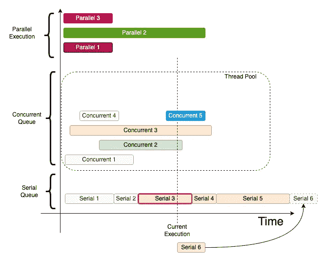

线程执行类型

如果在当前时间安排了“序列 6”任务，则可以看到该任务。它将以 **FIFO** 的方式添加到列表中，等待将来执行。

# 多线程基础

我一直纠结的一件事是没有标准术语。为了帮助这些科目，我将首先写下同义词，例子。如果你来自 iOS 之外的其他技术，你仍然可以理解这个概念，并把它移植过来，因为基本原理是一样的。我很幸运，在我职业生涯的早期，我与 C、C++、C#、node.js、Java(Android)等一起工作。所以我习惯了这种上下文切换。

*   **主线程/ UI 线程:**这是应用程序启动的线程，预定义的串行线程。它监听用户交互和 UI 变化。所有的变化都需要立即得到回应。需要注意不要给这个线程增加大量的工作，因为应用程序可能会冻结。

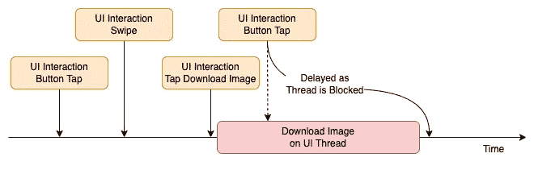

UI 线程上长时间运行的任务(错误，不应该这样做)

```
DispatchQueue.main.async {
    // Run async code on the Main/UI Thread. E.g.: Refresh TableView
}
```

*   **后台线程(全局):**预定义。大多数情况下，我们根据需要在新线程上创建任务。例如，如果我们需要下载一些大的图像。这是在后台线程上完成的。或者任何 API 调用。我们不想阻止用户等待这个任务完成。我们将调用一个 API 调用来获取后台线程上的电影数据列表。当它到达并且解析完成后，我们切换并更新主线程上的 UI。

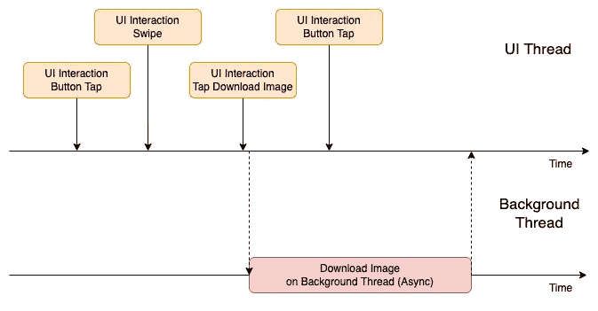

长时间运行的任务(在后台线程上以正确的方式完成)

```
DispatchQueue.global(qos: .background).async {
     // Run async on the Background Thread. E.g.: Some API calls.
}
```

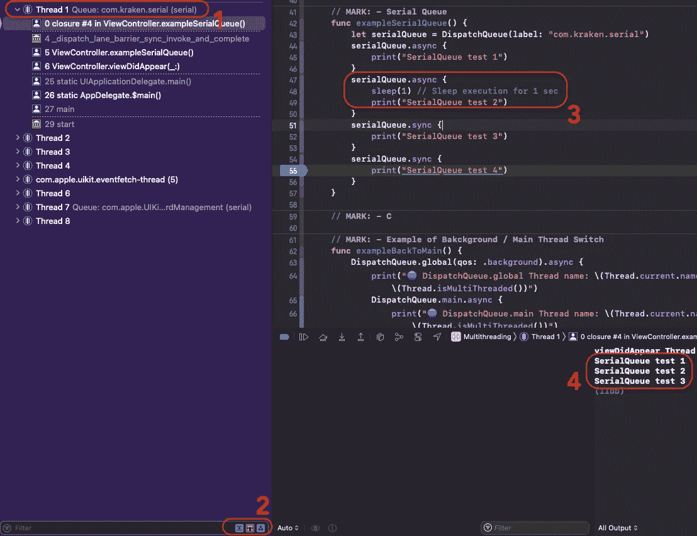

串行队列示例

在上图中，我们在第 56 行添加了一个断点。当点击它时，应用程序停止，我们可以在线程左侧的面板上看到这一点。

1.  你可以看到`DispatchQueue(label: “com.kraken.serial”)`的名字。标签是标识符。
2.  这些按钮有助于关闭/过滤系统方法调用，只查看用户发起的调用。
3.  你可以看到我们增加了`sleep(1)`。这将停止代码执行 1 秒钟。
4.  如果你观察顺序，它仍然以连续的方式被触发。

根据之前的 iOS，最常用的两个术语之一是串行队列和并发队列。

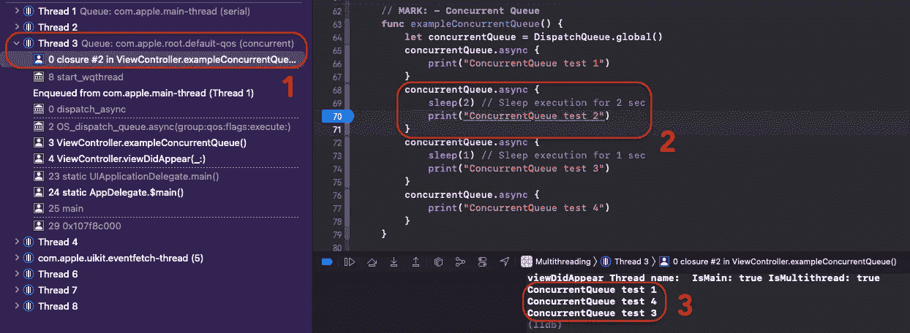

并发队列示例

1.  这是并发队列的结果之一。上面还可以看到串口/主线程( *com.apple.main-thread* )。
2.  `sleep(2)`就是加到这一点上的。
3.  你看没有秩序。它在后台线程上异步完成。

```
let mainQueue = DispatchQueue.main
let globalQueue = DispatchQueue.global()
let serialQueue = DispatchQueue(label: “com.kraken.serial”)
let concurQueue = DispatchQueue(label: “com.kraken.concurrent”, attributes: .concurrent)
```

我们还可以创建一个私有队列，它可以是串行的，也可以是并发的。

# 大中央调度

GCD 是 Apple 的低级线程接口，用于支持多核硬件上的并发代码执行。简单地说，GCD 使您的手机能够在后台下载视频，同时保持用户界面的响应性。

> “DispatchQueue 是一个对象，它管理应用程序主线程或后台线程上任务的串行或并发执行。”—苹果开发者

如果您注意到上面的代码示例，您可以看到“qos”这意味着服务质量。使用该参数，我们可以如下定义优先级:

*   **背景** —当一个任务对时间不敏感，或者当用户可以在这个过程中进行其他交互时，我们可以使用这个。比如预取一些图像，加载，或者在这个后台处理一些数据。这项工作需要大量的时间、秒、分和小时。
*   **实用程序** —长时间运行的任务。一些用户可以看到的过程。比如下载一些带指标的地图。当一项任务需要几秒钟，最终需要几分钟。
*   **用户启动** —用户从 UI 启动某个任务，等待结果继续与应用交互。这项任务需要几秒钟或一瞬间。
*   **userInteractive** —当用户需要立即完成一些任务，以便能够继续与应用程序进行下一次交互时。即时任务。

给`DispatchQueue`贴标签也很有用。这可以帮助我们在需要时识别线程。

# 调度组

通常我们需要启动多个异步进程，但是当所有进程都完成时，我们只需要一个事件。这可以通过 DispatchGroup 实现。

> "作为一个单元监控的一组任务."—苹果文档

例如，有时您需要在后台线程上进行多个 API 调用。在应用程序准备好进行用户交互或更新主线程上的 UI 之前。下面是一些代码:

用`DispatchGroup`多线程

*   **步骤 1。**创建`DispatchGroup`
*   **步骤二。**然后为该组需要调用`group.enter()`事件的每个任务启动
*   **第三步。**因为每完成一个任务`group.enter()`还需要叫`group.leave()`。
*   **第四步。**当所有回车-回车对完成后，调用`group.notify`。如果你注意到它是在后台线程上完成的。您可以根据需要进行配置。

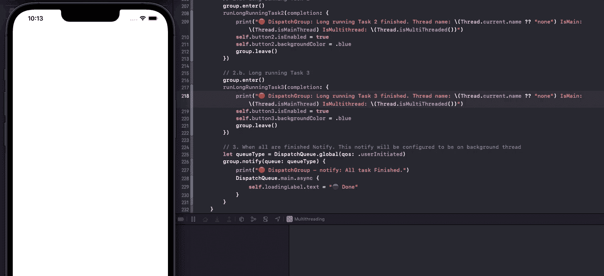

调度组。任务一个接一个，全靠通知。

值得一提的是`wait(timeout:)`选项。它将等待任务完成一段时间，但超时后，它将继续。

# 调度信号量

> "通过使用传统的计数信号量来控制跨多个执行上下文对资源的访问的对象."—苹果文档

使用 DispatchSemaphore 的多线程

每次访问共享资源时调用`wait()`。

当我们准备好释放共享资源时，调用`signal()`。

`DispatchSemaphore`中的`value`表示并发任务的数量。

# 分派工作项

一个普遍的看法是，当一个 GCD 任务被安排好了，它就不能被取消。但这不是真的。iOS8 之前确实如此。

> 您要执行的工作，以允许您附加完成句柄或执行依赖项的方式封装—苹果文档

例如，如果您正在使用搜索栏。每输入一个字母都会调用一个 API 调用，从服务器端请求一个电影列表。想象一下，如果你正在输入“蝙蝠侠”“B”、“Ba”、“Bat”……每一个字母都会引发一个网络呼叫。我们不想这样。例如，如果在一秒钟的范围内输入了另一个字母，我们可以简单地取消之前的呼叫。如果时间过去了一秒钟，而用户没有键入新的字母，那么我们认为需要执行 API 调用。

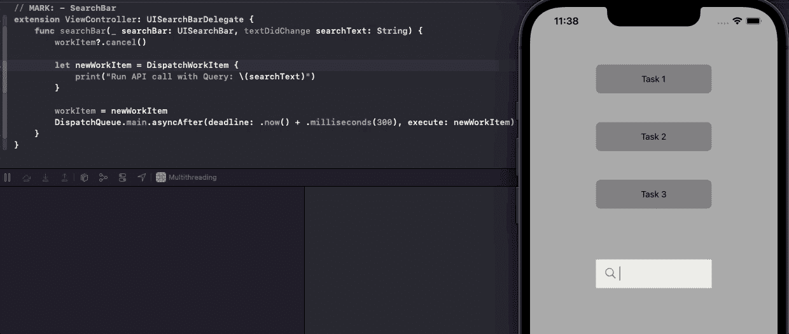

搜索栏。使用 DispatchWorkItem 模拟“去抖”

当然，使用像 RxSwift / Combine 这样的函数式编程，我们有更好的选择，比如`debounce(for:scheduler:options:)`。

# 调度障碍

分派障碍正在解决读/写锁问题。这确保只执行这个 DispatchWorkItem。

> "这使得线程不安全的对象成为线程安全的."—苹果文档

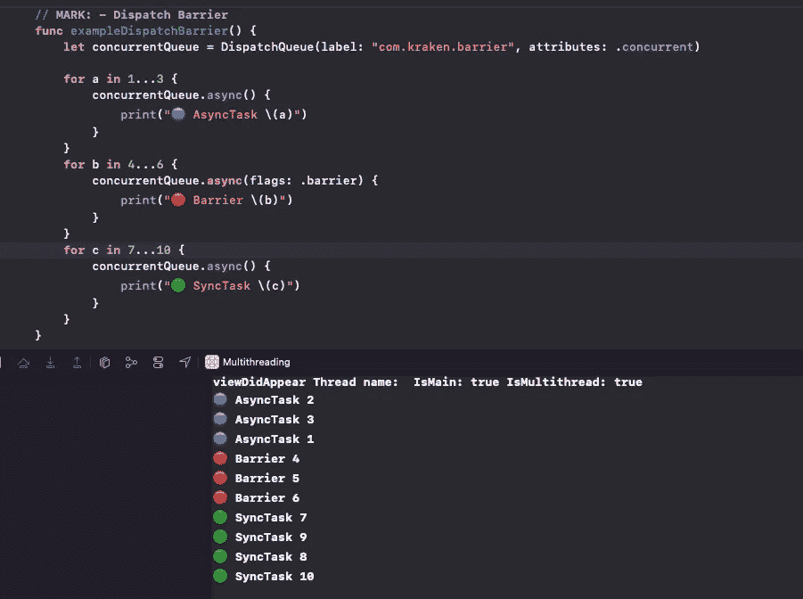

调度障碍

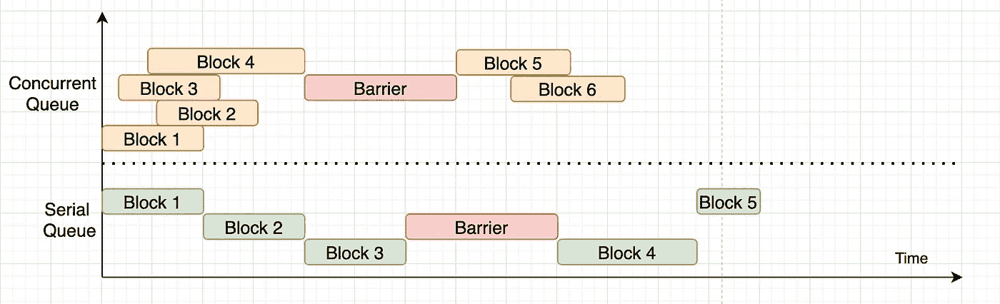

障碍时间线

例如，如果我们想保存游戏，我们想写一些打开的共享文件，资源。

# AsyncAfter

我们可以使用这段代码来延迟一些任务的执行:

邪恶的阿斯卡特。多线程不好的一面

在我看来，这是万恶之源，尊重例外。对于每一个需要延迟的异步任务，我建议仔细考虑一下，如果可能的话，使用一些状态管理系统。不要把这个选项作为首选。通常，还有另一种方法。

# (NS)操作和(NS)操作队列

如果你正在使用 n operation，这意味着你正在使用 GCD，因为 n operation 是建立在 GCD 之上的。NSOperation 的一些好处是，它有一个更加用户友好的依赖关系界面(以特定的顺序执行任务)，它是可观察的(KVO 观察属性)，有暂停、取消、恢复和控制(您可以指定队列中的任务数量)。

OperationQueue 示例。iOS 多线程的选项 2

您可以将并发操作计数设置为 1，这样它将作为一个串行队列工作。

```
queue.maxConcurrentOperationCount = 1
```

串行操作队列

并发操作队列

组并发操作队列

这最后一个是调度组。唯一的区别是编写复杂的任务要容易得多。

# 调度资源

DispatchSource 用于检测文件和文件夹中的更改。根据我们的需要，它有许多变化。下面我只举一个例子:

示例如何监控一些“物理”文件

# 僵局

有一种情况，两个任务可以互相等待对方完成。这叫做死锁。该任务将永远不会执行，并将阻止应用程序。

iOS 多线程中的死锁

从不在主队列上调用同步任务；会造成死锁。

# 主线程检查器

有一种方法可以得到我们做错了事的警告。这是一个非常有用的选项，我推荐使用它。它可以很容易地捕捉一些不必要的问题。

如果你在目标上打开并编辑下一个图像上的方案，打开主线程检查器，那么当我们在后台进行一些 UI 更新时，这个运行时选项会通知我们。请参见下图中的紫色通知:

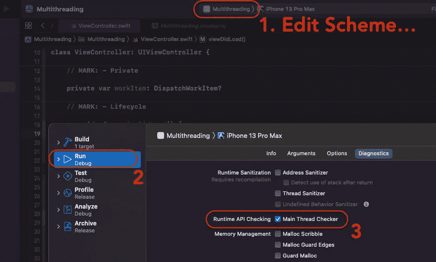

主线程检查器

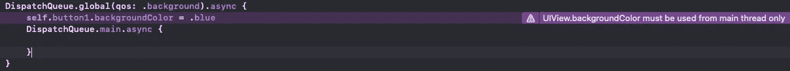

主线程检查器结果

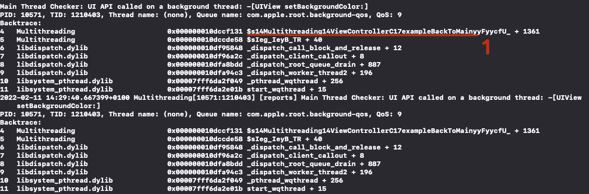

方法名问题在哪里可以看出来

您还可以在 Xcode 终端中看到有什么问题。对于新来的人来说，这可能有点奇怪，但是你会很快习惯的。但是你可以在这一行中，找到问题所在的方法的名字。

# Xcode 中的线程

在调试时，有几个技巧可以帮助我们。

如果你添加了一个断点并停在某一行。在 Xcode 终端你可以输入命令`thread info.`，它会打印出当前线程的一些细节。

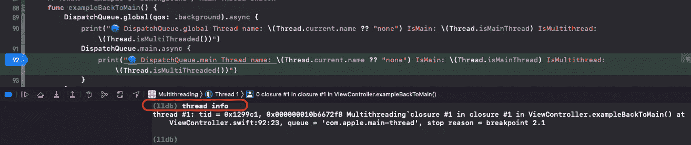

调试代码终端中的线程

以下是一些对终端更有用的命令:

`po Thread.isMainThread`

`po Thread.isMultiThreaded()`

`po Thread.current`

`po Thread.main`

也许你也有类似的情况——当应用程序崩溃时，在错误日志中你可以看到类似`com.alamofire.error.serialization.response`的内容。这意味着框架创建了一些自定义线程，这是标识符。

# 异步/等待

随着 iOS13 和 Swift 5.5 的推出，期待已久的 Async / Await 应运而生。苹果很好，他们认识到了这样一个问题，当一个新的东西推出时，会有很长一段时间的延迟，直到它可以用于生产，因为我们通常需要支持更多的 iOS 版本。

Async / Await 是一种在没有完成处理程序的情况下运行异步代码的方式。

最简单的异步/等待

下面是一些值得一提的代码:

*   `Task.isCancelled`
*   `Task.init(priority: .background) {}`
*   `Task.detached(priority: .userInitiated) {}`
*   `Task.cancel()`

我想强调任务组。这是 Await / Async 世界中的“DispatchGroup”。我发现 Paul Hudson 在这个[链接](https://www.hackingwithswift.com/quick-start/concurrency/how-to-create-a-task-group-and-add-tasks-to-it)上有一个很好的例子。

Paul Hudson 的 TaskGroup 的好例子

# 行动者

参与者是类，是线程安全的引用类型。它们处理数据竞争和并发问题。正如您在下面看到的，访问 actor 的属性是用`await`关键字完成的。

> "参与者一次只允许一个任务访问他们的可变状态."—苹果文档

来自[https://docs.swift.org/](https://docs.swift.org/)的例子

# 结论

我们已经讨论了许多多线程主题——从 UI 和后台线程到死锁和 DispatchGroup。但是我相信你现在正在成为专家的路上，或者至少已经准备好了关于多线程主题的 iOS 面试问题。

完整的代码样本可以在下一个链接找到: [GitHub](https://github.com/skyspirit86/Multithreading) 。希望自己玩的有价值。

如果你到了这一步，感谢你的阅读。你应该得到一杯咖啡☕️.🙂如果你喜欢的内容，请👏，分享，还有[跟着](https://varga-zolt.medium.com/)，对我来说就意味着一个。如果您有一些建议或问题，请随时发表评论。

**想要连接？**
你可以在 [LinkedIn](https://www.linkedin.com/in/varga-zolt/) 、 [Twitter](https://twitter.com/skyspirit86) 或[https://skyspiritlabs.com/](https://skyspiritlabs.com/)与我联系。还有更多文章和教程。