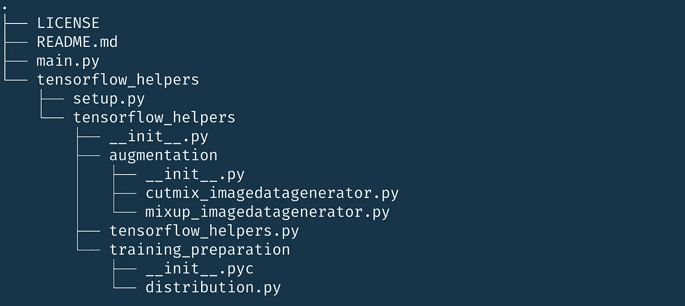
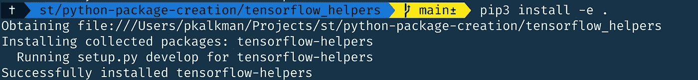
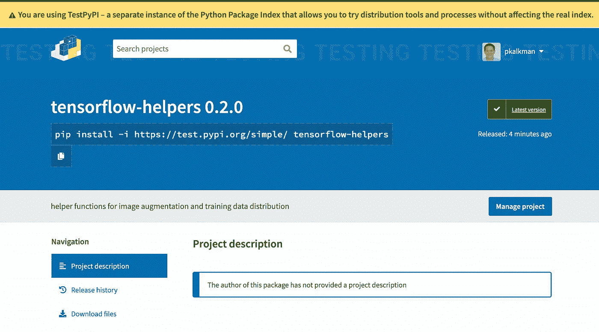
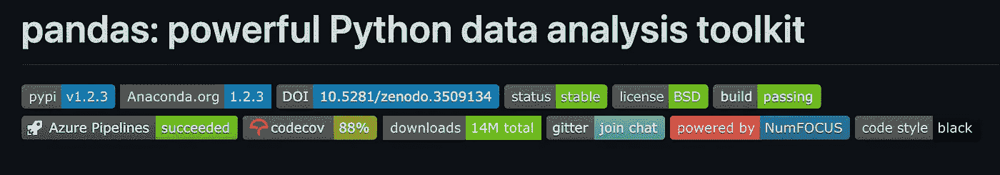
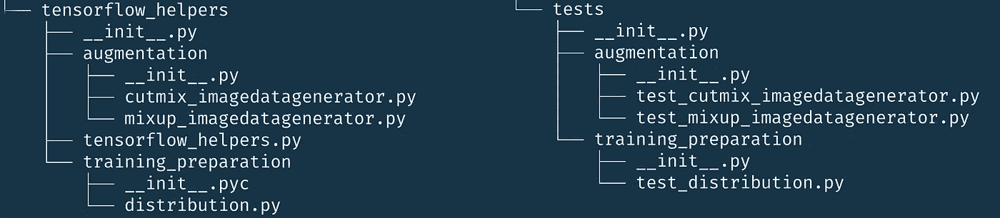

# 创建 Python 包的完整指南

> 原文：<https://betterprogramming.pub/the-complete-guide-to-creating-python-packages-3ecb150a1a43>

## 是时候将可重用的 Python 脚本转换成包了


通过[工作台会计](https://unsplash.com/@benchaccounting?utm_source=medium&utm_medium=referral)在 [Unsplash](https://unsplash.com?utm_source=medium&utm_medium=referral) 上创建包

如果你像我一样，你可能有几个 Python 脚本，可以在每个项目中重复使用。它们充满了有用的函数和类，可以帮助您提高工作效率。在一个新项目的开始，你复制脚本，你就上路了。

现在，是时候将您的脚本转换成真正的 Python 包了。转换它们将使它们更易于使用和与他人共享。别再复制粘贴了！

我还有几个在 Kaggle 比赛中重复使用的 Python 脚本。例如，在 TensorFlow 中实现 CutMix 和 MixUp 数据扩充的两个脚本。

在本文中，我将把这些脚本转换成一个 Python 包。我们将一步一步来，以便你能跟上。到本文结束时，我们将已经向 PyPI 上传了一个包，准备供其他人使用！

如果你只对源代码感兴趣，你可以在GitHub 仓库中找到。

# 将代码转换为本地包

你要做的第一件事是为你的包创建一个特定的文件夹结构。我将调用我的包`tensorflow_helpers`，所以我创建了下面的目录结构:

包的初始目录结构

在我的存储库的根目录下，我创建了一个`tensorflow_helpers`目录。在这个文件夹里，我放了一个叫做`__init__.py`的特殊文件。该文件将该目录标记为 Python 包—文件本身是空的。另一个文件`tensorflow_helpers.py`包含包代码。

我添加了两个子包，分别叫做`augmentation`和`training-preparation`。这使得组织代码更加容易。您可以通过在带有`__init__.py`文件的主包文件夹中创建附加文件夹来添加子包。文件夹结构现在看起来像这样:

添加子包

## 添加文档

有了目录结构，我们必须讨论文档。我知道这不是最有趣的部分，但它是至关重要的，因为它帮助用户使用你的代码。

我们必须记录每个函数、类和类方法。在开始之前，我们必须选择一种文档样式。有四种风格可以使用:Google、NumPy、reST 和 Javadoc——它们没有太大区别。

我选择使用 reStructuredText (reST)。这款是 [PEP 287](https://www.python.org/dev/peps/pep-0287/) 推荐的。

开始记录的一个简单方法是使用`pyment`。这是一个 Python 程序，可以在现有的 Python 文件中创建、更新或转换文档字符串。它支持前面提到的样式。

你用`pip install pyment`安装`pyment`。然后，您可以使用它来生成文档模板，如下所示:

```
pyment -w .\training-preparation.py -o reST
```

`-w`告诉`pyment`将文档添加到现有文件中。`-o`设置输出文档样式，在我们的例子中是`reST`。当然，它不会编写文档，但会给你一个很好的开始。如下图所示。

没有文件

使用 pyment 添加的文档模板

## 结构化导入

有了文档，就该考虑如何让用户导入您的包了。默认情况下，以下内容不起作用:

```
from tensorflow_helpers.augmentation import CutMixImageDataGeneratorhelp(CutMixImageDataGenerator)
```

执行此操作会导致以下错误:

```
Traceback (most recent call last):
  File "main.py", line 3, in <module>
    help(tensorflow_helpers.CutMixImageDataGenerator)
AttributeError: module 'tensorflow_helpers' has no attribute 'CutMixImageDataGenerator'
```

如果我们现在想要使用`CutMixImageDataGenerator`，我们必须像这样导入它:

```
import tensorflow_helpers.augmentation.cutmix_imagedatageneratorhelp(tensorflow_helpers.augmentation.cutmix_imagedatagenerator.CutMixImageDataGenerator)
```

这是大量的打字工作。为了让你的用户更容易使用这个包，我们通过使用内部导入来解决这个问题。

首先，我们必须向`augmentation`文件夹中的`__init__.py`文件添加两个相对导入。

```
from .cutmix_imagedatagenerator import CutMixImageDataGenerator
from .mixup_imagedatagenerator import MixupImageDataGenerator
```

其次，我们向`tensorflow-helpers`文件夹中的`__init__.py`添加一个相对导入。

```
from . import augmentation
```

现在我们可以这样使用`CutMixImageDataGenerator`。这看起来更好，使用的字符更少。

```
from tensorflow_helpers.augmentation import CutMixImageDataGeneratorhelp(CutMixImageDataGenerator)
```

# 将本地软件包转换为可安装软件包

到目前为止，我们的包的源代码一直在我们的解决方案文件夹的子文件夹中。因为包是子文件夹，我们可以直接导入。但是，如果我们将包移动到另一个位置，我们就不能。

我们必须使软件包可安装，然后安装软件包。安装后，我们可以在任何地方使用它，就像任何其他软件包一样。

您可以通过添加文件`setup.py`来使包可安装。

## 添加安装脚本

安装脚本包含软件包的附加元数据。如果您想发布您的包，这个文件是至关重要的。

在添加`setup.py`之前，我们必须重新构建代码。`setup.py`脚本不应该是包源代码的一部分。因此，我们创建一个新的顶级文件夹，如下所示:



我们的包的文件夹结构

我们在文件夹`tensorflow_helpers`里面添加了一个文件夹`tensorflow_helpers`。我已经将 setup.py 文件添加到外层的`tensorflow_helpers`中。

安装脚本包含作者、名称、描述和软件包版本等内容。

setup.py 脚本使您的软件包可以安装

一旦创建了 setup.py 脚本，就可以使用`pip`来安装它。我们导航到与 setup.py 脚本相同的文件夹，并执行以下命令:

`pip install -e .`

`.`告诉 pip 在当前目录下安装包。`-e`表示您希望在可编辑模式下安装软件包。如果没有这一点，您将不得不在开发过程中每次对包进行更改时重新安装包。

如果一切顺利，您应该会看到以下内容:



在可编辑模式下安装软件包

## 处理依赖关系

通常，您的包使用其他包，如 NumPy 或 Pandas。这些包是您的包的依赖项。

为了确保您的软件包的用户自动安装这些依赖项，我们在安装脚本中添加了`install_requires`参数。

我们还必须确保它们使用正确的 Python 版本，这可以通过`python_requires`参数来指定。

因此，我们的`setup.py`脚本看起来像这样:

如果您尝试允许尽可能多的依赖包版本，那将是最好的。如果您对版本号限制过多，您的用户可能不会安装您的软件包。

## **开发者环境**

为包开发人员提供一个环境也是一个很好的实践。您的包合作者的开发环境都需要拥有所有依赖包的完全相同的版本。

您可以通过执行`pip freeze`命令找出您正在使用的所有确切版本，这将生成一个包含所有包和版本的列表。您可以像这样将其写入一个`requirement.txt`文件:

`pip freeze > requirements.txt`

这确保了任何人都可以通过简单地执行`pip install`命令开始开发。

## 添加许可证

如果你在线共享你的包和代码，你必须包含一个许可文件。如果你不这样做，你就没有给其他人分享、修改或使用代码的许可。大多数 Python 包都是开源的，可以由其他用户自由修改和共享。

choosealicense.com 网站可以帮助你选择合适的许可证。

对于我的包，我选择[麻省理工学院许可](https://choosealicense.com/licenses/mit/)。您从 choosealicense.com 复制许可证的内容，并将其放在一个名为`LICENSE`的文件中。

## 添加自述文件

项目的另一个重要文件是自述文件。该文件充当您的包的首页。如果你在 Github 或 PyPI 上在线托管你的包，那么你的自述文件将会显示在那里。

你包括什么由你决定。一份好的自述文件将包括:

*   包标题。
*   包的描述。
*   如何安装软件包。
*   入门示例。
*   如何为包代码做贡献？
*   关于所用许可证类型的说明。

看看 tensorflow_helpers 包的[自述文件](https://github.com/PatrickKalkman/python-package-creation/blob/main/tensorflow_helpers/README.md)。

## 正在添加清单. in

在发布您的包之前，您需要创建的最后一个文件是`MANIFEST.in`文件。该文件列出了您希望随软件包一起分发的所有额外文件。

默认情况下，该发行版不包括许可证和自述文件。所以我们需要把它们列在`MANIFEST.in`里，就像这样:

```
README.md
LICENSE
```

# 发布您的包

此时，您的包已准备好发布。当您使用`pip`安装包时，您可以从 Python 包索引(称为 PyPI)下载它们。

PyPI 是一个在线代码库，任何人都可以上传包。你只需要注册一个免费账户。

在你上传你的包之前，你必须创建你的包的发行版。有两种分布:源分布和轮分布。

源代码发行版包含您作为包的一部分编写的所有 Python 文件。车轮发行版是软件包的处理版本，尺寸更小，安装更快。车轮发行版是首选发行版—如果可用，Pip 将使用该发行版。

但是，当您将发行版上传到 PyPI 时，最好同时上传 wheel 和源发行版。

## 创建发行版

您可以使用以下命令创建分布:

`python setup.py sdist bdist_wheel`

参数`sdist`和`bdist_wheel`表明我们想要构建源和轮分布。该命令的结果是一个包含轮子和源分布的`dist`文件夹。它还会创建 build 和 egg-info 目录，但是您可以忽略这些。

剩下的工作就是将 dist 文件夹中的文件上传到 PyPI。您可以像这样使用`twine`上传包。

`twine upload dist/*`

Twine 将要求您输入您的 PyPI 用户名和密码。还有一个 PyPI 的测试版本，您可以使用它来确保一切都按照您想要的样子运行。使用以下命令将我们的包上传到 TestPyPI:

`twine upload -r testpypi dist/*`

注意，TestPyPI 站点需要一个单独的帐户。当你上传这个包时，它会立即出现在[网站](https://test.pypi.org/project/tensorflow-helpers/0.2.0/)上。



上传到 TestPiPI 的包

# 提高您的包装质量

现在，我们上传了我们的包，我们可以看看如何提高我们的包的质量。我们可以通过添加自动测试和验证代码的一致性来提高质量。

## 自动测试

许多开源包都包含一组可以自动运行的测试。他们甚至在项目页面上显示使用这些测试覆盖了多少代码。参见 [Pandas Github 项目页面](https://github.com/pandas-dev/pandas)。



熊猫主页上的代码覆盖率指示

codecov 徽章显示 88%——这意味着 Pandas 包的自动化测试覆盖了 88%的源代码。

理想情况下，您为包中的每个函数添加一个测试。您的测试应该以类似于您的包源代码的方式组织。对于包中的每个脚本文件，您还需要创建一个测试文件。这意味着我们的代码结构看起来像这样——左边是包本身的源代码，右边是测试代码:



包内测试代码的组织

我不会详细讨论创建测试本身，因为那是另外一个主题。您可以在 Python [文档](https://docs.python.org/3/library/unittest.html)中找到更多相关信息。

## 代码一致性

如你所知，源代码被阅读的次数比它被编写的次数多。因此，为了帮助读者，保持一致的代码风格很重要。这种风格应该包括命名变量和函数、源代码布局和一般的经验法则。

我们没有创建自己的风格，而是使用了一个名为 PEP8 的预定义风格。我们通过使用 flake8 来加强 PEP8。Flake8 是一个静态代码检查器。这意味着它分析你的源代码而不运行它。您可以使用以下命令安装 flake8:

`python -m pip install flake8`

您可以从终端运行 flake8，但是如果您使用 Visual Studio 代码，您可以使用一个插件，在键入时直接分析源代码。

# 使用 Cookiecutter

在前面的段落中，我们从头开始构建我们的包。也可以使用 Cookiecutter 等发生器。Cookiecutter 是一个从模板创建包的命令行工具。

您可以使用它来创建一个空的 Python 包。这些模板创建了您的包需要的所有文件。因此，您可以将更多的精力放在代码上，不需要担心是否忘记了什么。

在使用它之前，您必须安装它:

```
python3 -m pip install cookiecutter
```

安装后，使用以下命令启动 CookieCutter:

```
cookiecutter [https://github.com/audreyr/cookiecutter-pypackage](https://github.com/audreyr/cookiecutter-pypackage)
```

如果您查看 Cookiecutter 生成的文件，您会看到两个额外的文件，`CONTRIBUTING.md`和`HISTORY.md`。

`CONTRIBUTING.md`描述了其他开发者如何帮助开发这个包。如果开发人员有兴趣帮助您的包，这个文件是他们首先要看的地方。

Cookiecutter 生成的`[CONTRIBUTING.md](https://github.com/audreyfeldroy/cookiecutter-pypackage/blob/master/CONTRIBUTING.rst)`是一个很好的起点。它以下面的句子开始:

```
Contributions are welcome, and they are greatly appreciated! Every little bit helps, and credit will always be given.
```

## HISTORY.md

`HISTORY.md`包含发行说明。这是一个降价文件，描述了从一个版本到另一个版本的所有变化。它告诉您的用户在以前的版本和新版本之间有什么重要的变化，这样他们就可以知道他们应该使用哪个版本的软件包。

没有关于如何构造这个文件的官方指南，但是大多数软件包都使用这样的结构:

```
Release History
===============

2.25.1 (2020-12-16)
-------------------
**Bugfixes**
- Requests now treats `application/json` as `utf8` by default. Resolving inconsistencies between `r.text` and `r.json` output. (#5673)

**Dependencies**
- Requests now supports chardet v4.x.

2.25.0 (2020-11-11)
------------------
**Improvements**
- Added support for NETRC environment variable. (#5643)
```

## 版本编号

您看到了`HISTORY.md`包含版本号。如果你发布了一个新版本的包，你必须增加版本号。版本号由三部分组成。主要编号、次要编号和修补程序编号。

随着你开发这个包，你将增加这些数字。一个众所周知的更新版本号的策略叫做语义版本化。[语义版本化](https://semver.org/)规定了版本号如何分配和递增。它指出:

> 给定主要版本号。小调。补丁，增加:
> 
> 主要版本当您进行不兼容的 API 更改时，
> 
> 当您以向后兼容的方式添加功能时，次要版本
> 
> 当你做向后兼容的错误修正时，补丁版本。
> 
> 预发布和构建元数据的附加标签可作为主标签的扩展。小调。补丁格式。

## 凹凸版本工具

您可以使用`bump-version`工具更新版本号。我们在命令行上从您的包的顶层运行该工具。

使用当前版本、参数、主要版本、次要版本或补丁以及文件名运行`bumpversion`。然后，它会增加该文件中版本号的主版本号、次版本号或补丁号。

```
bumpversion --current-version 0.2.0 patch setup.py
```

## 使用 Makefile

Cookiecutter 还生成一个 Makefile。Makefile 使得执行我们之前使用的各种终端命令变得更加容易。您可以随时向 Makefile 中添加更多的函数。Cookiecutter 的默认 Makefile 包含以下命令:

```
clean          remove all build, test, coverage and Python artifacts
clean-build    remove build artifacts
clean-pyc      remove Python file artifacts
clean-test     remove test and coverage artifacts
lint           check style with flake8
test           run tests quickly with the default Python
test-all       run tests on every Python version with tox
coverage       check code coverage quickly with the default Python
docs           generate Sphinx HTML documentation, including API
servedocs      compile the docs watching for changes
release        package and upload a release
dist           builds source and wheel package
install        install the package to the Python's site-packages
```

例如，不要执行`python setup.py sdist bdist_wheel`来生成分布，可以使用`make dist`，这样更容易记住。

# 结论

如果您继续学习，您会看到我们从将 Python 脚本转换成本地包开始。我们添加了文档并组织了导入。这使得用户更容易使用该软件包。

我们通过创建安装脚本将本地包转换为可安装包。我们管理了我们的依赖项，并添加了一个许可证和一个自述文件。在制作了一个源和轮子发行版之后，我们将它们发布到 PyPI。

发布之后，我们研究了添加测试和提高代码一致性如何提高我们的包的质量。

最后，我们看了如何使用 Cookiecutter 生成一个带有模板的 Python 包。Cookiecutter 生成了额外的文件，如`CONTRIBUTING.md`和`HISTORY.md`。Cookiecutter 还生成了一个 Makefile，使与包的交互更加容易。

我将我的包上传到测试 PyPI 站点，以确保它正确显示。你可以在这个 [GitHub 库](https://github.com/PatrickKalkman/python-package-creation)中找到我的包的源代码。

谢谢你的阅读，记住永远不要停止学习！