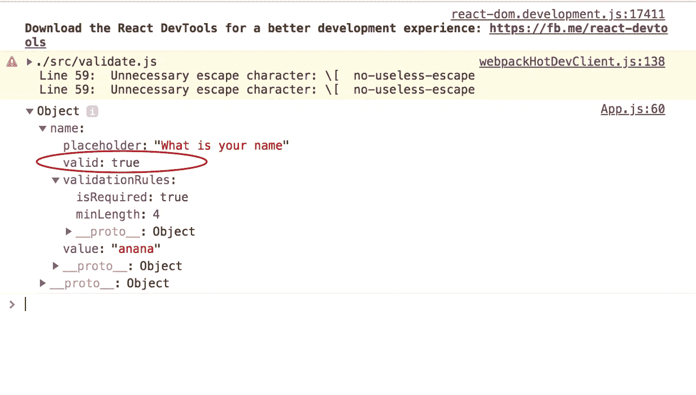
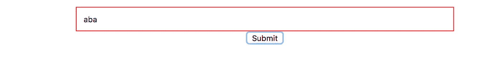

# React 中的表单完全指南

> 原文：<https://betterprogramming.pub/the-complete-guide-to-forms-in-react-d2ba93f32825>

## 我将来会收到一封关于表格的信

谢尔盖·阿库利奇在 [Unsplash](https://unsplash.com/s/photos/forms?utm_source=unsplash&utm_medium=referral&utm_content=creditCopyText) 上拍摄的照片

> 如果你喜欢在 ReactJs 中处理表单的更详细的视频教程(包括使用受控、非受控、类组件、功能组件以及如何使用名为 REACT HOOK FORM 的表单库)，你可以查看我的 [youtube 频道](https://www.youtube.com/playlist?list=PLfDIoHGD510YqxyCDHSKsBmgGjblIiANr)，这篇文章中的所有内容都包含在那里，我在 [udemy](https://www.udemy.com/course/complete-guide-to-forms-in-reactjs/?referralCode=2FD2036814C2AEA42FF1) 上发布了完整的课程。

表单在任何 web 应用程序中都非常有用。与 Angular 和 AngularJS 不同，Angular js 提供了开箱即用的表单验证，您必须在 React 中自己处理表单。这带来了许多复杂性，比如如何获取表单值、如何管理表单状态，以及如何动态验证表单并显示验证消息。

有不同的方法和库可以帮助解决这个问题，但是如果你像我一样不喜欢依赖太多的库，欢迎加入。我们将从头开始引导我们自己的形式。

React 中有两种类型的表单输入。我们有`uncontrolled input`和`controlled input`。`uncontrolled input`就像传统的 HTML 表单输入，它们会记住你输入的内容。我们将使用`ref`来获取表单值。

我们将`ref="name"`添加到输入标签中，以便在提交表单时可以用`this.refs.name.value`访问值。这样做的缺点是，当您需要时，您必须从字段中提取值，这可能会在提交表单时发生。

`controlled input`是呈现表单的 React 组件也控制后续用户输入时表单中发生的事情。这意味着，当表单值改变时，呈现表单的组件将值保存在其状态中。

当然，另一个组件可以处理表单状态。目标是每次输入改变时，调用方法`changeHandler`并存储输入状态。因此，组件总是拥有输入的当前值，而不需要请求它。这意味着表单组件可以立即响应输入的更改；例如:

*   现场反馈，如验证
*   除非所有字段都有有效数据，否则禁用按钮
*   强制执行特定的输入格式

# 处理多个表单输入

在大多数情况下，我们会有不止一个表单输入。我们需要一种方法来捕获输入，而不是声明多个方法来实现。因此，我们将修改`changeHandler`,如下所示:

由于上面修改了`changeHandler`的方式，我们的表单输入可以引用它来动态更新它的状态。

每个输入的 name 属性的值必须相同，在构造函数的`formControls`中声明状态名。

# 创建 TextInput 组件

有不同的输入元素，例如，文本、电子邮件、密码、选择选项、复选框、日期和单选按钮。我喜欢为输入元素创建单独的定制组件。让我们从`text input type`开始。

注意 `{…props}`。我们用它将道具分配给输入元素。我们可以使用如下的自定义文本输入元素:

# 验证我们的自定义文本输入

由于我们正在使用`controlled input`，我们可以向`formControls`状态添加更多的键来帮助验证输入。我们需要`valid`属性来表示输入是否有效。`validationRules`包含在`input`生效前要检查的规则列表。

我们的目标是，每次输入改变时，我们确保针对`true`或`false`检查该输入的`validationRules`，然后用检查结果更新`valid`键。我们还添加了`touched`属性来表示用户已经触摸了表单输入。这将有助于在输入被触摸时显示验证反馈。检查将以如下的`changeHandler`方法进行:

`valid`等同于方法`validate(value, prevState.formControls[name]).validationRules)`，我们将用它来检查特定控件的有效状态是`true`还是`false`。

我将`validate`方法移到一个单独的类中，然后导入它。`validate`方法接受两个参数，值和规则。我们遍历规则并检查每个规则是否有效，有效时返回`true`，无效时返回`false`。

假设我们想要在`name`上添加另一个验证，例如，我们希望`name`是必需的。我们需要做的就是更新名称`validationRules`的`formControl`，并在验证器类中为它编写逻辑，如下所示:

然后我们需要更新验证器类来容纳所需的验证器。

我们创建了一个定制的`TextInput`，并且我们创建了一个`formControl`，它有一个名为`name`的属性，其有效性规则为`isRequired`并且`minLength`为 3。下面是处理这个问题的组件:

如果我们在填写完`TextInput`后点击提交按钮，`formSubmitHandler`将如下所示控制`formControls`的值:

有效=真或假

好的一面是，我们不必等到用户单击 Submit 才知道表单输入是否有效。因为它实际上存储在组件状态中，所以我们可以在用户输入时用它来显示错误消息或反馈。我们甚至可以禁用提交按钮，直到验证通过。

# 显示错误反馈

为了显示输入的错误反馈，我们需要将特定输入的`touched`和`valid`属性作为道具传递给组件。我们将根据`valid`状态添加错误类型。我们希望只有当输入被触摸时才这样做。

我们还需要修改我们的`TextInput`组件，以根据`props.valid`和`props.touched`的值显示样式。

请注意，您应该已经在`App.css`中添加了`form-control`和`control-error`样式。

如果你的`TextInput`无效并被触碰过，你应该会看到如下截图。

# 如果表单无效，禁用提交按钮

HTML 5 在按钮输入上有一个`disabled`属性。只要`formControls`无效，我们可以将我们的`formControls`属性有效状态等同于禁用属性。

如果我们只有一个表单控件，那么`disabled={!this.state.formControls.name.valid}`会工作得很好，但是如果我们需要处理多个表单控件，我们可以为 state 设置一个新的属性来跟踪整个`formControl`对象的有效性状态。我们需要更新我们的状态来适应这种情况:

我们需要更新`changeHandler`方法，这样我们就可以遍历表单控件的状态，当有效时，将`formIsValid`状态更新为`true`。

有了这个设置，我们可以更容易地将禁用属性设置为`formIsValid`状态，这将处理一个或多个表单对象。

# 考虑其他表单输入类型

**文本区**:文本区、电子邮件和密码的工作方式与文本输入类似。我们可以创建一个`TextArea`组件。

**Email** :我们也可以创建一个`Email`组件，就像`TextInput`一样。

**密码**:我们也可以创建一个`Password`组件，就像`TextInput`一样。

电子邮件、文本区域和密码表单控件看起来类似于文本输入表单输入:

同样适用于电子邮件、密码和文本区域、文本输入

**选择选项**:选择选项表单控件与其他表单控件略有不同，因为我们必须适应选择选项。它看起来会像下面这样:

然后，选择选项组件将如下所示:

**Radio**:Radio 输入类似于 select 选项，因为它是可用选项中唯一可以选择的选项。表单控件将类似于选择选项表单控件。下面是单选按钮组件的外观:

把所有这些放在一起，让我们假设我们想要一个电子邮件输入、姓名(`TextInput`)、性别(选择选项)和无线电输入都在表单控件中。下面是您的组件的外观示例:

感谢阅读。