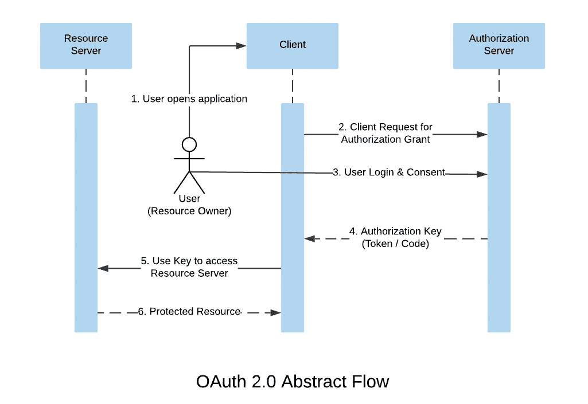
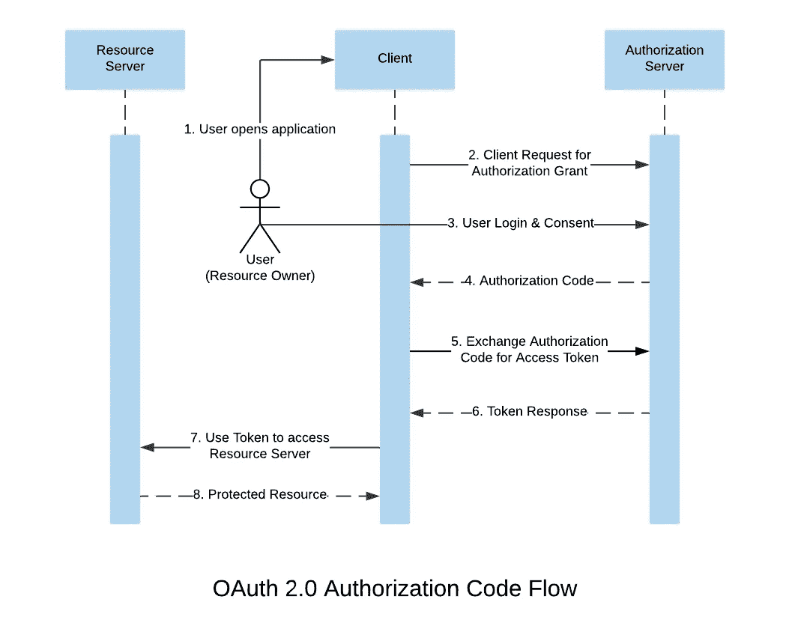
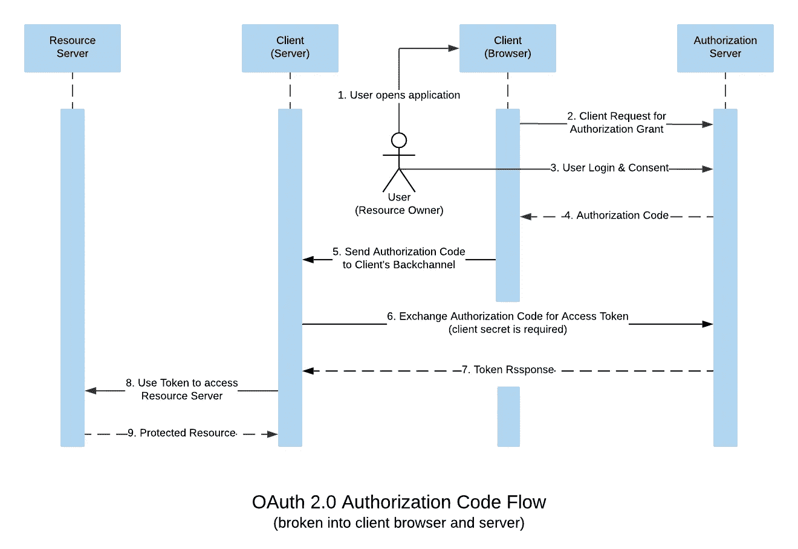
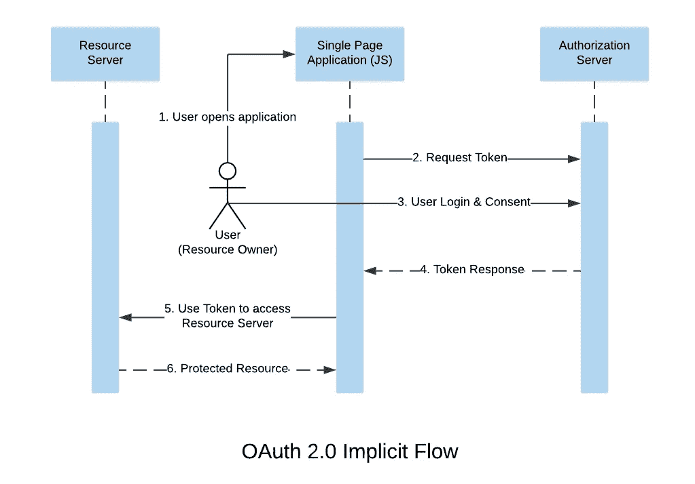
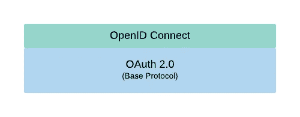

# OAuth 2.0 和 OpenID 连接协议完全指南

> 原文：<https://betterprogramming.pub/the-complete-guide-to-oauth-2-0-and-openid-connect-protocols-35ebc1cbc11a>

## 了解最广泛使用的身份验证和授权协议是如何工作的


照片由[詹姆斯·庞德](https://unsplash.com/@jamesponddotco?utm_source=medium&utm_medium=referral)在 [Unsplash](https://unsplash.com?utm_source=medium&utm_medium=referral) 拍摄

我们都在网站和手机应用上看到过“登录谷歌”和“连接脸书”按钮。点击按钮，会打开一个屏幕，显示“此应用程序想要访问您的公开个人资料，联系人…”并询问您是否要授予访问权限。这是高层次的 OAuth。理解这些协议对于每个软件工程师、安全专家甚至黑客来说都是至关重要的。

## TL；速度三角形定位法(dead reckoning)

OAuth 2.0 和 OpenID Connect 的完整指南，这是当今互联网上最广泛使用的两种授权和认证协议。OAuth 2.0 用于授权，OpenID Connect 用于认证。有两种最常见的 OAuth 2.0 授权流，用于服务器端应用程序的授权代码流和用于基于浏览器的应用程序的隐式流。OpenID Connect 是 OAuth 2.0 协议之上的身份层，使 OAuth 适用于身份验证用例。

# 为什么是 OAuth？

为了理解 OAuth 诞生的原因，我们需要理解一个叫做委托授权的术语。

## 委托授权

委托授权是一种允许第三方应用程序访问用户数据的方法。

## 委托授权的两种方法

委托授权有两种方法，一种是您给第三方应用程序您的帐户密码，以便他们可以代表您登录您的帐户并访问您的数据*另一种是*您授权应用程序使用 OAuth 访问您的数据，而无需提供您的密码(我们谁也不会提供我们的密码！).

现在我们知道了 OAuth 的必要性和重要性，让我们更深入地研究这个协议。

# OAuth 是什么？

OAuth(开放授权)是委托授权的标准协议。它允许应用程序无需用户密码即可访问用户数据。

## OAuth 2.0 术语

理解该协议需要我们理解其术语:

*   **资源所有者:**拥有客户端应用程序想要访问的数据的用户。
*   **客户端:**希望访问用户数据的应用程序。
*   **授权服务器:**授权服务器通过授予用户权限来授权客户端访问用户的数据。
*   **资源服务器:**保存客户端想要访问的数据的系统。在某些情况下，资源服务器和授权服务器是相同的。
*   **访问令牌:**访问令牌是客户端可以用来访问资源服务器上用户授予的数据的唯一密钥。

看看 OAuth 2.0 抽象流程中的术语:



图片来源:作者

授权密钥/授权可以是代码或令牌类型。稍后我们将了解不同的授权许可。现在，我们来详细了解一下授权流程:

1.  用户开始授权流程，通常是通过点击一个按钮，如与谷歌或脸书或任何其他服务连接。
2.  然后，客户端将用户重定向到授权服务器。重定向时，客户端发送诸如客户端 id 和重定向 URI 之类的信息。
3.  授权服务器处理用户身份验证，并显示同意屏幕，授予用户权限。如果你登录谷歌，你必须向谷歌提供你的登录凭证——即 accounts.google.com 而不是客户端。
4.  如果用户授予权限，授权服务器会使用授权密钥(代码/令牌)将用户重定向到客户端。
5.  然后，客户机用包含的授权密钥请求资源服务器，要求资源服务器用用户的数据进行响应。
6.  然后，资源服务器验证授权密钥，并用请求的数据响应客户端。

这就是用户如何让第三方应用程序访问他们的数据，而无需给他们密码。此时，会出现以下问题:

*   我们如何限制客户机只能访问资源服务器上的部分数据？
*   如果我们希望客户端只读取我们的数据而不更改它，该怎么办？

这些问题将我们带到 OAuth 术语的另一个重要部分:作用域。

## OAuth 中的作用域

OAuth 2.0 中的作用域用于限制应用程序对用户数据的访问。通过发布仅限于用户授权范围的授权许可。

当客户端向授权服务器请求授权时，它会发送一个作用域列表。授权服务器使用该范围列表来生成同意屏幕，并授予用户权限。如果用户同意同意屏幕，授权服务器发出仅限于用户授权范围的令牌或授权码。

例如，如果我授权一个客户端应用程序查看我的 Google 联系人列表，那么授权服务器发给客户端的令牌就不能用来删除我的联系人或查看我的日历事件——它的作用范围只是读取我的 Google 联系人。

# OAuth 2.0 的设置

在进入 OAuth 流程之前，最好先了解一些 OAuth 配置。当授权许可请求启动时，客户端将一些配置数据作为查询参数发送给授权服务器。基本查询参数包括:

*   `response_type`我们希望从授权服务器获得的响应类型。
*   `scope`客户端想要访问的作用域列表。授权服务器使用该列表为用户生成同意屏幕。
*   `client_id`由授权服务在为 OAuth 设置客户端时提供。这个 ID 有助于授权服务器确定启动 OAuth 流的客户端。
*   `redirect_uri`告诉授权服务器 OAuth 流完成后的去向。
*   `client_secret`由授权服务提供。根据 OAuth 流程，该参数可能是必需的，也可能不是必需的。我们将在授权代码流中看到它的重要性。

# 了解不同的 OAuth 流

两个最常用的 OAuth 2.0 流是基于服务器的应用程序的授权代码流和纯 JavaScript 单页应用程序(SPAs)的隐式流。

为了解释 OAuth 流程，我考虑将 Google 作为 OAuth 服务提供商。

## 授权代码流

授权代码流或授权代码授权是一个理想的 OAuth 流，它被认为是高度安全的，因为它使用前端通道(浏览器)和后端通道(服务器)来实现 OAuth 2.0 机制。



图片来源:作者

客户端通过将`response_type`设置为`code`将用户重定向到授权服务器来开始授权序列，这告诉授权服务器用授权码进行响应。该流量的 URI 如下所示:

```
[https://accounts.google.com/o/oauth2/v2/auth?](https://accounts.google.com/o/oauth2/v2/auth?)
 response_type=code&
 client_id=your_client_id&
 scope=profile%20contacts&
 redirect_uri=https%3A//oauth2.example.com/code
```

在上面的请求中，客户端通过在请求的`scope`参数中定义用户的公共配置文件和联系人来请求用户的许可。这个请求的结果是一个授权码，客户端可以用它来交换访问令牌。授权代码如下所示:

```
4/W7q7P51a-iMsCeLvIaQc6bYrgtp9
```

## 为什么要用代码换令牌？

访问令牌是唯一可以用来访问资源服务器上的数据的东西，而不是应用程序代码。那么，当客户端实际上需要一个访问令牌时，为什么要将`response_type`设置为`code`？原因是为了使 OAuth 流高度安全。



图片来源:作者

**问题:**访问令牌是我们不希望有人访问的秘密信息。如果客户端直接请求访问令牌并将其存储在浏览器中，它可能会被窃取，因为浏览器并不完全安全。任何人都可以看到页面源代码，或者使用开发工具来获取访问令牌。

**解决方案:**为了避免访问令牌在浏览器中暴露，客户端前端通道从授权服务器获取应用代码，然后将应用代码发送到客户端后端通道。现在要将这个应用程序代码换成一个访问令牌，需要一个叫做`client_secret`的东西。只有客户端的后端通道知道`client_secret`，然后后端通道向授权服务器发出 POST 请求，其中包含应用程序代码和客户端机密。该请求可能如下所示:

```
POST /token HTTP/1.1
Host: oauth2.googleapis.com
Content-Type: application/x-www-form-urlencodedcode=4/W7q7P51a-iMsCeLvIaQc6bYrgtp9&
client_id=your_client_id&
client_secret=your_client_secret_only_known_by_server&
redirect_uri=https%3A//oauth2.example.com/code
```

授权服务器验证客户端密码和应用程序代码，并使用访问令牌进行响应。后端通道存储访问令牌，并可能使用该令牌来访问资源服务器。这样，浏览器无法访问访问令牌。

## 隐式流

当您没有后端通道并且您的网站是一个只使用浏览器的静态网站时，使用 OAuth 2.0 隐式流。在这种情况下，当您将应用程序代码交换为访问令牌时，可以跳过反向通道上发生的最后一步。在隐式流中，授权服务器立即用一个访问令牌进行响应。



图片来源:作者

客户端将浏览器重定向到授权服务器 URI，在`response_type`设置为`token`的情况下启动授权流程。授权服务器处理用户的登录和同意。请求的结果是一个访问令牌，客户端可以使用它来访问资源服务器。

隐式流被认为不太安全，因为浏览器负责管理访问令牌，所以它可能会被窃取。尽管如此，它还是被广泛用于单页应用程序。

# 身份验证与授权

众所周知，OAuth 解决了委托授权问题，但是它没有提供一种标准的方法来认证用户。你可以这么说:

*   **OAuth 2.0** 用于授权。
*   **OpenID Connect** 用于认证。

如果你对这些术语感到困惑，下面是它们之间的区别:

*   **认证**是确保通信实体就是所声明的实体。
*   **授权**是验证通信实体是否有权访问资源的过程。

换句话说，认证关心你是谁，授权关心你有什么权限。

# OpenID 连接

OpenID Connect 是 OAuth 2.0 协议之上的身份层。它扩展了 OAuth 2.0，使认证方式标准化。



图片来源:作者

OAuth 并不立即提供用户身份，而是提供一个用于授权的访问令牌。OpenID Connect 使客户端能够根据授权服务器执行的身份验证来识别用户。这是通过在请求授权服务器进行用户登录和同意时定义一个名为`openid`的范围来实现的。`openid`是一个强制作用域，用来告诉授权服务器需要 OpenID Connect。

客户端发出的 OpenID Connect 身份验证请求的 URI 如下所示:

```
[https://accounts.google.com/o/oauth2/v2/auth?](https://accounts.google.com/o/oauth2/v2/auth?)
 response_type=code&
 client_id=your_client_id&
 scope=openid%20contacts&
 redirect_uri=https%3A//oauth2.example.com/code
```

请求的结果是一个应用程序代码，客户端可以用它来交换访问令牌和 ID 令牌。如果 OAuth 流是隐式的，那么授权服务器立即用一个访问令牌和一个 ID 令牌进行响应。

ID 令牌是一个 JWT 或 JSON Web 令牌。JWT 是一种编码的令牌，由三部分组成:报头、有效负载和签名。获取 ID 令牌后，客户端可以对其进行解码，以获得编码在有效负载部分中的用户信息，如下所示:

```
{
  "iss": "https://accounts.google.com",
  "sub": "10965150351106250715113082368",
  "email": "johndoe@example.com",
  "iat": 1516239022,
  "exp": 1516242922
}
```

## 要求

ID 令牌的有效负载包含一些称为声明的字段。基本要求是:

*   `iss`代币发行者。
*   `sub`用户的唯一标识符。
*   `email`用户的邮箱。
*   `iat`令牌发放时间表示为 Unix 时间。
*   `exp`以 Unix 时间表示的令牌到期时间。

然而，权利要求不限于这些领域。由授权服务器对声明进行编码。客户端可以使用这些信息对用户进行身份验证。

如果客户机需要更多的用户信息，客户机可以指定标准的 OpenID 连接作用域，告诉授权服务器在 ID 令牌的有效负载中包含所需的信息。这些范围是`profile`、`email`、`address`和`phone`。

# 结束注释

实践所学总是好的。要使用 OAuth 2.0 范围、授权码和令牌，请访问 [Google OAuth 2.0 游乐场](https://developers.google.com/oauthplayground/)。

感谢阅读到最后！如果觉得有用，请为故事鼓掌支持。