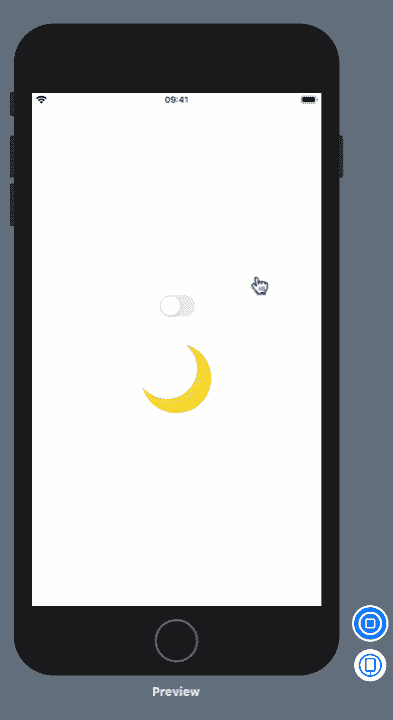
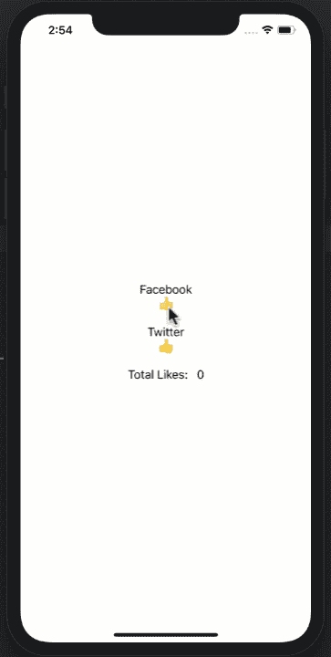

# SwiftUI 状态管理完全指南

> 原文：<https://betterprogramming.pub/the-complete-guide-to-state-management-in-swiftui-8759add64bcf>

## 如何理解 SwiftUI 开发的这个组成部分

泰勒·拉斯托维奇在 [Unsplash](https://unsplash.com/s/photos/iphone-x?utm_source=unsplash&utm_medium=referral&utm_content=creditCopyText) 拍摄的照片

**更新**:不要像 Michael Long 说的那样，在 ViewModel 的 init 方法中调用网络请求。我录制视频是为了说明问题以及如何修复。你可以在这里看视频:[https://youtu.be/HJS_yzSihoA](https://youtu.be/HJS_yzSihoA)

[SwiftUI](https://developer.apple.com/xcode/swiftui/) 是苹果新的声明式框架，用于为所有苹果设备构建用户界面。SwiftUI 框架可以分解成两个基本组件:*视图*和*状态*。

这篇文章是关于在 SwiftUI 中维护和理解状态的。状态管理是 SwiftUI 开发不可或缺的一部分，有许多不同的方式来处理状态。

# 理解状态

*状态*表示与视图相关的数据。它可以用 boolean、string、int 等基本类型来表示。；或者像视图模型这样的复杂对象。在 SwiftUI 中，更改状态值会导致视图重新呈现，从而允许它与相关数据同步。

在 [React](https://reactjs.org/) 和 [Flutter](https://flutter.dev/) 中也有类似的概念，其中改变状态会导致渲染和构建功能分别启动。

让我们看一个简单的状态例子。在这个例子中，我们将允许用户切换开关。根据开关的状态，图标会在白天和黑夜之间变化。

# 国家的基本说明

上面例子中的重要部分是在布尔属性上使用属性包装器。我们还用 private 关键字标记它，表明这个状态是`ContentView`组件的本地/私有状态。

`Toggle`视图接受一个`Binding<Bool>`，它通过传递`isOn`状态属性来满足。任何时候`Toggle`在`isOn`或`isOff`之间改变状态，状态值就会更新。每当状态更新时，它调用 body 属性来重新呈现视图。

结果如下所示:

现在您已经对状态有了一些基本的了解，让我们看看如何使用它来捕获多条信息。

# 添加更多变量

下面我们有一个名为`Register`的视图的实现。它包括注册新用户的所有基本要素。为了使这个例子简单，我们使用了基本的 SwiftUI 元素，如`TextField`等。在您的实际应用中，您可以使用 SwiftUI 框架中可用的`Form`视图。

`Register`视图的状态由四个独立变量控制。每个变量捕获状态的一部分。当用户在文本字段中键入内容时，由于绑定的强大功能，状态变量会得到更新。

大多数情况下，这很有效！但是我们必须处理四个独立变量，它们代表一个模型。这可以通过引入表示视图状态的视图模型来简化。

# 斯威夫图伊和 MVVM

虽然您可以使用任何设计模式来构建您的 SwiftUI 应用程序，但是推荐的模式是[表示模型](https://martinfowler.com/eaaDev/PresentationModel.html)，也称为 MVVM。在 MVVM 设计模式中，您将首先创建一个视图模型，该模型将负责向视图提供数据并管理与视图相关的状态。

`RegistrationViewModel`的实现如下所示:

现在，我们可以更新`Register`视图并利用我们新创建的`RegistrationViewModel`:

如您所见，我们的`Register`视图现在简单多了，而`RegistrationViewModel`负责维护视图的状态。我们已经移除了状态变量的单个片段，并用`RegistrationViewModel`代替了它们。现在，每当用户更新*文本字段*时，视图模型就会自动更新。MVVM 设计模式允许我们清晰地构建 SwiftUI 应用程序，同时使单元测试变得更容易。

有时，您有嵌套的/子视图，并且您希望子视图更新父视图的状态。这是通过使用*捆绑*完成的。

# @绑定

SwiftUI 中的单个视图可能由多个子视图组成。有时您希望允许子视图改变父视图的状态。绑定允许您将状态从父视图传递到子视图。一旦子视图改变了状态，父视图将自动获得更新的副本并重新呈现视图。让我们像以前一样实现相同的日/夜示例，但是这次我们将把`Toggle`视图放入名为`DayNightView`的子视图中。

`DayNightView`的实现如下所示:

属性包装器`@Binding`表明`isOn`属性将被传递给`DayNightView`。一旦`DayNightView`更改了`isOn`属性，原始发送者将通过重新呈现视图得到通知。

分配`isOn`属性将导致`render`在父视图上被调用。

父视图的实现如下所示:

`DayNightView`将负责显示`Toggle`开关。`DayNightView`接受一个`binding`作为参数。在上面的代码中，我们已经将`@State`属性`isOn`传递给了`DayNightView`。这意味着当`DayNightView` 更新可绑定属性时，父视图中的状态属性`isOn` 也会得到更新。

`@Binding`的主要目的是将状态传递给子视图，在子视图中可以修改状态。这给了子视图一个与父视图交流和更新的机会。

# @可观察到的和@观察到的

大多数应用程序从外部获取数据，主要使用 JSON Web API。一旦数据被下载，它就被填充到 *DTO 对象*中，然后被映射到视图模型，最后显示在屏幕上。

使用异步请求的一个常见问题是如何通知用户界面数据已经下载，视图必须刷新以显示新数据。SwiftUI 通过引入`Observable` 和`Observed`属性包装器解决了这个问题。

在进入`Observable`和`Observed`之前，我们必须想办法执行一个`async`请求来获取数据。为了简单起见，我们将发出一个假请求，并以`async`的方式获得一个帖子列表。

在上面的代码中，你可以看到`Webservice`只需等待两秒钟，然后在完成处理程序中向用户发送一个帖子的硬编码列表。

`Webservice`类被`PostListViewModel`用来执行请求。`PostListViewModel`的实现如下所示:

`PostListViewModel`代表数据，将显示在发布列表屏幕上。需要注意的最重要的事情是使用了`ObservableObject`协议，该协议允许类发布事件。`posts`属性是用`@Published`属性包装器修饰的，这意味着它的行为就像一个发布者。每当一个值被赋给`posts`属性时，它就会发布一个事件，表明它已经被更改。

最后，`PostListView`使用`PostListViewModel`获取并在视图中显示帖子，如下所示:

如果您运行该应用程序，`PostListView`将使用`PostListViewModel`并在`List`视图中填充帖子列表。MVVM 设计模式以及发布和通知变更的能力使得视图与视图模型的同步变得更加容易。

目前，我们只讨论了本地状态，它表示特定视图维护和可用的状态。如果您需要从另一个视图中改变视图的状态，您可以将其作为一个参数传递，并使用`@Binding`属性包装器。如果您只在几个视图之间传递状态，这种方法很有效，但是当涉及到几个视图时，这很快就会变成一个麻烦。

在下一节中，我们将查看*全局状态*，它可以从任何 SwiftUI 视图中访问。

# @环境对象

`EnvironmentObject`的概念和`Redux`很像。`EnvironmentObject`的主要目的是维护*全局状态*。全局状态是可以从任何视图访问的状态。`EnvironmentObject`通常在顶层视图中注入，使全局状态对所有子视图可用。

为了简化示例，我们将创建一个名为`UserSettings`的类，它将在多个视图之间共享。我们将实现三种不同的视图，即`Facebook`、`Twitter`和`TotalLikes`。`Facebook`和`Twitter`视图将允许用户增加喜欢和`TotalLikes`将负责显示总喜欢。

`UserSettings`类的实现如下所示:

`UserSettings`类正在使用`ObservableObject`协议。在`UserSettings`类中唯一的属性是`likes`，它用一个`@Published`属性包装器来修饰，表明它将作为一个发布者，并在值改变时通知订阅者。

在使用`UserSettings`之前，我们需要将其注入到父视图中。打开`SceneDelegate.swift`并执行以下代码:

现在，`UserSettings`对象将对`ContentView`和`ContentView`内部的所有视图可用。接下来，我们将实现如下所示的`Facebook`和`Twitter`视图:

有趣的是`@EnvironmentObject`属性包装器的用法。将从父视图中自动填充`UserSettings`实例。当您增加`likes`属性时，它将为所有对`UserSettings`全局状态感兴趣的视图全局增加。

对全局状态的更新也将导致视图再次自动呈现。

`TotalLikes`视图负责显示`likes`的值。

最后，`Twitter`和`Facebook`视图在`ContentView`中使用。

结果如下所示:

厉害！