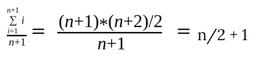
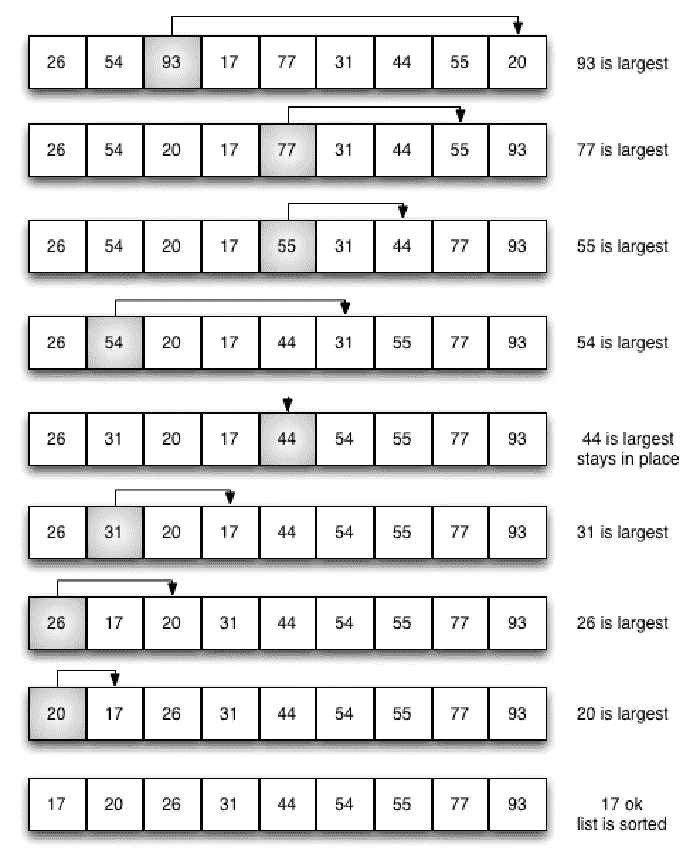
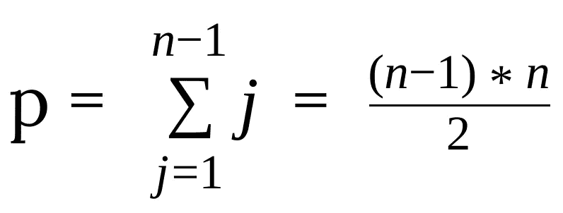
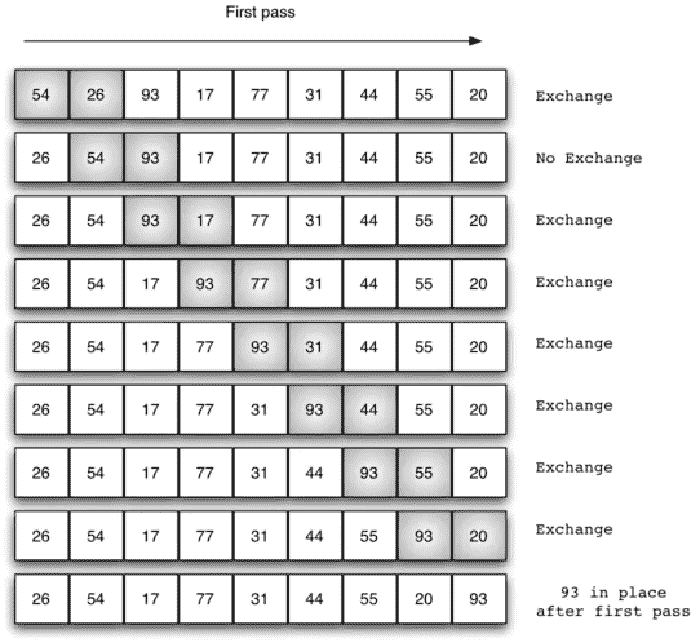
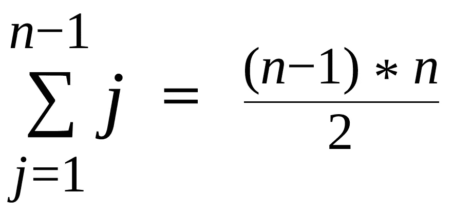
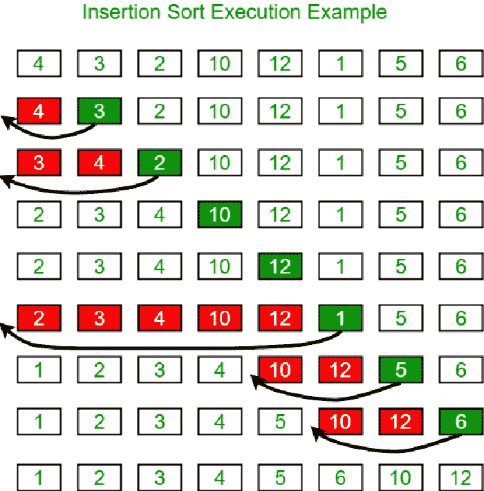
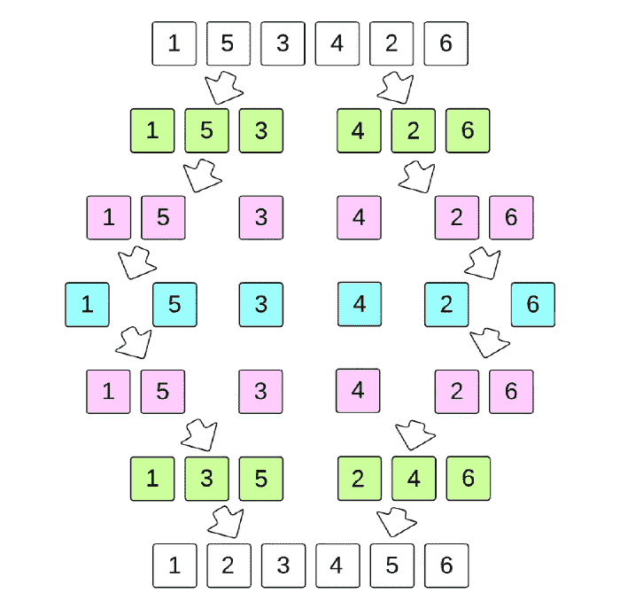
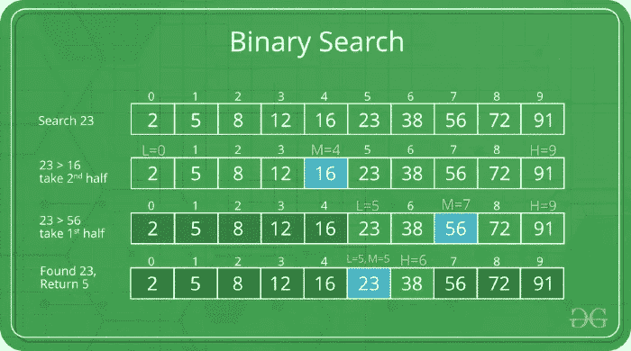
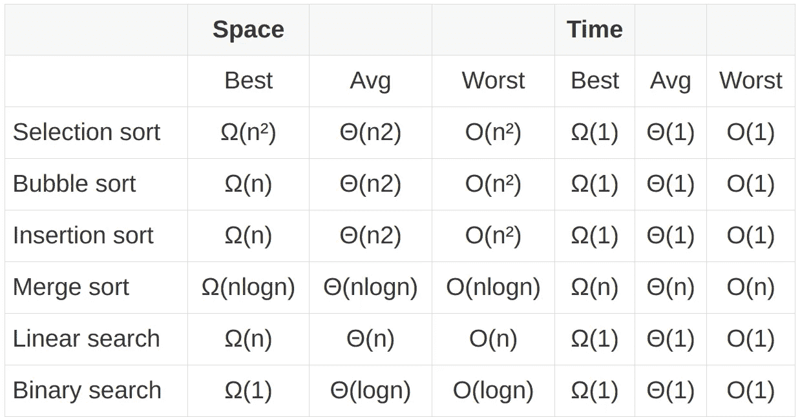

# 理解算法的时间和空间复杂性的完全指南

> 原文：<https://betterprogramming.pub/the-complete-guide-to-understanding-time-and-space-complexity-of-algorithms-88de31d89949>

## 这个话题在面试中超级潮，找工作的话应该知道


作者图片

解决问题的方法不止一种，但并不是所有的方法都是最好的。不是每个解决方案都能够有效地利用我们的资源。因此，在采取行动之前，我们需要找到解决问题的最佳、最有效的方案。

在编程中，我们不能把寻找最佳解决方案、最佳算法的机制留给猜测。我们需要一个明确的标准来评估解决方案的效率。这就是时间和空间复杂性概念介入的地方。它们帮助我们根据所需的资源来确定算法的效率。

在本文中，我们将讨论时间和空间复杂性的概念，以及如何使用它们为给定的任务选择最有效的算法。当然，这也是像 O( *n* )和 O(log *n* )这样的符号的来源，这些符号在学习算法时可能会让你感到困惑。

# 算法的效率

我们使用算法执行所需的时间和空间(内存)来衡量算法的效率。时间很重要，因为我们需要我们的程序尽可能快地运行，以快速交付结果。空间很重要，因为机器留给程序的空间是有限的。

最好的算法是使用最少的空间在最少的时间内完成执行的算法。但通常，在现实中，算法必须在节省空间和时间之间进行权衡。

这就是为什么给定任务的最佳算法不是一成不变的。最佳算法取决于我们的需求。如果我们需要我们的算法尽可能快地运行，不管内存使用情况如何，我们可以选择最省时的算法作为最佳算法，反之亦然。

如果我们需要节省时间和空间，我们可以满足于使用平均时间和空间量的算法。

# 空间复杂性

算法的空间复杂度是指算法执行时所使用的空间量与输入的大小之间的关系。

```
n = int(input())nums = []
for i in range(1, n+1):
    nums.append(i*i)
```

在这个例子中，我们创建的列表的长度取决于我们为 *n* 提供的输入值。

假设向列表中添加一个整数占用了 *c* 空间，而其他初始操作，包括创建一个新列表，占用了 *d* 空间。然后我们可以像这样为上面的算法所占用的空间创建一个方程。

```
when n       -> c*n + d
when n = 10  -> c*10 + d
when n = 100 -> c*100 + d
```

由该等式计算的值是算法完成执行所需的空间。常量 *c* 和 *d* 的值不受算法的控制，并且取决于诸如编程语言、硬件规格等因素。

然而，我们不需要这个方程计算的精确值来讨论算法的空间复杂度。相反，我们使用变量 *n* 的最高阶作为空间复杂度的代表。

例如，上述算法的空间复杂度约为 *n* 。如果另一个算法对于它需要的空间有等式*c***n*2+*d***n*+*e*，我们说它有一个 *n* 2 的空间复杂度的阶。

# 时间复杂度

时间复杂度是算法执行的与输入大小相关的基本操作的数量。这里我们计算的是操作的数量，而不是时间本身，这是基于这样一个假设，即每个操作需要固定的时间来完成。

如果我们再看一下前面的算法，它执行 *n* 次操作( *n* 次循环迭代)来完成它的执行。

如果我们像以前一样构造一个类似的时间复杂度方程，它也采用*c***n*+*d*的形式，其中 *c* 为每次循环迭代所用的固定时间，`d`为其他初始操作所用的固定时间。

因此该算法的时间复杂度也在 *n* 的数量级。

# 渐近分析

正如你在这些例子中看到的，我们不能用精确的值来比较一个算法和另一个算法，因为它们取决于我们使用的工具和底层硬件。事实上，如果我们计算在同一系统上运行同一算法的两个实例的时间和空间值，由于系统环境的细微变化，我们得到的值会有差异。

因此，我们使用[渐近分析](https://en.wikipedia.org/wiki/Asymptotic_analysis)来比较两种算法的空间和时间复杂度。它根据输入大小分析算法的性能。它评估性能如何随着输入大小的增加而变化。这种类型的分析不需要算法所采用的空间或时间的实际值来进行比较。

# 最佳、最差和一般情况

通常，在渐近分析中，我们在分析算法时会考虑三种情况:最佳、最差和平均。

为了理解每种情况，让我们以线性搜索算法为例。我们使用一个简单的`for`循环来搜索一个给定的整数 *k* 是否出现在一个名为`nums`的大小为 *n* 的列表中。

```
def linear_search(nums, n, k):
    for i in range(n):
        if k == nums[i]:
            return i
    return -1
```

让我们从时间复杂度的角度来考虑这个算法的最好、最坏和平均情况。(我们也可以从空间复杂度的角度来讨论这三个场景。)

## 最好的情况

我们将允许算法在最短时间内完成执行的输入组合视为时间复杂度方面的最佳情况。在这种情况下，执行时间充当算法时间复杂度的下限。

在线性搜索中，最好的情况发生在当 *k* 存储在列表的第 0 个索引时。在这种情况下，算法可以在`for`循环的仅一次迭代之后完成执行。

```
nums = [1, 2, 3, 4, 5, 6]
n = 6
k = 1
```

## 最坏情况

最糟糕的情况发生在将花费最长时间完成的输入组合传递给算法时。最坏情况的执行时间充当算法时间复杂度的上限。

在线性搜索中，最坏的情况发生在`k`不在列表中的时候。这需要算法 *n* +1 次迭代才能算出这个数字不在列表中。

```
nums = [1, 2, 3, 4, 5, 6]
n = 6
k = 7
```

## 一般情况

为了找到平均情况，我们得到算法对于每个可能的输入组合的运行时间的总和，并取它们的平均值。

在线性搜索中，算法完成执行所需的迭代次数遵循以下模式。

```
When k is stored at the 0th index  -> 1 iteration
When k is stored at the 1st index  -> 2 iterations
When k is stored at the 2nd index  -> 3 iterations
When k is stored at the 3rd index  -> 4 iterations
:                                  :
When k is stored at the nth index  -> n iterations
When k is not in the list          -> n+1 iterations
```

所以我们可以这样计算算法的平均运行时间。



# 渐近符号

渐近符号是一种数学符号，用于表示渐近分析中算法的时间和空间复杂度。我们主要使用三种渐近符号来表示算法的最佳、最差和平均情况。

## ω(大ω)符号

ω符号表示函数的渐近下界。换句话说，它说函数应该至少输出给定输入的相应的 big-omega 值。

对于一个函数 *g* ( *n* )，我们可以将ω(*g*(*n*))表示的函数集合定义如下。

```
Ω(g(n)) = {
  f(n): there exist positive constants c and n0 such that
    0 <= c*g(n) <= f(n) for all n >= n0
}
```

很拗口。但是让我们用一个例子来分解这个定义，试着去理解它的意思。

先拿函数*g*(*n*)=*n*2 来说。

现在， *g* ( *n* )的大ω代表所有 *n* > = *n* 0 时满足条件 0<=*c***g*(*n*)<=*f*(*n*)的函数集合

我们来考虑函数*f*(*n*)= 2*n*2+4。

```
For c = 1 and n0 = 1, 0 <= c*g(n) <= f(n) for all n >= n0
Therefore, f(n) = Ω(g(n))
```

现在，如果我们考虑*f*(*n*)= 3*n*+5，就找不到满足上述条件的常数 *c* 和 *n* 0 的值。所以*f*(*n*)= 3*n*+5 不属于 *g* ( *n* )的大ω。

在时间和空间复杂性中，ω符号用于表示算法的最佳情况。它可以提供时间和空间复杂度的下限。

## O(大 O)符号

o 符号表示函数的渐近上界。换句话说，对于给定的输入，该函数应该最多输出相应的 big-O 值。

对于一个函数 *g* ( *n* )，集合 O( *g* ( *n* ))的定义如下。

```
O(g(n)) = { 
  f(n): there exist positive constants c and n0 such that
    0 <= f(n) <= c*g(n) for all n >= n0
}
```

还是那句话，我们用一个例子来理解这个定义。

```
g(n) = n2
f(n) = 2n2 + 4
For c = 5 and n0 = 1, 0 <= f(n) <= c*g(n) for all n >= n0
Therefore, f(n) = O(g(n)
```

而如果我们考虑*f*(*n*)=*n*3+2，则不属于 O( *g* ( *n* ))，因为 *c* 和 *n* 0 的值组合都不满足要求的条件。

我们用 O 符号来表示算法最坏情况下的时间和空间复杂度。

## θ(大θ)符号

θ符号表示函数的上界和下界。因此，对于给定的输入，它定义了函数可以取值的最大和最小边界。

θ符号的标准定义如下。

```
Θ(g(n)) = {
    f(n): there exist positive constants c1, c2 and n0 such
        that 0 <= c1*g(n) <= f(n) <= c2*g(n) for all n >= n0
}
```

我们用一个例子，用我们到目前为止使用的 *g* ( *n* )和 *f* ( *n* )函数来理解这个定义。

```
g(n) = n2
f(n) = 2n2 + 4
For n0 = 1, c0 = 1, and c1 = 5, 0 <= c0*g(n) <= f(n) <= c1*g(n) for all n >= n0
Therefore, f(n) = Θ(g(n))
```

Big-theta 符号用于定义算法的平均时间和空间复杂度。

# 流行算法的时间和空间复杂度

## 选择排序

选择排序算法用于对项目列表进行排序。

1.  它遍历列表一次，找到最小项，并将其放在列表的起始索引处。
2.  然后，在下一次迭代中，它会找到第二个最小项，并将其放在第二个位置。
3.  这种模式一直持续到列表中的所有项目都排序完毕。

```
def selection_sort(nums, n):
    """
    nums: the list of numbers to sort
    n: the length of the list
    """
    for i in range(n-1): min_index = i
        #search the unsorted indexes for the next minimum number
        for j in range(i+1, n):
            if (nums[j] < nums[min_index] ):
                min_index = j
        #Swap the next minimum number with the earliest unsorted number
        nums[i], nums[min_index] = nums[min_index], nums[i]
```



选择排序示例

**时间复杂度**

让我们考虑这个算法的最好、最坏和一般情况下的时间复杂度。

最好的情况发生在传递的数字列表已经排序的时候。然而，选择排序算法仍然必须完成所有的迭代步骤，因为它没有一种机制来知道列表是否已经排序。

如果算法在 *p* 步数内完成，则以下公式适用。



我们可以看到 *p* 的顺序是 *n* 2。因此，选择排序的最佳时间复杂度是*ω*(*n*2)。

选择排序对于其他所有输入都是一样的，包括最坏的情况。所以它的最坏情况和平均情况的时间复杂度是 O( *n* 2)和θ(*n*2)。

**空间复杂度**

选择排序不在内存中存储额外的数据。它只修改原始列表。因此，它的空间复杂度为 O(1)。

## 冒泡排序

冒泡排序算法比较列表中的相邻项，如果第一项小于第二项，则交换它们。它继续这个操作，直到在遍历列表时没有执行交换(即，列表被排序)。

例如，如果[22，12]是列表中两个相邻的项目，冒泡排序会交换它们，并将顺序更改为[12，22]。

```
def bubble_sort(nums, n):
    for i in range(n-1):
        swapped = False
        for j in range(n-i-1):
            if (nums[j] > nums[j+1]):
                #Swap the adjacent numbers to keep them in ascending order
                nums[j], nums[j+1] = nums[j+1], nums[j]
                swapped = True if not swapped:
            break
```



冒泡排序示例

**时间复杂度**

在最好的情况下，当传递的列表已经排序时，算法执行 *n* -1 次操作，其顺序为 *n* 。因此，它的最佳情况时间复杂度为ω(*n*)。

在最坏的情况下，当列表中的项目按降序排列时，该算法按照 *n* 2 的顺序执行多个操作。因此，冒泡排序的最坏情况时间复杂度为 O( *n* 2)。

算法的平均时间复杂度也是θ(*n*2)。

**空间复杂度**

与选择排序类似，冒泡排序具有 O(1)的常数空间复杂度。

## 插入排序

插入排序算法按照以下步骤对项目列表进行排序。

1.  从第 0 个索引开始循环访问数组。
2.  检查当前项目是否小于其前一个项目。
3.  如果是，将当前项目与前一个项目进行比较。
4.  继续此操作，直到找到小于或等于当前项目的项目。
5.  通过将较大的项目上移一个位置，将当前项目放在较小的项目旁边。

```
def insertion_sort(nums, n):
    for i in range(1, n):
        current = nums[i]

        #Check the previous items to find where current item fits in the sorting order
        j = i-1
        while j >= 0 and nums[j] > current:
            nums[j+1] = nums[j]
            j -= 1
        nums[j+1] = current
```

**时间复杂度**

在最好的情况下，插入排序算法只需要 *n 次*操作，因为列表已经被排序了。因此，它具有ω(*n*)的最佳情况时间复杂度。

在最坏的情况下，该算法需要完成以下数量的运算，其顺序为 *n* 2。



所以最坏情况的时间复杂度是 O( *n* 2)。

**空间复杂度**

同样，由于该算法在不使用额外内存的情况下就地修改列表，所以它的空间复杂度为 O(1)。



插入排序示例

## 合并排序

Merge sort 将给定的列表分成更短的列表，并在将它们组合在一起之前对它们进行排序，以创建一个完全排序的列表。算法中涉及的步骤如下。

1.  通过中间点将列表分成两半。
2.  分别对列表的前半部分和后半部分进行合并排序。
3.  合并排序后的两半，创建最终的排序列表。

正如您可能已经猜到的，merge sort 是一种递归算法，它在对半列表上反复调用`mergeSort`函数，直到初始列表被分成单个项目。然后，它将这些项目按排序后的顺序重新合并。

```
def merge(arr, left, right): i = j = k = 0 #Compare the elements in the two lists starting from the first items
    #Add the smallest item to the merged list 
    #Continue this until all items of one list are added
    while i < len(left) and j < len(right):
        if (left[i] < right[j]):
            arr[k] = left[i]
            i += 1
        else:
            arr[k] = right[j]
            j += 1
        k += 1 #Check if there are more items in left list and merge them in order
    while i < len(left):
        arr[k] = left[i]
        i += 1
        k += 1 #Check if there are more items in right list and merge them in order
    while j < len(right):
        arr[k] = right[j]
        j += 1
        k += 1 def merge_sort(arr, n):
    if (n > 1):
        mid = n//2
        left = arr[:mid]
        right = arr[mid:] merge_sort(left, len(left))
        merge_sort(right, len(right)) #Merge left and right lists in sorted order
        merge(arr, left, right)
```



合并排序示例

**时间复杂度**

在最佳、最差和一般情况下，合并排序具有相同顺序的时间复杂性。让我们看看如何找到算法的这个顺序。

*   归并排序算法将一个有 *n* 个条目的列表一分为二，一直持续到有 *n* 个有单个条目的列表。
*   如果 *n* =2 *x* ，这需要 *x* 的除法数除以 2 才能得到基本级别。因此它创建了 *x* 个级别，每个级别包含大小为 *n* /2、 *n* /4、…、 *n* /2 *x* -1、 *n* /2 *x* 的数组。我们可以使用对数来计算 *x* 的值。是 log2 *n* 。
*   如果 2*x*+1>n>2*x*，则需要 *x* +1 的除法数除以 2 才能得到基级。这导致创建了 *x* +1 个级别。我们可以将 log2 *n* +1 的值向上取整，得到 *x* +1 的值。
*   在每一级中，合并排序算法在将左列表和右列表合并在一起时，对单独列表中的每个项目迭代一次。因为总共有 *n* 项，所以每一级都需要 *n* 次运算才能完成合并。
*   因为最多有 log *n* +1 个级别，所以算法执行的操作总数是 *n* *( log *n* +1)。按照 *n* *log *n* 的顺序。

因此，归并排序的最佳、最差、平均时间复杂度分别为ω(*n** log*n*)、O( *n* *log *n* )、θ(*n** log*n*)。

**空间复杂度**

合并排序使用额外的 *n* 空间来存储分割数组中的项目。因此，它在最好、最差、一般情况下的空间复杂度分别为ω(*n*)、O( *n* )、θ(*n*)。

## 线性搜索

线性搜索算法遍历列表中的每一项，找出某一项是否存储在其中。

```
def linear_search(nums, n, k):
    for i in range(n):
        if k == nums[i]:
            return i
    return -1
```

**时间复杂度**

在最坏的情况下，该算法遍历列表中的每个项目一次。因此，它的最坏情况时间复杂度为 O( *n* )。在最好的情况下，搜索完成一次搜索迭代，时间复杂度为 O(1)。

**空间复杂度**

线性搜索不使用额外的空间来存储项目。因此它的空间复杂度为 O(1)。

## 二进位检索

二进制搜索算法用于在排序的项目列表中查找给定的项目。它使用不同于线性搜索的机制来更快地完成搜索。

1.  找到列表的中间项目，并将其与给定项目 *k* 进行比较。
2.  如果中间项等于 *k* ，则算法完成。
3.  如果 *k* 小于中间项，则对中间项左边的数组执行二分搜索法。
4.  如果 *k* 大于中间项，则对中间项右边的数组执行二分搜索法。
5.  递归地继续这个操作，直到找到 *k* 或者确定 *k* 不在列表中。

```
def binary_search(nums, left, right, k):
    if (left <= right):
        mid = left + (right - left)//2 #Check if the mid item is equal to k
        if (nums[mid] == k):
            return mid #If k is smaller than the middle item, check the left half of the list
        elif nums[mid] > k:
            return binary_search(nums, left, mid-1, k)

        #If k is lerger than the middle item, check the right half of the list
        else:
            return binary_search(nums, mid+1, right, k)

    return -1
```



二分搜索法的例子

**时间复杂度**

二分搜索法，类似于你在合并排序算法中看到的，使用分治法来解决这个问题。它将数组一分为二，并在数组的相关一侧搜索给定的项。最坏的情况下，算法最多将数组 log *n* +1 次。因此，它的最坏情况时间复杂度为 O(log *n* )。

在最好的情况下，传递的列表的中间项必须是被搜索的项。因此，由于它在恒定时间内完成，最佳情况下的时间复杂度为ω(1)。

**空间复杂度**

二分搜索法最好的空间复杂度是ω(1)。

最坏情况下的空间复杂度取决于实现。使用我们已经完成的递归实现，由于为每个递归调用在中间、左侧和右侧值存储额外的数据，二分搜索法具有 O(log *n* )的空间复杂度。迭代实现可以将复杂度降低到 O(1)。

# 算法复杂性概述



算法及其复杂性概述

如果你以前对算法的时间和空间复杂性感到困惑，我希望这篇文章至少在某种程度上帮助你解决了这种困惑。

感谢您的阅读。