# 将 Node.js 中的 GraphQL 用于 Apollo Server 的完整指南

> 原文：<https://betterprogramming.pub/the-complete-guide-to-using-graphql-in-node-js-with-apollo-server-aef347a7a0ee>

## 如何将 GraphQL 集成到 Node.js 应用程序中

来源:[安吉拉·孔波尼](https://unsplash.com/photos/BHlaVh6-An0)对 [Unsplash](http://unsplash.com)

# 本文的目标

在本文中，我们将了解以下内容:

*   什么是 GraphQL
*   何时使用它，它相对于 REST 的优势是什么
*   Apollo 服务器的基本 GraphQL 功能
*   高级 GraphQL 功能，如 GraphQL 中的解析器链和突变
*   使用 GraphQL 时需要记住的重要事项

# 介绍

GraphQL 的流行使得许多开发者从 REST 转向在他们的新应用中使用 GraphQL。如果您是一名新手或有学习热情的开发人员，您可能会认为 GraphQL 是一种非常难以使用的技术。

对此我的回答是否定的。GraphQL 已经成为最热门的学习技术之一，这是有充分理由的。我们先来了解一下 GraphQL 是什么。

## 什么是 GraphQL

简单来说，就是从 API 查询数据的一种方式。此外，GraphQL 允许程序员请求将数据从服务器拉至客户机。所有这些似乎都类似于使用 REST 方法，那么它们之间的区别是什么，为什么要使用 GraphQL 呢？[包括 GitHub 和 Twitter 在内的 90 多家公司都在使用它](https://graphql.org/users/)，所以它一定有什么不同之处。

## 为什么使用它

当使用 REST 获取数据时，您有多个端点和其他请求，如`POST`、`DELETE`、`GET`和`PUT`。此外，您可以通过从多个端点获取所需的数据。另一方面，GraphQL 去掉了不同的端点，只给你一个端点。您需要的数据取决于您发送到这个单一端点的查询。

让我用一个例子来说明这一点。假设您正在构建一个应用程序，它只显示来自这个 [Coffee API](https://sampleapis.com/api-list/coffee) 的咖啡名称。

休息时，你会先要热咖啡，然后要冷咖啡。最后，您只想显示返回响应中的`title`字段。它会这样做:

*   首先，您将看到所有可用的数据及其字段:

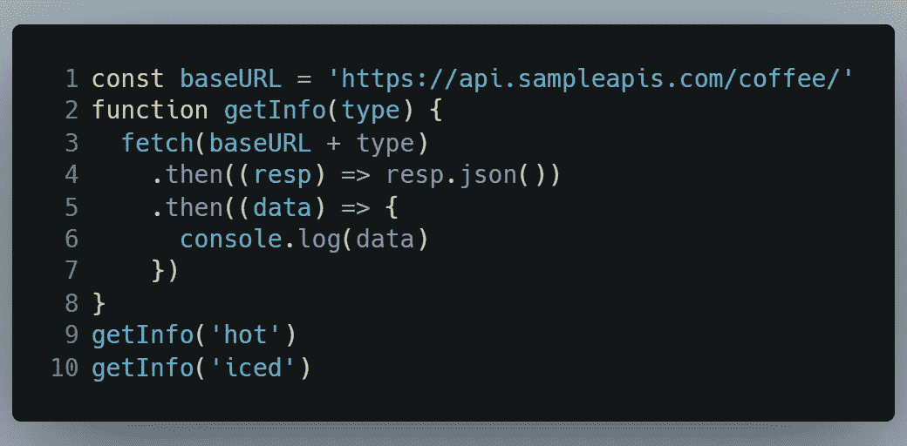

获取 REST 中所有可用的数据

这将为您提供如下所示的输出:

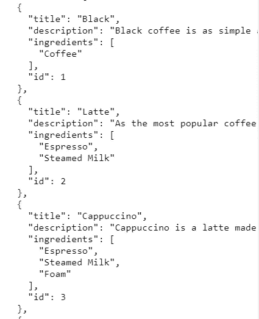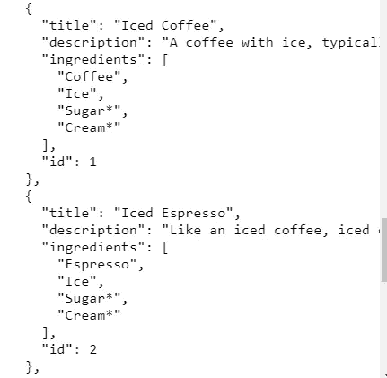

代码的输出

*   所有这些数据对我们来说都是不必要的。为了只获取`title`字段，我们需要像这样重写我们的代码:

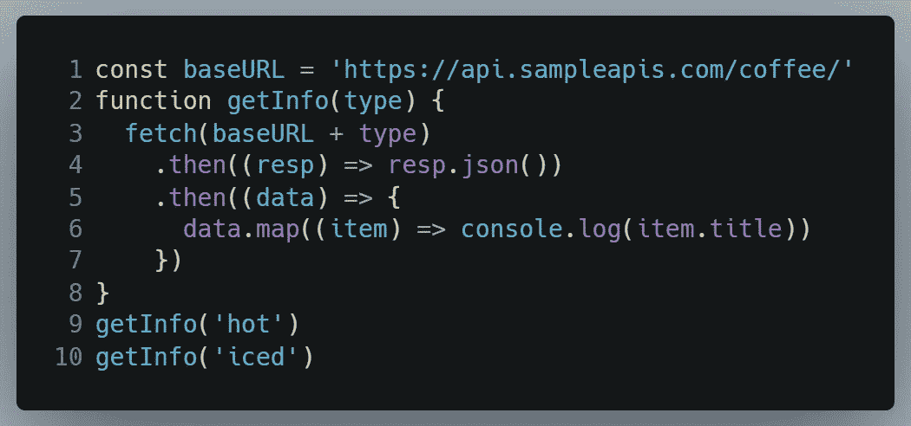

在休息中得到唯一的标题

这将产生以下输出:

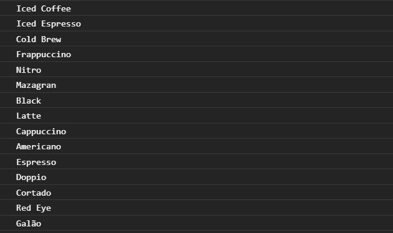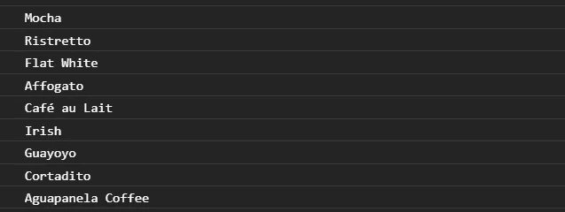

代码的输出

如你所见，这相当容易。但是请注意，当我们的响应出现时，不需要的字段也出现了，例如，`description`和`ingredients`。我们只需要`title`，其他什么都不需要。注意，我们还执行了几次`GET`请求。在某些情况下，`GET`请求也会被执行超过必要的次数。这被称为*过取*。那么，我们如何在只接收我们想要的数据的同时防止这种情况呢？

这就是 GraphQL 介入的地方。您向 API 指定您需要什么数据(在本例中，只有`title`)，结果，您得到的响应过滤掉了不需要的数据，只返回过滤后的数据(在这里，这只是每个对象的`title`字段)。

让我们用 GraphQL 复制这个。您也可以[自己运行查询](https://api.sampleapis.com/coffee/graphql)。

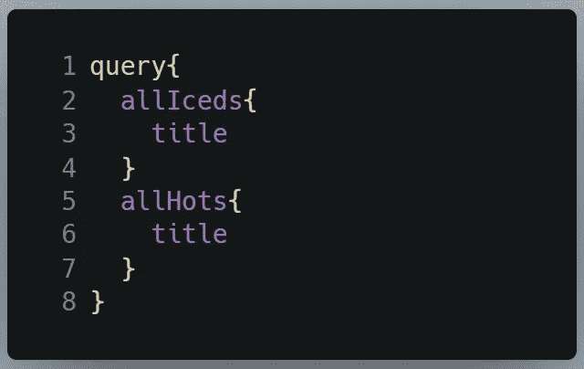

查询以获取 GraphQL 中的数据

*   第 2–4 行:我们首先进行查询，以获得冰咖啡的`title`。
*   第 5–7 行:然后我们进行另一个查询来获取冷咖啡的`title`。

这就是事情的全部。当我们运行查询时，输出如下:

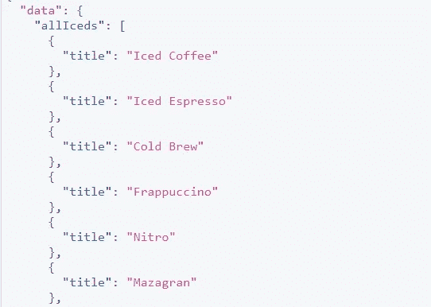

GraphQL 查询的输出

如您所见，我们成功地获得了一个响应，而没有收到我们不需要的其他字段。没有必要筛选出不需要的字段。在编程领域，这是一个游戏改变者。

既然已经谈了 GraphQL 的结果，那就来写点代码吧！

# 开始

首先，使用以下终端命令初始化项目的存储库:

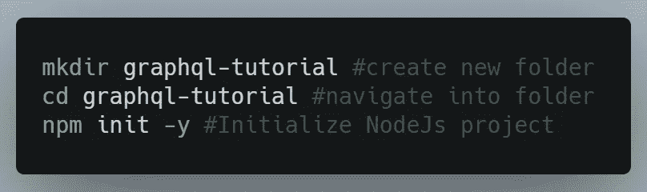

初始化我们的项目

完成后，现在让我们安装项目所需的库。

## 安装库和依赖项

我们将使用以下库:

*   这是阿波罗服务器的核心库。Apollo 服务器技术将允许我们在 Node.js 应用程序中使用 GraphQL。
*   `graphql`:这个库将用于构建 GraphQL 模式。此外，`graphql` 也是`apollo-server`模块的依赖项。我们将在本教程的后面详细讨论模式。

我们现在已经完成了这一部分。在下一节中，我们将学习 GraphQL 的基础知识。

# GraphQL:使用 Apollo 服务器的基本查询

在本节中，我们将学习 GraphQL 的基础，并使用一个简单的数据集。此外，我们还将学习 GraphQL 查询语言的基础知识。

## 设置

在您的项目目录中，创建一个名为`basic-server.js`的文件。这将是我们项目的主要文件。

在`basic-server.js`中，我们将从`apollo-server`模块中导入以下依赖项:

*   `gql`:这是为了创建我们的模式。
*   `ApolloServer`:这将构建并运行我们的 GraphQL 服务器。

转到`basic-server.js`，像这样导入这些:

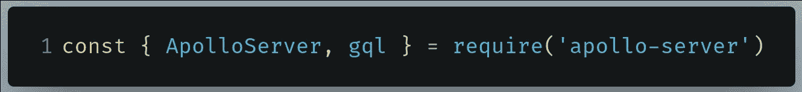

要在 basic-server.js 中编写的代码

完成后，现在让我们来处理我们的模式。

## 定义我们的模式

什么是*模式*？根据 [Apollo 的文档](https://www.apollographql.com/docs/apollo-server/getting-started/#step-3-define-your-graphql-schema)，模式本质上是通知 GraphQL 关于客户端可以查询的数据的结构或形状。换句话说，这个模式是客户端可以从 GraphQL API 请求的数据的描述。

在`basic-server.js`中，编写以下代码:

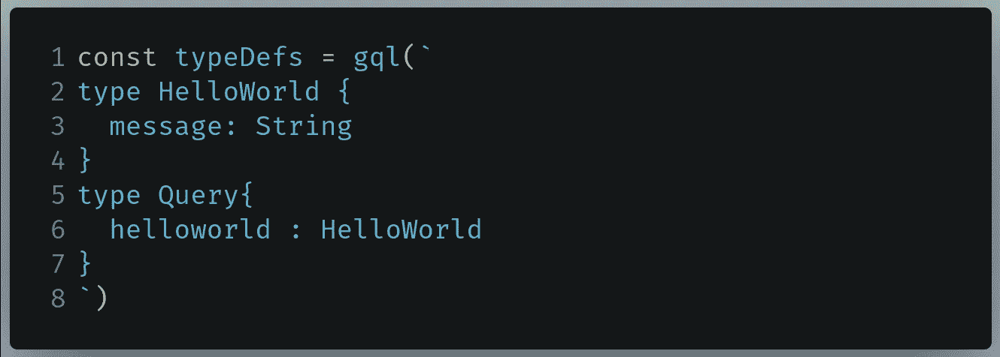

要在 basic-server.js 中编写的代码

*   第 2–4 行:这里我们告诉 GraphQL，`HelloWorld`是一个对象类型，它有一个名为`message`的字段。`message`字段将包含字符串数据。
*   第 5-7 行:这里我们告诉 GraphQL，客户端可以执行一个名为`helloworld`的查询，结果，返回的数据将是类型`HelloWorld`。

这里，`String`是一个*标量类型。标量类型类似于您在其他编程语言中使用的数据类型，例如 Int、Boolean 等等。关于标量类型的更多细节，请参考 [Apollo 服务器的文档](https://www.apollographql.com/docs/apollo-server/schema/schema/#scalar-types)。*

另一方面，`HelloWorld`和`Query`被称为*对象类型。*一个对象类型包含一个字段集合，每个字段可以是标量类型，也可以是另一个对象类型。这类似于您在其他编程语言中使用的对象。

**重要提示** : `Query`是一个特殊的对象类型，它定义了客户端可以根据我们的 GraphQL API 查询的所有数据。

既然我们已经通知了 GraphQL 我们的模式，现在让我们开始实际创建我们的数据集。

## 定义我们的数据集

这里我们将简单地创建一个对象，它的字段名为`message`。

在`basic-server.js`中，编写以下代码:

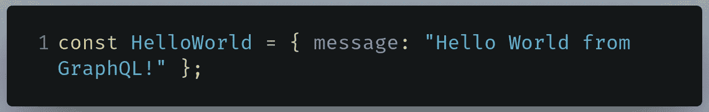

要在 basic-server.js 中编写的代码

如您所见，`message`字段包含单词“来自 GraphQL 的 Hello World！”。

现在已经完成了，让我们来研究解析器。

## 使用解析器获取数据

简单地说，*解析器*是一个告诉 GraphQL 从哪里获取信息的函数。换句话说，它告诉 GraphQL 如果用户执行查询，返回什么数据。例如，如果用户在`helloworld`上执行一个查询，GraphQL 将参考 resolver 函数返回什么数据作为响应。

在我们的例子中，我们希望解析器返回`message`字段的值(即“来自 GraphQL 的 Hello World！”)在`HelloWorld`对象中，如果用户对`helloworld`进行查询。

在`basic-server.js`中，编写以下代码:

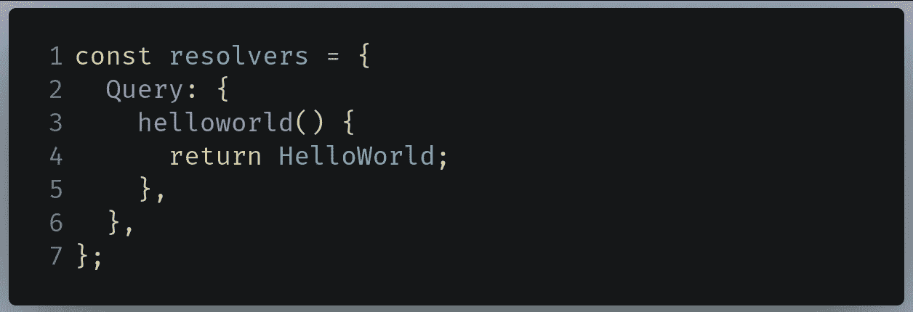

要在 basic-server.js 中编写的代码

*   第 3–4 行:这里我们创建了一个解析器，它告诉 GraphQL 如果用户查询名称`helloworld`，那么返回的结果将是我们定义为数据的`HelloWorld`对象。

完成后，作为我们的最后一步，我们将运行我们的 GraphQL 服务器。

## 运行服务器

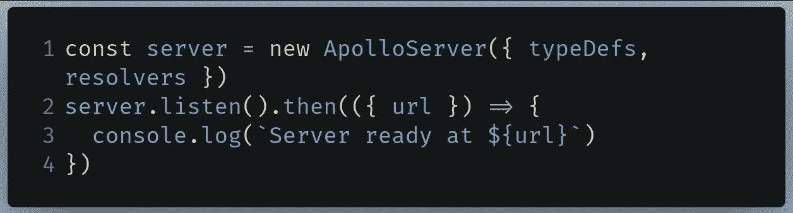

要在 basic-server.js 中编写的代码

*   第 1 行:这里我们创建了一个`ApolloServer`的实例，并通知 GraphQL 使用我们最近定义的模式和解析器。
*   第 2-4 行:启动我们的服务器。

现在运行代码。要查看输出，请转到`localhost:4000`。

然后，您将看到一个如下所示的页面:

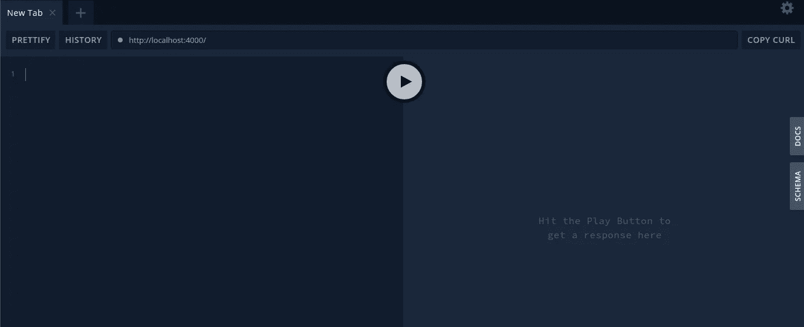

代码的输出

在您的应用程序右侧，点击`Docs`按钮。这将为您提供可以查询的数据的摘要。

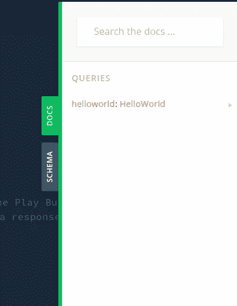

Apollo 服务器中的文档部分

正如我们所看到的，这正是我们在模式中定义的。我们可以执行一个名为`helloworld`的查询。此外，文档菜单证明`helloworld`属于类型`HelloWorld`。

接下来，点击列表中的`helloworld`项，这样我们可以获得关于`HelloWorld`对象类型中字段的更多信息。

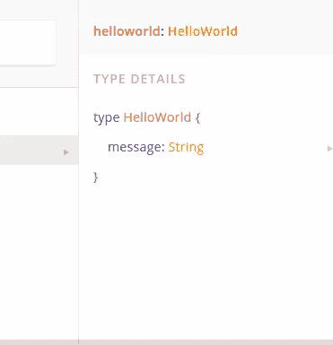

我们 helloworld 查询的详细信息

我们现在可以看到出现在`HelloWorld`对象类型中的字段。此外，注意到`HelloWorld`有一个名为`message`的字段，其标量类型为`String`。我们需要执行一个查询来获取这个字段的值。

现在跳回 GraphQL 的查询编辑器，编写以下代码:

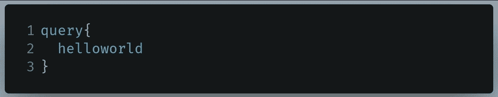

要在查询编辑器中编写的查询

*   第 1 行:这告诉 GraphQL 我们正在执行一个查询。
*   第二行:这里我们从`helloworld`查询。

现在按播放键。这将是输出:

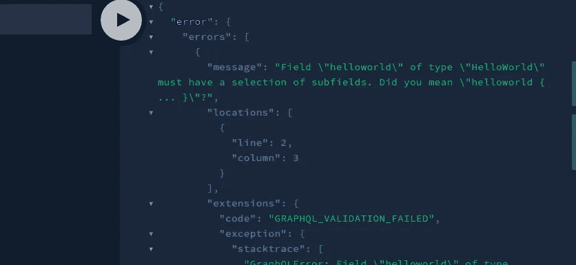

代码的输出

我们出错了。这是为什么呢？我们只是请求 GraphQL 给我们关于`HelloWorld`对象的数据。它应该给我们一个对象作为回应，对吗？

我们得到的不是我们想要的响应，而是一个错误，因为**我们不够具体**。我们需要明确地告诉 GraphQL 我们想要什么。

在这种情况下，我们希望`message`字段的值出现在`HelloWorld`对象中。在查询编辑器中，将代码更改为以下内容:

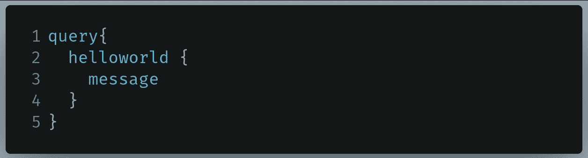

要在查询编辑器中编写的查询

*   第 3 行:这里我们查询位于`helloworld`中的`message`字段的值。

当您按下播放按钮时，这将是返回的响应:

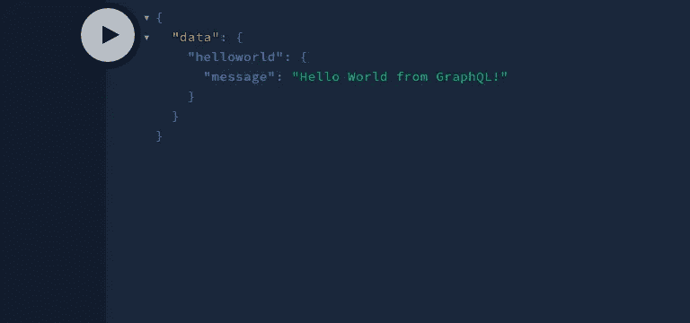

查询的输出

太好了！如您所见，我们得到了想要的数据。回想一下，我们在数据集中定义了这个`message`字段的值。

此外，注意 GraphQL 的查询语言类似于 JSON。如果你懂 Javascript，那么 JSON 对你来说并不陌生。因此，它的学习曲线变得更浅。

我们现在已经完成了这一部分。在下一篇文章中，我们将通过使用解析函数和变异等概念来提升我们的 GraphQL 游戏。

最后，`basic-server.js`应该是这样的:

这是获取我们想要的数据的查询:

要在查询编辑器中编写的查询

# GraphQL:使用解析器链和执行变异

在本节中，我们将使用中等复杂的数据集，甚至学习如何将两个数据集链接在一起，例如，一个作者数据库和一个图书数据库。此外，我们还将在 GraphQL 中编辑我们的数据库。

创建一个名为`advanced-server.js`的文件。该文件的设置与`basic-server.js`类似。

设置完成后，让我们首先处理模式。

## 定义我们的模式

在我们的模式中，我们将定义两种对象类型:

*   这将链接到我们包含图书列表的数据库。
*   这将链接到我们包含作者名单的数据库。

在`basic-server.js`中，编写以下代码:

*   第 2-6 行:这里我们定义了我们的`Book`对象类型。它将有一个类型为`String`的`name`字段和一个类型为`ID`的`id`字段。此外，我们还有一个`authorId`字段，它将帮助我们将图书数据库链接到作者数据库。第 5 行的`!`表示这个字段在我们的数据库中是强制性的。
*   第 7-10 行:这里我们定义了我们的`Author`对象类型。它将有一个类型为`ID`的`id`字段和一个类型为`String`的`name`字段。
*   第 12 行:`[Book]`表示如果客户查询书籍，那么他们将收到一个由`Book`对象组成的数组作为响应。
*   第 13 行:`[Author]`表示如果客户机查询作者，那么它们将收到一个由`Author`对象组成的数组作为响应。

现在我们已经定义了我们的模式，让我们继续定义我们的数据集。

## 创建我们的数据集

这里我们将创建两个对象数组。一个将有关于书籍的信息，另一个将有关于作者的数据。

在`advanced-server.js`中，复制并粘贴以下代码:

如您所见，我们有一个包含三个作者信息的`authors`数组。另一方面，我们有一个包含八本书信息的`books`数组。

现在让我们继续创建我们的解析器。

## 定义我们的解决方案

现在，我们将定义两个解析器函数:

*   `books`:这将返回`books`数据集。
*   `authors`:这将返回`authors`数据集。

在`advanced-server.js`中，编写以下代码:

*   第 3 行:`books`解析器将返回图书数据库。
*   第 6 行:`authors`解析器将返回作者数据库。

现在让我们像这样运行我们的服务器:

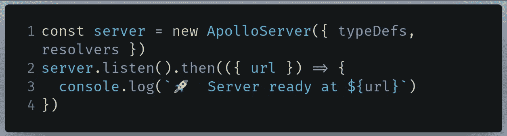

在 advanced-server.js 中运行服务器的代码

现在运行代码。这将是结果:

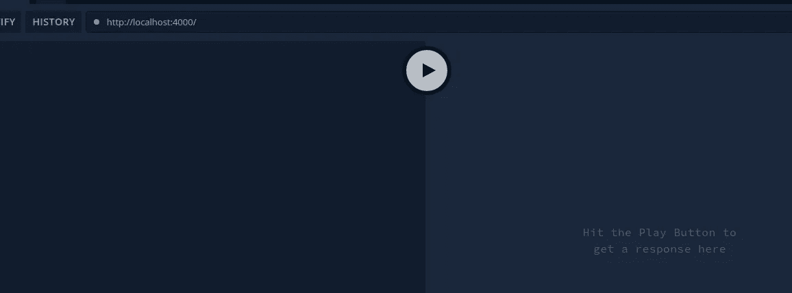

代码的输出

现在，在查询编辑器中编写以下代码:

*   第 2–5 行:这里我们查询作者并从`authors`对象中获取`name`和`id`字段。
*   第 6-10 行:这里我们查询书籍并从`books`对象获取`name`、`id`和`authorId`字段。

当您按下播放按钮时，输出如下:

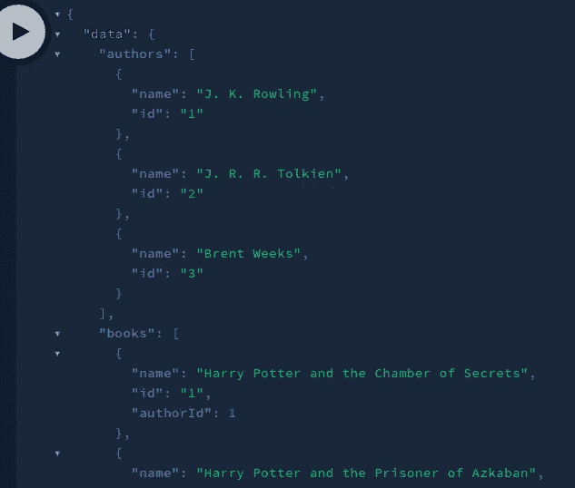

查询的输出

维奥拉。我们的代码是成功的。我们得到了想要的数据。我们学习了如何返回一个对象数组作为响应。

现在，让我们继续学习旋变器链。

最后，`advanced-server.js`应该是这样的:

## 分解器链

在某些情况下，我们希望链接两个数据集。例如，我们可以通过比较我们`Books`的`authorId`和我们`Authors`的`id`来链接我们的`Books`数据库和`Authors`数据库。

为了实现这一点，转到`advanced-server.js`并找到以下代码:

现在把它改成这样:

*   第 6 行:我们添加了另一个字段，它的类型是`Author`。这将有助于`Book`和`Author`之间的连接过程。
*   第 11 行:我们向`Author`添加了另一个字段，它的类型是`[Book]`。这是因为一个作者可以有多本书。

运行代码。在查询编辑器中，编写以下代码:

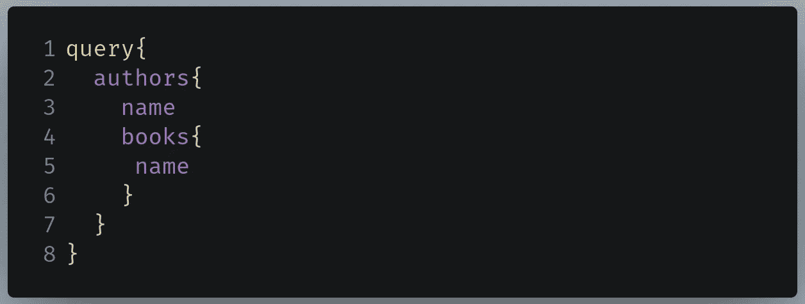

要在查询编辑器中编写的查询

*   第 4–6 行:由于`Author`对象类型也有一个`Book`对象作为它的字段之一，我们可以进一步对嵌入的`Book`对象的字段运行另一个查询。这里我们查询的是书名。

这将是输出:

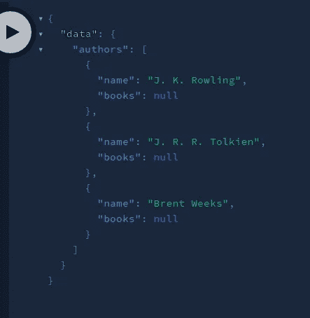

正如您可以在我们的响应中看到的，我们在`books`数组中获得了`null`。这是因为我们还没有为此编写解析函数。

完成后，我们的第二步是编写一个解析器函数。在`advanced-server.js`中，找到下面这段代码:

要在 advanced-server.js 中编写的代码

现在像这样替换它:

*   第 11 行:当客户端查询`Book`对象类型中嵌入的`author`字段时，我们在这里处理查询。`parent`参数也包含附加数据。为了找出`parent`的值，我们现在只是注销`parent`的值。
*   第 17 行:同样，我们在`Author`对象上实现了相同的过程。这一次，我们处理的是当客户端查询`Author`对象字段中嵌入的`books`字段时的查询。

运行代码并执行以下查询:

要在查询编辑器中编写的查询

这与之前的查询相同。但是，这次请查看控制台中的日志。这将是结果:

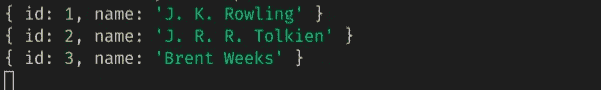

代码的输出

如您所见，`parent`包含了这个字段的父字段的解析器的返回值。在这种情况下，`books`字段的父字段是`authors`，这就是为什么我们得到了`authors`的返回值。

现在转到查询编辑器，编写以下代码:

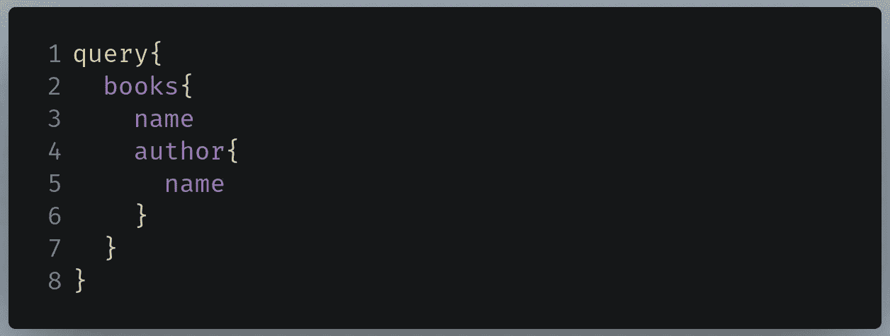

要在查询编辑器中编写的查询

*   第 4-5 行:这里我们对`author`字段执行查询，它是`books`对象的子字段。

这将是您的控制台中的输出:

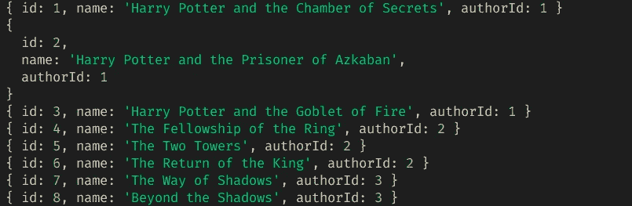

查询的输出

太好了！可以看到，我们又一次得到了父对象的返回值(`books`)。

要链接这两个数据库，我们可以这样做:

*   在`authors`数据库中，找到图书`authorId`字段和作者`authorId`字段匹配的作者。我们将使用数组`find`方法来实现这一点。
*   在`books`数据库中，提取作者`id`字段和图书`authorId`字段匹配的图书。我们将使用数组`filter`方法来实现这一点。

让我们用代码实现它。为此，在`advanced-server.js`中找到您的解析器功能:

现在把它改成这样:

*   第 12 行:调用数组`find`方法，获取`id`字段与图书`authorID`匹配的作者。找到作者后，将返回该作者的信息。
*   第 17 行:调用数组`filter`方法来获取书籍列表，其中的`authorId`字段与作者`id`字段相匹配。找到图书列表后，将返回一个过滤后的图书数组。

现在运行代码。在查询编辑器中，执行以下查询:

要在查询编辑器中编写的查询

这个查询告诉 GraphQL 获取图书列表，然后打印出每本书的作者姓名。

这将是输出:

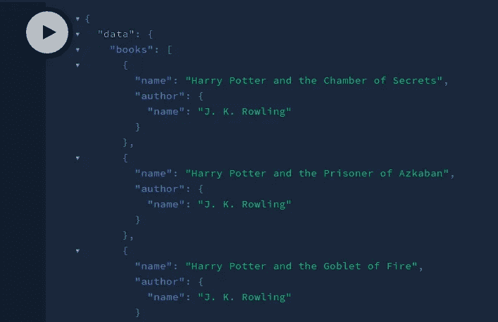

查询的输出

瞧啊。我们得到了我们想要的产量。现在让我们来看看作者名单和他们各自的书。在查询编辑器中，运行以下查询:

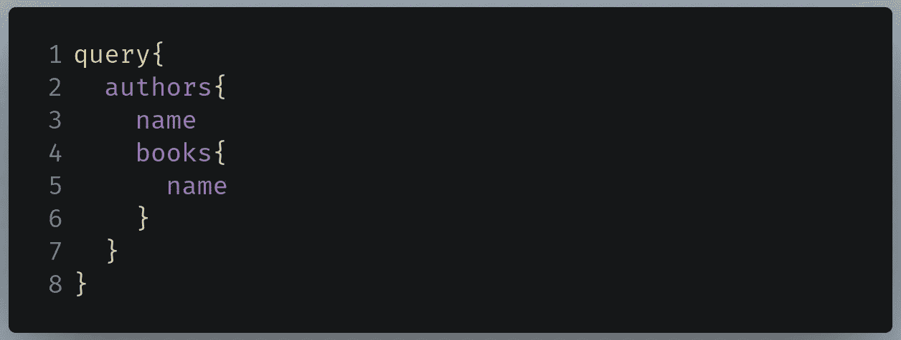

要在查询编辑器中编写的查询

这个查询告诉 GraphQL 打印出作者列表，还打印出每个作者的图书列表。

这将是代码的输出:

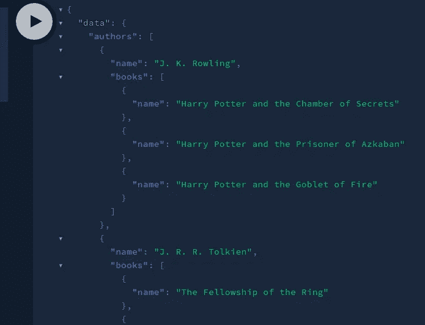

查询的输出

厉害！我们得到了想要的产量。正如你所看到的，我们终于把两个数据库连接起来了。

在下一节中，我们将在模式中使用参数。

## 模式中的参数

在某些情况下，我们只想要单个作者或单本书的信息。在休息时，这些将是终点:

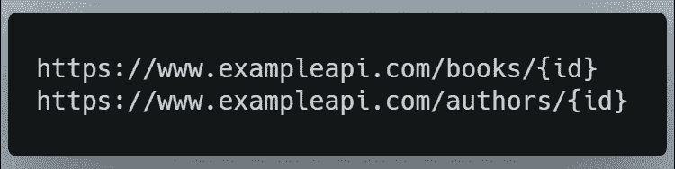

休息时的样本终点

目前在我们的 GraphQL 代码中，我们只能获得书籍或作者的整个数据集。

为了只查询关于单本书或数据的信息，我们需要修改我们的模式，使我们的查询可以接受一个参数`id`，这样 GraphQL 将只返回包含那个特定的`id`的数据。

在`advanced-server.js`中，找到您的模式:

现在把它改成这样:

*   第 16 行:在这里，我们告诉 GraphQL，如果客户端针对`bookById`执行查询，那么他们还必须指定一个名为`id`的参数，该参数应该总是一个整数值(`Int`)。该查询返回的值应该总是类型`Book`。
*   第 17 行:这里我们告诉 GraphQL，如果客户机对`authorById`执行查询，那么它们还必须指定一个名为`id`的参数，这个参数应该总是一个整数值(`Int`)。该查询返回的值应该总是类型`Book`。

我们还没有为这些查询定义解析器。在`advanced-server.js`中，找到您的解析器:

现在像这样编辑它:

*   第 9–11 行:如果用户针对`bookById`进行查询，我们将处理该查询。Apollo 服务器提供了多个参数。在本教程中，我们只关心`args`参数。`args`参数包含一个对象的值，该对象包含该字段中提供的所有 GraphQL 参数。目前，我们正在注销`args`的值。
*   第 12–14 行:我们正在处理对`authorById`的查询。这里我们也记录了`args`的值。

现在运行代码。在查询编辑器中，执行以下查询:

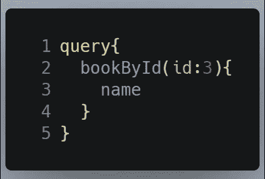

要在查询编辑器中编写的查询

*   第 2 行:这里我们查询`bookById`并传入`id`的参数。
*   第 3 行:获取还书的`name`字段。

这将是输出:

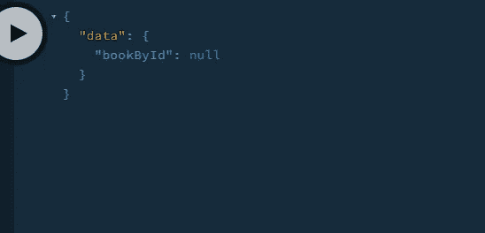

查询的输出

我们没有得到有效的响应，因为我们只注销了`args`的值。这应该是您的控制台中的输出:

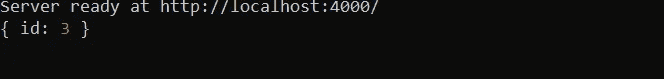

代码的输出

太好了！所以我们知道`args`是一个包含传递到字段中的参数的对象。

现在在查询编辑器中执行这个查询:

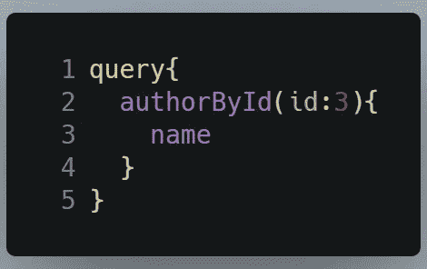

要在查询编辑器中编写的查询

控制台中的输出如下:

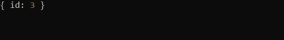

代码的输出

这确保了我们得到一个包含参数和值的对象。现在让我们使用`args`参数来获取单本书或作者的数据。在`advanced-server.js`中，找到您的解析器:

现在像这样编辑它:

这些变化出现在第 10 行和第 13 行。

*   第 10 行:调用一个数组`find`函数，该函数查找带有与传入查询的`id`参数相匹配的`id`字段的图书。
*   第 13 行:与前面相同的操作正在进行。不过，这次我们要找的是作者。

完成后，调用以下查询:

要在查询编辑器中编写的查询

这将是输出:

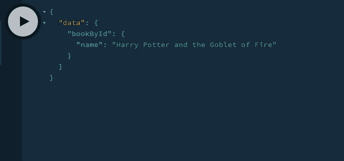

查询的输出

太好了！现在执行这个查询，查找带有`3`的`id`的作者:

要在查询编辑器中编写的查询

这将是输出:

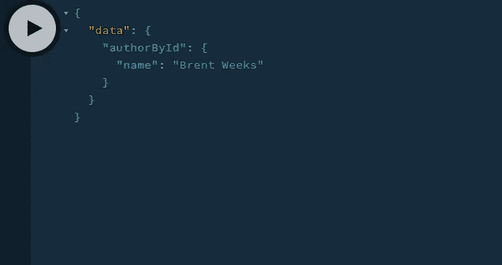

查询的输出

太好了！这意味着我们的代码有效。

回想一下，在我们的模式中，我们也说过`Book`有一个字段`Author`，而`Author`也有自己的子字段。这意味着我们可以执行下面的查询来查找由`id`甚至链接的作者写的书:

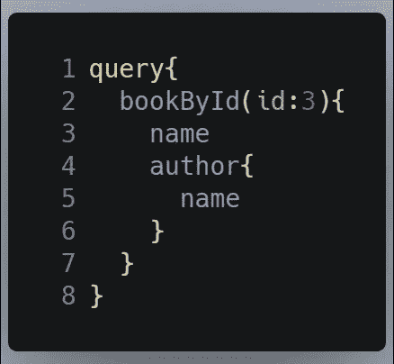

要在查询编辑器中编写的查询

这将是输出:

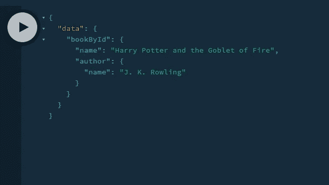

现在一切都联系起来了，这样做真的很简单。由此可见 GraphQL 的能力有多强。

或者，我们也可以运行这个查询，通过`id`获取作者并获取他们的书籍:

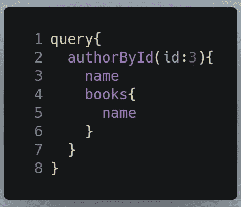

要在查询编辑器中编写的查询

这将是输出:

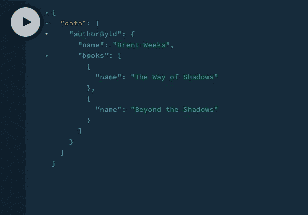

查询的输出

维奥拉。我们的代码有效。

在下一节中，我们将了解突变。

最后，`advanced-server.js`应该是这样的:

## 编辑有突变的数据

假设您想要编辑一本书的信息或更改作者的姓名。在休息时，您可以像这样执行一个`POST`或`PUT`请求:

示例 POST 和 PUT 请求处于静止状态

我们可以在 GraphQL 中使用叫做*突变*的东西来完成同样的过程。在 GraphQL 中，你没有`POST`或`PUT`数据，而是用*对其进行变异*。

作为第一步，我们必须在模式中定义一个突变。在`advanced-server.js`中，找到您的模式:

将`Mutation`类型添加到模式定义中，如下所示:

这些变化出现在第 20 行和第 2 行。

*   第 20 行:这意味着客户端现在可以执行`addBook`的变异。该函数接受两个参数:一个是`String`数据的`name`字段，一个是`Int`数据的`authorId`。该函数返回一个类型为`Book`的响应。
*   第 21 行:这一行代码意味着用户现在可以执行一个`addAuthor`突变。它接受一个名为`name`的参数，该参数属于`String`类型。这个突变将会给我们一个类型为`Author`的结果。

剩下的工作就是为这些突变定义一个解析器。

在`advanced-server.js`中找到你的突变:

现在像这样编辑它:

*   第 27 行:这里，当客户端执行变异时，我们处理解析器。位于这个`Mutation`对象中的所有函数将处理它们在模式中定义的相应突变。
*   第 28–33 行:当用户执行`addBook`突变时，这个函数将被调用。`name`和`authorId`字段将由`args`参数提供的自变量赋值。稍后，这个新的`book`对象将被推送到`books`数据库。最后会返回这个结果。
*   第 34-41 行:当客户端执行`addAuthor`突变时，将`name`字段分配给客户端参数提供的字段。然后，新的`author`对象将被推送到`authors`数据集。最后，这个`author`对象将被返回。

我们现在完成了。让我们来测试一下。转到 Apollo Server 中的 Docs 工具栏，您会发现出现了一个新标题，名为`Mutations`:

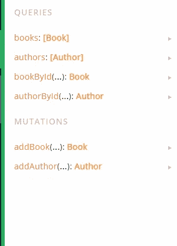

Apollo 服务器中的文档菜单

现在，在查询编辑器中键入以下代码:

要在查询编辑器中编写的查询

*   第 1 行:告诉 GraphQL 我们要发出一个突变请求。
*   第 2 行:用`name`和`authorId`需求调用`addBook`函数。
*   第 3-5 行:获取新的`Book`对象的所有字段。

这将是结果:

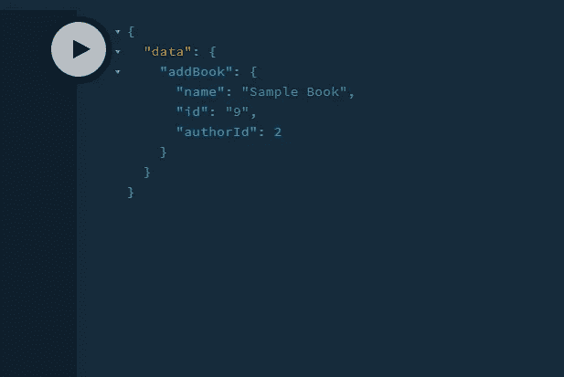

查询的输出

太好了！我们的代码有效。现在让我们查询数据集中所有可用的书籍:

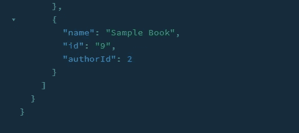

查询的输出

如您所见，该书已成功添加。因为所有这些`Book`对象都链接到它们的`Author`对象，所以我们甚至可以执行一个变异，并且还可以接收其相应的作者数据，就像这样:

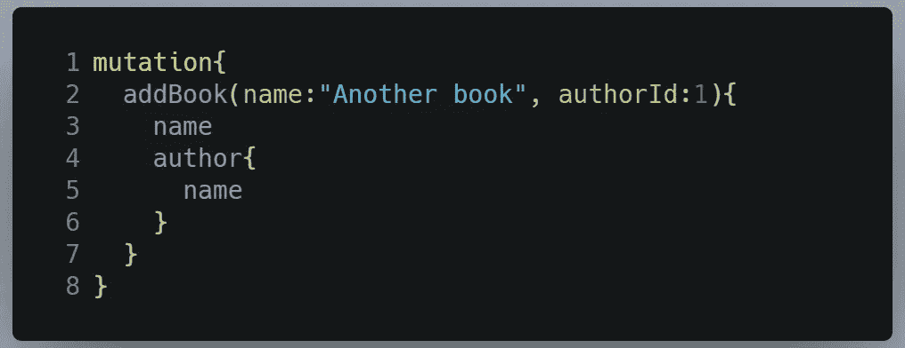

要在查询编辑器中编写的查询

这将产生以下结果:

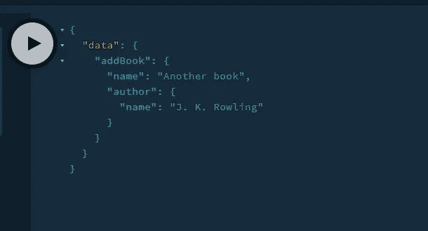

查询的输出

现在让我们执行一个`addAuthor`突变。转到查询编辑器，编写以下代码:

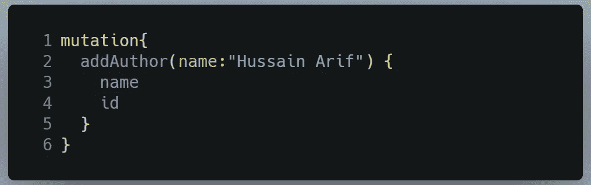

要在查询编辑器中编写的查询

运行该查询将产生以下结果:

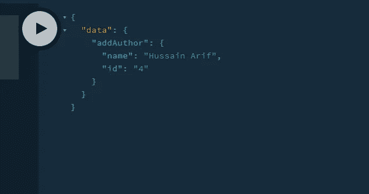

查询的输出

我们得到回应了！现在，让我们使用以下查询来确认它是否已被添加到我们的数据库中:

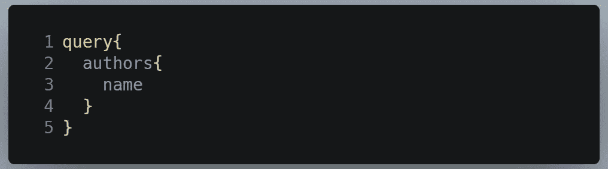

要在查询编辑器中编写的查询

这将是结果:

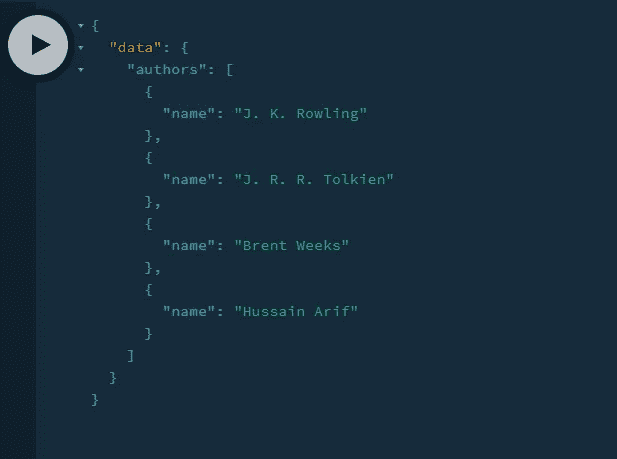

查询的输出

这太棒了！我们的代码工作，我们得到了我们想要的输出。

然而，使用 GraphQL 有一些规则可以确保您的应用程序完美运行。在下一节中，我们将讨论这些规则。

# 使用 GraphQL 时需要记住的事项

## 数据集的字段应与架构的字段相匹配

例如，如果您对`Author`的模式定义如下:

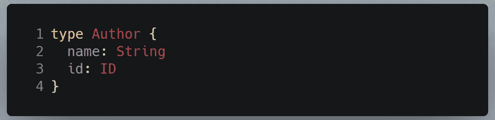

示例模式定义

你的数据集看起来像这样:

样本数据集

那么您的代码应该不会产生错误。

另一方面，如果您的模式如下所示，则它是不正确的:

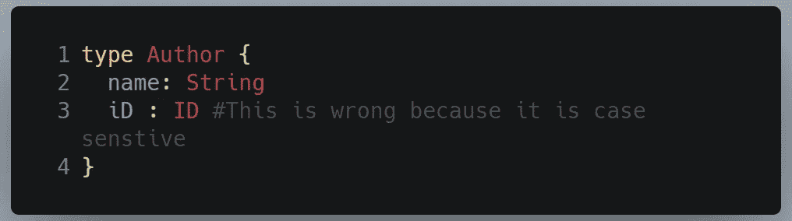

错误的模式

请注意，其中一个字段是`iD`。GraphQL 的语言区分大小写。如果是`id`，那么应该没有问题。

总之，**模式和数据集的所有字段都应该匹配**。

# 代码和其他资源

## 最终代码

*   `basic-server.js`应该是这样的:

*   `advanced-server.js`应该是这样的:

## 其他阅读资源

*   [阿波罗 GraphQL 简介](https://www.apollographql.com/docs/tutorial/introduction/)(涵盖基础知识)
*   [阿波罗服务器 GraphQL 简介](https://www.apollographql.com/docs/apollo-server/)
*   [40 分钟学会 graph QL:Web Dev 简化版](https://www.youtube.com/watch?v=ZQL7tL2S0oQ)

# 结论

看看 GraphQL 是多么易用和强大，我们可以承认，GraphQL 无疑将成为通过外部数据库或 API 获取数据的事实上的标准。虽然还是新技术，但它已经巩固了作为一项极其强大的技术的地位。

这个教程真的很长。如果您遇到任何问题，建议您解构代码并广泛研究 GraphQL 及其与 Node.js 的集成。不要放弃！

非常感谢您的阅读！

下一篇:[在 React 中创建动画与帧运动](https://medium.com/better-programming/create-amazing-animations-in-react-using-framer-motion-34c803f60c6f)
上一篇: [React 路由器，已解释](https://medium.com/better-programming/react-routers-explained-ff89153a6405)