# 您期待已久的完整 SwiftUI 文档

> 原文：<https://betterprogramming.pub/the-complete-swiftui-documentation-youve-been-waiting-for-fdfe7241add9>

## 超越苹果的文档。代码示例、建议的最佳实践以及对所有视图、控件、布局等的解释！

*本文最好在 Chrome 上查看，因为链接到介质上的部分存在限制。*


苏珊·尹在 [Unsplash](https://unsplash.com/?utm_source=unsplash&utm_medium=referral&utm_content=creditCopyText) 上拍摄的照片

[苹果的 SwiftUI 文档](https://developer.apple.com/documentation/swiftui)涵盖了很多 SwiftUI 的基础知识。但是那些仍然存在的差距呢？我们都知道，当 WWDC 在 2020 年 6 月到来时，文档可能会大规模更新，但我们不能等那么久！

以下是我对 SwiftUI 现有文档的每一页所了解到的一切。苹果提供的我就不重复了，他们没说的我尽量补充。为了保持一致，我将使用相同的类别，这绝对不是因为我懒得想自己的类别。

每个类别标题将直接链接到苹果的版本。

我不指望有人会读完整篇文章。如果有，我佩服你的敬业精神！我估计好一点的编程编辑都要看一遍，我很感谢他们。

我的建议是，虽然你现在可能不需要所有这些，但你将来可能会需要，所以把它做成书签，以后当你的知识有缺口时再来看它可能会有所帮助。

我的知识也有缺口，这就是为什么我承诺尽可能经常更新这篇文章。如果有你认为我应该澄清或更详细地涉及的领域，让我知道！

# 目录

```
VIEWS AND CONTROLS
- [SwiftUI 2 changes](https://medium.com/better-programming/swiftui-views-and-controls-the-swift-2-documentation-youve-been-waiting-for-dfa32cba24f3)
- [The View protocol](#d1ca)
- [Text](#2307)
- [Text ViewModifiers](#137d)
- [Standard text modifiers](#b4d4)
- [TextField](#162d)
- [TextField ViewModifiers](#06e7)
- [SecureTextField](#edca)
- [SecureTextField ViewModifiers](#b43a)
- [Font](#6742)
- [Image](#ead4)
- [SF Symbols](#08d7)
- [Button](#ad26)
- [ButtonStyle](#cb4b)
- [NavigationView and NavigationLink](#a858)
- [EditButton](#7d0c)
- [MenuButton](#893d)
- [PasteButton](#b6ac)
- [Toggle](#3cf6)
- [Creating a custom ToggleStyle](#52a0)
- [Picker](#7966)
- [DatePicker](#2aa1)
- [Slider](#7455)
- [Stepper](#fdee)VIEW LAYOUT AND PRESENTATION
- [HStack, VStack, and ZStack](#978e)
- [List, ScrollView, ForEach, and DynamicViewContent](#c810)
- [Identifiable](#5356)
- [Axis](#f38e)
- [Form](#f3c0)
- [Group](#f8c1)
- [GroupBox](#8d90)
- [Section](#2c75)
- [Spacer](#e2b0)
- [Divider](#f5bf)
- [TabView](#418d)
- [VSplitView and HSplitView](#dbd7)
- [Alert](#dc84)
- [ActionSheet](#b392)
- [EmptyView](#3100)
- [EquatableView](#cbbe)
- [AnyView](#bdb1)
- [TupleView](#a3e8)DRAWING AND ANIMATION
- [Animation](#789a)
- [Animatable and AnimatableData](#1582)
- [AnimatablePair](#982c)
- [EmptyAnimatableData](#db6e)
- [AnimatableModifier](#11ee)
- [withAnimation (Implicit Animation)](#0817)
- [AnyTransition](#99be)
- [InsettableShape](#6673)
- [FillStyle](#90a3)
- [ShapeStyle](#c10c)
- [GeometryEffect](#176d)
- [Angle](#b383)
- [Edge and EdgeInsets](#9134)
- [Rectangle, RoundedRectangle, Circle, Ellipse, and Capsule](#4dd2)
- [Path](#e425)
- [ScaledShape, RotatedShape, and OffsetShape](#83d6)
- [TransformedShape](#5a4d)
- [Color](#690f)
- [ImagePaint](#c123)
- [Gradients (Linear/Angular/Radial)](#3ba2)
- [GeometryReader and GeometryProxy](#fa47)
- [CoordinateSpace](#7513)FRAMEWORK INTEGRATION
- [UIHostingController](#17b6)
- [UIViewRepresentable](#171f)
- [UIViewControllerRepresentable](#7b0c)
- [DigitalCrownRotationalSensitivity](#3cb4)STATE AND DATA FLOW
- [State](#efd1)
- [Binding](#0e81)
- [ObservedObject](#65b8)
- [EnvironmentObject](#7a99)
- [FetchRequest and FetchedResults](#933d)
- [DynamicProperty](#9a25)
- [Environment](#98ed)
- [PreferenceKey](#66a3)
- [LocalizedStringKey](#394b)GESTURES
- [Gestures](#f198)PREVIEWS
- [The PreviewProvider protocol](#8932)
```

# [视图和控件](https://developer.apple.com/documentation/swiftui/views_and_controls)

另见: [SwiftUI 2 变更](https://medium.com/better-programming/swiftui-views-and-controls-the-swift-2-documentation-youve-been-waiting-for-dfa32cba24f3)

## 查看协议

如果您还不知道，SwiftUI 使用`View`协议来创建可重用的界面元素。视图是值类型，这意味着它们使用一个`Struct`而不是一个`Class`定义。

这实际上意味着什么呢？

结构不允许继承。尽管你的结构符合`View`协议，但是它们并没有继承苹果提供的一个叫做`View`的基类。

这使得它与`[UIView](https://developer.apple.com/documentation/uikit/uiview)`不同，UIKit 中的几乎所有东西都继承自`[UIView](https://developer.apple.com/documentation/uikit/uiview)`。一个`UIView`如果不被分配一个框架并作为一个`UIViewController`子类的子视图被添加，基本上是看不到的。

如果你创建一个新的 Xcode 项目，它使用 SwiftUI 而不是 Storyboard 作为其用户界面的基础，你会自动得到一个 SwiftUI `View`的例子，叫做`ContentView`。

您会注意到在`ContentView`结构中，有一个名为 body 的变量。这是`View`协议的唯一要求，它使用了 Swift 5.1 中全新的`some`关键字。

你可以依靠[堆栈溢出线程](https://stackoverflow.com/questions/56433665/what-is-the-some-keyword-in-swiftui)来解释这个关键字的意思，比我更好:

> 你可以把它看作是一个“反向”通用占位符。与调用者满足的常规泛型占位符不同……不透明结果类型是实现满足的隐式泛型占位符……从中得出的主要结论是，返回`some P`的函数是一个返回符合`P`的特定单一具体类型的值的函数。

让我们开始看看苹果提供的符合`View`协议的示例视图。

## 文本

参见:[文本(在 2.0 中更新)](https://medium.com/better-programming/swiftui-views-and-controls-the-swift-2-documentation-youve-been-waiting-for-dfa32cba24f3#ab2f)

您在创建 SwiftUI Xcode 项目时得到的那个示例项目可能包括最简单的视图构建块，它被称为`Text`。

在大多数情况下，您将传递一个`String`给这个的构造函数，这将是它显示的内容。

下面是一些`Text`的初始化器的例子:

注意，最后一个初始化器，采用了`LocalizedStringKey`、`tableName`、`bundle`和`comment`，需要一个使用`.strings`文件扩展名的单独文件。

正如在[苹果关于这个初始化器](https://developer.apple.com/documentation/swiftui/text/3065754-init)的文档中提到的，唯一需要的参数是键的字符串。我给出了一个详细的例子，主要是为了让您了解这些其他参数需要什么。

`tableName`的缺省值是`Localizable`，这是字符串文件的标准名称。我特意将我的命名为`Local`,以说明为什么我需要这个参数。

默认情况下，这个包是主包，所以在这种情况下传递`Bundle.main`是多余的。

注释应该给出上下文信息，但是在这个例子中，我只给出了字符串`Comment`。

这里的`Text`被嵌入到`VStack`中，因为主体变量的不透明结果类型必须被设置为一种类型。换句话说，它不能设置为几个项目，因为这可能涉及几个类型。

虽然`VStack`可以包含多达十个视图，但是每个视图都可以是`VStack`、`HStack`或`Group`，并且每个视图都可以有十种类型。

向下滚动到 [HStack、VStack 和 ZStack](#978e) 了解更多详情。

## 文本视图修饰符

与所有视图一样，文本可以被符合 ViewModifier 协议的结构修改。

让我们来看一个自定义修改器的例子，这样您就可以看到在这些修改器的表面下发生了什么:

所有这些文本看起来都一样，但是后两个文本使用了自定义的视图修饰符

如您所见，添加`.modifier(YourModifier())`来调用 ViewModifier 是可能的，但是使用`View`扩展并给出一个干净的调用点更有意义。

这是标准修改器的样子，所以做一个`View`扩展会让你的修改器看起来更像默认的。

如果没有这个，将很难创建一个比缺省值更容易编写的`ViewModifier`,因为以单词“modifier”开始修饰符并调用其构造函数会增加不必要的复杂性。

## 标准文本修饰符

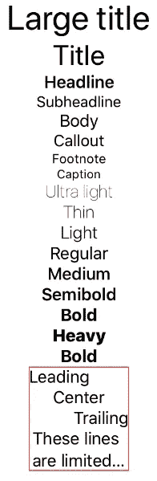

默认字体的所有大小和粗细

在这个例子中，我在保存字体对齐的`VStack`周围放了一个红色边框。这是为了表明这个`VStack`的边界是有限的，因为内部的`Text`具有固定的最大尺寸。

如果不这样做，`Text` s 的对齐没有任何效果，因为`VStack`容器将扩展以容纳里面的`Text`。

为了对齐前缘(左)或后缘(右)，我们需要定义前缘或后缘的位置。这也可以通过固定`VStack`本身的宽度来实现。

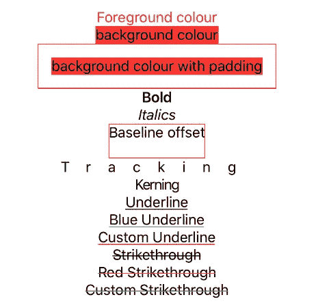

注意这个例子是如何在`Text`而不是`View`上创建扩展的。这是因为在这种情况下，您只能保证接收到的类型是一个`Text`。

不可能通过创建一个`ViewModifier`或`View`扩展来实现与`greenStrikethrough`或`redUnderline`的等效，因为这些扩展采用了一个可能不是`Text`的通用`View`。

既然您已经知道了这一点，那么您可以创建自己的定制函数来定制`Text`，而不需要我上面提到的创建`ViewModifier`的中间步骤。

## 文本字段

如果您希望用户输入文本，您将需要一个绑定来存储该数据。第一个例子使用了一个`State`变量，它将字符串本地存储在 SwiftUI 结构中，实际上并不将它保存在任何可以使用它的地方，也不永久存储它。

如果您想保留您的数据并能够给它一个计算值，您将需要一个`ObservableObject`。这实际上为您提供了一个存储数据的常规 Swift 文件，一旦您开始添加可以修改数据值的控件，这将变得非常有用。

您不需要为您保存的字符串值提供一个`didSet`闭包，我只是提供一个例子来展示`didSet`何时运行。我的`DataModel`类是一个普通的 Swift 类，所以它的`didSet`闭包运行并打印字符串的新值。

然而，由于 SwiftUI 视图是动态创建的值类型，所以当您修改本地`State`变量时，`didSet`回调不会将任何内容打印到控制台。

你注意到后来的一些初始化器是如何使用`Float`而不是`String`的吗？

这些初始化器可以接受任何类型，但是要注意传入一个提供的`[Formatter](https://developer.apple.com/documentation/foundation/formatter)`类，或者自己创建一个。

在我的例子中，我使用了`NumberFormatter`，它不会让您输入任何不是数字的字符。这让我很容易保存我的`Float`，而不用担心应用程序会崩溃，因为我不能将一串字母转换成存储`TextField`值的`Float`。

其他初始化器也有两个闭包，第一个是`onEditingChanged`。

[苹果关于这个](https://developer.apple.com/documentation/swiftui/textfield/3338359-init) `[TextField](https://developer.apple.com/documentation/swiftui/textfield/3338359-init)` [初始化器](https://developer.apple.com/documentation/swiftui/textfield/3338359-init)的文档没有提到闭包里面的 bool 表示什么，但是测试似乎表明它与`TextField`被赋予焦点有关。

有没有在 UIKit 的`UITextField`上调用过`[resignFirstResponder](https://developer.apple.com/documentation/uikit/uiresponder/1621097-resignfirstresponder)`？

这实质上抛弃了键盘，因为`UITextField`不再需要焦点。即使您可以在某个时候恢复键盘，文本也不会插入到那个`UITextField`中，除非您再次将它设为第一响应者。

这都与`UIResponder`有关，一个抽象接口，从它继承了`UIView`、`UIViewController`以及 UIKit 中的其他所有东西。

我们不知道 SwiftUI 事件是如何在相同程度上得到处理的，但我使用了短语 *first responder* ，因为使用过`UITextField`的人应该很熟悉它。

`onEditingChanged`中的 bool 可以被称为`fieldActive`或者任何你想叫的名字，这样你就清楚了。

重要的是，当你开始编辑一个`TextField`，`onEditingChanged`被一个设置为 true 的 bool 调用。当你按下键盘的回车键时，调用`onCommit`块，之后用一个设置为`false`的 bool 调用`onEditingChanged`。

## 文本字段视图修饰符

关于什么是视图修改器的更详细解释，见[文本视图修改器](#137d)。

您目前不能更改`TextField`中占位符文本的前景色。在我写这篇文章的时候，当在`List`中显示`TextField` s 时，除了默认键盘类型之外，你不能为`TextField`使用任何键盘类型。

我发现试图在`List`中显示`TextField`也会导致它们相互重叠。以下是在`VStack`中展示的所有键盘类型，它们似乎都工作得很好:

## 安全文本字段

本质上与上面的`TextField`相同，附加的好处是隐藏您输入的字符，这对密码很有用。与上面的`TextField`一样，您可以选择多种键盘类型，此处仅显示`numberPad`。

## SecureTextField 视图修饰符

关于视图修饰符的详细解释，见[文本视图修饰符](#137d)。

与`TextField`类似，您可以更改前景色或背景色，添加边框，并使用不同的`TextFieldStyle`，但此时您不能更改占位符文本的前景色。

## 字体

我不能详细阐述苹果文档中关于`Font`的内容，所以我提供了一种简单的方法来使用定制字体，就像使用苹果标准字体一样:

注意我是如何对`Font`和`View`进行扩展的。不用用扩展，我直接用`Font.custom`的时候你就看到了。所有这些方法都会导致相同的`Text`，所以这只是一个你认为哪个代码最干净的问题。

最容易编写的是`View`扩展，它不需要你向函数传递任何东西。

`Font`扩展名更符合标准 Apple 字体的分配方式，例如`.font(.headline)`。

## 图像

另见:[图像(在 SwiftUI 2.0 中更新)](https://medium.com/better-programming/swiftui-views-and-controls-the-swift-2-documentation-youve-been-waiting-for-dfa32cba24f3#fd7f)

SwiftUI 中的[图片](https://developer.apple.com/documentation/swiftui/image)比 UIKit 中的要容易得多。与其需要创建一个`UIImage(named: “Your file name”)`并将其分配给`yourUIImageView.image`，不如创建`Image`与`Text`一样简单。

只需给它传递一个`String`，它会将它设置为一个同名的文件。如果您启动您的应用程序，但它没有该名称的文件，您会收到一条有用的控制台消息，内容如下:

```
No image named ‘Your file name’ found in asset catalog for main bundle. 
```

如果您发现应用程序中没有出现图像，您可能需要在控制台中搜索。

**默认情况下，图像不可调整大小**

在随后的修改器中改变其大小之前，必须调用`Image`上的`.resizable()`修改器。

`scaledToFit`修改器将锁定图像的长宽比，并将其缩放到最大尺寸，但不会对屏幕太大。

`scaledToFill`修改器也可以缩放你的图像，但是它不能锁定纵横比，因此很可能会拉伸或收缩你的图像以适应可用空间。

## SF 符号

如果你不熟悉它们， [SF Symbols](https://developer.apple.com/design/human-interface-guidelines/sf-symbols/overview/) 是一个超过 1500 个符号的库，苹果提供了从超轻到黑色的九种重量。

要在您的图像中使用这些，只需将您传递到图像中的`String`标记为`systemName`。或许值得下载 [SF Symbols Mac app](https://developer.apple.com/design/downloads/SF-Symbols.dmg) ，这样你就可以找到你想要使用的符号的系统名称。

使用 SF 符号给你的应用程序带来一致的外观，由于这些免费符号的灵活性和可访问性，这可能会在未来几年接管 iOS 生态系统。

## 纽扣

另见:[按钮(在 2.0 中更新)](https://medium.com/better-programming/swiftui-views-and-controls-the-swift-2-documentation-youve-been-waiting-for-dfa32cba24f3#4777)

一个`[Button](https://developer.apple.com/documentation/swiftui/button)`没有自己的样子。换句话说，你将需要给你的`Button`一个`Label`，它本身是任何符合`View`的具体类型。

最明显的例子是一个`Text`，它会给出你的按钮将要做什么的信息。在我写这篇文章的时候，Apple 在文档中指定的唯一一件事(除了如何创建和样式化它们)是按钮的触发方式因操作系统而异。

在 iOS 上，你点击它，在 tvOS 上，当按钮被选中时，你按下 enter，在有或没有 Catalyst 的 macOS 应用程序中，苹果没有提到，你用鼠标或触控板点击。

构造函数要求你给出一个动作。这可以是一组空的花括号，但至少必须以这种形式出现。

除了在花括号中指定您的功能(这会很快变得冗长)，您还可以指定不带花括号和不带 `*()*` *调用操作符的函数名称*。*这并没有将动作绑定到变量上，这意味着你不需要`$`操作符，你可以在像`Toggle`这样的绑定控件上找到它。*

## 按钮样式

有些控件允许您选择现有的样式，比如在这种情况下符合`ButtonStyle`的样式。这也意味着你可以为一个`Button`创建你自己的定制风格，如何做的细节可以在 [SwiftUI 实验室的定制风格教程](https://swiftui-lab.com/custom-styling/)中找到。

正如你可能在我对那篇文章的评论中看到的，`SliderStyle`目前并不存在(尽管它在苹果的网站上有记录)。让我们浏览一下现有的按钮样式，看看它们是如何工作的。

注意，有些只能在 MacOS 上使用。

## 导航视图和导航链接

另见:[导航视图(在 2.0 中更新)](https://medium.com/better-programming/view-layout-and-presentation-in-swiftui-705b7d81f03#3320)

将视图嵌入到`NavigationView`中允许您设置导航标题并链接到其他视图。类似于`Button`,`NavigationLink`需要一个`Label`，它基本上是任何符合`View`协议的结构。

在大多数情况下，这可能是一个`Text`或`Image`，但也可以是您创建的任何自定义视图。

在 iPhone 上，作为链接目的地的`View`从右边滑入，每个连续的`NavigationLink`以同样的方式滑动。当返回初始`View`时，可以从左边缘滑动或者使用导航栏左上角的返回按钮。

这个例子来自我的手表应用 Dog HQ，它显示了全尺寸狗狗照片的滚动列表，每张照片都链接到一个放大版本。

这就是为什么我需要将索引传递给我放大的`DogView`的构造函数，这样我就知道我想要哪只狗作为目的地。

将一个垂直滚动并扩展到我想要的任何大小的`List`与一个`ForEach`结合起来，允许我创建 50 行并将该索引传递到具有我指定的名称的闭包中。

`ForEach`的迭代可以是一个数组中最大项数的序列，或者数组可以被传递到`List`的构造函数中，并在闭包内用您指定的名称进行访问。

显然，我只是对这个数组略知皮毛。数组可以包含复杂的类型，比如一个自定义类，它有一个名为`imageName`的字符串属性，一个数字值，或者甚至是另一个类的实例，您可以使用点语法来访问它。

屏幕顶部的导航栏可以包含一个前导和尾随按钮。其主要用途似乎是添加一个`EditButton`，这将在下面详细描述。

## 编辑按钮

当你有一个`List`条目并且你想删除其中一些的时候，编辑按钮是非常有用的。点击它进入编辑模式(不出所料)，每行显示一个红色圆圈，并有一条水平线穿过它。

点击*编辑*将向左滑动该行，显示右端的删除按钮，作为最终确认。

您仍然需要实现一个函数来处理从列表中删除数据，否则，您的更改只是可视化的，您的数据实际上不会以您期望的方式被删除。

有关使用`EditButton`的更多信息，请参见 [List、ScrollView、ForEach 和 DynamicViewContent](#c810) 。

## 菜单按钮

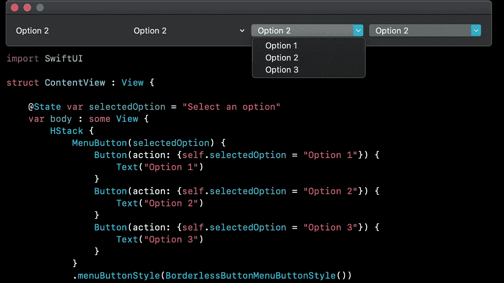

目前有四个菜单按钮样式选项可用

`MenuButton`只在 macOS 应用程序上可用，所以我提供了一个使用所有标准`.menuButtonStyle`选项的 Mac 应用程序示例。

从左到右，这些款式分别是`BorderlessButtonMenuButtonStyle`、`BorderlessPullDownMenuButtonStyle`、`PullDownMenuButtonStyle`。

如果最右边的那个和旁边的很像，那是因为它用了`DefaultMenuButtonStyle`。

由于默认的`MenuButton`有`PullDownMenuButtonStyle`的外观，所以这些看起来完全一样。

## 粘贴按钮

另见:[粘贴按钮(在 2.0 中更新)](https://medium.com/better-programming/swiftui-views-and-controls-the-swift-2-documentation-youve-been-waiting-for-dfa32cba24f3#ec57)

此控件允许您在 MacOS 上粘贴信息，但在 iOS 上不可用。它可以采用各种数据类型，这些数据类型被表示为 UTI 类型。

我在示例中包含了一个函数，可以让您查找任何类型的 UTI 字符串，这可能会在实现这个按钮时对您有所帮助。一旦您决定了您需要什么类型标识符，您将需要处理您从`NSItemProvider`获得的数据。

我已经展示了一个例子，在这个例子中，我只粘贴了数组中的第一项，但是希望它能清楚地说明如何处理其他数据类型和多项。

以下是符合`[NSItemProviderWriting](https://developer.apple.com/documentation/foundation/nsitemproviderwriting)`的类型列表，因此可以用`PasteButton`粘贴:

*   `[CNContact](https://developer.apple.com/documentation/contacts/cncontact)`
*   `[CNMutableContact](https://developer.apple.com/documentation/contacts/cnmutablecontact)`
*   `[CSLocalizedString](https://developer.apple.com/documentation/corespotlight/cslocalizedstring)`
*   `[MKMapItem](https://developer.apple.com/documentation/mapkit/mkmapitem)`
*   `[NSAttributedString](https://developer.apple.com/documentation/foundation/nsattributedstring)`
*   `[NSMutableString](https://developer.apple.com/documentation/foundation/nsmutablestring)`
*   `[NSString](https://developer.apple.com/documentation/foundation/nsstring)`
*   `[NSTextStorage](https://developer.apple.com/documentation/uikit/nstextstorage)`
*   `[NSURL](https://developer.apple.com/documentation/foundation/nsurl)`
*   `[NSUserActivity](https://developer.apple.com/documentation/foundation/nsuseractivity)`
*   `[UIColor](https://developer.apple.com/documentation/uikit/uicolor)`
*   `[UIImage](https://developer.apple.com/documentation/uikit/uiimage)`

您还可以使用自己的自定义类型来符合该协议，从而允许您粘贴自定义类型的数据。

## 触发器

参见:[切换(在 2.0 中更新)](https://medium.com/better-programming/swiftui-views-and-controls-the-swift-2-documentation-youve-been-waiting-for-dfa32cba24f3#e003)

`Toggle`是 UIKit 中`UISwitch`的 SwiftUI 等价物。SwiftUI 使用绑定，而不是使用`IBAction`函数将 Swift 代码链接到故事板上的`UISwitch`并在其值改变时运行。

如果没有将变量标记为`State`(在结构内)或`Published`(在符合`ObservableObject`的外部类中)，SwiftUI 不会在值改变时重新绘制`View`的内容。

这是绑定过程的重要部分，尤其是将外部代码标记为`Published`，因为这是 SwiftUI 知道该变量存在的唯一方式。

## 创建自定义 ToggleStyle

我注意到`Toggle`的初始化器可以接受一个名为`[ToggleStyleConfiguration](https://developer.apple.com/documentation/swiftui/togglestyleconfiguration)`的结构，我花了一段时间试图弄清楚如何自己构造这个结构。

在 SwiftUI 实验室关于定制风格的优秀教程的帮助下，我发现协议`ToggleStyle`提供了定制风格的能力。

它允许您这样做的部分方法是下面的代码行:

```
typealias [ToggleStyle](https://developer.apple.com/documentation/swiftui/togglestyle).Configuration = [ToggleStyleConfiguration](https://developer.apple.com/documentation/swiftui/togglestyleconfiguration)
```

起初，这种语法让我感到困惑。

在这里使用一个`typealias`只是用一个更简洁的本地名称来引用结构的一种方式。这可能是为了使`makeBody`函数，如下所示，可以具有与类似协议`ButtonStyle`、`PickerStyle`和`TextFieldStyle`相同的声明签名:

```
func makeBody(configuration: Self.Configuration) -> some View
```

我不想在这里为`Toggle`创建一个自定义的视觉外观，因为这已经在 [SwiftUI 实验室的教程](https://swiftui-lab.com/custom-styling/)中有很好的介绍了。

相反，我决定改变标签的处理方式，完全忽略传入的标签，给出两个动态标签，这两个标签根据开关的`isOn`状态变化:

这里有两个例子，但是看起来完全一样。一种是使用相当冗长的形式，使用`.toggleStyle`修饰符，就像标准的`ToggleStyle`一样。

另一个在`Toggle`上使用一个扩展，返回这个冗长的形式，提供一个干净的调用点，但是变得与标准的`ToggleStyle`看起来不一致。

这取决于你喜欢哪一个。不言而喻，在`MyToggleStyle`结构中不需要局部变量，缺少局部变量就不需要将值传递给构造函数。

我这样做只是为了展示如何传入自定义值，但是不能改变`makeBody`函数的签名。

换句话说，`makeBody`只能带一个`Self.Configuration`参数。通过构造一个带有未初始化变量的结构，我们有了另一种方式来传递来自`Toggle`构造函数的`isOn`绑定和`Label`值。

`MyToggleStyle`没有利用`configuration.label`，这是我们加的`Text(“This label will never be seen”)`的值。没有必要添加这个标签，因为没有它也可以构造一个`Toggle`,但是有必要指出一个自定义`ToggleStyle`如何隐藏它想要的任何东西。

既然`makeBody`返回`some View`，那么你想返回什么都可以。你可以返回一个`Text`、`Button`、`Image`，甚至是一个`VStack`，尽管我不知道你为什么要这么做。

## 采摘者

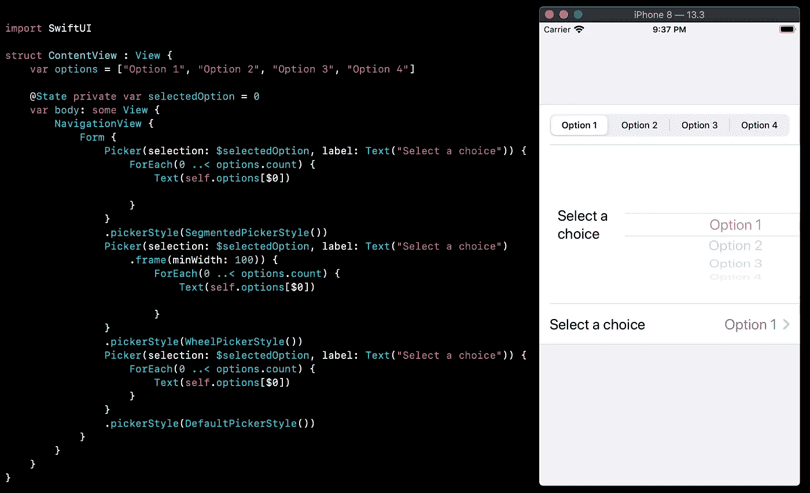

正如在关于拣选器的 [Hacking With Swift 教程中提到的，在`Form`中`Picker`的默认行为是将你带到另一个你可以选择选项的地方。](https://www.hackingwithswift.com/quick-start/swiftui/pickers-in-forms)

在 iOS 上你必须把`Form`放在`NavigationView`里面，否则这个导航不会发生。在一个`Form`之外，`DefaultPickerStyle`将会是`WheelPickerStyle`。

我还在`UIKit`中加入了与`UISegmentedControl`外观相似的`SegmentedPickerStyle`。

## 日期选择器

另见:[日期选择器(在 2.0 中更新)](https://medium.com/better-programming/swiftui-views-and-controls-the-swift-2-documentation-youve-been-waiting-for-dfa32cba24f3#9756)

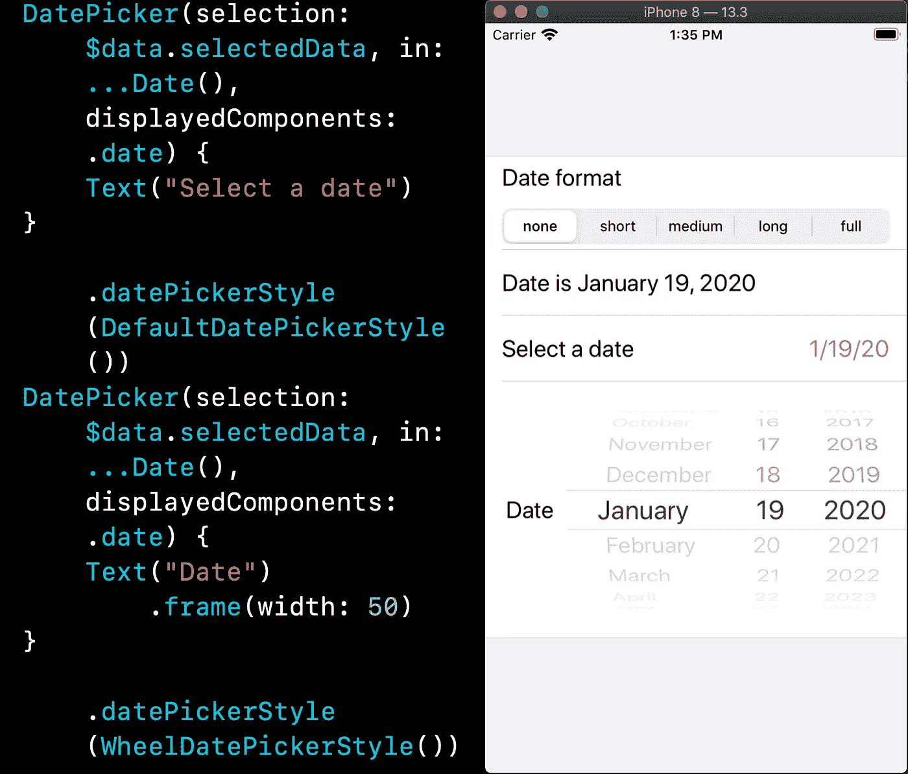

`DatePicker`与`Picker`相似，但风格不尽相同。在`Form`内部使用时，`DatePicker`只占用一条线。

正如你在上面的截图中看到的，一个`Form`中的默认`DatePicker`有一个标签和当前日期。点击它会导致一个`DatePicker`从下面滑出。

滑出的`DatePicker`与`WheelDatePickerStyle`完全相同，这就是为什么它看起来像是现在显示的，而实际上我只是在它下面有一个`WheelDatePickerStyle`。

我添加了一个`Picker`，您可以用它来尝试不同的日期格式，只是为了展示如何在运行时更改`DatePicker`的格式。

## 滑块

滑块允许您在最小值和最大值之间滑动拇指(白色圆圈)。这类似于 UIKit 中的`UISlider`。当您创建它时，您必须设置一个封闭的范围，以便 SwiftUI 知道最小值和最大值。

步长可以设置为任意值，如果您不需要将值设置为十进制，这可能会节省您将长的`Float`转换为`Int`的时间。

这也有助于您增加或减少记录滑块位置的精确度，通过排除超过您指定的步长数量的小数位，可能会使计算更容易。

## 跳舞者

SwiftUI 中的一个`Stepper`与`UIKit`中的一个`UIStepper`基本相同。它由一个相连的减号和加号按钮组成。

并非所有的初始化器都要求你设置一个绑定变量来存储值。它们中的许多都采用闭包，当您递减、递增或编辑`Stepper`的值时会调用这些闭包。

# [查看布局和演示文稿](https://developer.apple.com/documentation/swiftui/view_layout_and_presentation)

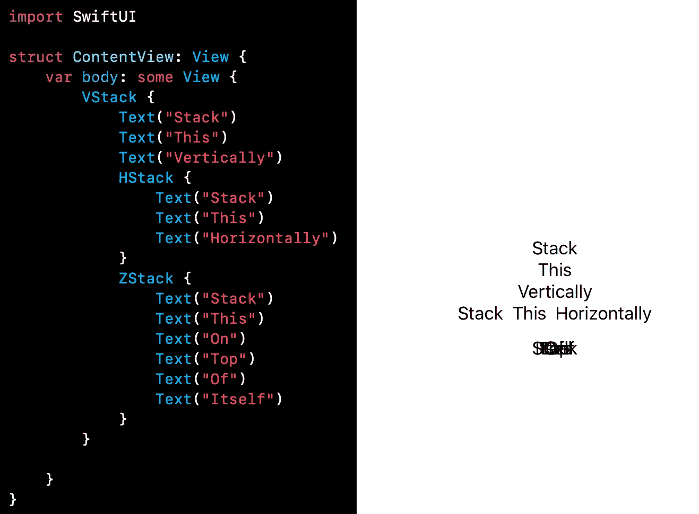

VStacks 是垂直的，HStacks 是水平的，ZStacks 是多达十个视图的分层堆栈

## HStack、VStack 和 ZStack

虽然总是竖着写，但是这些栈把孩子排列在不同的方向。

`VStack`对于任何应用程序来说都是一个有用的起点，因为你可以用多达 10 个孩子(以及他们所有的后代)快速填充手机屏幕。

`HStack`将使用可用的水平空间来布局其子项，这可能不允许在纵向手机屏幕上有太多空间。当你想把一个`Text`标签放在一个控件旁边时，这是很有用的，比如在一个`List`中(见下文)。

## List、ScrollView、ForEach 和 DynamicViewContent

另见:[列表(在 2.0 中更新)](https://medium.com/better-programming/view-layout-and-presentation-in-swiftui-705b7d81f03#51f2)
另见:[ForEach&DynamicViewContent(在 2.0 中更新)](https://medium.com/better-programming/view-layout-and-presentation-in-swiftui-705b7d81f03#c1f5)

正如在`NavigationLink`的例子中提到的，`List`是一个滚动视图，它将垂直增长以适应动态的行数。类似于`UIKit`中的`UITableView`，但是没有任何工作。

你可以像添加`VStack`一样添加静态数据到`List`，将一个`View`放在另一个的上面，或者你可以使用`ForEach`。

`ForEach`让您循环遍历一个集合，比如一个数组，每次都以标准化的方式显示大量数据。

`ScrollView`使嵌入其中的`VStack`或`HStack`能够滚动。默认的`ScrollView`垂直滚动，即使`ScrollView`的直接子节点是一个`HStack`。

这意味着如果您想要覆盖此行为，您必须使用`ScrollView(.horizontal)`。你仍然可以像使用`List`一样用`ForEach`来使用它们，但是多了一层`VStack`或`HStack`使得这种方式更加复杂。

当然，`VStacks`没有与`UIKit`中的`UITableView`单元格外观相似的行。例如，一个由`Text`组成的`List`将会把那些`Texts`一个接一个地堆叠起来，没有分隔物。

可以定制一个`View`来模仿这些行，或者给你的行一个完全不同的外观。

但是除非你需要水平滚动，否则最好使用`List`。

`List`也将支持自定义行，并且它还具有带有`VStack`的`ScrollView`所缺乏的其他特性。

当一个`EditButton`被添加到包含一个`List`的`View`中时，您可以重新排列或删除`List`中的项目。

如果您没有在这种情况下被调用的方法，那么您的`List`行将会消失，但是它后面的数据仍然不受影响。下一次在滑动删除一行后启动应用程序时，该行将会返回，因为底层数据没有被修改。

在[用 Swift 的](https://www.hackingwithswift.com/books/ios-swiftui/deleting-items-using-ondelete) `[onDelete](https://www.hackingwithswift.com/books/ios-swiftui/deleting-items-using-ondelete)` [教程](https://www.hackingwithswift.com/books/ios-swiftui/deleting-items-using-ondelete)中，可以看到`.onDelete`修改器是如何工作的。这使您能够传入一个方法，该方法将在用户滑动鼠标删除您的`List`中的项目时运行。

`DynamicViewContent`是`.onDelete`修饰符的返回类型，但它意味着`ForEach`的内容需要更新。

`ForEach`是另一个`View` struct，这意味着当底层数据改变时，它可以自己动态地改变。

正如你在我的例子中看到的，`.onMove`和`.onDelete`非常相似。真正的问题发生在你试图使用`.onInsert`的时候，我无法使用它。

我期望它的工作方式是在`insert()`函数中，这个方法可能会在 SwiftUI 的未来版本中开始工作。

出于某种原因，`.onInsert`以字符串的形式接受了一组`[UTType](https://developer.apple.com/documentation/mobilecoreservices/uttype)` 标识符。这些指定了我们期望插入到`ForEach`底层数据中的类型，在本例中是`NSString`。

作为如何创建 UTI 类型标识符的例子，我从字符串创建了一个`NSItemProvider`并打印出来。这为`NSString`输出了 UTI 类型的字符串，这是我在我的`onInsert`调用中引用的。

即便如此，我提供的名为`*inserted()*`的方法也从来没有被调用过。这似乎表明`.onInsert`的功能没有被添加。我只在一个`List`和一个`VStack`里面试过，所以可能在某个地方有用。

让我知道你是否得到了`onInsert`的工作，因为在网上任何地方都没有它的例子。

## 可辨认的

`ForEach`swift ui 中的循环要求数组中的每一项都是`Identifiable`，这意味着每个成员都有自己唯一的标识符。

在下面的例子中，我从一个字符串数组开始。由于`String`符合`Hashable`协议，所以不需要提供唯一标识符，因为`\.self`提供了`hashValue`。

在我的定制类中符合这个协议将要求我提供一个`hash(into:)`函数，它将基本组件组合成一个整数`hashValue`，唯一地标识每个实例。

我还需要重载比较我在`hash(into:)`函数中组合的相同属性的`==`操作符。

在苹果的文档中了解更多关于散列协议的信息。

当我创建`myUnhashableType`时，我不符合`Hashable`协议。

因此，使用 ID`\.self`不起作用，这可以从第二个`ForEach`上面的注释中看出。这会产生一个阻止编译的错误，除非这个`ForEach`被注释掉或删除。

然而，`myIdentifiableType`在循环中有一个更容易识别的方法。`Identifiable`协议只要求一个名为 ID 的变量存在，并且对每个实例都是唯一的。

为此，我只需使用 UUID，它会在每次创建新实例时生成一个通用的惟一标识符。

这甚至让我避免了在`ForEach`中指定标识符的需要，因为符合`Identifiable`准确地告诉了`ForEach`它需要什么来标识每个实例。

## 轴

这只是一个包含案例`.horizontal`和`.vertical`的枚举。它用于表示内容可以排列的两个方向。

例如，一个`ScrollView`有一个叫做`axes`的属性，它是一个`Axis.Set`。这实质上意味着您可以更改轴以包含`.horizontal`、`.vertical`或两者。这将改变您可以滚动的方向。

## 形式

`Form`给你一个不像 iOS 设置菜单的界面。你可以将界面的各个部分分成`Section`个部分，这样控件的外观会比在`List`中更令人愉快。

## 组

[组(在 2.0 中更新)](https://medium.com/better-programming/view-layout-and-presentation-in-swiftui-705b7d81f03#7373)

苹果公司简单地将此描述为:

> "用于分组视图内容的启示."

与`VStack`或`HStack`对布局的影响不同，`Group`根本不会改变布局。相反，它允许你像对待一个孩子一样对待十个孩子。例如，一个`VStack`只能有十个孩子，这就把你限制为十个`View`。

但是如果这 10 个孩子都是`Group` s，那么每个组可以有 10 个孩子，这样一个`VStack`就可以显示 100 个`View` s。

它们被视为一个`View`的事实也允许你将`.foregroundColor(.red)`或`.frame(width: 300)`这样的修饰符应用于整个组，而不是必须为每个`View`设置这些修饰符或将`View`放置在`VStack`这样的布局中。

## 分组框

[分组框(在 2.0 中更新)](https://medium.com/better-programming/view-layout-and-presentation-in-swiftui-705b7d81f03#6348)

`GroupBox`是带有可选标签的`View`容器，仅在 macOS 上可用。

## 部分

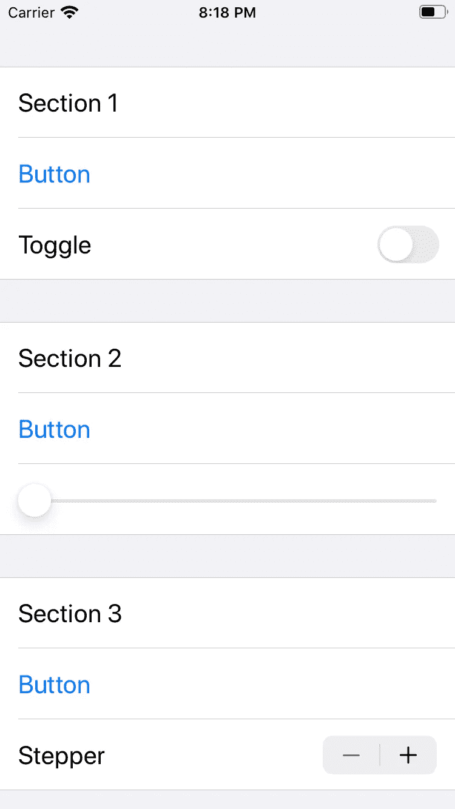

上面的截图显示了一个分成三个`Section`的`Form`

正如你所看到的，`Form`在三个`Section`之间有间隙，可以看到更细的行显示更暗的背景色。

## 逆电流器

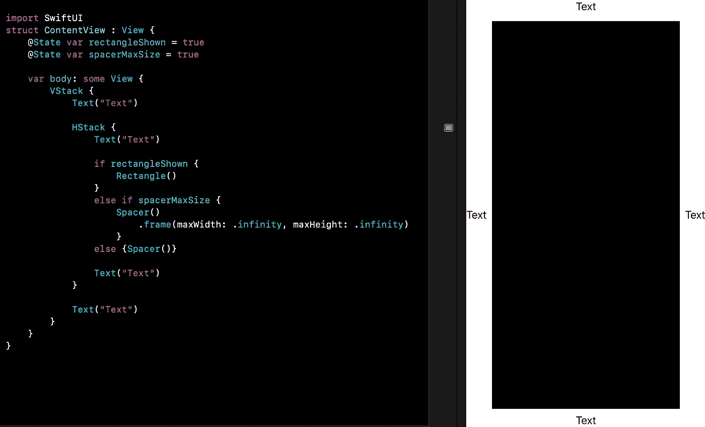

在上面的截图中，我已经展示了`Rectangle`和`Spacer`的异同。

当`rectangleShown`为真时，`HStack`中的`Text`被推到侧面，`VStack`中的`Text`被推到顶部和底部。`Rectangle`实质上是调整其父`HStack`的高度，以占据所有可用的垂直空间。

如果将`rectangleShown`设置为假，则`Rectangle`将消失，但`Text`不会移动。

这是因为最大尺寸为无穷大的`Spacer`的行为方式与`Rectangle`相同。它能够增加其父节点的大小，以占据所有可用空间。

但是将`spacerMaxSize`改为 false，`Spacer`将缩小到`Text` s 的高度，否则这就是`HStack`高度的基础。

`HStack`中的`Text`仍然被推到两侧，因为`HStack`本身默认有一个无穷大的`maxWidth`。

总之，`Spacer`默认情况下只增长到其父级的大小，除非给它们一个无穷大的最大值，否则不会增加其父级的大小。

默认情况下，像`Rectangle` s 这样的视图有一个无限的最大尺寸，并且会增加其父视图的尺寸，除非给它们一个与其父视图相等的最大尺寸。

## 圆规

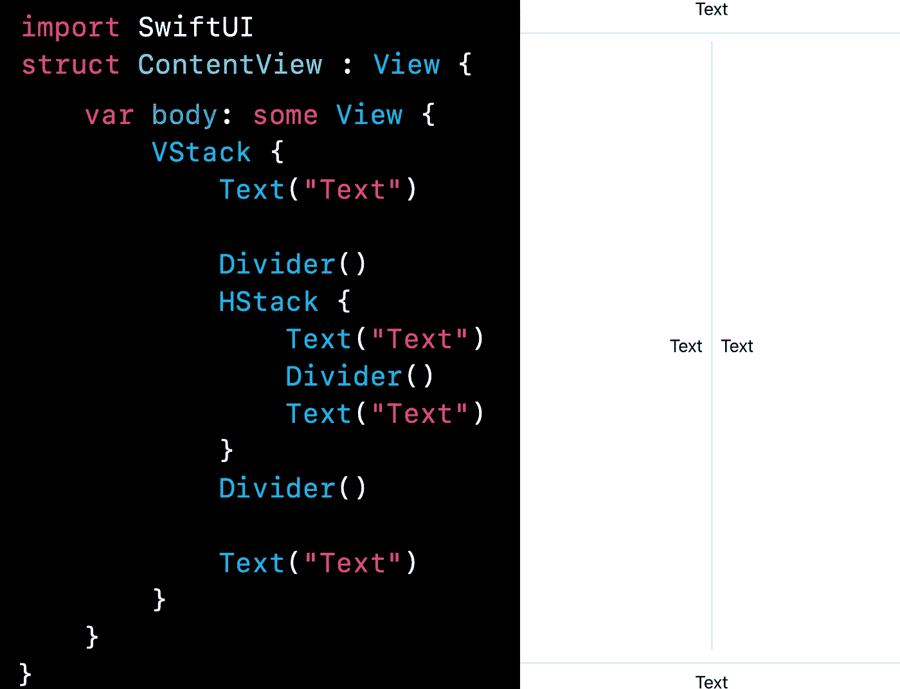

一个`Divider`在布局中的`View`之间放置一条线。在`VStack`中，它们是水平线，而在`HStack`中，它们是垂直线。

将`Dividers`上的`.background(Color.red`设置为红色分割线。否则，它们将根据当前选择的配色方案设置为默认值。

## 选项卡视图

另见: [TabView(在 2.0 中更新)](https://medium.com/better-programming/view-layout-and-presentation-in-swiftui-705b7d81f03#5eb5)

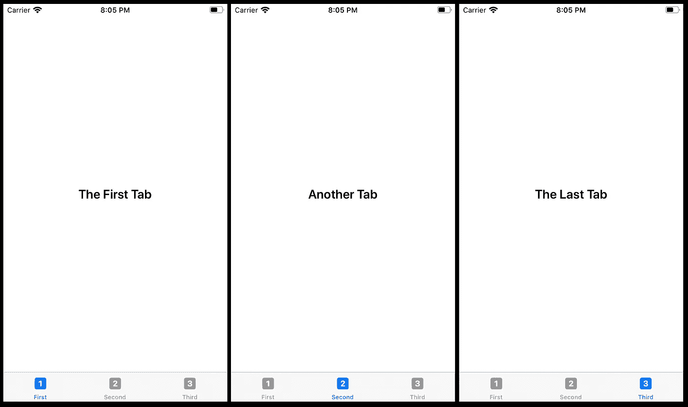

上面的截图来自实现[苹果的](https://developer.apple.com/documentation/swiftui/tabview) `[TabView](https://developer.apple.com/documentation/swiftui/tabview)` [的例子](https://developer.apple.com/documentation/swiftui/tabview)。

我没有太多可以补充的了。

## VSplitView 和 HSplitView

这些版本的`VStack`和`HStack`允许用户拖动分隔线来改变每个分割区域的大小。

不出所料，`VSplitView`将其子节点垂直排列，而`HSplitView`则水平排列。这仅在 macOS 上可用，因此您不能在 iOS 或 tvOS 项目中使用它。

## 警报

创建非常容易，但是它们并不像你想象的那样符合`View`协议。您不能将类型为`Alert`的值放在`VStack`或您认为它可能显示的任何地方。

下面，我提供了一个创建警报的三个主要场景的例子。请注意，我已经为前两个警报添加了操作，但这不是必需的。您可以在任何一个警报按钮上执行操作，也可以两个都执行，或者都不执行，这取决于您。

在`alert1`中，您想要一个默认动作，在本例中称为“OK”，它确认您想要一个动作发生。这会将“您做了一些事情”打印到控制台。

旁边的按钮是一个取消按钮，这里使用默认的`Alert.Button.cancel`创建，它自动提供预期的文本，当它被按下时不采取任何行动。

`alert2`非常类似，按下时打印“你试图删除一些东西”到控制台。这里的区别在于按钮是`Alert.Button.destructive`类型的，这意味着按钮将是红色的，以指示一个做出永久且潜在负面改变的动作。

`alert3`是最简单的一种警告，你可以有一个标题和可选的消息，但是只有一个按钮可以关闭`Alert`。

Alert 中断所有用户活动，用一个或两个选项按钮给出消息

## 行动表

因为它们的工作方式完全相同，所以我用`ActionSheets`重复了上面的`Alert`的例子。

主要的区别是它们有一系列的按钮，这意味着你可以添加任意数量的按钮。这与`Alert`形成对比，后者只有一两个按钮的选项。

ActionSheet 类似于一个警告，但是可以显示无限数量的按钮

## 空视图

`EmptyView`有一个相当描述性的名字。它是一个不占空间的隐形`View`。

下面我举的例子，画出了`EmptyView`和`Spacer`的具体对比。`Spacer`可以被给定一个特定的帧尺寸，并填充那个空间，而`EmptyView`将忽略一个帧修改器。

默认情况下,`Spacer`将填充所有可用空间，这就是为什么我必须在这个例子中将它的高度限制为 20。

一个`EmptyView` 也可以作为任何`View`结构的主体返回

也许`EmptyView`最有用的方面之一是它可以作为任何`View`结构的主体返回。这意味着您可以创建一个空的`View`而不会出现错误，因为主体是空的。

## 等值视图

SwiftUI 实验室有[一个关于](https://swiftui-lab.com/equatableview/) `[EquatableView](https://swiftui-lab.com/equatableview/)`的很棒的教程，比我能解释得更好。

## 任意视图

由于`View`是一个协议，您不能创建`View`本身的实例。这意味着你不能创建一个`[View]`类型的数组，但是你可以创建一个`[AnyView]`类型的数组。

下面是一个类型为`[AnyView]`的数组的例子，以及如何使用`ForEach`显示其内容。你不能将数组本身传递给`ForEach`的构造函数，因为`AnyView`不符合`Hashable`的要求。

相反，我创建了一个从第一个索引到最后一个索引的序列，并用这个索引作为内部数组的下标。

我还提供了一个用于打乱数组的`Button`，只是为了向您展示一个`AnyView`的底层类型并不重要。以前的一个`Text`可以变成一个`Image`，`AnyView`只是重绘了内容。

## TupleView

如果你不熟悉 tuple，[下面是 Swift 语言文档中对 tuple 的解释](https://docs.swift.org/swift-book/ReferenceManual/Types.html):

> “复合类型是没有名称的类型，在 Swift 语言中定义。有两种复合类型:函数类型和元组类型。
> 
> 复合类型可以包含命名类型和其他复合类型。例如，元组类型`(Int, (Int, Int))`包含两个元素。第一个是命名类型`Int`，第二个是另一个复合类型`(Int, Int)`。"

在许多方面，`tuple`就像一个没有花括号的结构体。如果结构具有未用默认值初始化的属性，则在创建该结构时，必须用括号将这些属性初始化。

但是元组没有初始化器，所以那些括号被分配给一个带有等号的`tuple`。与初始化结构属性不同，标签是可选的。

我提供了第二个例子，它创建了一种新的 tuple `twoTexts`，如果使用这两个值，它们的标签必须与原来的`twoTexts`匹配。

我没有将`myTwoTexts`添加到`ContentView`的`body`中，主要是为了引起注意，尽管`TupleView`显示来自几个`View`的内容，但它并不需要使用`VStack`。

不能以这种方式创建混合类型的数组。您可以创建一个`Text`或`Image`的数组，但不能创建`View`的数组，因为它有协议要求。创建一个混合类型的数组是推断出来的，因为你不能从`Any`转换到`View`、`Text`或`Image`。

有一种方法可以创建混合类型的数组，那就是使用`AnyView`。

向上滚动到上面的`AnyView`,查看使用它的混合阵列示例。

与我的大多数例子不同，我为我的`TupleView`提供了`ContentView_Previews`来展示它的样子。我使用了固定的尺寸，因为我们使用的是小的`View`，这样更容易看到`TupleView`在单独的预览中显示每个`View`。

对于普通的`View`,你需要创建一个`Group`,并指定你想在单独的预览中出现的`View`。关于预览的更多信息，请看我在这篇文章末尾写的关于`[PreviewProvider](#8932)`[协议](#8932)的内容。

# [绘图和动画](https://developer.apple.com/documentation/swiftui/drawing_and_animation)

## 动画

这里有一个使用默认类型`Animation`的例子。要使用它们，只需修改你的`View`并使用`.animation(.spring())`修改器添加一个动画。

如果您想具体了解想要执行的更改，请参见`[withAnimation](#0817)`。如果您制作一个带有自定义属性的自定义形状，您需要将它们指定为`animatableData`(见下文)。

## 动画和动画数据

`Animatable`是一个协议，用于告诉 SwiftUI 如何激活您的自定义`Shape`。

无需显式声明 struct 符合协议，您可以通过声明一个名为`animatableData`的属性来符合协议，该属性告诉 SwiftUI 您可以制作什么动画。

在我的例子中，我已经创建了一个`Square`形状，因为`Rectangle`已经存在，而`Square`不存在。

符合`Shape`要求您的形状有一个名为`path(in:)`的函数，它基本上接受您的形状的框架矩形，并要求您生成一个 SwiftUI 可以用来绘制形状的`Path`。

我所做的就是决定哪个长度更短，宽度还是高度。在纵向模式的 iPhone 上，这是宽度。

当我绘制路径时，我使形状在两个方向上都等于这个较短的长度，而不是使用`rect.maxX`或`rect.maxY`将正方形拉伸到提供的矩形空间中。

在 Y 方向上，我还应用了一个偏移量，这样正方形就可以从屏幕中心的起始位置上下移动。

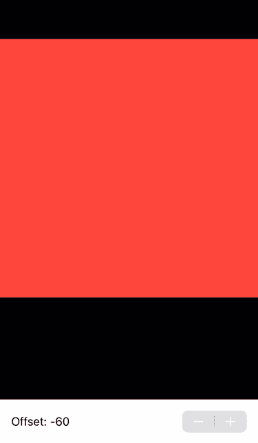

重要的部分是我提供了一个名为`animatableData`的变量，通过 getter 和 setter 提供对`offset`变量的访问。

`Stepper`的步长为 25，这意味着每当数字改变时，它们将`Square`移动 25。为什么这很重要？这是一个足够大的变化，如果没有动画，这将是一个不和谐的运动。

尝试禁用动画，你会明白我的意思。

如果你对我使用的`GeometryReader`感到困惑，你可以在这篇文章中找到我的[定义。](#fa47)

## 动画对

`AnimatablePair`与上面提到的`Animatable`协议有关，这里就不重复基本了。`AnimatablePair`允许你将两个`animatableData`浓缩成一个值。真的就这么简单。

这是上面的`Animatable`示例的一个版本，它允许`Square`同时拥有一个`xOffset`和一个`yOffset`:

## EmptyAnimatableData

在上面的`AnimatablePair`和`AnimatableData`示例中，我明确告知 SwiftUI 我希望在我的自定义形状中显示哪些属性。

由于`Shape`本身符合`Animatable`协议，所以默认实现被继承。默认实现所做的只是创建一个设置为类型`EmptyAnimatableData`的`animatableData`属性。

这允许`Shape`的孩子遵守`Animatable`协议，而无需实际设置他们的`animatableData`。

如果他们想覆盖这个值，他们可以，就像我在上面的例子中所做的那样。

## 动画修改器

`AnimatableModifier`允许您生成一个带有动画的修改视图。

我已经制作了上一节中关于`Animatable`协议的例子的一个版本，它使用了`AnimatableModifier`协议。在现有的例子中，我有一个步进器，每次将一个方块上下移动 25 °,一边移动一边制作动画。

在这个新版本中，我使用蓝色的`Rectangle`填充整个屏幕，并应用`AnimatableSquare`修改器。

注意，我使用了一个`View`扩展来避免使用定制修饰符通常需要的笨拙的`.modifier(SquareAnimatable(offset: offset))`语法。

`SquareAnimatable`修改器添加一个红色的`Square`作为任何`View`的覆盖。该覆盖图从创建它的`View`中获取它的`offset`值，这意味着父`View`可以更改该值，而`SquareAnimatable`将移动方块并动画显示该更改。

本例中的`Square`形状实际上是在`SquareAnimatable`修饰符的范围内声明的，这意味着带有传递给它的偏移值的`Stepper`的父`View`甚至不知道如何使它控制的`Square`！

当我最初这样做的时候，我把偏移量作为一个`@Binding`传递给它。

不要这样！

`animatableData`中的 setter 试图设置传递的值，您会得到一个运行时警告:

```
Modifying state during view update, this will cause undefined behavior
```

用 Swift 破解解释了为什么`State`变量不应该在`View`的主体中被改变。

本质上，问题是当`View`正在创建的时候，我们试图改变初始的`@State`属性*偏移量*。如果是个`Button`就不成问题了。

## 带动画(隐式动画)

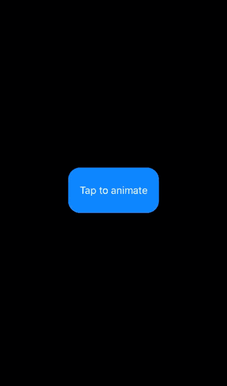

将动画放入 SwiftUI `View`的一个简单方法是将代码放在一个`withAnimation`块中。

这类似于`UIKit`中`UIView.animate(withDuration:Animations:)`所用的模块，但默认情况下不需要持续时间。

您可以传入一个`Animation`对象，比如`withAnimation(.linear(duration: 5))`，以便更好地控制动画的外观。你甚至可以选择是否将一个持续时间传递给`.linear`。

关于`Animation`的更多细节，请参见本节开头的的[定义。](#789a)

请注意，在这种情况下，将`.animation(.default)`修改器添加到`Rectangle`会产生相同的效果，尽管有必要指出不同之处。

`.animation(.default)`修改器是隐式动画的一个例子。你基本上是在说我们希望对`Rectangle`的任何改变都是动画的。

这意味着，如果我们添加另一个增加宽度的`Button`，即使我们没有将这些变化指定为`withAnimation`，它也会被动画化。

如果你想完全控制`View`的哪些方面可以被动画化，你需要明确地指定哪些值的变化应该使用`withAnimation`来动画化。

## 任何转换

这类似于`AnyView`，它允许你把一个视图当作一个通用的和不透明的返回类型。

当组合多个过渡时，可以使用`combined`方法将过渡加在一起。您也可以添加一个`Animation`到一个过渡，其结果是一个`AnyTransition`对象。

## 不可镶嵌形状

`strokeBorder`允许您绘制切入形状区域的边界，要求`Shape`符合`InsettableShape`协议。

更多信息请参见本【Swift 黑客教程。

## 填充样式

`FillStyle`只有两个选项，都是布尔型。

奇偶规则与 SwiftUI 如何决定路径的哪些部分应该被填充有关。引用[SVG](https://www.w3.org/TR/SVG/painting.html#WindingRule)的规范:

> 该规则确定画布上一个点的“内部性”,方法是从该点向任意方向画一条射线到无限远，并计算该射线穿过的给定形状的路径段数。
> 
> 如果这个数是奇数，则点在里面；如果扯平，重点在外面。"

实际上，这会导致带有扭曲填充的形状自身重叠，从而在重叠部分没有填充。在 SVG 规范中有这种效果的例子，关于奇偶规则的维基百科页面也有。

如果对`isEOFilled`参数使用 false，则使用非零方法。这确保了所有封闭的空间都被填满，而不仅仅是那些没有重叠的空间。

抗锯齿是平滑锯齿状边缘或“[锯齿](https://en.wikipedia.org/wiki/Jaggies)”的过程。当分辨率较低时，锯齿是由光栅图像由方形像素网格组成这一事实造成的。

尽管水平直线和垂直直线可以以低分辨率呈现而没有锯齿，但是由于试图用正方形像素的网格来表示不垂直于其中一个轴的直线的“阶梯效应”,与这些轴的任何角度差异都会导致出现锯齿。

如果您对`isAntialiased`参数使用 true，一些模糊量用于柔化锯齿。否则，将会出现锯齿。

## ShapeStyle

`ShapeStyle`用于从`Shape` s 创建`View` s。背景修饰符，令人惊讶的是目前还没有文档，声明如下:

```
extension View {@inlinable public func background<Background>(_ background: Background, alignment: Alignment = .center) -> some View where Background : View}
```

因为一个`Color`不是一个`View`，你可以把它传递给这个需要一个`View`的函数，这可能会令人惊讶。

事实上，您可能会惊讶地发现，您可以创建一个只有一个`Color`作为主体的`View`，尽管`Color`并不直接符合`View`协议。

而是`Color`符合`ShapeStyle`，而`ShapeStyle`符合`View`本身。

似乎正在发生的是用`Color`创建一个`Rectangle`，根据`ShapeStyle`的默认实现填充它:

`ImagePaint`、`Border`、`Stroke`、`Fill`、`Gradients`似乎都以某种方式使用`ShapeStyle`来创造前景和背景。

## 几何效应

`GeometryEffect`允许你创建自定义动画，其中许多动画会产生类似于所提供的`rotation3DEffect`修改器的 3D 效果。

[SwiftUI 实验室有一个关于使用 GeometryEffect 的很棒的教程](https://swiftui-lab.com/swiftui-animations-part2/)。

## 角

您可以创建带有度数或弧度的`Angle`，这两者都需要成为`Double`。

一旦创建，您的`Angle`的角度或弧度可以作为属性访问。`Angles`用于制作`RadialGradients`，给`Paths`加弧，用于`RotationEffect`和`RotationGesture`。

## 边缘和边缘嵌入

`Edge`是包含值`.bottom`、`.leading`、`.top`和`.trailing`的枚举。它似乎只用在两个修饰语:`.edgesIgnoringSafeAreas`和`.padding`。

`EdgeInsets`用在类似`.listRowInsets`和`.resizable`修饰符的地方。

## 矩形、圆形矩形、圆形、椭圆形和胶囊形

您可以轻松创建这些形状，因为它们在 SwiftUI 中以`Views`的形式提供。下图显示了它们之间的区别。

`Circle`似乎是唯一一个锁定其长宽比的，所以即使给它一个宽度大于高度的框架(如我在下面的代码中所做的那样)也不会像拉伸`Ellipse`一样拉伸`Circle`。

没有叫做`Square`的对等物，所以你只能用一个`Rectangle`创建一个正方形，并赋予它相等的宽度和高度。

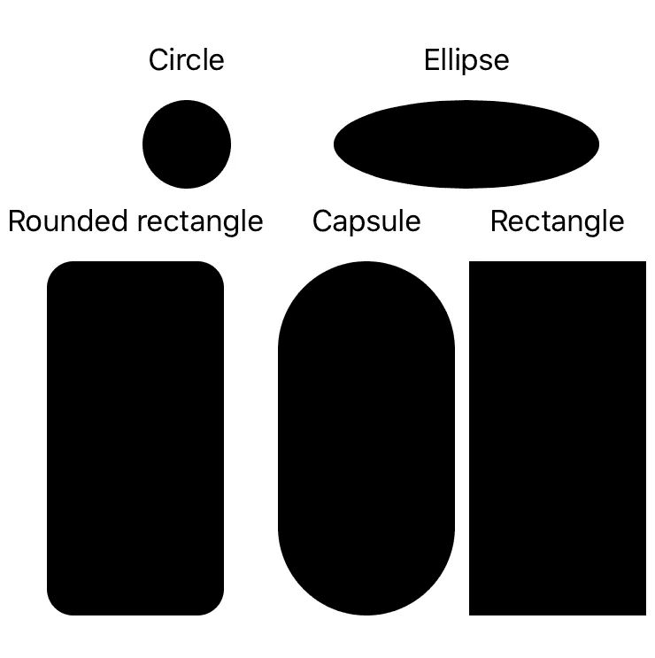

希望并排比较能显示出`Capsule`与`RoundedRectangle`的不同之处。我给`RoundedRectangle`提供了一个 15 的`cornerRadius`，这就是为什么它有一个可见的顶部边缘。

如果我将`RoundedRectangle`的`cornerRadius`设置为其宽度的 50%，在本例中为 50，它的外观与`Capsule`几乎没有区别。

总之，`Capsule`就像是`RoundedRectangle`的`cornerRadius`总是等于其宽度的 50%。

一个`Rectangle`也与一个`RoundedRectangle`相同，带有一个`0`的`cornerRadius`。

## 小路

重复我在`Animatable`和`AnimatableData`部分说过的话:

> “符合`*Shape*`要求您的形状有一个名为`*path(in:)*`的函数，它基本上接受您的形状的框架矩形，并要求您生成一个`*Path*`，SwiftUI 可以使用它来绘制形状。”

苹果教程 [*绘制路径和形状*](https://developer.apple.com/tutorials/swiftui/drawing-paths-and-shapes) 直接在 a `View`的 body 属性中使用路径，不符合`Shape`。

## ScaledShape、RotatedShape 和 OffsetShape

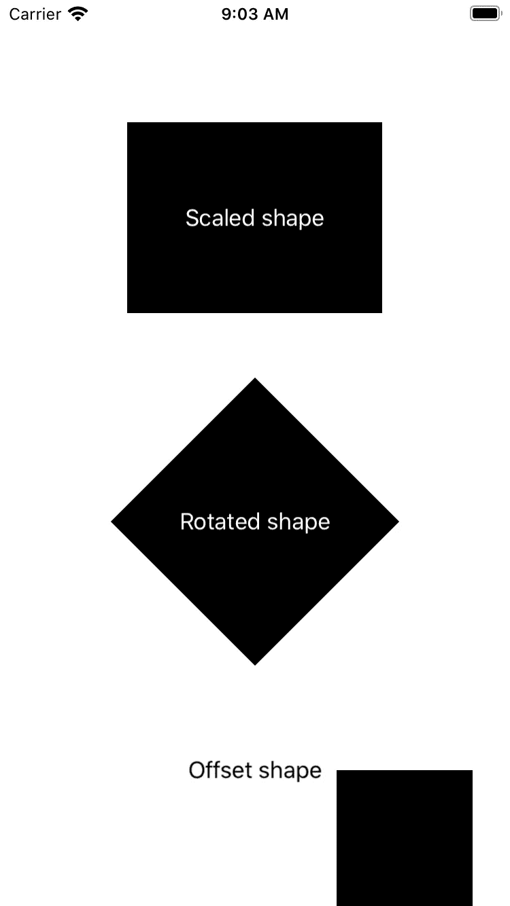

这些转换后的`Shapes`非常容易使用，因为它们只需要您传入一个`Shape`和必要的转换参数。

对于我的缩放后的`Rectangle`，我在两个方向上都缩放了 0.5。一个`Rectangle`通常会占据所有的可用空间，所以很明显这个相对较小，并且位于`VStack`的上三分之一的中心。

旋转和偏移的矩形必须使用它们的框架按比例缩小，否则它们会与其他矩形重叠。

这张截图是在光线模式下拍摄的，所以默认`foregroundColor`是黑色的。我把前两个叠加的`Text`改成了白色，但是需要注意的是这在黑暗模式下不起作用。

在黑暗模式下，`Rectangle` s 将采用默认的白色`foregroundColor`。因此，该文本将被隐藏，而偏移`Rectangle`的`Text`将被默认的黑色背景隐藏。

在 SwiftUI 中使用默认背景色和前景色时，请始终考虑明暗模式。

我把`OffsetShape`的例子放在一个`Group`中，它自己的固定高度是 200。

这是因为偏移一个形状并不会增加分配给它的空间大小，所以尽管由于`OffsetShape`的高度，分配的空间会是 100，但将其向右下方移动只会将`OffsetShape`移出屏幕底部。

`RotatedShape`同样，不增加分配的空间来说明轮换。

请注意，覆盖的`Text`不会与`OffsetShape`偏移，从而在`Text`应该在`OffsetShape`的地方留下了一个有趣的效果。

## 变形形状

一个`TransformedShape`类似于上面的`[ScaledShape](#83d6)` [、](#83d6) `[RotatedShape](#83d6)` [和](#83d6) `[OffsetShape](#83d6)` [例子，除了它在它的初始化式中接受一个](#83d6)`[CGAffineTransform](https://developer.apple.com/documentation/coregraphics/cgaffinetransform)`的单个参数。

核心图形仿射变换将变换表示为 3 x 3 矩阵，这意味着它可以在单个实例中表示许多变换。由于一个 3 x 3 矩阵总是在最右边的列中有[0，0，1]，所以这里所做的所有更改都在前两列中。

如果你不知道矩阵乘法是如何工作的，那就去看看这个有趣的网站。

虽然您可以在初始化时或稍后通过调整各个位置 *a* 、 *b* 、 *c* 、 *d* 、 *t* ₓ和 *t* ᵧ的属性来使用`GAffineTransform`类构建矩阵，但是使用该类最简单的方法是使用 Apple 提供的构造函数和实例方法。

在我的例子中，我使用接受翻译的构造函数来尝试将`Rectangle`放在屏幕中央。然后我将它缩放并旋转 45 度。

请注意，您需要将实例方法的结果赋给变量本身，这就是我使用笨拙的语法`affineTransform = affineTransform.scaledBy(x: 0.4, y: 0.4)`的原因。

我最初假设直接调用该方法是可行的，因为 Xcode 不会以通常的方式警告您:

```
Result of call to scaledBy(x:y:) is unused
```

不要把这个警告的缺失当作证据，证明它被赋值给你像我一样调用它的变量！

## 颜色

SwiftUI 有自己的`[Color](https://developer.apple.com/documentation/swiftui/color)`类，是跨平台的，这意味着它可以在 macOS、tvOS、iOS 和 watchOS 上工作。这与只在 macOS 上运行的`[NSColor](https://developer.apple.com/documentation/appkit/nscolor)`和基本上在其他地方都能运行的`[UIColor](https://developer.apple.com/documentation/uikit/uicolor)`形成了对比。

SwiftUI 中的`Color`可以使用`NSColor`、`UIColor`、红/绿/蓝(RGB)、色调/饱和度/亮度(HSL)或白色/不透明度进行初始化。

这些初始化器的一个重要区别是`Color`将透明度参数标记为“不透明度”,而不是其他颜色类中的“alpha”。

与`UIColor`不同，`Color`不能从`[CGColor](https://developer.apple.com/documentation/coregraphics/cgcolor)`或`[CIColor](https://developer.apple.com/documentation/coreimage/cicolor)`初始化。要使用它们，只需将它们传递给`NSColor`(在 macOS 上)或`UIColor`(其他地方)的初始化器，并将结果传递给`Color`的初始化器。

在下面的例子中，我在 SwiftUI 中显示了三种颜色，或者至少，如果 SwiftUI 允许的话，我会这样做:

如您所见，虽然我可以使用相同的变量构造`CGColor`、`UIColor`和`Color`，但是如果要在我的`View`中使用它们，我必须将前两个变量转换为`Color`。

您可能还注意到`Color`要求这些变量的类型是`[Double](https://developer.apple.com/documentation/swift/double)`，而不是`[CGFloat](https://developer.apple.com/documentation/coregraphics/cgfloat)`。

这似乎标志着核心图形浮动结束的开始，但是 SwiftUI 仍然到处使用它，也许最显著的是设置`View`框架的宽度和高度。

也许有一天，SwiftUI 会要求一个`Double`来设置一个`View`的框架，那一定会标志着一个转折点。

## 图像绘画

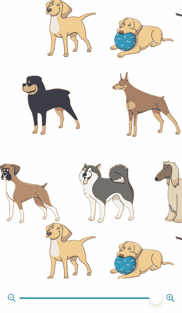

## 梯度(线性/角度/径向)

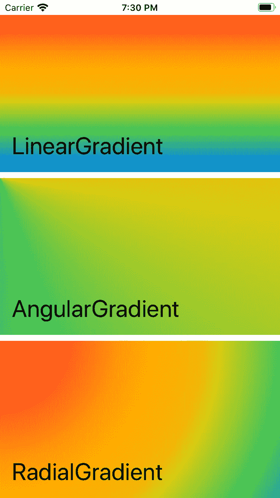

## 几何阅读器和几何代理

`GeometryReader`允许您在屏幕上捕捉`View`的几何图形。

在上面的例子中，包含整个`View`的`ZStack`本身嵌入在一个`GeometryReader`中，这个闭包不影响布局，但是需要传入一个参数。

[苹果的教程](https://developer.apple.com/tutorials/swiftui/drawing-paths-and-shapes)把这个论点叫做*几何*，所以我在我的例子里也是这么做的。被传入的对象是一个`GeometryProxy`，它给了我们两个属性和一个方法。

方法`frame(in:)`允许您传入`CoordinateSpace.local`或`CoordinateSpace.global`来获取相对于直接父级(局部)或相对于最高级别父级(全局)的帧。

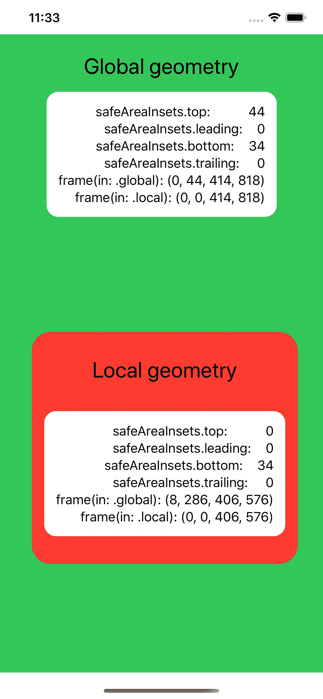

这个例子展示了在 iPhone 11 Pro Max 上使用的两个`GeometryReader`。绿色区域是一个`VStack`，它是`View`的第一个父对象。

传递到`GeometryReader`闭包的`GeometryProxy`显示第一个父元素在顶部有 44 个安全区域 insets，在底部有 34 个。顶部是为了避免将视图放在槽口下面。

在 iPhone 8 和其他仍然有 home 键的设备上，顶部安全区域的大小为 20，以避开状态栏。

只有没有 home 键的 iPhones 才有 34 的底部安全区域，这允许用户向上滑动以回家和切换应用程序。

要忽略任何视图的安全区域，使用`.edgesIgnoringSafeArea(.all)`修改器。其他选项有`.bottom`、`.leading`、`.top`和`.trailing.`

有关这些选项的更多信息，请参见[边缘](#9134)。

值得注意的是，在大多数情况下，大小似乎是相同的。在全局和局部范围内，父`VStack`和较小的红色`VStack`都具有静态大小。

它们的不同之处在于它们的`minX`和`minY`值。当我第一次把小红`VStack`放在一个`HStack`里面的时候，全局空间中的`minX`值没有变化。

只有当我插入一个`Spacer`时，`VStack`才右移八位，造成全局位置`minX`和`minY`不一样的情况。

## 坐标空间

坐标空间在上文部分的`[GeometryReader](#fa47)` [和](#fa47) `[GeometryProxy](#fa47)` [中有更详细的介绍。](#fa47)

主要的区别是`View`的本地原点是(0，0)，但是由于它在屏幕上的位置`View`的全局位置可能与此不同。

`CoordinateSpace`是在使用`GeometryProxy`对象的`frame(in:)`函数时提供`.local`和`.global`选项的枚举。

唯一使用 enum 的地方是在`DragGesture`。`DragGesture`的初始化器可以接受一个参数`minimumDistance`，这是在采取行动之前需要的移动，以及一个`coordinateSpace`枚举的实例。

有了这个`coordinateSpace`设置，传入手势的`onChanged`闭包的`Value`结构将在其`startLocation`和`location` `CGPoint`属性中给出相对或通用坐标。

# [框架整合](https://developer.apple.com/documentation/swiftui/framework_integration)

## UIHostingController

如果你在 Xcode 中创建新的 SwiftUI 项目，并转到`SceneDelegate` Swift 文件，你会注意到最上面的函数叫做`func scene(_ :, willConnectTo:, options:)`，它包含初始化`ContentView`结构实例的代码。

接下来，该函数获取当前的`[UIWindowScene](https://developer.apple.com/documentation/uikit/uiwindowscene)`，它基本上是在 iPad 上使用多个窗口的[的管理器。如果你有一部 iPhone，多窗口是不可能的，所以你只是管理一个窗口。](https://developer.apple.com/documentation/uikit/app_and_environment/scenes/supporting_multiple_windows_on_ipad)

在`if let windowScene = scene as? UIWindowScene`块中，您会注意到`SceneDelegate`立即获得当前窗口。这并不难，因为此时我们还没有在 iPad 上设置多个窗口，所以只有一个窗口。

然后，有点像最初的`UIViewController`上的`Storyboard`，我们设置了`rootViewController`。

创建一个新的`UIHostingController`允许我们显示 SwiftUI。

有像 SwiftUI 实验室的解散模态这样的教程向你展示创建你自己的定制的价值。

我不能提供一个比这更好的例子，但是如果你没有特定的问题要解决，你可能永远不需要创建一个定制的`UIHostingController`。

您需要在`SceneDelegate`中做的主要改变是将一个`EnvironmentObject`传递到您的`ContentView`中。有关更多信息，请参见`[EnvironmentObject](#7a99)`。

## uiviewerepresentable

`UIViewRepresentable`允许您从 UIKit 中的`UIViews`创建 SwiftUI `View`。

在这个例子中，我创建了一个多行`TextField`，这在 SwiftUI 中是不可能的。由于没有等效的`UITextView`，我使用`UIViewRepresentable`和一个简单的`ObservableObject`创建它，将数据永久保存到`UserDefaults`。

如果您在`MultiTextField`中输入内容，您的更改会自动即时保存，因此下次您启动应用程序时，文本将保持不变。

## UIViewControllerRepresentable

您甚至可以从 UIKit 中表示整个`UIViewController`实例，而不是像上面的`UIViewRepresentable`中那样表示单个视图。

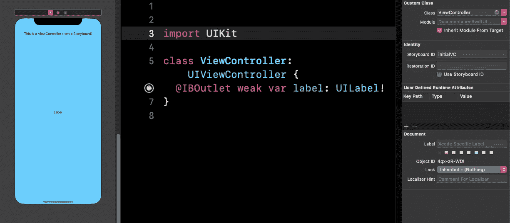

为了复制我的例子，您需要在 SwiftUI 项目中创建一个`Storyboard`，并将其命名为默认名称“Storyboard”。

向`Storyboard`添加一个`UIViewController`，并在视图层次中选择它。将`Class`设置为`ViewController`，将`Storyboard ID`设置为`initialVC`。

添加一个`UILabel`，我使用约束将其居中。

我不会在这篇文章中解释 UIKit 约束，但网上有很多关于它的教程。

你不需要我在顶部添加的`UILabel`，上面写着“这是一个来自故事板的 ViewController”，这只是为了让它工作时更明显。

你也不需要把背景弄成蓝色，我只是想当我们混合 SwiftUI 和`UIViewController`的时候，这样会让区别更加明显。

你不必从`Storyboard`创建你的`ViewController`实例，我只是认为这对很多人来说是一个有用的例子。

您需要在`UIViewConrollerRepresentable`中包含的只是初始化`ViewController`的`makeUIViewController(context:)`和对 SwiftUI 中的变化做出反应的`updateUIViewController(_:, context:)`。

注意，我有一个链接到我的`ContentView`结构的`@Binding`属性，这意味着我在 SwiftUI `TextField`中所做的更改会更新`UIKitVC`中的这个属性，而`updateUIViewController(_:, context:)`会将这些更改传递给`ViewController`类中的实际`UILabel`。

## 数字冠旋转敏感度

这是 Apple Watch 侧面旋转表盘的一系列敏感问题。它有`.low`、`.medium`和`.high`三个品种。

# [状态和数据流](https://developer.apple.com/documentation/swiftui/state_and_data_flow)

## 状态

任何你想本地存储在一个`View`结构中的变量都应该用这个来标记。如果你添加了一个变量而没有添加`@State`，你不能用它来存储一个控件的值。

这是因为`@State`变量可以在运行时改变，SwiftUI `View`将在此基础上重新绘制自己。

例如，如果你有一个`Button`改变了绑定到`Slider`的值，那么`Slider`将会移动以反映你所做的改变，尽管事实上你并没有移动`Slider`本身。

下面是三个主要的 SwiftUI 控件及其相应的`@State`变量，以及一个改变它们的重置`Button`:

## 有约束力的

如果您想影响子`View`的父属性中的`@State`属性，您需要传递它并将其标记为`@Binding`。这使得子节点`View`可以像父节点一样直接访问父节点的`@State`变量。

在下面的例子中，我使用上面的`@State`例子来呈现一个包含子`View`的工作表。

由于局部`@Binding`属性未初始化，当您在 sheet 修饰符中创建`PresentedView`结构时，需要初始化它们。

如果您不确定下面一行:

```
Environment(\.presentationMode) var presentationMode
```

它用于关闭工作表的“消除”按钮。更多信息，请访问[环境](#98ed)。

## 观察对象

在我的控件示例中，比如`Toggles`和`TextFields`，我展示了一种从符合`ObservableObject`协议的 Swift 类访问数据的简单方法。

为了简单起见，我在相同的代码片段中展示了这一点，但它实际上应该在一个单独的 Swift 文件中。下面是将 Swift 类绑定为`@ObservedObject`的最基本的例子。

这意味着对 Swift 文件中标有`@Published`的变量所做的任何更改都会通知 SwiftUI 文件相应地更新其视图。

## 环境对象

添加一个`EnvironmentObject`和添加一个`ObservedObject`非常相似。

这里的`DataModel`类的结构完全相同，但是我们将它标记为`ContentView`内的`EnvironmentObject`和*，而不是设置为`DataModel.shared`的*。

相反，我们只是用名称和类型来声明它，并且使用`SceneDelegate` Swift 文件来传递`DataModel.shared`。

我已经在`SceneDelegate`中包含了需要更改的内容，以便将`EnvironmentObject`传入。请记住，您导航到的任何后续视图，比如用一个`NavigationLink`或者通过展示一个表，在创建时都需要将相同的`EnvironmentObject`传递给它们。

我在我的例子中添加了一个表格，你可以通过按下一个按钮来显示它，只是为了显示`environmentObject`是如何通过的(尽管它与`SceneDelegate`中的相同):

## FetchRequest 和 FetchedResults

在 `[FetchRequest](https://www.hackingwithswift.com/quick-start/swiftui/how-to-create-a-core-data-fetch-request-using-fetchrequest)`上有一个很好的[黑客与 Swift 教程。](https://www.hackingwithswift.com/quick-start/swiftui/how-to-create-a-core-data-fetch-request-using-fetchrequest)

## 动态特性

为了 SwiftUI `View`在底层数据改变时被刷新，我们需要一个协议来封装这个底层概念。

至少一些符合类型`[Binding](https://developer.apple.com/documentation/swiftui/binding)`、`[Environment](https://developer.apple.com/documentation/swiftui/environment)`、`[EnvironmentObject](https://developer.apple.com/documentation/swiftui/environmentobject)`、`[FetchRequest](https://developer.apple.com/documentation/swiftui/fetchrequest)`、`[GestureState](https://developer.apple.com/documentation/swiftui/gesturestate)`、`[ObservedObject](https://developer.apple.com/documentation/swiftui/observedobject)`和`[State](https://developer.apple.com/documentation/swiftui/state)`应该为在 SwiftUI 中处理过数据的任何人所熟悉。

这些属性在重绘`View`的主体之前设置。

## 环境

“环境”可让您访问与设备设置相关的设置。例如，`ColourScheme.dark`允许你预览你的应用在新的黑暗模式下会是什么样子，并与更传统的`ColourScheme.light`进行对比。

可以在辅助功能设置中增加对比度，因此`ColorSchemeContrast.increased`或`ColorSchemeContrast.standard`是唯一的选项。

在辅助功能设置中选择粗体文本的结果由`LegibilityWeight.bold`显示，否则默认为`LegibilityWeight.regular`。

每个`View`都有一个关联的`PresentationMode`结构，它存储一个属性并有一个方法。该属性是 bool `isPresented`，它告诉您`View`是否是活动的。

方法是`dismiss()`，它允许你从屏幕上移除当前的`View`并返回到`View`所显示的位置。

我还可以继续，但是举一个例子列出如何绑定每一个`Environment`值并在`List`中查看数据可能更有意义:

## 偏好键

任何`View`都可以使用修饰符`.preferredColorScheme(.dark)`强制其外观为黑暗模式，即使设备设置为明亮模式。

这将把`[PreferredColorSchemeKey](https://developer.apple.com/documentation/swiftui/preferredcolorschemekey)`结构的 value 属性设置为`ColorScheme.dark`的值属性。这可以通过强制`View`与`.colorScheme(.light)`一起使用灯光模式来覆盖，这就是为什么第一个修改器仅指示偏好而非强制状态。

可以调用`.preferredColorScheme(nil)`来表示没有偏好，这会导致使用默认的配色方案，而`.colorScheme(nil)`不能被调用。

为什么`.colorScheme(nil)`不能叫？

`[PreferredColorSchemeKey](https://developer.apple.com/documentation/swiftui/preferredcolorschemekey)` 符合`PreferenceKey`协议，该协议不仅需要一个值，还需要一个在没有设置值时可以使用的`defaultValue`。

`.colorScheme(.light)`修饰符根本不设置结构值，只是返回带有所需配色方案的`View`。

## 本地化字符串键

`LocalizedStringKey`可以从字符串中创建，并将尝试使用它在`Localisable.strings`或另一个用于[国际化](https://developer.apple.com/internationalization/)的文件中找到相应的值。

如果找不到值，则使用键本身。

关于使用`LocalizedStringKey`的示例，参见[文本](#2307)。

# [手势](https://developer.apple.com/documentation/swiftui/gestures)

## 手势

我知道这应该是他们文档的替代品，但是苹果的教程很好地涵盖了手势。我不想给出类似于[所提供的](https://developer.apple.com/documentation/swiftui/gestures)的例子，所以我就让这部分保持原样。

当你掌握了基础知识，苹果公司有另一个教程教你如何将手势组合成更复杂的互动。这两篇文章的底部都有一个标准手势类型的列表，所有这些似乎都有很好的文档记录。

如果您发现手势文档中有一页需要进一步解释，请告诉我，我会尽力在这里解释。

# [预览](https://developer.apple.com/documentation/swiftui/previews)

## PreviewProvider 协议

创建一个符合这个提供者的结构允许你创建一个`View`的集合，创建一个`Group`允许你创建多个预览，每个预览可以有一个不同的平台。

为此，您可以使用`VStack`、`HStack`和`ZStack`，但是这会产生奇怪的结果，即使您选择不同的预览设备，也会在一个屏幕上显示多个预览。

除了指定设备，您还可以指定平台。目前的选项有 iOS、macOS、tvOS 和 watchOS。

默认情况下，`PreviewLayout`值被设置为`.device`，它显示设备的外观，并适合其中的预览。将它设置为`.sizeThatFits`似乎会给出容器的设备大小，但不会显示容器周围的设备挡板。

最后，将`previewLayout`设置为`fixed`允许您为容器设置自定义的宽度和高度，这在您不太关心`View`在设备上的外观时可能会很有用。

使用`.environment`可让您在黑暗模式下预览，并查看您的应用程序如何在不同的本地化环境下工作。

感谢阅读！