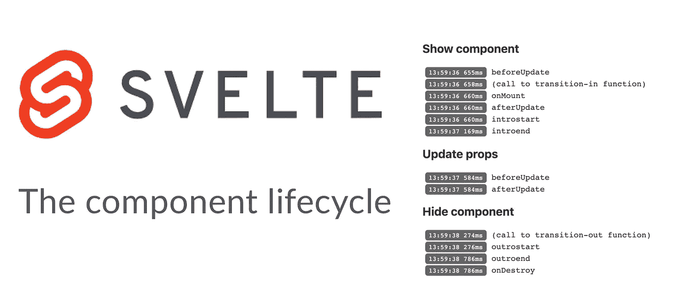
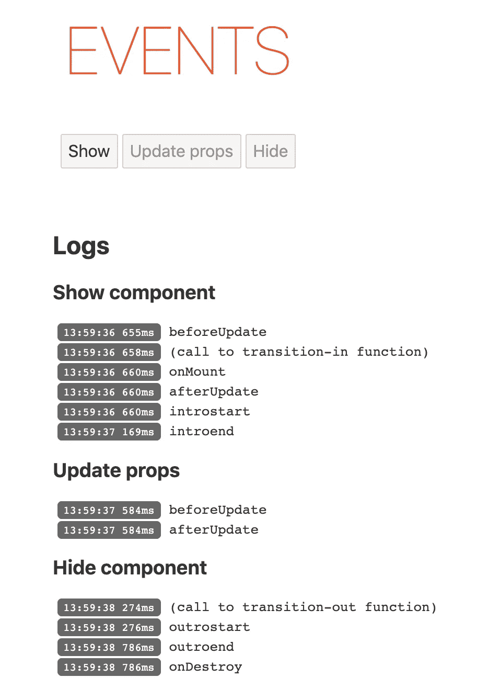

# 苗条中的组件生命周期

> 原文：<https://betterprogramming.pub/the-component-lifecycle-in-svelte-1784ecab5862>

## 通过准确了解 Svelte 何时执行组件生命周期的各个部分，构建更健壮的应用程序

图片来源:我

确切地知道应用程序中发生了什么可能意味着完全控制的感觉或经历深深的挫折之间的差别。就个人而言，未知让我抓狂，这反过来又经常导致各种各样的实验和/或调试会议。在这篇文章中，我想分享其中的一个，并阐明[svelet](https://svelte.dev/)中的组件生命周期。

我会把这篇文章写得很短。主要目标是提供各种事件的综合概述以及它们触发的正确顺序。因此，我假设你对苗条有些熟悉。我们将首先看一下相关的概念，但是你也将会发现所有相关的代码以及在作品中更下面的交互式苗条环境的链接。

# 组件生命周期

Svelte 中的每个组件都经历了相似的生命周期:按需创建、安装、更新，最终在不再需要时销毁。虽然 Svelte 在后台为您处理这些，但它可以通过事件通知您这些事情何时发生。正如我们将看到的，这在您需要直接与 DOM 交互时特别有用。

# 重大生命周期事件

让我们从头开始。在所有可用的生命周期事件中，您可能会最常用到这两个:`onMount`和`onDestroy`。

顾名思义，`onMount`将在*组件刚刚挂载到 DOM* 时被调用。这是访问 DOM 节点的绝佳位置(例如，聚焦输入或与外部框架交互时)。

它的对应物是`onDestroy`，当组件*刚刚从 DOM* 中卸载时会被调用。典型的用例包括取消存储订阅或从外部库清理。

与以上相关的有`beforeUpdate`和`afterUpdate`。这些将分别在 DOM 更新之前和之后被称为*。典型的循环如下所示:*

*   *该组件接收更新的属性或状态。*
*   *`beforeUpdate`被称为。*
*   *DOM 被更新。*
*   *`afterUpdate`被称为。*

*例如，您可以使用它来更新元素的滚动位置(这也是官方教程中的例子)。*

*注意，对`beforeUpdate`的第一次调用甚至发生在组件挂载之前的*，所以在试图访问这里的任何 DOM 元素时要小心。此外，由于这些可能会被调用很多，所以确保这里的代码是有效的可能是谨慎的。如果你想阅读更多关于它们的内容，请阅读 API 参考文献的相关章节。**

*根据我的经验，上述事件应该已经涵盖了您通常会遇到的许多用例。但是，有时您可能想要更多的控制(例如，当转换元素时)。这是下一节要讲的内容。*

# *过渡事件*

*[过渡](https://svelte.dev/tutorial/transition)本质上是动画，当一个元素被挂载到 DOM 或者从 DOM 中卸载时，它被应用到这个元素。一旦你在一个元素上使用了转换，Svelte 将会触发几个关于转换的事件。*

*注意，从技术上讲，这些不是生命周期事件，而是发生在每个单独分配了转换的 DOM 元素上。以下是过渡期间发生的情况:*

*   *Svelte 调用分配给 in-directive(或者 transition-directive，如果你使用的话)的函数来创建转换。*
*   *调度`introstart`事件。*
*   *应用入转场(即元素以动画形式出现。注意:如果您使用 Javascript 进行转换，动画期间的每个更新周期都会调用 tick 函数。)*
*   *`introend`事件被调度。*

*您可以通过使用`on:introstart`或`on:introend`指令轻松地挂钩到这些事件中。*

*出转场的工作方式基本相同，只是用“结尾”代替了“开头”所以你会用`on:outrostart`和`on:outroend`。*

*如果这仍然是理论上的，我会完全理解。因此，我创造了一个互动的苗条 REPL，你可以亲眼目睹这一切的发生。`App.svelte`主要是设置环境。有趣的部分在`Component.svelte`里面。代码应该或多或少是不言自明的，但如果有什么不清楚的地方，请在评论中告诉我。*

*这个 REPL 的[中的 Component.svelte(为了清楚起见，将其缩短)](https://svelte.dev/repl/ff7585c7987f4100867655a1cc475819?version=3.18.1)*

*如果您按顺序单击所有三个按钮，您应该会得到类似如下的输出:*

**

*生命周期和过渡事件概述*

*我鼓励你玩这个。例如，移除出转场以查看不再调度`outrostart`和`outroend`事件。*

*这几乎结束了生命周期功能的概述。然而，还有一个 Svelte 提供的功能。它被称为`tick`，并不是真正的生命周期挂钩，但与生命周期密切相关。一旦你理解了这一点，它可能会帮你省去很多麻烦(还有像`setTimeout`这样的黑客)。*

# *奖金:滴答*

*那么什么是`tick`？让我们从技术定义开始:无论何时调用`tick()`，它都将返回*一个承诺，这个承诺在 DOM 已经与所有待定的属性/状态更新*同步之后解决。换句话说，你可以等待一个解决的承诺，以确保 Svelte 已经完成了所有相关的 DOM 更新。*

*为了说明这意味着什么，让我们看一个简单的例子(注意，有其他方法可以解决这个特殊的问题，但我想说明这一点):假设我们想有条件地显示一个输入，并在输入被挂载后立即聚焦它。我们可以设置一个布尔值来显示输入。这将触发 Svelte 的内部机制来更新 DOM。但是我们如何知道 DOM 更新何时完成呢？你可能会尝试类似于`setTimeout`的东西，但那可能感觉像是一个黑客(理应如此)。*

*相反，您可以简单地添加`tick()`并等待它的承诺解决:*

*使用 tick 等待 DOM 更新(链接到[交互式 REPL](https://svelte.dev/repl/d13c11ee427d4638a1496a5696ad1a8c?version=3.18.1)*

*这是我们点击按钮时发生的情况:*

*   *调用(异步)事件处理程序`showInput`。*
*   *boolean 设置为 true，触发 Svelte 在下一个渲染周期显示输入。*
*   *我们打电话给`tick`，等待承诺解决。*
*   *Svelte 完成所有的 DOM 更新(即安装输入)，然后解析`tick` 承诺。*
*   *我们可以放心地在输入上调用`focus()` 。*

*如果您需要等待基于组件内*变化的 DOM 更新，这将特别有用。如果你有条件地安装一个完整的组件，你宁愿使用`onMount`。**

# *结论*

*理解生命周期事件不仅有助于作为开发人员保持理智，还可以帮助您构建更健壮的应用程序。我希望这个概述能帮助你对苗条组件生命周期的各个部分更有信心。请在评论中告诉我你的想法。我也很想知道你用各种生命周期事件做什么。*