# Deno 撰写的关于 Fresh——JavaScript 的新 Web 框架的全面指南

> 原文：<https://betterprogramming.pub/the-comprehensive-guide-on-fresh-a-new-web-framework-by-deno-b1ebc94007cb>

## 为 Deno 编写的全新 web 框架的完整指南


图片由 https://fresh.deno.dev/[改编](https://fresh.deno.dev/)

# 什么是新鲜？

[Fresh](https://github.com/denoland/fresh) 是面向 JavaScript 和 TypeScript 开发者的全栈现代 web 框架。它旨在创建高质量、高性能和个性化的 web 应用程序。Fresh 1.0 发布于 2022 年 6 月 28 日。

Fresh 是一个为 [Deno](https://en.wikipedia.org/wiki/Deno_(software)) 编写的新型 web 框架，它是 JavaScript、TypeScript 和 WebAssembly 的运行时，基于 V8 JavaScript 引擎和 Rust 编程语言。

Fresh 基于 island 的体系结构，该体系结构鼓励在服务器呈现的网页中进行小而集中的交互。默认情况下，它向客户端发送纯 HTML，并为交互式小部件注入占位符。在静态内容的海洋中，每个页面几乎没有交互的孤岛。它最大限度地减少了页面加载时间，并最大限度地减少了在客户端执行的工作。当出现错误时，它也会优雅地降级。

Fresh 使用 [Preact](https://github.com/preactjs/preac) ，这是一个替代 react，它用一个小库实现了快速虚拟 DOM。Preact 和 JSX 用于服务器和客户端的渲染和模板化。

在本文中，我们提供了一个完整的指南，介绍了新的 web 框架如何促进快速服务器端呈现、便捷路由和轻松部署的开发。

# 创造一个全新的项目和工作环境

在[安装 Deno CLI](/the-comprehensive-guide-to-deno-an-alternative-to-node-ea0db4fdec77#2db0) 之后，我们通过以下命令搭建一个新的项目:

*   在第 1 行，`deno run`执行位于`[https://fresh.deno.dev](https://fresh.deno.dev)`的初始化脚本。`-A`允许所有权限，`-r`重载一切。
*   在第 2–21 行，该命令从 init 脚本下载所有依赖项。
*   第 22 行，显示了是否使用`twind`的选择，这是一个小型、快速、功能完整的`tailwind-in-js`解决方案。我们绕过了`twind`，因此它减少了代码的大小并丢失了一些格式。
*   在第 23 行，它显示了是否使用 [VS Code](/10-useful-plugins-for-visual-studio-code-6ab62c0b14ee) 的选择，这是微软为 Windows、Linux 和 macOS 开发的源代码编辑器。
*   在第 27–28 行，它指示如何启动开发服务器。

我们选择使用 VS 代码并下载[Deno 扩展](https://marketplace.visualstudio.com/items?itemName=denoland.vscode-deno)来启用 Deno 工作环境。

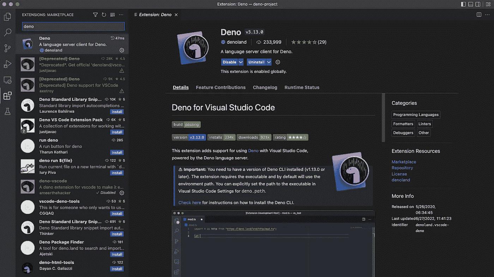

作者图片

在文件夹`my-project`中，我们执行`deno task start`。

在浏览器上，运行欢迎页面。它有一个徽标、一些欢迎文本和一个可以增加或减少数量的交互式组件。

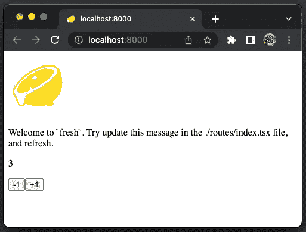

作者图片

# 顶级文件和目录

安装项目后，项目目录下会生成许多文件和目录。

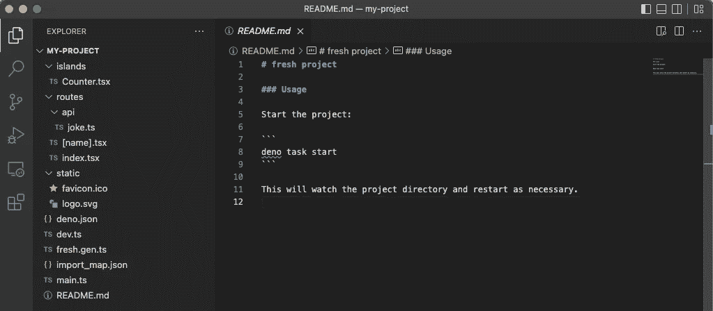

作者图片

顶层文件为`deno.json`、`dev.ts`、`main.ts`、`fresh.gen.ts`、`import_map.json`、`README.md`。

顶层目录是`routes`、`islands`和`static`。

## deno.json

`deno.json`是 Deno 的配置文件，配置一个启动任务和依赖关系的导入映射。

*   在第 2–4 行，`deno task start`被配置为运行`dev.ts`。`-A`允许所有权限，`—-watch`监视文件更改并自动重启进程。
*   在第 5 行，指定了`importMap`的位置。

以下是来自`deno run --help`的手表选项:

模块图被定义为一个简单的图，它被构建来覆盖来自根模块的所有依赖关系。这里的根模块是`dev.ts`。由于它的模块图不包括`static`和`routes`目录，我们需要显式地将它们添加到观察文件中。

## 开发人员

`dev.ts`是该项目的开发切入点。

*   在第 1 行，shebang 命令(`#!`)运行脚本`env`，以确定可执行文件(`deno`)的位置。选项`-S`将字符串`deno run -A --watch=static/,routes/`分割成多个参数，因此它使用适当的选项执行`deno`命令。用第 1 行执行`dev.ts`仅打印出以下信息:

```
Warning deno task is unstable and may drastically change in the future
Task start deno run -A --watch=static/,routes/ dev.ts
Watcher Process started.
Watcher Process finished. Restarting on file change...
```

*   在第 3 行，`dev`函数是从新鲜的`mod.ts`导入的，它在第 5 行被调用。`dev`函数有两个参数，基本 URL 和入口点。该函数基于`routes`和`islands`目录的内容创建一个清单文件`fresh.gen.ts`。

## 主页面

`main.ts`是项目的生产切入点。

*   在第 1–5 行，三斜线指令被定义为编译器指令。`/// <reference path="..." />`指令指示编译器在编译过程中包含额外的文件。
*   在第 9 行，它用生成的清单文件启动应用程序。如果需要，可以指定端口号，例如`await start(manifest, { port: 3000 });`

## 新鲜事物

`fresh.gen.ts`是自动生成的清单文件。结果基于`routes`和`islands`目录的内容。以下是现成环境的内容:

*   在第 5–8 行，它从`routes`和`islands`目录中的所有文件导入。
*   在第 10-20 行，它定义了由`routes`、`islands`和`baseUrl`组成的`manifest`对象。
*   在第 22 行，`manifest`被导出为`default`。

## import_map.json

管理项目的依赖关系。

*   在第 3 行，新的框架被导入。
*   在第 4–6 行，Preact 包被导入。

## 路线目录

`routes`目录包含项目中的所有路线。该文件夹中每个文件的名称对应于访问该页面的路径。这个文件夹中的代码永远不会直接发送到客户端。

## 岛屿目录

`islands`目录包含项目中所有的交互岛。每个文件的名称对应于该文件中定义的岛的名称。该文件夹中的代码可以从客户端和服务器运行。

## 静态目录

`static`目录包含按原样自动提供的静态文件。目前，有两个文件:

*   `favicon.ico`:浏览器标签和书签的新图标。
*   `logo.svg`:应用的新 logo。

# 路线

路由是一种机制，它决定通过哪条路由来处理给定的传入请求。新路由请求基于其 URL 路径。`routes`目录包含项目中的所有路线。每个文件的名称对应于访问该页面的 URL 路径。以下是将文件名映射到路由模式的规则:

*   文件扩展名被忽略。
*   文件路径中的文字被视为字符串文字进行匹配。
*   名为`<path>/index.<ext>`的文件与名为`<path>.<ext>`的文件行为相同。
*   通过用`[`和`]`包围一个标识符，路径段可以变成动态的。
*   最后一个路径段遵循结构`[...<ident>]`的路径被视为具有通配符后缀。

下面是一个示例表:

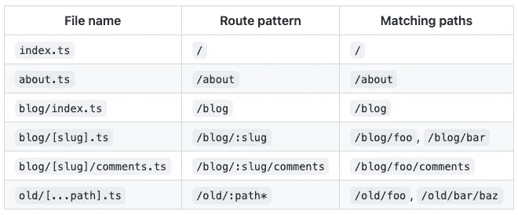

图片由新鲜文档，[https://fresh.deno.dev/docs/concepts/routing](https://fresh.deno.dev/docs/concepts/routing)

这些规则比 [React 路由器](/a-step-by-step-guide-on-react-router-6-8964c10af364#71a9-41181d1f934)简单多了。

让我们看看如何用现成的例子`index.tsx`、`[name].tsx`和`api/joke.ts`来应用规则。

## index.tsx

`index.tsx`是为路径`/`指定静态路由的页面组件。由`http://localhost:8000`访问的是索引页。

*   第 1–2 行是 Preact 特定的语法。第 1 行告诉 babel 为`JSX`使用`h`，这也可以在 babel 中全局配置[。`h()`函数将 JSX 转换成虚拟 DOM 元素。](https://babeljs.io/docs/en/babel-plugin-transform-react-jsx#usage)
*   在第 5–20 行，它定义了`Home`组件，这是一个典型的 React 代码，具有 Fresh 徽标(第 8–12 行)、欢迎文本(第 13–16 行)和`Counter`组件(第 17 行)。

以下是`http://localhost:8000`显示的页面:


作者图片

## [姓名]。tsx

`[name].tsx`是为路径`/:name`指定动态路由的页面组件。这是由`http://localhost:8000/:name`访问的页面。

*   第 1–2 行是 Preact 特定的语法。
*   在第 5–8 行，它定义了`Greet`组件，该组件读取路由参数以检索`props.params.name`，并显示动态 Hello 消息。添加第 6 行以显示`props`。

`PageProps`类型被定义为具有`url`、`route`、`params`和`data`。

在浏览器上，键入 URL 路径`http://localhost:8000/john`。`console.log`在执行控制台上显示页面属性:

```
{
  params: { name: "john" },
  url: URL {
    href: "http://localhost:8000/john",
    origin: "http://localhost:8000",
    protocol: "http:",
    username: "",
    password: "",
    host: "localhost:8000",
    hostname: "localhost",
    port: "8000",
    pathname: "/john",
    hash: "",
    search: ""
  },
  route: "/:name",
  data: undefined
}
```

以下是`http://localhost:8000/john`显示的页面:

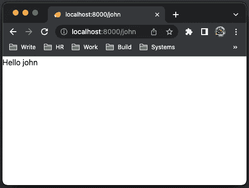

作者图片

## api/joke.ts

路由实际上由两部分组成:处理程序和页面组件。处理程序是形式为`Request => Response`或`Request => Promise<Response>`的函数，当向特定路由发出请求时会调用这些函数。

带有页面组件的路线是常规路线，如`index.tsx`和`[name].tsx`。只有处理程序的路由是 API 路由，比如`routes/api/joke.ts`。API 路线位于`routes/api`。

`routes/api/joke.ts`定义了以下处理程序:

*   在第 3-15 行，创建了一个包含 10 个笑话的数组。
*   在第 17–21 行，一个处理程序被定义为`JOKES`的随机行。

必须导出一个处理程序。它可以访问支持路由请求的`Request` ( `_req`)对象，并且必须返回一个`Response`对象。响应对象既可以手动创建，比如笑话字符串，也可以通过`_ctx`、`HandlerContext`呈现页面组件来创建。

以下是`http://localhost:8000/api/joke`显示的页面:

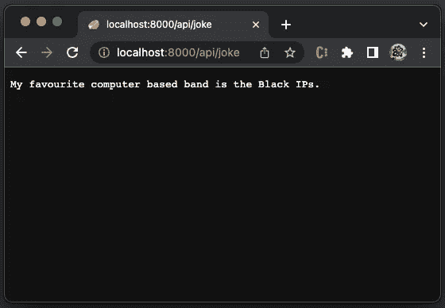

作者图片

## [姓名]。带处理程序的 tsx

由`http://localhost:8000/john`访问的`[name].tsx`没有定义自定义处理程序。它使用只呈现页面组件的默认处理程序。

我们可以用一个自定义处理程序来扩展它，以调用`api/joke`。

*   在第 5–15 行，为`GET`方法定义了一个处理程序。它调用 API 路由，`http://localhost:8000/api/joke`。
*   在第 8 行，`resp`显示在执行控制台上:

```
Response {
  body: ReadableStream { locked: false },
  bodyUsed: false,
  headers: Headers {
  "content-type": "text/plain;charset=UTF-8",
  date: "Sat, 23 Jul 2022 18:29:48 GMT",
  vary: "Accept-Encoding"
},
  ok: true,
  redirected: false,
  status: 200,
  statusText: "OK",
  url: "http://localhost:8000/api/joke"
}
```

*   在第 12 行，检索响应体，并由第 13 行的`_ctx.render(result)`呈现为`data`。
*   在第 17–25 行，它定义了`Greet`组件。
*   在第 18 行，`console.log`在执行控制台上显示页面属性:

```
{
  params: { name: "john" },
  url: URL {
    href: "http://localhost:8000/john",
    origin: "http://localhost:8000",
    protocol: "http:",
    username: "",
    password: "",
    host: "localhost:8000",
    hostname: "localhost",
    port: "8000",
    pathname: "/john",
    hash: "",
    search: ""
  },
  route: "/:name",
  data: "Why are assembly programmers often wet? They work below C level."
}
```

以下是`http://localhost:8000/john`显示的页面:

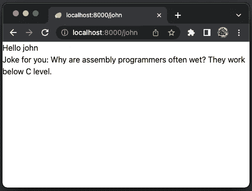

作者图片

以下是获取数据的技巧—渲染是同步的，获取数据是异步的。所有异步操作都应该加载到 route 的`handler`函数中，然后通过`_ctx.render()`的第一个参数传递给页面组件。传递给`_ctx.render()`的数据可以通过页面组件上的`props.data`字段进行访问。

# 岛屿

在 Fresh 中，孤岛支持客户端交互。它们是在客户端呈现的独立的 Preact 组件。这不同于通常在服务器上呈现的所有其他组件。

`islands`目录包含项目中所有的岛。每个文件的名称对应于岛组件的 pascal 大小写名称。这里是`islands/Counter.tsx`:

这看起来像是正常的行为代码吗？

简单来说就是用作`<Counter start={3} />`。

# 部署到生产环境

我们已经写了[一个创建生产就绪的 React 应用](https://javascript.plainenglish.io/a-hands-on-guide-for-creating-a-production-ready-react-app-864ad98e7497)的指南，它显然不简单。然而， [Deno Deploy](https://deno.com/deploy) 可以轻松地将生产应用部署为全球可用。

为了部署到 Deno Deploy，应用程序需要有一个 GitHub repo。存储库`[my-deno-fresh-project](https://github.com/JenniferFuBook/my-deno-fresh-project)`就是为此目的而创建的。

转到 [Deno Deploy 仪表板](https://dash.deno.com/projects)并创建一个新项目。

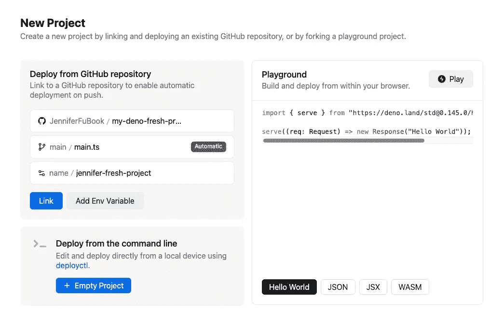

作者图片

新创建的项目在`https://jennifer-fresh-project.deno.dev/`可用。

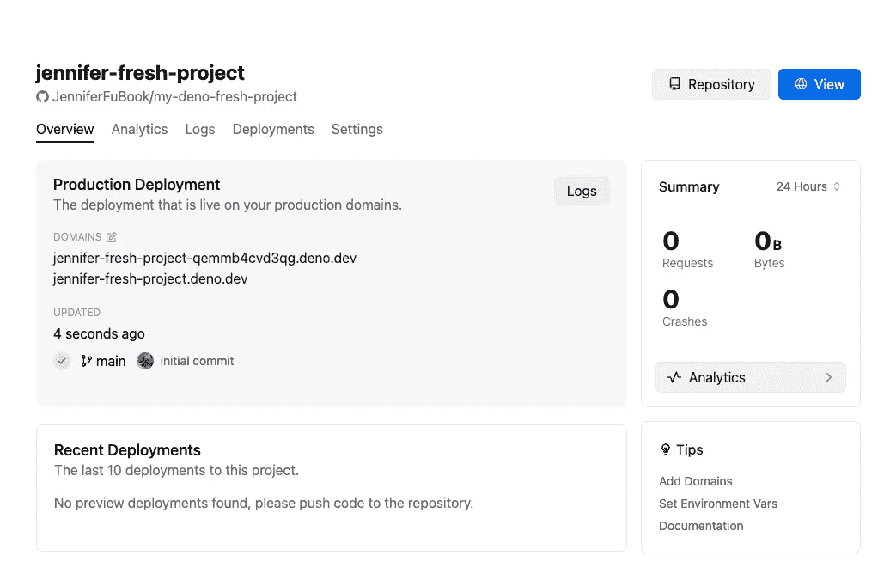

作者图片

去`[https://jennifer-fresh-project.deno.dev/](https://jennifer-fresh-project.deno.dev/)`，索引页很好用。

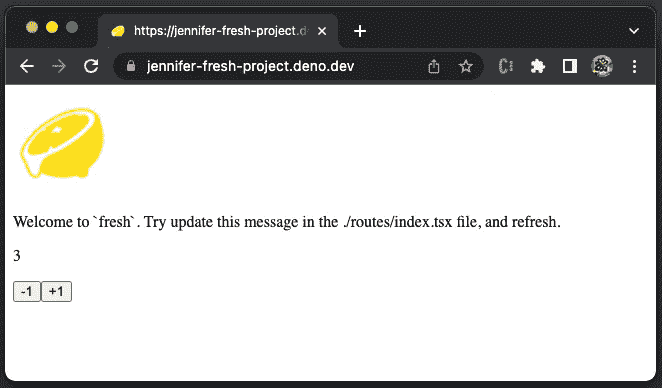

作者图片

转到`[https://jennifer-fresh-project.deno.dev/api/joke](https://jennifer-fresh-project.deno.dev/api/joke),`API 路线运行良好。

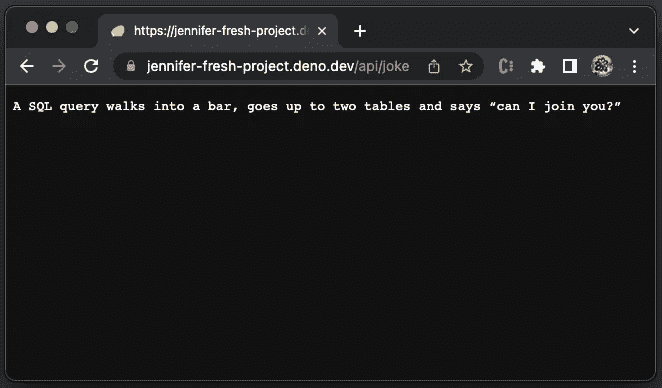

作者图片

转到`https://jennifer-fresh-project.deno.dev/john,`，它显示一个错误。

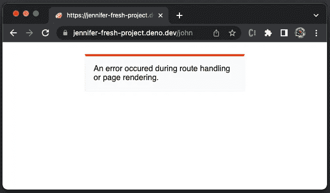

作者图片

发生了什么事？

转至`https://dash.deno.com/projects/jennifer-fresh-project/logs`，显示错误详情:

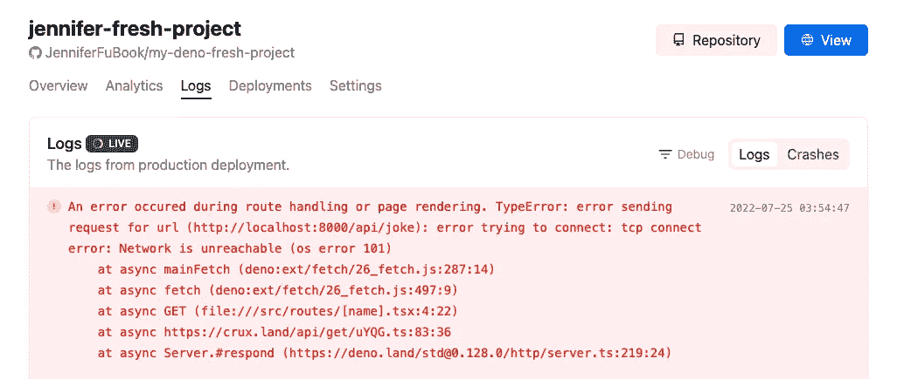

作者图片

很明显`http://localhost:8000/api/joke`不是为 API 服务的。在以下代码的第 9 行更改硬编码的 API 路径:

它适用于本地开发环境。

提交更改并将代码推送到 Github。

它仍然不工作，出现 508 错误:

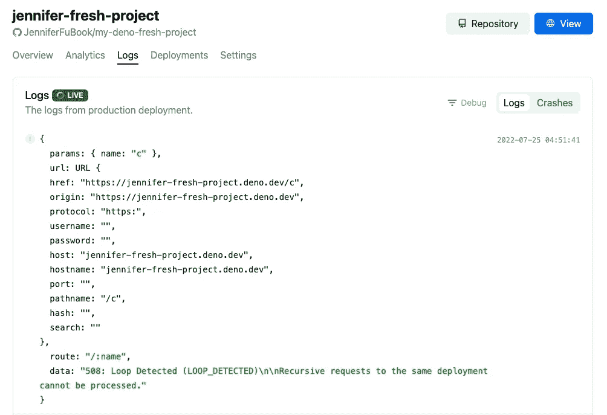

作者图片

这是一个现存的问题，下面是改编自[怀亚特·德根哈特](https://github.com/WittySmirk)的[解决方案](https://github.com/denoland/fresh/issues/398#issuecomment-1174075334)的工作代码:

它起作用了:

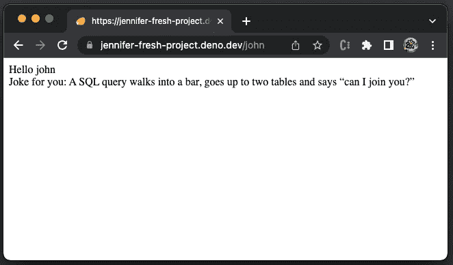

作者图片

以下是快乐日志:

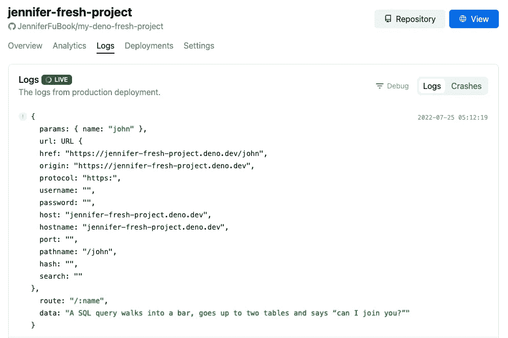

作者图片

问题已解决。不过 Fresh 应该可以走 API 路由的相对路径。新的可用框架仍然需要一些改进。

纵观全局，每次推送 Github 都会触发自动重新部署。这个功能非常方便。项目仪表板上的日志/崩溃内容有助于调试部署问题。

# 结论

Fresh 旨在创建高质量、高性能和个性化的 web 应用程序。这是一种为 Deno 编写的新型 web 框架。Fresh 基于 [islands 架构](https://jasonformat.com/islands-architecture/)并使用 Preact，Preact 通过一个小库实现快速虚拟 DOM。Preact 和 JSX 用于服务器和客户端的渲染和模板化。

Fresh 1.0 推出还不到一个月，但它展示了许多有前途的特性，以促进快速服务器端呈现、方便路由和易于部署的开发。

还有另一个 web 框架， [Astro](https://medium.com/p/5dadd98f8e39) ，你可能想看看。它还使用了岛屿架构。

感谢阅读。

```
**Want to Connect?**If you are interested, check out [my directory of web development articles](https://jenniferfubook.medium.com/jennifer-fus-web-development-publications-1a887e4454af).
```