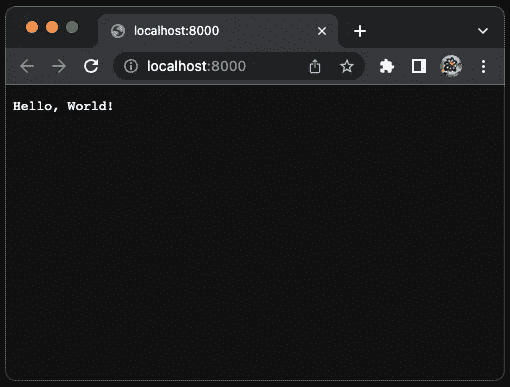
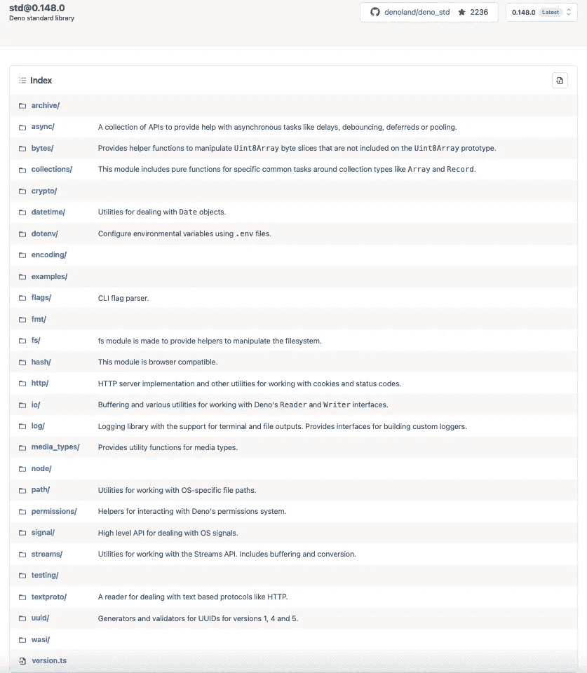
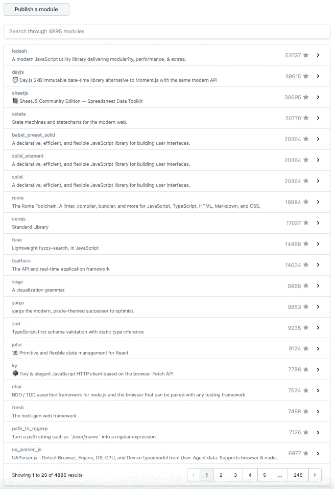

# Deno 综合指南 Node 的替代产品

> 原文：<https://betterprogramming.pub/the-comprehensive-guide-to-deno-an-alternative-to-node-ea0db4fdec77>

## JavaScript 和 TypeScript 的现代运行时


作者图片

## 什么是德诺？

[Deno](https://en.wikipedia.org/wiki/Deno_(software)) (读作`dee-no`)是基于 V8 JavaScript 引擎和 Rust 编程语言的 JavaScript、TypeScript 和 WebAssembly 的运行时。它有安全的默认值和良好的开发者体验。名字是 node 的变位词，也是 DEstroy NOde 的首字母缩写。

Deno 由 Ryan Dahl 创建，他是 [Node.js](/5-major-features-of-node-js-18-5f4a164cc9fc) 的原创者，专注于生产力。这是 Ryan Dahl 在 2018 年在 [JSConf EU](https://2018.jsconf.eu/) 的演讲[中宣布的关于 Node.js](https://www.youtube.com/watch?v=M3BM9TB-8yA) 我后悔的 10 件事。

根据[https://stackshare.io/deno](https://stackshare.io/deno)的统计，有 14 家公司在他们的技术堆栈中使用了 Deno，包括`cloudless`、`Appwrite`、`The Lonero Foundation`、`Development`和`Huel`。

以下是 Deno 功能列表:

*   [Deno 是一个单独的可执行文件](#2db0)。
*   [支持开箱打字稿](#eb72)。
*   [默认安全](#17cd)。
*   [没有集中的官方包管理器](#caac)。
*   [提供内置开发工具](#ca07)。
*   [支持现代网络平台标准和功能](#30be)。
*   [托管第三方模块](#c660)。

# Deno 是一个单独的可执行文件

Deno 可以在 macOS、Linux 和 Windows 上运行。Deno 是一个单一的二进制可执行文件，没有外部依赖性。它也被称为 Deno CLI。

在 macOS 上，我们可以用 brew 安装 Deno。

```
% brew install deno
```

与节点支持命令`node`、`npm`和`npx`不同，Deno 只有一个可执行文件`deno`。

以下是我们安装的 Deno 版本:

以下命令将现有 Deno 升级到最新版本。

```
% deno upgrade
```

或者，我们可以将其升级到特定版本，比如`1.0.0`。

```
% deno upgrade --version 1.0.0
```

以下是列出所有 Deno 命令的帮助手册:

# 支持现成的类型脚本

Deno 在运行代码时将 TypeScript 视为一级语言。我们可以直接运行或导入 TypeScript，无需安装除 Deno 可执行文件之外的任何东西。它让用户体验变得简单明了。

创建 Hello World 的类型脚本:

我们可以执行现成的类型脚本——无需设置`tsconfig.json`。

`deno info`显示缓存信息或源文件相关信息。

Deno 缓存在目录下，`$DENO_DIR`，其中包含以下文件和目录:

*   `$DENO_DIR/gen`:编译成 JavaScript 的文件缓存。
*   `$DENO_DIR/deps`:远程 URL 导入文件的缓存。
*   `$DENO_DIR/registries`:它是语言服务器的缓存，提供特定于语言的智能，并通过支持进程间通信的协议与开发工具通信，如自动完成、转到定义或悬停文档。
*   `$DENO_DIR/location_data`:本地存储的缓存。

在幕后，Deno 通过 TypeScript 编译器和名为 [swc](https://swc.rs/) 的 Rust 库的结合，将 TypeScript(包括 TSX 和 JSX)转换成 JavaScript。代码经过类型检查和转换后，将被存储在缓存中。除非代码被修改或者用`--reload`标志运行，否则缓存的代码已经为下一次运行做好了准备，无需再次转换。

`deno info hello-world.ts`显示本地文件，`hello-world.ts`，并发出文件信息。

执行`hello-world.ts`会在`$DENO_DIR/gen/file/Users/jenniferfu/denoStuff`下生成三个文件:

*   `hello-world.ts.js`:生成的 JavaScript 文件，带有源图。

*   `hello-world.ts.meta`:包含关于文件的元数据，包含管理缓存失效的源模块的散列。

*   `hello-world.ts.buildinfo`:TypeScript 编译器增量编译信息文件，有助于加快类型检查。下面是一个例子:

Deno 的内置 TypeScript 配置相当不错，但是可以针对编译器、格式化程序和 linter 进行定制。通常是 [JSON 格式](/exploring-json-json5-and-circular-references-2b5b0c5de532)，命名为`deno.json`或`deno.jsonc`。

配置文件可以放在当前工作目录或父目录之一中。也可以用标志`--config path/to/file.json`手动指定。

这里有一个`deno.json`的例子:

# 默认安全

Deno 是 JavaScript 和 TypeScript 的安全运行时。代码在沙盒中运行，用于环境访问、网络访问、文件系统读写访问、高分辨率时间测量、加载动态库和运行子进程。它要求用户明确指定允许的访问或全部允许。

`deno run —-help`列出所有允许选项:

让我们试试`hello-world2.ts`——Hello World 网页的应用服务器:

执行 Deno 命令，可以通过三种方式授予网络访问权限:

*   通过键入`y`交互允许:

*   `--allow-net:`的执行标志

*   `--allow-all:`的执行标志

Hello World 网页已启动并运行:



作者图片

# 没有集中的官方软件包管理器

Deno 可以从多个来源获取脚本，一个文件名、一个 URL 和从 stdin 读取文件的`-`。后者对于与其他应用程序的集成非常有用。

使用 URL 运行官方示例`welcome.ts`:

表示[https://deno.land/std/examples/welcome.ts](https://deno.land/std/examples/welcome.ts)的最新版本是`0.148.0`版本，已下载。该命令被执行并输出`Welcome to Deno`。

这里是网址上的`deno info`，`https://deno.land/std/examples/welcome.ts`。

文件下载后，直到最新版本增加或带`--reload`标志运行，才会再次下载。执行缓存的文件并输出消息。

这个`welcome.ts`文件是什么？我们可以使用以下命令调用`curl`下载文件并查看它:

什么是`std@0.148.0`？

Deno 有一个[标准库](https://github.com/denoland/deno_std)，里面包含了所有 Deno 项目都可以无畏使用的高质量代码的模块。每个模块都没有外部依赖性，它们由 Deno 核心团队审查。

标准库目前独立于 Deno 版本进行标记。一旦库稳定下来，这种情况就会改变。`std@0.148.0`是指`0.148.0`版本的标准库。这里是所有版本的列表。

`[https://deno.land/std@0.148.0](https://deno.land/std@0.148.0)`列出了`std@0.148.0`中的所有模块:



作者图片

# 提供内置的开发工具

Deno 提供了一套开发工具。它集成了 Visual Studio 代码和 JetBrains IDEs。它还有一组用于安装、格式化、编译、捆绑、lint、文档和测试的命令。让我们用例子来看看它们。

## 安装

`deno install`安装脚本作为可执行文件。

*   在 1 号线，安装了遥控器`welcome.ts`。
*   在第 4–5 行，它展示了如何在需要时将 Deno 可执行文件添加到`$PATH`中。
*   在第 7 行，调用可执行文件。

## 格式

`deno fmt`格式化源文件。

*   在第 1–2 行，它显示了一个格式错误的文件。
*   在第 4 行，执行`deno fmt`以格式化`formatExample.ts`。
*   在第 8–9 行，它显示了一个格式良好的文件。

## 编制

`deno compile`将脚本编译成可执行文件。

*   在第 1 行，`hello-world.ts`被编译成可执行文件，`hello-world`(第 4 行)。
*   在第 6 行，执行`hello-world`。

## 捆

在下面的例子中，我们创建了多个文件，其中`file3.ts`从`file1.ts`和`file2.ts`导入。`deno run`执行`file3.ts`输出一个方程式。

*   在第 1–2 行，它显示`file1.ts`。
*   在第 4–5 行，它显示`file2.ts`。
*   在第 7-10 行，显示了`file3.ts`，它使用了从`file1.ts`和`file2.ts`导入的变量。
*   在第 12 行，执行`file3.ts`。

`deno bundle`可以将模块和依赖项捆绑成一个文件。

*   在第 1 行，`files3.ts`被捆绑到`file.bundle.js`(第 4 行)。
*   在第 6–11 行，它显示了捆绑文件，其中导入的变量被替换为实际值(第 11 行)。
*   在第 13–14 行，执行捆绑文件等同于执行原始文件。

## 线头

`deno lint` lints 源文件。

*   在第 1-4 行，它显示`lintExample.ts`。
*   在第 6 行，在`lintExample.ts`运行`deno lint`。
*   在第 7–12 行，它显示了`no-var`违规。
*   在第 14–20 行，它显示了`no-explicit-any`违例。

## 文件

`deno doc`显示文档。

*   在第 1-10 行，它显示`documentExample.ts`。
*   在第 12–21 行，它显示了`deno doc`内容。
*   在第 23–87 行，它以`—-json`格式显示`deno doc`内容。

## 试验

`deno test`运行测试。

*   第 1-10 行显示`testExample.ts`，包括两个测试:`Equation Test 1`和`Equation Test 2`。
*   在第 12 行，在`testExample.ts`上运行`deno test`。
*   在第 14 行，显示`Equation Test 1`正常。
*   第 15 行显示`Equation Test 2`失效。
*   在第 17–26 行，它显示了`Equation Test 2`失败的原因。

# 支持现代网络平台标准和功能

当 Node.js 构建时，它缺乏一些现代 web 平台标准和功能，如 promises 和 async/await、 [ES 模块](/what-might-be-coming-in-npm-9-6985cf2678a6)和 TypeScript。Deno 是一个改进，因为它支持所有现代 web 平台标准和功能。

下面是`echo_server.ts`的出处:

*   在第 3 行，它使用 es 模块中的`import`，而不是`require`。
*   在第 11 行，承诺使用`await`。
*   代码本身是类型脚本。

在`echo_server`上运行`deno info`。它检查 ES 模块及其所有依赖项。

在第 2–9 行，它下载了七个依赖项。

在第 14–21 行，它显示了依赖层次结构。

我们使用一个 [byobu](/introduction-to-byobu-a-window-manager-and-terminal-multiplexer-d8ef0cc278d9) 分割窗口来执行代码。

作者提供的视频

在顶部窗口，我们执行`deno run — allow-net https://deno.land/std@0.148.0/examples/echo_server.ts`。

在底部窗口，我们执行`nc localhost 8080`来运行 [netcat](https://en.wikipedia.org/wiki/Netcat) (仅限 Linux/MacOS)，这是一个用于读写网络的计算机网络实用程序。每当键入 enter 时，当前消息都会在下一行出现。

# 托管第三方模块

Deno 为 Deno 脚本提供托管服务`[https://deno.land/x](https://deno.land/x)`。它缓存存储在 GitHub 上的开源模块，并在一个易于记忆的域中提供服务。

至此，共有 4895 个第三方模块。



作者图片

# 结论

Deno 相当新，目前发布的版本是`1.23.3`。Deno 是一个单独的可执行文件，它支持现成的 TypeScript。Deno 提供内置的开发工具，并支持现代 web 平台标准和功能。它没有集中的官方软件包管理器，同时托管许多第三方模块。

Deno 是一个单独的可执行文件，它支持现成的 TypeScript。Deno 提供内置的开发工具，并支持现代 web 平台标准和功能。它没有集中的官方软件包管理器，同时托管许多第三方模块。

一些框架是建立在 Deno 之上的，包括 [Fresh](https://github.com/denoland/fresh) ，它是为速度、可靠性和简单性而构建的下一代 web 框架。

在下一篇文章中，我们将深入探讨 Deno 的 Web 框架 Fresh。Deno Deploy 可以轻松地将生产应用程序部署为全球可访问。

感谢阅读。如果你有兴趣，可以看看[我的其他媒体文章](https://jenniferfubook.medium.com/jennifer-fus-web-development-publications-1a887e4454af)。