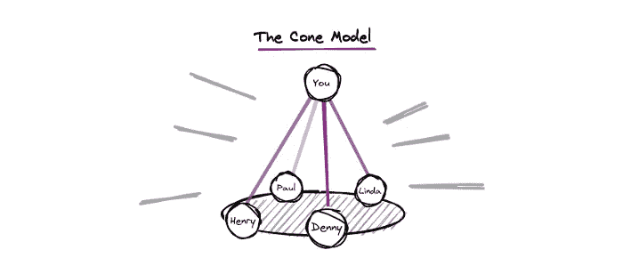
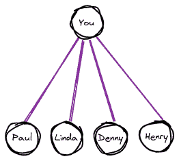
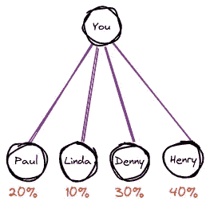
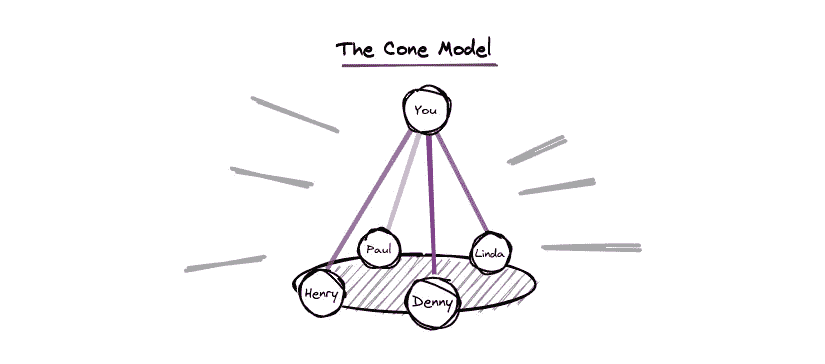
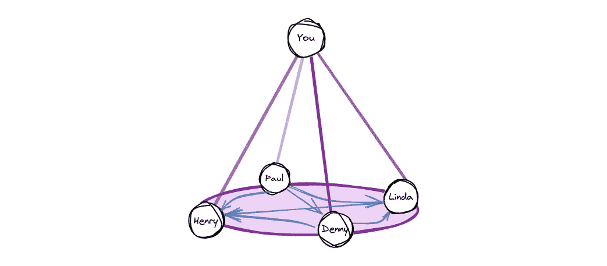

# 团队支持网络的圆锥模型

> 原文：<https://betterprogramming.pub/the-cone-model-for-teams-support-network-9b87659c8008>

## 为你的团队提供强大的支持，即使你不在

作者图片

作为经理，我们需要为我们的团队成员提供高水平的支持，从技术到情感。

这是一项艰苦的工作，需要双方的耐心和信任，一旦建立起来，将有助于你的团队快速成长。

# 三角形

经理和下属之间的“一对一”关系

有许多技术可以构建这种出色的支持级别。一对一很好，但是你可能已经注意到了，在“一对一”中有一种一对一的关系，这种关系可能是不够的，也是危险的。大多数经理都有不止一个直接下属，他们的注意力必须分散到每个人身上。有时，一些成员需要更多的关注，而其他成员的支持度很低。

你的团队支持网络看起来像一个三角形，每个人都依赖于你。每个人在特定的时间需要不同的注意力。

你的注意力必须合理分配。

这是很自然的，因为每个人都是独一无二的，可能有不同的技能水平。最重要的是，一些人可能会参与一个复杂的项目，而另一些人会有一个寒冷的一周。你可能会告诉自己，“这对我来说很自然”，你是对的。但这也会影响你的团队的成长速度，并可能很快失去控制。

# 什么会出错？(或者我为什么需要它)

让我们来看几个普遍的场景。使用圆锥模型可以避免这些问题。

## 1.忽视天赋

Linda(高级工程师)是你们团队中非常有才华的工程师。她一年前加入，并有高速增长，从那以后，你从未与琳达有任何挑战。她总是勇往直前，照顾自己的成长。很自然地，你开始把注意力从 Linda 转移到 Denny(初级工程师)身上，Denny 最近有点挣扎。琳达停止生长了。她开始觉得自己的成长步伐大幅下降，不明白为什么。几个月后，琳达宣布她接受了另一家公司的邀请。她想追求自己的成长。

你是否因为转移了注意力而犯了错误？ **没有**。丹尼需要更多的关注，而你的能力有限。错误在于你没有照顾到琳达的需要。

## 2.盲点

在过去的几个月里，球队表现得非常好。工作按时高质量完成。当你与另一位同事进行自发对话时，他们会提到 Henry(工程师)家里有问题，影响了他的注意力。你有点惊讶，你和 Henry 有过几次 1 对 1，但这个话题从来没有出现过。

*你会因为忽略这一点而成为一名糟糕的经理吗？* **否**。这可能是因为亨利是一个非常注重隐私的人，因此不会与大多数人分享他的个人问题。这可能是你自己能够抓住的东西。

## 3.超出你的能力范围

当你加入团队时，这是你第一次使用技术堆栈。你有很好的工程背景，了解技术原理和设计，但在对特定生态系统的深入讨论方面，你仍然落后。Denny(初级工程师)正在开发领域迈出他的第一步。他已经写了八个月的代码，需要很好的支持。你尽最大努力把他推向正确的方向，但却不能给他关于他的编码技能的非常准确的反馈。

你负责开发 Denny 的编码技能吗？ **是的。** *你能为他提供一切必要的支持吗？* **否**

那么你能做些什么来避免这些情况呢？经理如何提供如此全面的支持，而不至于分散到影响其他职责的程度？(执行、策略、招聘等。)

# 圆锥体

创建多对多支持网络

你应该最小化你的依赖性，最大化团队成员之间的关系网。不要让你的团队依赖你来成长，你应该在人与人之间建立联系，利用不同的优势和劣势。

## 确定需求

建立联系的一种方法是确定对直接下属的需求，并在 1on1 期间提出来。例如，亨利需要团队技术团队的指导。明确指出你不足以获得这方面的支持是很重要的，但 Linda 可能是一个完美的匹配。你与 Linda 交谈，让她知道你希望她花更多的时间与 Henry 在一起，并让她关注主要领域。

## 设定期望值

有时你不会意识到某个特定的需求。然而，你必须滋养这个网络。一个很好的方法是给你的团队设定期望值。在接下来的 1on1 中，让他们知道你希望他们观察特定的团队成员，甚至某个区域。“保罗(高级工程师)，我想请你注意琳达的系统设计。请务必查看它们”。

点击这里阅读更多关于[设定期望的魔力](/the-magic-of-setting-expectations-978ba7316df8)。

## 好的网络怎么看？

*   琳达支持亨利:在我们的技术堆栈中编码
*   **Paul 支持 Linda** :软件架构和系统设计
*   Paul 也支持 Denny :在我们的技术堆栈中编码
*   **丹尼支持亨利:**团队协作和沟通
*   还有**你支持大家:)**

内部支持网络

> 经理们应该建立强大的关系网，创造一个他们不是关键组成部分的环境。他们应该可以离开几个星期而不影响团队。

## PS。

对于经理的主管来说，锥形模型可能非常有效。

*谢谢，* [*康多莉扎*](https://medium.com/u/7425a9d975b6?source=post_page-----9b87659c8008--------------------------------)