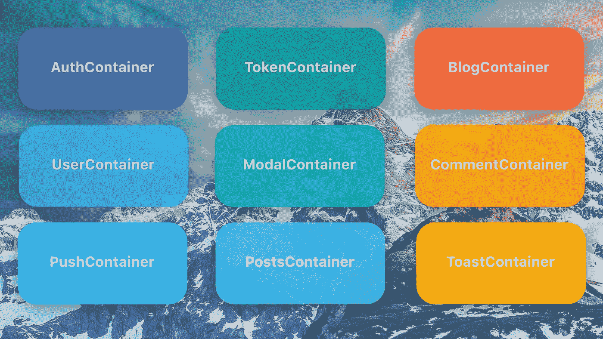
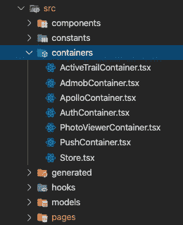
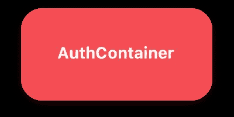
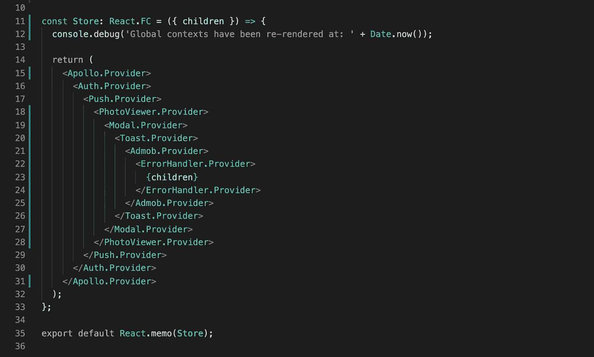

# 这里有一个更简单的替代 Redux 的方法

> 原文：<https://betterprogramming.pub/the-container-pattern-for-better-state-management-in-react-9351fe4381d1>

## 使用容器隐喻来提供一个最小的模块化微服务式的状态管理解决方案。



图片来源:作者

# 介绍

容器模式是在[未声明的下一个](https://www.npmjs.com/package/unstated-next)库中引入的概念。这种模式认为状态是持有全局应用程序状态的模块化部分的各种`Containers`。为了提供这种状态，您在应用程序中创建一个上下文，然后通过钩子访问它。

与 Redux 之类的东西相比，这个`Container`模式提供了一种以钩子为中心的方式来管理状态。它更容易学习，可以很好地与您的应用程序进行伸缩，并提供了一种直观的方式来考虑全局状态。它是这样工作的。

# 集装箱是什么样的？

容器模式是一种方法，在这种方法中，不是将所有的全局状态放在一个外部库或全局存储中，比如 Redux，而是将状态分成多个称为容器的块。这些块负责管理它们自己的状态，并且可以使用类似于下面的语法被拉入应用中的任何功能组件:

```
const {user} = Auth.useContainer();
```

这种模式工作得非常好，因为它将状态分成自我管理的块，而不是将所有的东西都交织在一起。每个组件都可以简单地获取它想要使用的状态块，并且只依赖于应用程序状态的一部分。

每个州块都很容易推理。它们只是一个连接到上下文提供者的定制钩子——仅此而已。术语“容器”实际上意味着“一个 React 定制钩子和一个上下文提供者”因此，当有人推荐使用 Hooks 和 useContext 进行状态管理时，他们在技术上是在推荐这种容器模式。

要使用容器，你只需要导入上下文并使用钩子。从技术上讲，你不需要任何外部库，但是我使用了一个名为[的库，因为它给了我一些好处，让这个模式变得更加简单。](https://www.npmjs.com/package/unstated-next)

# 什么是未声明的-下一个？

下一个是一个很小的库，帮助我们更容易地推理这些全局容器。这个库很小(只有 200 字节)，因为它基本上不做 React 的上下文 API 没有做的事情。

这个库对于这个设计模式来说是 100%可选的。它只是提供了一些小的 API 改进，使得上下文更容易使用。一些主要的好处包括:

*   **类型检查:**这为您提供了现成的类型脚本支持。这是我对使用 React Context API 的不满之一，所以很高兴看到 unstated-next 解决了这个问题。
*   **错误处理:**如果您试图访问一个在 React DOM 树中没有上下文提供者的容器，它将抛出一个错误。这是调试的救命稻草。
*   **更容易思考:**考虑上下文有时看起来很抽象，但是使用这个库和“容器”的概念要容易得多。

# 这个图案是什么样子的？



## 文件结构

当我使用这种模式时，我将所有的容器放在 src 目录根目录下的“container”文件夹中。我用单词“container”作为每个容器的后缀，并将所有相关代码放在一个文件中。

这已经比 Redux 更有优势，在 Redux 中，一个单独的职责可能被分成三个或四个文件，分别负责动作、reducer、store、选择器等。



## 容器文件

容器是您的状态片段将存在的地方。这个文件包含了读写这部分状态所需的一切。下面是一个`AuthContainer`的容器文件的样子:

```
// The reducer. This would be very similar to your reducer in Redux.
// This is optional, you can just use useState instead, but this is
// here to show that if you want to use a reducer and do more
// complicated state transitions you can.
function authReducer(state: AuthState, action: Action) {
   ...
}// Custom Hook
function useAuth(initialState: AuthState) {
   const [state, dispatch] = useReducer(authReducer, initialState);const loginWithGoogle = () => {
      dispatch(loggingIn());
      doGoogleLogin()
         .then(user => dispatch(success(user)))
         .catch(err => dispatch(error(err.message)));
   }const loginWithEmailPassword = (email, password) => {
      dispatch(loggingIn());
      doEmailPasswordLogin(email, password)
         .then(user => dispatch(success(user)))
         .catch(err => dispatch(error(err.message)));
   }const logout = () => dispatch(logout());return { 
      user: state.data,
      isAuthenticating: state.loading,
      error: state.error,
      loginWithGoogle,
      loginWithEmailPassword,
      logout
   };
}// Create the Container (this can be a Context too)
// You just pass in the custom hook that you want to build the
// container for.
export const Auth = createContainer(useAuth);
```

这真的很干净——它基本上只是一个定制的钩子，然后在底部有一条线，使它成为一个容器。当您在底部添加容器代码时，它会使这个定制钩子具有相同的状态，即使在多个不同的组件中使用。这是因为`Unstated-Next`容器只是在幕后使用了`Context` API。

为了完成这项工作，你首先需要在你的应用程序中添加一个`Store`来存储所有的容器。这可能看起来像这样:



***注:*** *我觉得还有更好的方式来管理这样一个* `*Store*` *。如果我们可以基于一组容器或者类似的东西动态地创建这种结构，我想那会干净得多。*

此外，如果有一种方法可以让所有这些加载到 DOM 的同一个级别，这样任何容器都可以访问任何其他容器，那也将是令人惊奇的。遗憾的是，我认为这是 React 的局限性。

将它放在根组件中，这样根组件看起来就像这样:

```
const App: React.FC = () => {
   return (
      <Store>
         <ReactRouter>
            <AppRoutes>
         </ReactRouter>
      </Store>
   );
}
```

然后*瞧*！如果你做的正确，你现在应该能够进入你的任何 React 组件，并且像这样使用这个钩子:

```
const LoginPage: React.FC = () => { ... const {
      formLogin, 
      googleLogin, 
      isAuthenticating,
      user
   } = Auth.useContainer(); useEffect(() => {
      if (user) {
         history.push('/home');
      }
   }, [user]); ... return (
      <div>
         <button onClick={() => googleLogin()}>
            Login with Google
         </button> ... </div>
   );
}
```

如果你做的每件事都是正确的，遵循这个模式应该是可行的！如果您做错了什么，`Unstated-Next`可能会抛出一个错误，指出容器的提供者尚未创建。但这很好，因为这是一个显式的错误消息，如果您使用基本的 React 上下文，将很难跟踪这个错误！

# 为什么不用 Redux？

Redux 非常适合大规模的状态管理。这是管理大型应用程序状态的可靠方法。然而，对于绝大多数应用程序来说，Redux 是一个错误的起点。这是非常的样板文件，可能不会给你带来很多好处，除非你已经知道你需要它。

所以我提供这种模式作为替代。

您从这种模式中获得的主要好处是，从开发人员的角度来看，它更有意义。Redux 获取您的状态并将其从视图层中分离出来。我认为管理状态的更好方法是将它与使用它的视图层放在一起。

*这就是 React 钩子存在的原因。*

您已经可以看到，随着状态的其他部分从 Redux 之类的东西转移到 hooks 中，事情正在朝着这种方法发展:

*   **本地状态** = >使用状态/使用用户
*   **API 状态**=>[React-Query](https://github.com/tannerlinsley/react-query)/[useSWR](https://github.com/vercel/swr)/[Apollo](https://www.apollographql.com/docs/react/)
*   **表单状态** = > [反应钩子表单](https://react-hook-form.com/)

因此，构建全球状态来很好地适应钩子生态系统是有意义的。

*我的大部分状态管理都是由各种钩子库完成的，所以我的全局状态管理也应该是以钩子为中心的。*

容器模式实现了这个想法。它以很少的时间成本提供了 Redux 的大部分功能，并且设计时考虑了以钩子为中心的开发。

对于任何中小型项目，这种模式对我来说都是显而易见的。对于一个更大的项目，这取决于用例。

以下是容器模式和 Redux 之间的一些比较:

## 容器模式有以下优点:

*   比 Redux 之类的东西更简单。
*   在幕后使用本机上下文 API。
*   知道`useState`、`useContext`和自定义钩子的话 10 分钟就能学会 API。
*   只使用了一个很小的库，甚至这种依赖也是可选的。

## 它也有以下缺点:

*   不支持中间件。
*   没有类似 Redux chrome 调试器的工具。
*   如果容器之间存在依赖关系，那么它们必须按照一定的顺序提供。

考虑到这一点，如果您的用例不需要像 Redux 这样庞大的东西，那么您现在有了一个更好的想法。

如果你想采用这种模式，但又不能完全离开 Redux，另一个选择是使用 [Redux 工具包](https://redux-toolkit.js.org/)和 [Redux 鸭子模式](https://medium.com/@matthew.holman/what-is-redux-ducks-46bcb1ad04b7)。


Redux 鸭子

如果您正在构建一个大型应用程序，这种 Redux Ducks 方法非常有效，因为它使用了一种以容器为中心的方法，但仍然让您处于 Redux 的生态系统中。

# 结论

这就是`Container`模式。如果你想在应用程序中使用 Redux，我会认真考虑这样做的成本，以确定你的应用程序是否真的需要它。不管怎样，我认为这种模式是一个很好的起点，因为它很小而且模块化，所以将来可以很容易地将其移植到 Redux 中。

总的来说，这个模式帮我清理了很多代码。它还帮助我在开发应用程序时将状态管理从我的痛点列表中移除。

让我知道你的想法——希望它能在你的项目中发挥作用。尽情享受吧！