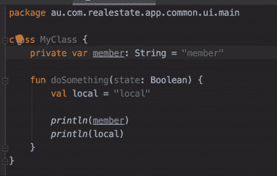

# 编码中花括号的故事

> 原文：<https://betterprogramming.pub/the-curly-story-of-coding-49a348a31cf2>

## 它从哪里来，怎么样，会持续吗？


照片由 [Clément H](https://unsplash.com/@clemhlrdt?utm_source=medium&utm_medium=referral) 在 [Unsplash](https://unsplash.com?utm_source=medium&utm_medium=referral) 上拍摄

如果你看看我们今天的编程语言，你会发现编程语言中使用了这个奇妙的符号`{`和`}`。

这是为了什么？简单，就是告诉编译器(或者解释器)代码块的开始和结束。当然，你可以在一个块中包含多个块。

```
// A very simple example from C#
public class MyClass
{
    public void myFunction(bool isToPrint)
    {
        if (isToPrint) 
        {
            Console.WriteLine("Hello, world!");
        }
    }
}
```

有没有想过这是怎么发生的？我们应该把它放在哪里？未来的趋势是什么？

# 一直都有吗？

不。当计算机第一次被发明的时候，编程语言和我们今天使用的是如此的不同。迈克尔·麦克米兰的一个优秀的媒体博客写下了它的全部历史。

[](https://medium.com/better-programming/a-brief-history-of-the-curly-brace-in-programming-5b3eacdc3f7a) [## 编程中花括号的简史

### 我们每天都在使用它们，但是代码中的花括号是从哪里来的呢？

medium.com](https://medium.com/better-programming/a-brief-history-of-the-curly-brace-in-programming-5b3eacdc3f7a) 

我只是在下面总结一下(感谢迈克尔·麦克米兰

## 在算法 58 的日子里(1958 年)

在那个年代，块的概念被带到了编程中，这是编程界的一大进步。它是通过 ALGO58 语言引入的。

```
if x > -1 then
     begin
          if x ≠ 0 then
          x := 1/x
     end;
```

如你所见，它使用了`begin`和`end`。清晰可见。任何读了它的人都明白，不用想`{`和`}` 是什么。

## 在 C 语言之父 BPCL 的时代(大约 10 年后)

`begin`和`end`很好。但是为了使编码更容易和更有效，引入了一个更短的方法，即`$(`和`$)`。

```
IF A < B
     $( LET T = A
          A := B; B := T
     $)
```

很好，我们不再需要打字了。但这并没有持续太久。

## c 语言(BPCL 之后大约一年)

B 语言的寿命很短，在 1968-1969 年间被 C 语言完全取代。发生了一些语法变化，其中之一是将`$(`和`$)`替换为`{`和`}`。

```
if (isToPrint == true) 
{
    print("Hello, world!");
}
```

此后，`{`和`}`被 C 语言的衍生语言广泛使用，如 C++、C#等。

# 今天天气如何？

我会说它做得很好。大多数编程语言仍然使用`{`和`}`来表示一段代码，可能是基本结构如`if-else`，或者是函数作用域，或者是类作用域等。这包括 C#、C++、Java 等语言，也包括新千年引入的语言，如 Scala、Kotlin、Swift 等。

然而，对于我们应该把`{`的起点放在哪里，编码社区中有很大的意见分歧。Jeremy Bytes 解释了三个阵营

[](https://jeremybytes.blogspot.com/2013/04/where-do-curly-braces-belong.html) [## 花括号属于哪里？

### 上周末，在我的一次会议上出现了一个问题(干净代码:杀人狂魔也读代码):你把…

jeremybytes.blogspot.com](https://jeremybytes.blogspot.com/2013/04/where-do-curly-braces-belong.html) 

## 阵营 1:我们应该总是把它放在下一行

这遵循了`begin`和`end`时代的惯例。

```
public void myFunction(bool isToPrint)
{
    if (isToPrint) 
    {
        Console.WriteLine("Hello, world!");
    }
}
```

原因很简单，容易辨认，看起来更整洁。即使在打印纸上，也能看得很清楚。C，C++时代，这是著名的风格，现在用 C#，这是风格。

## 阵营 2:我们应该总是把它放在起跑线的同一条线上

随着编程语言的进步，`{`不再需要在下一行。它可以在块开始的同一行，节省一些行空间。

```
public void myFunction(bool isToPrint) {
    if (isToPrint) {
        Console.WriteLine("Hello, world!");
    }
}
```

它看起来更紧凑，尽管不如 Camp 1 整洁。这是在 Java 时代引入的，并从那时开始流行起来。

## 阵营 3:要看是结构块还是功能块等。

这是两个阵营 1 和 2 的混合，对于函数和类块，它应该在下一行。但如果结构块(如`if-else`或`for-loop`等)，那么它应该在同一行。

```
public void myFunction(bool isToPrint) 
{
    if (isToPrint) {
        Console.WriteLine("Hello, world!");
    }
}
```

阵营 3 是最不受欢迎的，因为它不一致。

# 接下来会发生什么？

在某一点上，阵营 1 和阵营 2 之间就谁的做法正确存在激烈的争论。两个阵营似乎都能从逻辑上证明他们的观点。整洁还是紧凑？哪个会赢？

## 语言接受方法

根据最新的趋势和在线参考，我发现唯一坚持阵营 1 的语言是 C#，正如他们在其 [C#编码指南](https://docs.microsoft.com/en-us/dotnet/csharp/programming-guide/inside-a-program/coding-conventions)中所述。

介绍`{`和的源语言。`}`，也就是 [Gnome C 编码标准](https://developer.gnome.org/programming-guidelines/stable/c-coding-style.html.en)和 [C++编码指南](https://isocpp.org/wiki/faq/coding-standards)，正呈现出一种张贴混乱的混合风格。然而，自 Java 以来开发的语言都提倡 Camp 2 风格，例如 [Java 编码指南](https://docs.oracle.com/javase/tutorial/java/javaOO/methods.html)、 [Scala 编码指南](https://docs.scala-lang.org/tour/basics.html)、 [Swift 编码指南](https://docs.swift.org/swift-book/LanguageGuide/Functions.html)、 [Kotlin 编码指南](https://kotlinlang.org/docs/tutorials/kotlin-for-py/functions.html)等等(Go、R、Rust、JavaScript、Dart)

通过观察采用 Camp 2 方法的新语言，尽管 C 和 C++并没有表现出一致的偏好，但这表明 Camp 2 可能是向前发展的主要趋势。

## 该工具提高了可读性

虽然许多纯粹主义者仍然坚持认为代码应该写在纯文本编辑器上仍然可读的地方(或打印在纸上)，但不可否认的是，IDE 等工具的进步改变了我们编码的方式。

工具使得代码简洁而紧凑。即阵营 1 和阵营 2 的两个世界的最好的，例如，仅仅折叠功能或类`{` `}`的能力使它整洁，并且不再担心找到块的开始和结束在哪里。



图片由作者提供。

这有助于消除远离 Camp 2 方法的缺点，并进一步提高代码的紧凑性。

看起来 2 号阵营的明显趋势会更加突出。

# 会持续多久？

尽管在 1 号或 2 号营地，`{`和`}`仍然被很好地保存下来，作为表示街区开始和结束的字符。

然而，有一些迹象表明编程语言开始远离`{`和`}`的使用。

## 不需要在一行中使用`{`和【if-else

让我们看一下 [C 语言编码指南](https://developer.gnome.org/programming-guidelines/stable/c-coding-style.html.en)，它陈述如下:

> 大括号不应用于单个语句块

```
if (condition)
	single_statement ();
else
	another_single_statement (arg1);
```

再来看 Java，它有三进制运算，如下，它代替了一个简单的`if-else`:

```
**// Normal**
if (booleanCondition) {
    doThisIfTrue();
} else {
    doThisIfFalse();
}**// Ternary**
booleanCondition? doThisIfTrue() : doThisIfFalse();
```

让我们看看 Kotlin，它有一个 Elvis 运算符，可以帮助简化空值检查:

```
**// Normal**
if (myObject != null) {
    myObject.doSomethingWithObject()
} else {
    doSomethingElse()
}**// Elvis Expression**
myObject?.doSomethingWithObject ?: doSomethingElse()
```

## 函数式编程范式

在过去的几十年里，编程范式已经从过程化转向面向对象，再转向函数式编程。

[](https://levelup.gitconnected.com/why-code-evolve-from-procedural-to-object-oriented-to-functional-programming-13a88292307e) [## 为什么代码从过程化到面向对象再到函数式编程

### 通过实际的代码示例学习不同风格的编程范式

levelup.gitconnected.com](https://levelup.gitconnected.com/why-code-evolve-from-procedural-to-object-oriented-to-functional-programming-13a88292307e) 

在函数式编程中，它鼓励人们在工作中使用函数，而不是强制执行任务。一个简单的例子就是`for-loop`。(科特林的例子)

```
**// 1\. Imperative approach**
for (it in 1..100) {
    *print*(i)
}**// 2\. Simple functional approach**
(1..100).forEach { it -> print(it) }**// 3\. Concise functional approach**
(1..100).forEach(::print)
```

你注意到在最后一个例子中，它显示了`{`和`}`的消失

## 没有卷的语言

有几种新语言尝试不使用，例如 Shell 脚本结构代码块，不使用 curly。尽管这个函数仍然使用曲线。

```
if [ expression ] 
then 
   statement1
   statement2
else 
   statement3 
fi
```

例如 Python，使用缩进级别来反映代码块的开始和结束。

```
def tri_recursion(k):
  if(k > 0):
    result = k + tri_recursion(k - 1)
    print(result)
  else:
    result = 0
  return result
```

然而，编程社区长期以来一直被`{`和`}`所困扰，还没有准备好接受一个没有它们的版本。

尽管如此，我们看到程序员群体的趋势正朝着简洁编码的方向发展。在工具和技术的帮助下，程序员越来越接受不那么冗长的代码。

[](https://medium.com/swlh/the-7-coding-styles-that-are-dated-90eff1408d6e) [## 7 种过时的编码风格

### 我曾是他们的坚定信徒，但现在我改变了看法

medium.com](https://medium.com/swlh/the-7-coding-styles-that-are-dated-90eff1408d6e) 

有一天`{`和`}`不再被用来定义代码块的可能性可能会成为现实，尽管我认为这需要一段时间。