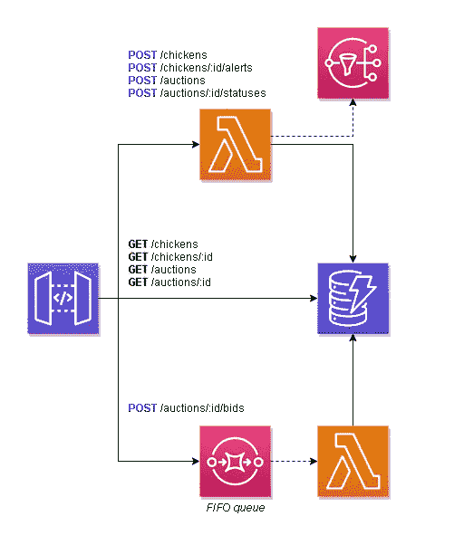
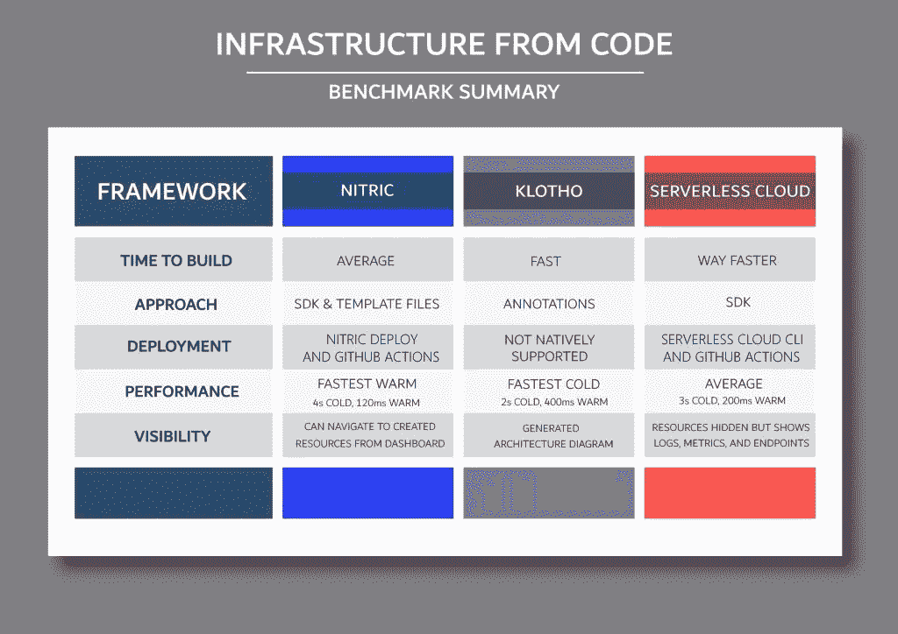

# 从代码看基础设施的当前状态

> 原文：<https://betterprogramming.pub/the-current-state-of-infrastructure-from-code-cbd3469ecdc5>

## 我测试了代码框架的三个基础设施，得到了截然不同的体验。这是我的发现。

免费视频上由[rawpixel.com](https://www.freepik.com/free-vector/business-performance-analysis-with-graphs_3425213.htm#query=investigate&position=37&from_view=search&track=sph)拍摄的图片

这篇文章已经等了很久了。

回到九月份，我取笑了一下[我对 Code (IfC)](/my-first-impressions-of-infrastructure-as-code-13c44bdc7743) 基础设施的第一印象。大约在那时，我开始了一项实验。我想看看人们是如何从代码问题中接近*基础设施的。*

从代码构建基础设施是构建云架构的一种相对较新的方式。一个框架会把你的代码转化为云资源。这省略了无服务器开发(或一般的云开发)的声明性部分，这最终会让您进展得更快。专注于你的业务逻辑，而不是构建 SAM 模板或 CDK 构造，确实让你专注于真正解决你的业务问题。

在云中构建时做出基础设施决策是一个有趣的想法，但不是每个人都会欣赏。有些人会竭尽全力来控制他们周围的环境。但是正如杰瑞米·戴利所说，控制是一种幻觉。控制基础设施的愿望实际上可以归结为优化(通常)的愿望。将来，[那可能也会为我们处理](/the-future-of-serverless-1c945a75f4be)！

暂且把未来放在一边，我想谈谈现在可以得到的东西。让我们来看看您现在可以探索什么，开始让您的基础架构得到管理。

# 实验

作为实验，我构建了四次相同的 API。一次是以我通常的方式作为控制——通过 SAM 模板，与三个不同的 IfC 供应商合作。我使用的供应商有:

*   [硝酸](https://nitric.io/)
*   [克洛索](https://klo.dev/)
*   [无服务器云](https://www.serverless.com/cloud)

在这个空间中还有其他我没有评估的，如[安可](https://encore.dev/)、[穿梭](https://www.shuttle.rs/)、[莫代尔](https://modal.com/)和[黑暗](https://darklang.com/)。由于时间关系，没有对这些进行评估。如果你对 IfC 感兴趣，我鼓励你看看其他的。

为了比较这些框架，我在开发过程的生命周期中的几个方面对它们进行了评估。评估领域包括:

*   **构建时间** —我能以多快的速度启动并运行一些东西
*   **方法** —用于从代码中抽象或推断基础设施的方法是什么
*   **部署**——把我写的东西放到云中有多容易
*   **性能**—API 延迟是否在可接受的阈值内
*   **可见性** —我能在多大程度上看到、改变或管理生成的基础架构

我的意图不是宣布一个“赢家”，而是探索不同的方法和基础设施管理技术，以构建一个未来的想法。

# API

有趣的是，评估将为鸡肉拍卖构建一个 API。它有添加、更新和查看鸡和拍卖的端点。当一只鸡被拍卖时，用户可以订阅对它的更新，然后他们可以在拍卖直播时对这只鸡出价。要查看 SAM 模板中构建的体系结构，请参考下图。你也可以[在这里](https://itchy-swan-43.redoc.ly/)查看 API 文档。

我的目标是，当我尝试在 Nitric、Klotho 和无服务器云的每个框架中构建这个 API 时，看看它们会做些什么。这些实现中的每一个都将用 JavaScript 编写。

你可以在这里查看 [GitHub 库。](https://github.com/allenheltondev/infrastructure-from-code-benchmark)

# 评估

## 是时候建造了

建造时间就是我能从一无所有到在空中拍卖一只功能鸡的速度。这与文档、工具、快速启动以及是否有本地测试选项有关。我越快得到真实的东西，我就能越快开始迭代我的设计。

**硝酸**——在这个实验之前，我的机器上没有任何“通用部署”工具。我必须创建一个帐户并安装[普鲁米](https://www.pulumi.com/)，安装[勺](https://scoop-docs.vercel.app/)，下载并安装[硝酸 CLI](https://nitric.io/docs/installation) ，并确保我有 Docker 启动并运行。一旦安装了所有的先决条件，我就可以开始了——这是一个非常好的体验。当您运行`nitric new`命令时，Nitric 会自动引导您的应用程序。它设置了脚手架，并且可以立即在本地使用 Docker 运行。

然而，如何构建我的 API 并不是很直观。Nitric 希望你将计算代码放在一个 *functions* 文件夹中，但是我不清楚 API 是如何注册的，以及如何到达端点。[文档](https://nitric.io/docs/getting-started)把事情解释的很好，但是感觉有一些我不明白的魔法。开发者不喜欢魔术。总的来说，尽管在本地测试速度很快，但启动时感觉舒适还是有点困难。

**Klotho**——我立刻和 Klotho 撞上了减速带。我在 Windows 机器上运行(我知道，我知道)，很快发现 Klotho 对它有未经测试的支持。我下载了可执行文件，并试图运行它，但没有运气。所以我决定不使用可执行文件，按照他们网站上的[快速入门指南](https://klo.dev/docs/tutorials/your_first_klotho_app)进行操作。幸运的是，我已经安装了 Pulumi，这是我在硝酸试验中安装的，节省了我的时间。

Klotho 建议将你的应用构建成一个 [express app](https://expressjs.com/) 并在构建完成后快速插入框架。所以我采用了这种方法，在不到一个小时的时间里运行了一个 express 应用程序。我可以用一个简单的`node index.js`命令在本地运行这个应用程序，并随时进行测试。总的来说，非常容易构建，对于我这个 JavaScript 开发人员来说也很熟悉。

**无服务器云**——这对我来说是一次异想天开的经历。这是我构建的最后一个框架，也是最简单的。作为一名 JavaScript 开发人员，当我所要做的就是通过 npm 全局安装 *@serverless/cloud* 并输入`npm init cloud`时，我有点头晕。他们的[云外壳](https://www.serverless.com/cloud/docs/get-started#start-from-cli)接管了我的终端，并指导我完成引导我的应用程序的所有步骤。

模板完成后，我可以通过在我的终端上运行`cloud start`命令来测试它，并且实际上是在云中测试它！这个框架感觉就像我在构建一个 express 应用程序，这是很自然的，并且导致了更快的构建时间。总的来说，这是非常好的开发体验。

总结:总的来说没有什么不好。这三家公司在入门文档方面做得非常好。工具是我的优势。我也喜欢 Klotho 的心态*先构建，后装备*。这对于想要迁移到云原生架构的现有应用程序来说非常好。在我完成部署工具的初始安装后，一切都运行得相当顺利。

## 方法

这个类别识别并指出每个框架满足 IfC 问题领域的方法。解决问题的方法没有对错之分，但看到做出的决定和不同的思想流派是很有趣的。

**Nitric** —该框架使用 SDK 和配置 yaml 文件进行设置。SDK 抽象了云概念，如 API、数据库、队列和事件，允许您使用它们的版本进行构建。这使他们能够跨云供应商部署您的代码。配置文件告诉 Nitric 使用哪个云供应商和地区，以及像函数处理程序这样的配置细节。

我不太喜欢的是他们的模板增加了一个[“功能”文件夹](https://github.com/allenheltondev/infrastructure-from-code-benchmark/tree/main/nitric/functions)。对我来说，这给了我一个心智模型，我正在编写 Lambda 函数，并以我将通过 [SAM 模板](https://github.com/allenheltondev/infrastructure-from-code-benchmark/tree/main/SAM)的方式构建代码。这违背了国际金融公司的宗旨。应该被框架抽象出来。*注意——我后来知道这个文件夹的结构可以根据你的喜好来改变。我不必保留默认配置。*

**Klotho**——这是一种非常独特的国际金融公司方式。这里的思路是创建一个 web 服务并[注释基础设施的关键部分](https://klo.dev/docs/api/concepts)，比如 API、数据库和事件。注释告诉 Klotho 在生成 Pulumi 模板时如何处理存储库中的资源。对于现有的应用程序来说，这是一个很低的门槛，因为重构不是必需的。在关键基础设施上添加注释，您的资源将被自动创建。

运行 Klotho 后，结果是一个编译的 Pulumi 模板和一个可编辑的 Klotho 模板。Klotho 模板是一个配置文件，告诉 Klotho 框架如何解释代码中的注释。对于新注释，它使用默认配置。对于现有的注释，它使用映射到代码的已定义资源。这个模板文件允许您覆盖框架做出的任何基础设施决策，这将更多的控制权交还给开发人员。这是好事吗？也许对某些人来说。

**无服务器云** —最简单的方法，这个框架使用无服务器 SDK。没有模板或配置文件，只有抽象出数据库和 API 的 SDK。SDK 和 Nitric 有相似的感觉，但是更加抽象。

可以看出，这个框架的数据抽象已经考虑了很多。它为数据提供了单表设计的感觉，还提供了数据更改事件。它降低了开发过程的复杂性。

**总结** —这里有多种方法。Nitric 和无服务器云提供了一个 SDK 来编写代码，这些代码提供了核心云概念的高级抽象。另一方面，Klotho 提供了一种非侵入性的编码方式，允许您通过注释将现有的应用程序放入云中。这两种方法都很简单，大大降低了开发人员的复杂性。

需要注意的一点是，Nitric 和 Klotho 允许你构建尽可能多的不同资源。我能够清楚地创建一个`chickens`和一个`auctions` API。但是有了无服务器云提供的抽象，我不需要管理单独的资源，比如大量的 API 或数据库表。无服务器云的*全有或全无*方法决定了您的全部云资源，而其他云的*方法则是挑选*方法。这对于开发人员来说是一个显著的区别，他们对让一个框架来决定部署哪些资源感到不同程度的舒适。

## 部署

完整解决方案的下一个检查项目是将您的代码放入云中有多容易。这包括沙盒测试和生产配置项部署。

**Nitric**——在我评估 Nitric 的时候，没有记录在案的方法将我的本地更改推送到沙盒帐户。我坚信你应该把你的开发环境带到云上，而不是相反，所以对我来说，这是对 Nitric 的一个巨大打击。然而，在与 Nitric 团队的工作会议之后，他们已经扩展了他们的 CLI 来将您的本地版本部署到云中。伟大的反馈循环和新的功能集。

对于 CI，有几个不同的选项。Nitric 为云部署提供了他们的 [Nitric Deploy](https://deploy.nitric.io/) 解决方案。这将连接到您的 GitHub repo，并自动部署到已配置的分支。这在理论上听起来不错，但是排除了测试和回滚的可能性。也就是说，他们还提供了一个带有 GitHub Actions 的解决方案[，使您能够在部署之前进行测试。所以现在，我会等待 Nitric Deploy，直到功能嵌入其中。](https://nitric.io/docs/guides/github-actions)

Klotho——这里不做过多评价。Klotho 不会尝试为您部署任何东西。它负责生成 Pulumi 代码，您可以自己进行部署。他们网站上的说明推荐直接使用[Pulumi](https://klo.dev/docs/tutorials/deploying)将应用程序放入云端。

**无服务器云** —正如我在*构建时间*部分提到的，无服务器云让我有点吃惊。当我第一次去本地测试时，我惊喜地发现我实际上已经部署到了云中的沙盒环境中！熟悉之后，我了解到从本地机器上安装并运行我的 API 是多么容易，以及它的部署速度有多快。当地发展的 5 颗金星！

对于 CI 部署，无服务器云建议[使用 GitHub Actions](https://www.serverless.com/cloud/docs/workflows/cicd) 通过 CLI 进行测试和部署。这只是几个命令，这与我使用 Nitric 或 SAM 模板是一样的。

**总结** —从无尝试到全面支持，部署是一个需要重点关注的巨大领域。如果你提供一个试图从消费者那里抽象出基础设施的框架，*你的部署游戏就更好了*。

## 表演

每个无服务器开发人员首先想到的是部署资源的延迟。毕竟，无服务器是按使用付费的，所以你的应用运行得越快，你支付的费用就越少。

硝酸(Nitric)—第一次在我部署的硝酸 API 中碰到一个端点时，我被吓坏了。我的 Lambda 函数的冷启动时间超过了 20 秒！所以我和硝酸小组谈了谈，他们做了一些调查。在他们的研究之后，他们推出了一个优化更新，[发表了他们的发现](https://nitric.io/blog/lambda-containers-coldstarts)。这个问题与基于容器的 Lambda 函数冷启动的方式有关。现在冷启动运行 3-6 秒，热调用少于 120 毫秒！这又是一个伟大的反馈循环。

**Klotho**——与 Nitric 类似，Klotho 创建了基于容器的 Lambda 函数，所以我有类似的期望。奇怪的是，我得到了相反的结果。冷启动时间明显更快，约为 2 秒，但热启动时间平均约为 400 毫秒。这一定是容器配置的结果，但是因为我不是一个真正的容器人，所以我的调查只停留在推测上。Klotho 确实提供了配置 Lambda 函数内存大小的选项，因此这里可以选择微调性能。

**无服务器云** —当我到达无服务器云时，我开始看到一种趋势。冷启动时间在 2-3 秒之间，而热启动时间通常在 200 毫秒左右。我注意到并不是所有的端点都有冷启动。我发现 API 中的一个端点将进行冷启动，而其他端点将立即开始响应，响应时间大约为 200 毫秒。这让我相信无服务器云也能实现基于容器的功能，考虑到代码是如何编写的，这是有意义的。

**总结** —这些框架产生的 API 的性能差异很小。冷启动是这三者的共同之处，平均延迟非常接近。Klotho 允许您调优这些函数，但其他函数不允许。这让您想知道这是否应该由框架本身来管理。

## 能见度

当我谈到关于 IfC 的可见性时，我在寻找一个简单的东西:*我知道我在云中部署了什么吗？我能支持它吗？*

**Nitric** —由于 Nitric 在幕后使用 Pulumi，他们对部署到您的 AWS 帐户中的资源、它们之间的关系以及 AWS 控制台中每个资源的直接链接有了很好的了解。他们既有已部署基础设施的列表，也有图形表示。

关于长期支持你的应用，图形视图可能是你最好的选择。它显示了部署的资源之间的关系，每个节点都是控制台中直接指向它的链接。Nitric 中没有基础设施的日志或聚合视图，因此您可以使用可观察性工具来扩展这些功能，或者直接访问您的云供应商控制台。

Klotho —使用 Klotho 的最大好处之一是，当它编译你的代码时，它会自动生成一个[架构图](https://github.com/allenheltondev/infrastructure-from-code-benchmark/blob/main/klotho/compiled/dev.png)。您可以一目了然地看到哪些资源将被部署到您的帐户，以及它们如何相互交互。同样，这里使用了 Pulumi，因此如果您导航到 Pulumi 仪表板，您会看到类似于 Nitric 的资源视图。

虽然这个图很好，但是依赖于框架的可支持性是一个很长的过程。由于 Klotho 并不试图管理您的基础架构或部署，因此除了酷炫的架构图之外，我不会给 it 评估加分。

**无服务器云**——这真让我大吃一惊。其他框架编译代码并将其部署到您的帐户中，但不包括无服务器云。它完全从你那里提取资源，并将其托管在他们自己的帐户中。您将看到一个显示日志和 API 端点的管理控制台。

因此，从“我在运行什么基础架构”的角度来看，这是不可能的。但是它确实展现了重要的价值和度量标准。这种方法迫使你改变对 IfC 的看法。它让你专注于代码，而不是代码背后的基础设施。这是唯一一个认真对待基础设施管理即服务的框架。

**总结** —同样，我们在这里有三个非常不同的抽象层，每个抽象层对应一个舒适度。如果您想保持对基础设施的控制感，Klotho 可能是一个不错的选择。如果你想弥合差距，硝酸是交出钥匙的好方法。如果您准备投入一项为您管理基础架构的服务，无服务器云是您的最佳选择。

# 总体思路

这不是一个一成不变的实验。这些框架彼此差异很大，很难说哪一个是“最好的”。下面是我们上面所讲内容的一个快速总结。

这个过程教会了我一些基于第一印象的有价值的见解。

*   **你需要改变心态**——这是一个全新的抽象层次
*   **IfC 是关于管理基础设施的**——它不是简单地将代码编译成 IaC 并交还给你
*   **每个舒适级别都有一个工具**——那些不准备放弃基础设施控制权的人仍然可以参与
*   **云约束不会消失**——您仍然需要考虑[冷启动](/lets-stop-talking-about-serverless-cold-starts-38e4c1fda963)、[服务限制](/solutions-architect-tips-how-to-design-around-serverless-service-limits-15e12b5c4235)和[重试](/3-ways-to-retry-failures-in-your-serverless-application-84b5102f620)
*   **我们还有很长的路要走** —我们已经有了一个很好的开始，但是在自我优化基础设施和普遍接受前提之前，我们还有很长的路要走

就我个人而言，我对这个概念很感兴趣。我认为这是未来云开发的方式。我们仍处于整个概念的初级阶段，因此需要做出许多决策，与最终用户交流，进行抽象，构建框架。但是这个概念是可靠的，并且大有希望。

很明显，随着这一领域的发展，它的变化也很快。文档几乎每天都在变化，新特性以启动速度发布(这意味着超快)。我发现所有的团队都非常乐于回应和接受反馈。如果你有什么不太明白的地方，或者在文档中发现了缺失的部分，请联系我们——这可能是一个疏忽。

如果你错过了，最近宣布无服务器云将脱离无服务器公司，并成为 Ampt。这对于 IfC 领域来说是一个巨大的发展，允许无服务器云背后的优秀工程师在不与无服务器公司的其他优先事项竞争的情况下进行构建。

未来和现在都有机会改变我们在云中构建的方式。现在是时候参与进来，亲自尝试一下了。我测试的每一个框架都非常乐意与我合作，接受反馈，并快速做出改变。他们在那里帮助你建设。

非常感谢和我一起做这个实验的团队！来自无服务器云/Ampt 的杰瑞米·戴利和[艾姆拉·萨姆丹](https://twitter.com/emrahsamdan)、来自硝酸的[杰耶·库斯奇](https://www.linkedin.com/in/jye-cusch)和[拉克·西瓦](https://www.linkedin.com/in/rak-siva-b9360816a)以及来自 Klotho 的[阿拉·史班](https://twitter.com/AlaShiban)没有你们，我不可能做到这些！

编码快乐！