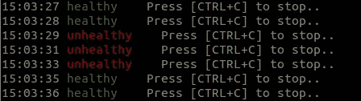

# Python 中异步的危险以及如何避免它们

> 原文：<https://betterprogramming.pub/the-dangers-of-async-in-python-and-how-to-avoid-them-6e6f98f19f0e>

## 通过一个非抢占式事件循环示例了解 Python 中的异步陷阱

在 [Unsplash](https://unsplash.com?utm_source=medium&utm_medium=referral) 上由[Tine ivani](https://unsplash.com/@tine999?utm_source=medium&utm_medium=referral)拍摄的照片。

Python 中的异步 web 服务器通常被认为是易于使用和高性能的。但是有些警告甚至会让高级软件开发人员出错。

其中一个警告是，事件循环是*非抢占式的*:当一个异步任务正在运行时，其他任何东西都不能运行。让我用一个小例子来说明这一点，这个例子大致基于我在工作中遇到的一个情况。

# 问题是

我们在 Kubernetes 中运行了一个简单的 Python 异步 web 服务器。它公开了一个端点，该端点下载一个文件，用一个库调用处理它，然后返回结果。我们发送了一个请求，需要一些复杂的、更长时间的处理，但是什么也没有发生。事实上，我们看到 web 服务器被重启了，所以我们的请求没有得到响应。重试产生了相同的行为。

## app 为什么重启？

该应用程序的部署定义了一个 [Kubernetes 活跃度探测器](https://kubernetes.io/docs/tasks/configure-pod-container/configure-liveness-readiness-startup-probes/),其工作方式大致如下:为应用程序提供一个端点。每十秒钟，它会发送一个请求。如果它在一秒钟内响应，并且响应状态代码大于或等于 200 且小于 400，则应用程序被认为是活动的。如果其中三个探测器连续失败，就认为它已经死了，Kubernetes 将重新启动它。

这就引出了下一个问题。

## 为什么活性探测失败了？

这就是 Python 事件循环的*非抢占*特性发挥作用的地方。每个请求都会在事件队列上创建一个新任务。Python 事件循环挑选下一个任务并运行它，直到它产生或完成。然后它将运行下一个任务，以此类推。但是如果一个任务不间断地运行几秒钟，其他任务就没有机会运行了。

对于我们的 web 服务器，这意味着复杂的请求会阻止其他请求得到服务，导致活跃度探测请求超时。

通常，如果您自己不做任何大量的请求处理，或者当您使用异步库时，这“不应该发生”。异步库将确保任务在向操作系统发出底层请求(例如，访问文件)时会让步。但是在我们的例子中，处理所需的库不支持 async，所以调用它意味着在这两者之间没有其他东西可以运行。

我用 [starlette](https://www.starlette.io/) 和[uvicon](https://www.uvicorn.org/)创建了一个小型的示例 web 服务器来重现这个问题。[源代码在 GitHub 上](https://github.com/lucas-sonnabend/nonpremeptive-async)。请检查它，并与它一起玩。我用一个非异步睡眠来模拟长处理，这个非异步睡眠将阻塞当前事件循环那么多秒。

最小的网络服务器

我没有在 Kubernetes 中运行 web 应用程序，而是使用我自己的活跃度探针，每秒钟调用服务器的`/health`端点。如果您运行 web 服务器(`poetry run uvicorn example:app`)，启动活跃度探测(`./liveness_probe.sh`)，并点击`/processing`端点(`./send_requests.sh`，您将看到活跃度探测失败了几次。

失败的活性探测器

我们成功地把这个问题简化为一个小例子。现在我们可以尝试不同的解决方案！

# 那么你说的“非先发制人”是什么意思呢？

以上是*非抢占式*调度的一个很好的例子。您可以将事件循环视为一个调度程序，它从事件队列中挑选任务，并非抢占式地运行它们。

非抢占式调度器只在当前任务阻塞、自愿放弃或完成时切换任务。

另一种方法是 [*抢占式*调度](https://en.wikipedia.org/wiki/Preemption_(computing))，它可以在一个任务执行过程中中断该任务来调度另一个任务。进程和线程通常由操作系统使用抢占式调度程序来运行。我们可以利用它们来解决我们的问题。

# 解决方法

## 1.使用更多工作进程

默认情况下，uvicorn 产生一个工作进程，所以我们得到一个事件循环。一个常见的建议是使用`2 * available cores + 1` workers，因此双核系统上有五个 workers。这样，我们得到了五个事件循环，并且可以在遇到同样的问题之前并行处理四个长时间运行的请求。

在我们的示例中，我们可以通过使用`poetry run uvicorn --workers 5 example:app`启动应用程序来实现这一点。现在，如果您运行`./send_requests.sh`，您可以看到活性探针始终保持绿色。操作系统可以以*抢占*的方式在工作进程之间切换。但是如果用`./send_requests.sh 5`同时发送五个请求，活跃度探测又会失败。您的请求超过了可用工作进程的数量。

## 2.在单独的线程中运行阻塞代码

[Python 的文档](https://docs.python.org/3.6/library/asyncio-dev.html#handle-blocking-functions-correctly)实际上推荐在不同的线程或进程中运行阻塞任务，使用`[EventLoop.run_in_executor()](https://docs.python.org/3.6/library/asyncio-eventloop.html#asyncio.AbstractEventLoop.run_in_executor)`。

这将在单独的线程中运行处理，释放主线程中的事件循环，以继续处理其他请求。在示例 web 服务器中，您可以用`./send_requests.sh 5 processing_fixed`点击请求端点，活跃度探测器保持绿色——即使在处理多个请求时。

同样，它之所以有效是因为操作系统在线程*和*之间抢先切换:它们运行一会儿，然后操作系统调度另一个线程，这样所有的线程都能取得一些进展。重要的是。对活性探测作出反应的主线程可以及时运行。

## 3.调整你的数字

您可以调整活动探测器，以允许检查之间有更长的暂停时间或更高的连续失败阈值。不利的一面是，如果您的应用程序完全死机，Kubernetes 将需要更长的时间来重新启动。在处理一个复杂的请求时，您仍然有一个反应相当迟钝的 web 应用程序。

这不会改变任何调度行为，但仍然是一个实用的解决方案。

# 还有陷阱吗？

这些例子相当简单。我将并发请求的数量保持在较低水平，并且使用`time.sleep()`来模拟请求的“处理”。这会挂起当前线程，让操作系统有机会运行其他线程或进程。在实际项目中，处理将是等待外部资源(读取文件或访问数据库)和 CPU 上的实际处理的组合，这类似于睡眠。

[我的示例](https://github.com/lucas-sonnabend/nonpremeptive-async)还提供了一个`processing_busy`端点，它模拟了一个繁忙循环的 CPU 密集型处理。我鼓励您尝试一下，改变工作进程、并发请求和不同端点的数量。这样，您将探索应用程序的性能界限和并发性。奥马尔·雷沃德写了一篇关于这个问题的更深入的文章。

# 摘要

希望这个示例 web 服务器展示了异步 Python 的一个更复杂的行为。我实际上在使用 Python 的异步 Kafka 库时遇到了类似的问题， [aiokafka](https://aiokafka.readthedocs.io/en/stable/kafka-python_difference.html) 。这里，我们有一个异步心跳任务在后台运行。对消息进行长时间的 CPU 密集型处理可能会阻止 heartbeat 任务的运行，从而导致 Kafka broker 断开与客户端的连接。

总而言之，异步 Python 框架仍然是一个强大的工具。你只需要知道事件循环是不可抢占的！

如果你在这篇文章中读到了这一点，你很可能会喜欢它。查看我关于一个 [python 并发错误](/how-i-solved-a-challenging-concurrency-bug-in-python-cbf635d4bea9)的文章，了解另一个调试故事。