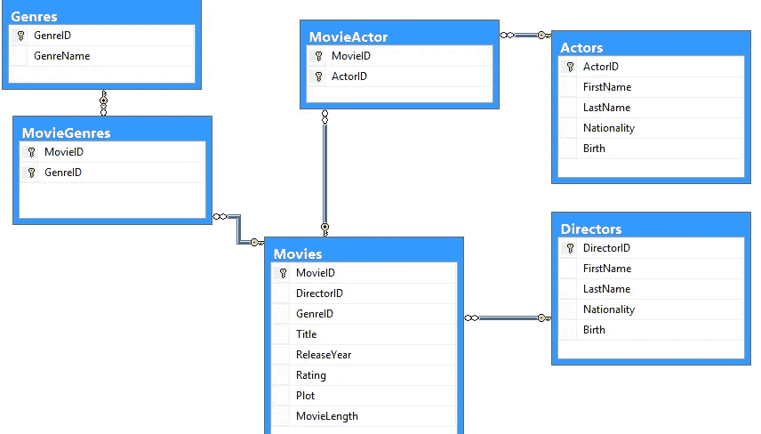

# 数据工程面试研究指南

> 原文：<https://betterprogramming.pub/the-data-engineering-interview-study-guide-6f09420dd972>

## 你的 FAANG 和其他技术面试

[绿色变色龙](https://unsplash.com/@craftedbygc?utm_source=medium&utm_medium=referral)在 [Unsplash](https://unsplash.com?utm_source=medium&utm_medium=referral) 上的照片

任何技术职位的面试一般都需要准备、学习和长时间的全天面试。

数据工程面试和其他技术面试一样，需要充分的准备。为了确保您为连续提问做好准备，需要涵盖许多主题。

有些职位要求 [Hadoop](https://hadoop.apache.org/) ，有些 [SQL](https://en.wikipedia.org/wiki/SQL) 。一些角色需要理解统计学，而另外一些角色需要大量的系统设计。

我们已经收集了许多资源，用于在 FAANG 家族的公司以及其他主要的技术公司学习和获得工作。我们还没有找到一个要求你在面试中了解 Hadoop 的问题，所以这个问题没有包含在本学习指南中。

如果你不确定你将面临哪种类型的面试，我们建议询问招聘人员。一些公司非常擅长保持面试的一致性，但即使这样，团队也可能会根据他们想要什么而偏离。以下是我们注意到的一些公司数据工程面试的例子。

**Amazon —** SQL 和数据库设计以及一般 ETL 设计。令人惊讶的是，没有 Python。

**网飞—** 大量使用 SQL 和代码，希望你不仅能编写 SQL 和代码，还能优化它们。

> *“他们询问了 SQL 查询，以找出给定特定条件下两个事件之间的时间差。”Glassdoor 上的网飞数据工程师*

**Expedia** —大数据问题，比如什么是 Spark 和 RDDs，以及 SQL 和 Python。

由于这种差异，我们创建了一个清单来跟踪你已经学习了哪些主题领域以及你还需要学习哪些内容:[数据工程学习清单](https://docs.google.com/spreadsheets/d/1GOO4s1NcxCR8a44F0XnsErz5rYDxNbHAHznu4pJMRkw/edit#gid=0)。

此外，我最近创建了一个[视频指南](https://www.youtube.com/watch?v=2lloOlnSzSs&t=1s)来浏览数据工程面试研究指南。

让我们从 SQL 开始。

# 结构化查询语言

作为一名数据工程师，你几乎不可避免地会遇到一些 SQL 问题。作为一个参加过很多顶级科技公司面试的人，比如亚马逊和 Capital One，我知道他们通常遵循一些类似的模式。

通常，至少有一个问题需要使用筛选器进行聚合，另一个问题需要一些连接，还有一个问题需要子查询。除此之外，可能还有一些需要自连接、递归和分析函数的曲线球问题。因此，让我们来看几个很好涵盖的概念。

## 视频前的 SQL 问题

这些最初的几个问题将帮助你衡量你在不同概念上的位置。这样你就可以在学习指南上做笔记，并回顾你觉得不舒服的地方。

1.  [262。行程和用户](https://leetcode.com/problems/trips-and-users/)
2.  [601。体育场的人流量](https://leetcode.com/problems/human-traffic-of-stadium/)
3.  [185。部门前三名薪资](https://leetcode.com/problems/department-top-three-salaries/)
4.  [197。温度上升](https://leetcode.com/problems/rising-temperature/)
5.  [626。交换座位](https://leetcode.com/problems/exchange-seats/)
6.  [报告](https://www.hackerrank.com/challenges/the-report/problem)
7.  [177。第 n 高工资](https://leetcode.com/problems/nth-highest-salary/)
8.  [对称对](https://www.hackerrank.com/challenges/symmetric-pairs/problem)
9.  [职业](https://www.hackerrank.com/challenges/occupations/problem)
10.  [奥利凡德的库存](https://www.hackerrank.com/challenges/harry-potter-and-wands/problem)
11.  [位置](https://www.hackerrank.com/challenges/placements/problem)

## 录像

[学习行号和解析函数](https://www.youtube.com/watch?v=QFj-hZi8MKk)

[分析功能运行总数的高级实现](https://www.youtube.com/watch?v=G3kYPzLWtpo&t=4s)

[分析函数中值的高级实现](https://www.youtube.com/watch?v=XecU6Ieyu-4&t=54s)

[Wise Owl SQL 视频](https://www.youtube.com/watch?v=2-1XQHAgDsM&list=PL6EDEB03D20332309)

## 视频后 SQL 问题

看完上面的 SQL 视频后，可以考虑尝试下面的新问题。试着看看你是否觉得自己在进步。同样，记下你觉得薄弱的任何特定话题。

1.  [二叉树节点](https://www.hackerrank.com/challenges/binary-search-tree-1/problem)
2.  [595。大国](https://leetcode.com/problems/big-countries/)
3.  626。交换座位
4.  [气象观测站 18](https://www.hackerrank.com/challenges/weather-observation-station-18/problem)
5.  [挑战](https://www.hackerrank.com/challenges/challenges/problem)
6.  [打印质数](https://www.hackerrank.com/challenges/print-prime-numbers/problem)
7.  [SQL 面试问题:3 个技术筛选练习(针对数据分析师)](https://data36.com/sql-interview-questions-tech-screening-data-analysts/)

# 数据库、ETL 和数据仓库

来源: [Stackoverflow](https://stackoverflow.com/questions/20346850/sql-movie-database-diagram)

对于数据库、 [ETL](https://seattledataguy.substack.com/p/what-are-etls-and-why-we-use-them) 和[数据仓库](https://www.theseattledataguy.com/what-are-the-benefits-of-cloud-data-warehousing-and-why-you-should-migrate/#page-content)设计问题，我们收集了一些书籍和视频，希望能在面试中帮助你解释你的设计。此外，我们还列出了一些可能的数据库/数据仓库概念，您可以尝试自己设计。

我们建议在尝试自我练习问题之前浏览视频，至少浏览一下数据仓库工具包。

[数据仓库工具包](https://www.kimballgroup.com/data-warehouse-business-intelligence-resources/books/data-warehouse-dw-toolkit/) 作者拉尔夫·金博尔

[设计传统关系数据库视频](https://www.youtube.com/watch?v=I_rxqSJAj6U)

[数据仓库设计视频](https://www.youtube.com/watch?v=--OJpdPeH80)

## 自我实践问题

在面试练习的这一部分，我们将列出一些你可以尝试设计的商业系统。首先，我们建议设计一个关系数据库，然后考虑如何设计依赖于该关系数据库的 ETL 和 DW。

**注意:**此外，我们发现面试官通常会根据你的设计来提问。所以，想一想你可以用数据库回答的一些问题，并把它们列出来。

为以下项目设计数据库/ETL 和 DW:

*   约会应用
*   自行车租赁服务
*   音乐流媒体应用
*   求职网站
*   类 Udemy 网站

这些只是一些想法。我们希望它们能帮助你对你可以练习建模和设计有一个更清晰的概念。在开始之前，花些时间想想用户如何与这些网站互动。

# 编程问题

数据工程师在日常生活中做大量的编程工作。数据工程师使用几种特定的语言。Python 可以说是最常见的。

如果这个角色需要大量的 Hadoop 工作，那么 [Java](https://www.java.com/en/) 也是一种有用的语言。还有一些其他有用的语言，比如 Java 和 PowerShell(如果你在微软工作的话)。

我们经历过两种类型的问题。有的面试官会问你更多操作性的问题。其他人会问经典算法和数据结构问题。

# 操作编程问题

操作性面试问题比较难准备。这里没有“经典”的面试问题。然而，他们也往往更容易当场弄清楚。算法面试题通常都有某种窍门。就像平衡括号问题:如果你不知道你需要使用队列，那就很难得到正确的答案。

然而，运营问题将更加集中在工作流和业务流程上。所以只要你擅长走真题，这个应该比较容易。这里有一些非常适合准备的问题。我们发现知道如何使用数组和字典很有帮助。除此之外，没有更多的要求。

1.  [袋鼠问题](https://www.hackerrank.com/challenges/kangaroo/problem)
2.  [破纪录](https://www.hackerrank.com/challenges/breaking-best-and-worst-records/problem)
3.  [查找字符串](https://www.hackerrank.com/challenges/find-a-string/problem)
4.  [itertools.permutations()](https://www.hackerrank.com/challenges/itertools-permutations/problem)
5.  [不知道！](https://www.hackerrank.com/challenges/no-idea/problem)
6.  [程序员的日子](https://www.hackerrank.com/challenges/day-of-the-programmer/problem)
7.  [排行榜](https://www.hackerrank.com/challenges/climbing-the-leaderboard/problem)
8.  [词序](https://www.hackerrank.com/challenges/word-order/problem)
9.  [夏洛克和方块](https://www.hackerrank.com/challenges/sherlock-and-squares/problem)
10.  [均衡阵列](https://www.hackerrank.com/challenges/equality-in-a-array/problem)
11.  [苹果和橘子](https://www.hackerrank.com/challenges/apple-and-orange/problem)
12.  [更多操作风格问题](https://www.hackerrank.com/domains/python)

# 算法和数据结构

马库斯·斯皮斯克在 [Unsplash](https://unsplash.com?utm_source=medium&utm_medium=referral) 拍摄的照片

在深入研究数据结构和算法之前，让我们快速检查一下，看看你目前在这方面做得怎么样。我们列出了八个难度不同的 LeetCode 问题。试试这些，试着估计一下你需要多长时间，以及你需要多少提示。如果你是按照学习指南，然后记下这一点。在这个列表的最后还有几个问题。所以一旦你看完了所有的视频，考虑做那些题，看看你是不是觉得自己在进步！

## 预习问题

1.  985。查询后偶数的总和
2.  657。机器人返回原点
3.  961。大小为 2N 的数组中的 n 个重复元素
4.  [110。平衡二叉树](https://leetcode.com/problems/balanced-binary-tree/)
5.  [3。没有重复字符的最长子串](https://leetcode.com/problems/longest-substring-without-repeating-characters/)
6.  [19。从列表末尾删除第 n 个节点](https://leetcode.com/problems/remove-nth-node-from-end-of-list/)
7.  [23。合并 k 个排序列表](https://leetcode.com/problems/merge-k-sorted-lists/)
8.  31。下一个排列

既然你已经过了这八道题，抖落了锈迹，那就开始复习这些概念吧。

## **数据结构**

1.  [数据结构&算法# 1——什么是数据结构？](https://www.youtube.com/watch?v=bum_19loj9A)
2.  [数据结构:链表](https://youtu.be/njTh_OwMljA)
3.  [数据结构:树](https://youtu.be/oSWTXtMglKE)
4.  [数据结构:堆](https://youtu.be/t0Cq6tVNRBA)
5.  [数据结构:哈希表](https://youtu.be/shs0KM3wKv8)
6.  数据结构:堆栈和队列
7.  [数据结构:计算机科学速成班#14](https://youtu.be/DuDz6B4cqVc)
8.  [数据结构:尝试](https://www.youtube.com/watch?v=zIjfhVPRZCg)

## **算法**

1.  [Python 面试算法](https://www.youtube.com/watch?v=p65AHm9MX80)
2.  [算法:图搜索、DFS 和 BFS](https://www.youtube.com/watch?v=zaBhtODEL0w&list=PLX6IKgS15Ue02WDPRCmYKuZicQHit9kFt)
3.  [算法:二分搜索法](https://youtu.be/P3YID7liBug)
4.  [算法:递归](https://youtu.be/KEEKn7Me-ms)
5.  [算法:冒泡排序](https://youtu.be/6Gv8vg0kcHc)
6.  [算法:合并排序](https://youtu.be/KF2j-9iSf4Q)
7.  [算法:快速排序](https://youtu.be/SLauY6PpjW4)

## **大 O 批注**

[大 O 符号和时间复杂度介绍(数据结构&算法#7)](https://www.youtube.com/watch?v=D6xkbGLQesk)

## **一些面试演练**

[亚马逊编码面试问题—递归阶梯问题](https://www.youtube.com/watch?v=5o-kdjv7FD0)

[谷歌编码面试——通用价值树问题](https://www.youtube.com/watch?v=7HgsS8bRvjo)

[谷歌编码面试问答#1:第一个重复出现的字符](https://www.youtube.com/watch?v=GJdiM-muYqc)

## 后期视频问题

一旦你完成了上面的视频，考虑尝试下面的算法和数据结构问题。确保你记录下在解决问题时你感觉有多舒服。

1.  [越大越好](https://www.hackerrank.com/challenges/bigger-is-greater/problem)
2.  [6。锯齿形转换](https://leetcode.com/problems/zigzag-conversion/)
3.  [7。反向整数](https://leetcode.com/problems/reverse-integer/)
4.  [四十。组合和二](https://leetcode.com/problems/combination-sum-ii/)
5.  [43。乘法字符串](https://leetcode.com/problems/multiply-strings/)
6.  [拉里的阵列](https://www.hackerrank.com/challenges/larrys-array/problem)
7.  [短回文](https://www.hackerrank.com/challenges/short-palindrome/problem)
8.  65。有效号码

如果你仍然觉得需要帮助，那么考虑参加一个关于算法和数据结构的课程。

# 大数据框架

回到 2020 年，我制作了一个关于为数据工程面试而练习的视频。有趣的是，一个人评论了这个视频，并指向我最初的数据工程学习指南。只是偶然！

世界真小。

他们还增加了另一部分。在这种情况下，他们增加了[火花](https://en.wikipedia.org/wiki/Apache_Spark)。因此，对于那些需要学习 Spark 的人来说，这里是 Paul Russel 添加到清单中的内容。你想补充什么？

[架构概述&用例](https://www.toptal.com/spark/introduction-to-apache-spark)

[星火由例(教程文档)](https://sparkbyexamples.com/spark/)

[PySpark 语法备忘单](https://s3.amazonaws.com/assets.datacamp.com/blog_assets/PySpark_SQL_Cheat_Sheet_Python.pdf)

# 结论

我们希望这个列表能帮助你准备下一次数据工程面试。如果您有任何问题或需要任何帮助，请告诉我们。