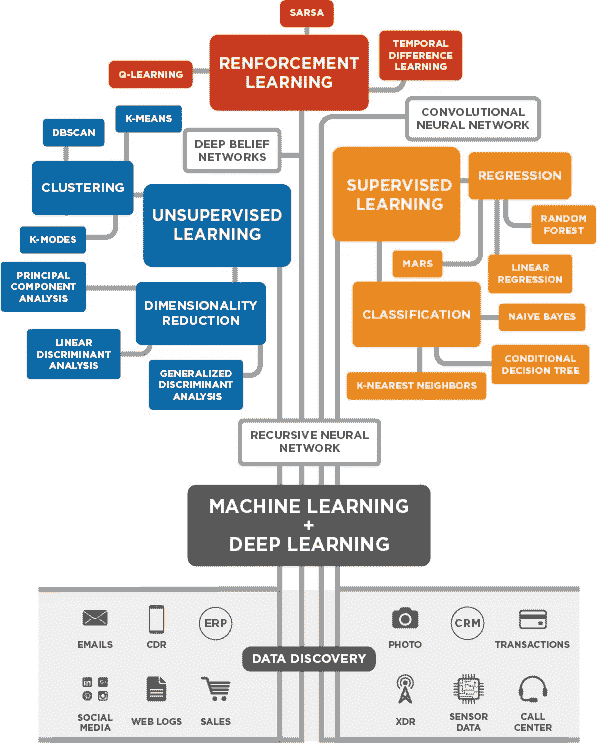
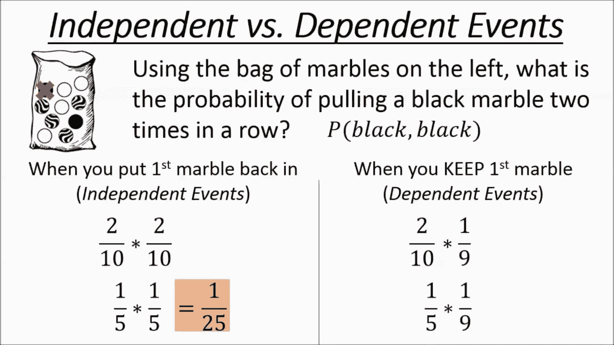
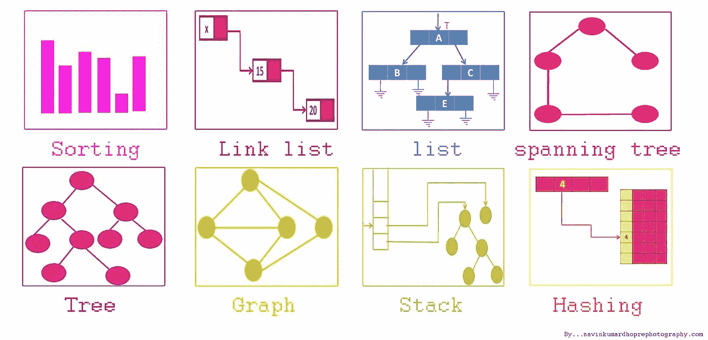

# 数据科学面试研究指南

> 原文：<https://betterprogramming.pub/the-data-science-interview-study-guide-c3824cb76c2e>

## 121 种资源帮助您获得数据科学梦寐以求的工作

照片由 Helloquence 提供

由本·罗戈扬

数据科学面试和其他技术面试一样，需要充分的准备。为了确保你准备好应对统计学、编程和机器学习方面的连续问题，需要涵盖许多主题。

在我们开始之前，我想分享一个小技巧。

我注意到公司进行的数据科学面试有几种类型。

一些数据科学访谈非常注重产品和指标。这些访谈更多地关注于询问产品问题，比如你会用什么样的指标来表明你应该在产品中改进什么。这些问题通常与 SQL 和一些 Python 问题成对出现。

另一种类型的数据科学面试往往是编程和机器学习的混合。

如果你不确定你将面临哪种类型的面试，我们建议询问招聘人员。一些公司非常擅长保持面试的一致性，但即使这样，团队也可能会根据他们想要什么而偏离。以下是我们在一些公司数据科学面试中注意到的一些例子。

**Airbnb —** 产品繁重、指标诊断、指标创建、A/B 测试、大量行为问题和带回家的材料。

**网飞—** 产品感问题、A/B 测试、实验设计、度量设计

**微软** —编程繁重，二叉树遍历，SQL，机器学习

**Expedia** —产品、编程、SQL、产品感知、关于 SVM 的机器学习问题、回归和决策树

由于这种差异，我们创建了一个清单来记录你学过的科目和你还需要学的科目。

[数据科学研究清单](https://docs.google.com/spreadsheets/d/1djhTq4vD72lzuLY2rCMOkkSuNG2rRf_C5PwNMjcIAMk/edit?usp=sharing)

[此外，我最近制作了一个视频指南来浏览数据科学面试研究指南！](https://www.youtube.com/watch?v=2lloOlnSzSs&t=1s)

让我们首先确保你能解释基本的数据科学算法。

# 加入我们的时事通讯

在继续滚动之前，为什么不加入我们团队的时事通讯，了解数据科学、数据工程和技术的最新动态！[在此了解更多信息](https://seattledataguy.substack.com/)。

# 机器学习算法

1.  [逻辑回归](https://www.youtube.com/watch?v=zAULhNrnuL4&t=26s) —视频
2.  [A/B 测试](https://www.youtube.com/watch?v=zFMgpxG-chM) —视频
3.  [决策树](http://www.acheronanalytics.com/acheron-blog/brilliant-explanation-of-a-decision-tree-algorithms) —帖子
4.  [SVM](https://towardsdatascience.com/support-vector-machine-introduction-to-machine-learning-algorithms-934a444fca47) —邮政
5.  [SVM 如何](https://www.youtube.com/watch?v=1NxnPkZM9bc) —视频
6.  [主成分分析:PCA](http://setosa.io/ev/principal-component-analysis/) — Post
7.  [主成分分析](https://www.youtube.com/watch?v=FgakZw6K1QQ) —视频
8.  [Adaboost](https://machinelearningmastery.com/boosting-and-adaboost-for-machine-learning/) — Post
9.  [AdaBoost](https://www.youtube.com/watch?v=LsK-xG1cLYA) —视频
10.  [机器学习的梯度推进算法简介](https://machinelearningmastery.com/gentle-introduction-gradient-boosting-algorithm-machine-learning/) — Post
11.  [渐变提升第一部分:回归主要思路](https://www.youtube.com/watch?v=3CC4N4z3GJc) —视频
12.  [K-均值聚类——智能数学](https://www.youtube.com/watch?v=9991JlKnFmk) —视频
13.  [贝叶斯网络](http://horicky.blogspot.com/2009/05/machine-learning-probabilistic-model.html) —帖子
14.  [神经网络](http://horicky.blogspot.com/2009/11/machine-learning-with-linear-model.html) —岗位
15.  [降维算法](https://elitedatascience.com/dimensionality-reduction-algorithms) — Post
16.  [kNN 算法如何工作](https://www.youtube.com/watch?v=UqYde-LULfs) —视频

# 概率与统计

在大型科技公司，偶尔收到概率或统计问题是很常见的。虽然这些问题不一定需要复杂的数学，但如果你还没有考虑过独立概率和相关概率，那么复习设置基本公式是很好的。

## **概率视频**

1.  [相依概率简介](https://www.khanacademy.org/math/math2/math2-prob/math2-mul-rule-dependent/v/introduction-to-dependent-probability?modal=1)
2.  [独立&非独立概率](https://www.khanacademy.org/math/math2/math2-prob/math2-mul-rule-dependent/v/independent-events-1?modal=1)
3.  [独立问题](https://www.khanacademy.org/math/math2/math2-prob/math2-mul-rule-independent/v/independent-events-2?modal=1)
4.  [条件概率文章](https://www.khanacademy.org/math/math2/math2-prob/math2-conditional-prob/a/conditional-probability-using-two-way-tables?modal=1)

## **概率测验**

1.  [概率&统计—第 6 组](http://interview-questions-247.appspot.com/data-science-probability-1)
2.  [概率&统计—集合 2](http://interview-questions-247.appspot.com/data-science-probability-2)
3.  [独立概率](https://www.khanacademy.org/math/math2/math2-prob/math2-mul-rule-independent/e/independent_probability?modal=1)
4.  [相关概率](https://www.khanacademy.org/math/math2/math2-prob/math2-mul-rule-dependent/e/dependent_probability?modal=1)

## **概率面试问题**

这些问题中的大部分要么与我们被问到的问题相似，要么直接取自 glassdoor.com。

1.  骰子滚动两次。第一卷显示 3，第二卷显示奇数的概率是多少？
2.  在任何 15 分钟的间隔内，有 20%的概率会看到至少一颗流星。你在一小时内看到至少一颗流星的可能性有多大？
3.  爱丽丝有两个孩子，其中一个是女孩。另一个孩子也是女孩的概率有多大？你可以假设世界上男性和女性的数量相等。
4.  有多少种方法可以把 12 个人分成 3 组，每组 4 个人？

## **统计预习**

1.  [数据科学概率统计 14](http://interview-questions-247.appspot.com/data-science-probability-statistics-14)

## **统计概念**

统计是一个宽泛的概念，所以不要太纠结于这些视频的细节。相反，只要确保你能在表面上解释这些概念。

1.  [偏差-方差权衡](https://towardsdatascience.com/understanding-the-bias-variance-tradeoff-165e6942b229)
2.  [混乱矩阵](https://www.dataschool.io/simple-guide-to-confusion-matrix-terminology/)
3.  [ROC 曲线](https://www.dataschool.io/roc-curves-and-auc-explained/)
4.  [正态分布](https://www.youtube.com/watch?v=iYiOVISWXS4)
5.  [P 值](https://www.khanacademy.org/math/ap-statistics/tests-significance-ap/idea-significance-tests/v/p-values-and-significance-tests)
6.  [皮尔森](https://www.spss-tutorials.com/pearson-correlation-coefficient/) [斯皮尔曼](http://www.statstutor.ac.uk/resources/uploaded/spearmans.pdf)
7.  [正态分布问题:z 分数(来自 ck12.org)](https://www.khanacademy.org/math/statistics-probability/modeling-distributions-of-data/z-scores/v/ck12-org-normal-distribution-problems-z-score?modal=1)
8.  [连续概率分布](https://www.youtube.com/watch?v=OWSOhpS00_s)
9.  [标准化正态分布随机变量(快速版)](https://www.youtube.com/watch?v=BN-2XOMnoCs&list=PLvxOuBpazmsPDZGwqhhjE3KkLWnTD34R0&index=6)
10.  统计学 101:简单线性回归，最基本的
11.  [统计 101:线性回归、异常值和有影响的观察值](https://www.youtube.com/watch?v=fJSXS4oVf88)
12.  [统计 101:方差分析，直观介绍](https://www.youtube.com/watch?v=0Vj2V2qRU10)
13.  [统计学 101:多元回归，最基础的东西](https://www.youtube.com/watch?v=dQNpSa-bq4M)
14.  [统计:人口方差|概率统计|可汗学院](https://www.youtube.com/watch?v=6JFzI1DDyyk&list=PL1328115D3D8A2566&index=3)
15.  [期望值:E(X)](https://www.youtube.com/watch?v=j__Kredt7vY&list=PL1328115D3D8A2566&index=13)
16.  [大数法则|概率统计|可汗学院](https://www.youtube.com/watch?v=VpuN8vCQ--M&list=PL1328115D3D8A2566&index=17)
17.  [中心极限定理|推断统计|概率统计|可汗学院](https://www.youtube.com/watch?v=JNm3M9cqWyc&list=PL1328115D3D8A2566&index=25)
18.  [误差范围 1 |推断统计|概率统计|可汗学院](https://www.youtube.com/watch?v=OwPSuHXmiPw&list=PL1328115D3D8A2566&index=33)
19.  [误差范围 2 |推断统计|概率统计|可汗学院](https://www.youtube.com/watch?v=YclQE2XtaLw&list=PL1328115D3D8A2566&index=34)
20.  [假设检验和 p 值|推断统计|概率统计|可汗学院](https://www.youtube.com/watch?v=-FtlH4svqx4&list=PL1328115D3D8A2566&index=37)
21.  [单尾和双尾检验|推断统计|概率统计|可汗学院](https://www.youtube.com/watch?v=mvye6X_0upA&list=PL1328115D3D8A2566&index=38)
22.  [1 类错误|推断统计|概率统计|可汗学院](https://www.youtube.com/watch?v=EowIec7Y8HM&list=PL1328115D3D8A2566&index=40)
23.  [大样本比例假设检验|概率统计|可汗学院](https://www.youtube.com/watch?v=1JT9oODsClE&list=PL1328115D3D8A2566&index=43)
24.  [增压装袋](https://medium.com/coriers/how-to-develop-a-robust-algorithm-c38e08f32201)

**统计后测验**

1.  [数据科学概率统计 17](http://interview-questions-247.appspot.com/data-science-probability-statistics-17)

# **产品和实验设计**

产品感是数据科学家的一项重要技能。了解新产品的衡量标准和原因有助于确定产品是否表现良好。有趣的是，有时某些指标按照你希望的方式发展可能并不总是好的。人们在你的网站上花费更多时间的原因可能是因为网页加载时间更长或者其他面临类似问题的原因。这就是为什么度量是复杂的，你度量的是重要的。

## **产品和实验设计概念**

1.  [用户参与度指标](https://mixpanel.com/topics/important-user-engagement-metrics-apps/)
2.  [数据科学家的工具箱:实验设计](https://www.youtube.com/watch?v=vSXOJnGNtM4)-视频
3.  [A/B 测试指南](https://conversionxl.com/AB-Testing-Guide-ConversionXL.pdf)
4.  [多元检验](https://www.youtube.com/watch?v=dYdTqoamI3Q)
5.  [6 个指标主题](https://www.productschool.com/blog/product-management-2/interview/answering-metrics-interview-question-product-management/)

## **产品和指标问题**

1.  一个重要的指标下降了，你会如何挖掘原因？\
2.  你会用什么指标来量化 Youtube 广告的成功(这也可以扩展到其他产品，如 Snapchat 过滤器、Twitter 直播、堡垒之夜新功能等)
3.  你如何衡量一个产品/产品特性的成功或失败
4.  谷歌发布了新版本的搜索算法，他们使用了 A/B 测试。在测试过程中，工程师们意识到新算法没有正确实现，并返回了不太相关的结果。测试期间发生了两件事:

*   治疗组的人比对照组的人进行了更多的询问。
*   治疗组的广告收入也更高。

治疗组的人比对照组的人执行更多搜索的原因可能是什么？这里有不同的可能答案。

问题 4 借用[Zarantech](https://www.zarantech.com/blog/interview-questions/data-science-product-analysis-and-business-metrics-interview-questions/)；我们真的很喜欢它，并认为这是一个很好的例子，事情可能会出错。

# 编程；编排

数据科学并不总是需要繁重的编程，这并不意味着面试官不会要求你遍历二叉树。所以一定要问你的面试官会期待什么。不要被这些问题吓倒。选择几个这样做，这样你在面试中就不会感到惊讶。

## **预视频问题**

1.  [嘶嘶作响](https://www.hackerrank.com/challenges/fizzbuzz/problem)
2.  [找出数组中第 k 个最小/最大的整数](https://www.geeksforgeeks.org/kth-smallestlargest-element-unsorted-array-set-2-expected-linear-time/)
3.  [第 n 个斐波那契](https://www.algoexpert.io/questions/Nth%20Fibonacci)

# 算法和数据结构

## 预习问题

在浏览关于数据结构和算法的视频内容之前，请考虑尝试下面的问题。这会帮助你知道你需要关注什么。

1.  [查询后偶数之和](https://leetcode.com/problems/sum-of-even-numbers-after-queries/)
2.  [机器人返回原点](https://leetcode.com/problems/robot-return-to-origin/)
3.  [大小为 2N 的数组中的 N 个重复元素](https://leetcode.com/problems/n-repeated-element-in-size-2n-array/)
4.  [平衡二叉树](https://leetcode.com/problems/balanced-binary-tree/)

## **数据结构视频**

1.  [数据结构&算法# 1——什么是数据结构？](https://www.youtube.com/watch?v=bum_19loj9A)
2.  [多维(视频)](https://archive.org/details/0102WhatYouShouldKnow/02_05-multidimensionalArrays.mp4)
3.  [数据结构:链表](https://youtu.be/njTh_OwMljA)
4.  [核心链表 Vs 数组(视频)](https://www.coursera.org/learn/data-structures-optimizing-performance/lecture/rjBs9/core-linked-lists-vs-arrays)
5.  [数据结构:树](https://youtu.be/oSWTXtMglKE)
6.  [数据结构:堆](https://youtu.be/t0Cq6tVNRBA)
7.  [数据结构:哈希表](https://youtu.be/shs0KM3wKv8)
8.  [数据结构:堆栈和队列](https://youtu.be/wjI1WNcIntg)

## **算法视频**

1.  [Python 面试算法](https://www.youtube.com/watch?v=p65AHm9MX80)
2.  [算法:图搜索、DFS 和 BFS](https://www.youtube.com/watch?v=zaBhtODEL0w&list=PLX6IKgS15Ue02WDPRCmYKuZicQHit9kFt)
3.  [BFS(广度优先搜索)和 DFS(深度优先搜索)(视频)](https://www.youtube.com/watch?v=uWL6FJhq5fM)
4.  [算法:二分搜索法](https://youtu.be/P3YID7liBug)
5.  [二叉查找树评论(视频)](https://www.youtube.com/watch?v=x6At0nzX92o&index=1&list=PLA5Lqm4uh9Bbq-E0ZnqTIa8LRaL77ica6)
6.  [算法:递归](https://youtu.be/KEEKn7Me-ms)
7.  [算法:冒泡排序](https://youtu.be/6Gv8vg0kcHc)
8.  [算法:合并排序](https://youtu.be/KF2j-9iSf4Q)
9.  [算法:快速排序](https://youtu.be/SLauY6PpjW4)

## **字符串操作**

1.  [编码面试问答:最长连续字符](https://www.youtube.com/watch?v=qRNB8CV3_LU)
2.  [Sedgewick —子串搜索(视频)](https://www.coursera.org/learn/algorithms-part2/home/week/4)

# 结构化查询语言

## **课后问题**

既然你已经学了一点，看了几个视频。再来试一些题！

1.  [越大越好](https://www.hackerrank.com/challenges/bigger-is-greater/problem)
2.  [之字形转换](https://leetcode.com/problems/zigzag-conversion/)
3.  [反向整数](https://leetcode.com/problems/reverse-integer/)
4.  [组合和二](https://leetcode.com/problems/combination-sum-ii/)
5.  [乘法字符串](https://leetcode.com/problems/multiply-strings/)
6.  [拉里的阵列](https://www.hackerrank.com/challenges/larrys-array/problem)
7.  [短回文](https://www.hackerrank.com/challenges/short-palindrome/problem)
8.  [有效号码](https://leetcode.com/problems/valid-number/)
9.  [越大越好](https://www.hackerrank.com/challenges/bigger-is-greater/problem)
10.  [全计数排序](https://www.hackerrank.com/challenges/countingsort4/problem)
11.  [莉莉的作业](https://www.hackerrank.com/challenges/lilys-homework/problem)

## **SQL —问题**

一般来说，至少会有一次面试是围绕 SQL 展开的。此外，面试官可能会带你经历开发产品的整个过程，选择要跟踪的指标，然后询问以衡量该指标的有效性。

1.  [车次和用户](https://leetcode.com/problems/trips-and-users/)
2.  [体育场的人流量](https://leetcode.com/problems/human-traffic-of-stadium/)
3.  [部门前三名薪资](https://leetcode.com/problems/department-top-three-salaries/)
4.  [交换座位](https://leetcode.com/problems/exchange-seats/)
5.  [黑客对报告进行排名](https://www.hackerrank.com/challenges/the-report/problem)
6.  [第 n 高工资](https://leetcode.com/problems/nth-highest-salary/)
7.  [对称对](https://www.hackerrank.com/challenges/symmetric-pairs/problem)
8.  [职业](https://www.hackerrank.com/challenges/occupations/problem)
9.  [位置](https://www.hackerrank.com/challenges/placements/problem)
10.  [奥利凡德的库存](https://www.hackerrank.com/challenges/harry-potter-and-wands/problem)

**SQL —视频**

1.  [IQ15: 6 SQL 查询面试问题](https://www.youtube.com/watch?v=uAWWhEA57bE)
2.  [学习行号和解析函数](https://www.youtube.com/watch?v=QFj-hZi8MKk)
3.  [分析功能的高级实现](https://www.youtube.com/watch?v=G3kYPzLWtpo&t=4s)
4.  [分析函数的高级实现第 2 部分](https://www.youtube.com/watch?v=XecU6Ieyu-4&t=54s)
5.  [智慧猫头鹰 SQL 视频](https://www.youtube.com/watch?v=2-1XQHAgDsM&list=PL6EDEB03D20332309)

**发布 SQL 问题**

1.  [二叉树节点](https://www.hackerrank.com/challenges/binary-search-tree-1/problem)
2.  [气象观测站 18](https://www.hackerrank.com/challenges/weather-observation-station-18/problem)
3.  [挑战](https://www.hackerrank.com/challenges/challenges/problem)
4.  [打印质数](https://www.hackerrank.com/challenges/print-prime-numbers/problem)
5.  [大国](https://leetcode.com/problems/big-countries/)
6.  [交换座位](https://leetcode.com/problems/exchange-seats/)
7.  [SQL 面试问题:3 个技术筛选练习(针对数据分析师)](https://data36.com/sql-interview-questions-tech-screening-data-analysts/)

# 结论

技术面试可能会很难。无论是针对[软件工程师](https://medium.com/better-programming/the-software-engineering-study-guide-bac25b8b61eb)、[数据工程师](https://www.coriers.com/the-interview-study-guide-for-data-engineers/)还是数据科学家。我们希望这份学习指南能帮助你跟踪你的进步！

如果您认为我们遗漏了什么，或者您有其他资源，您认为这将是一项优势，请让我知道。谢谢大家！