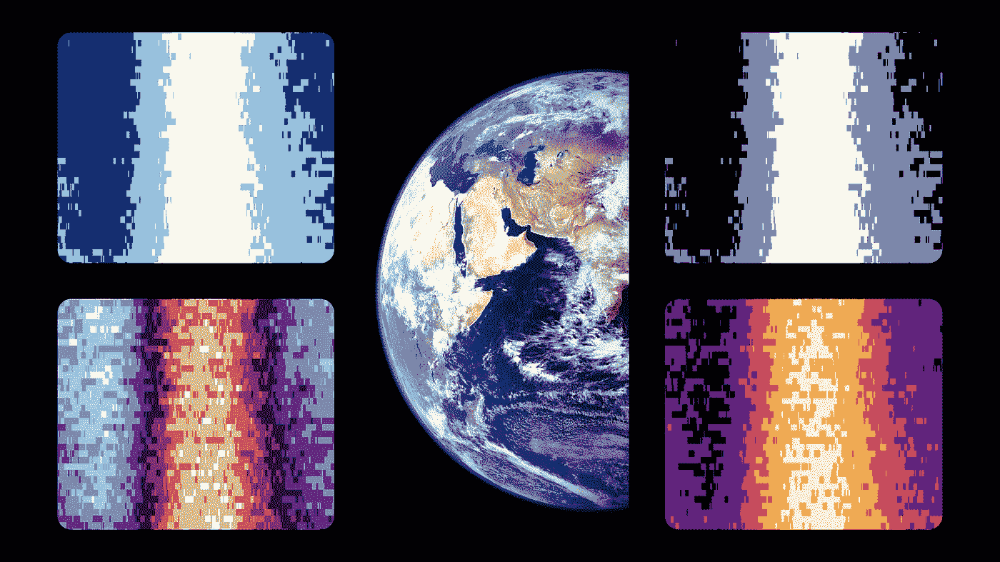
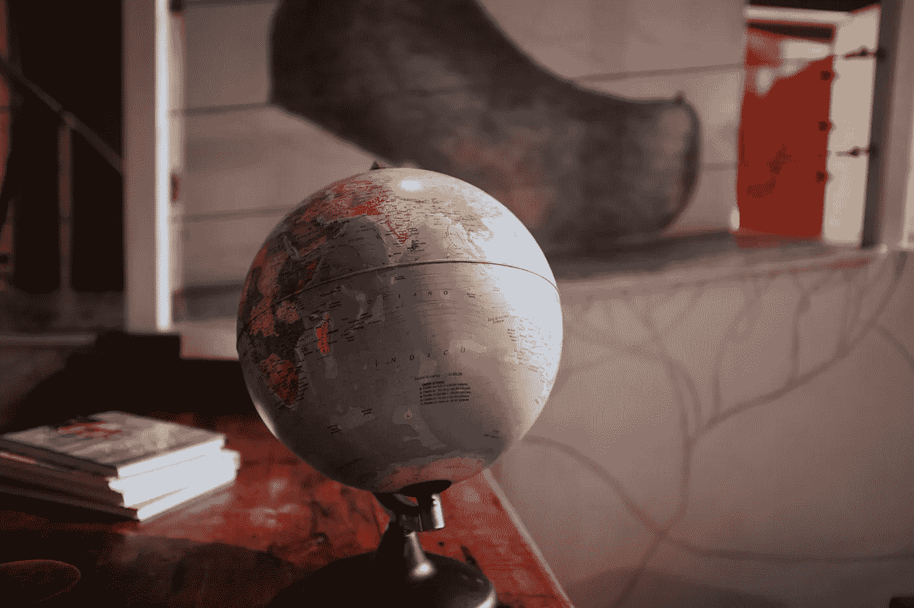
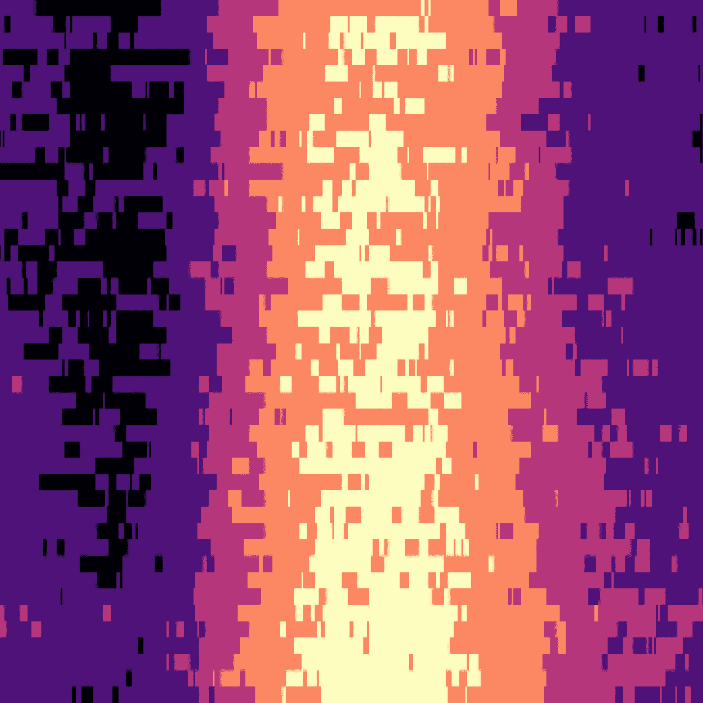
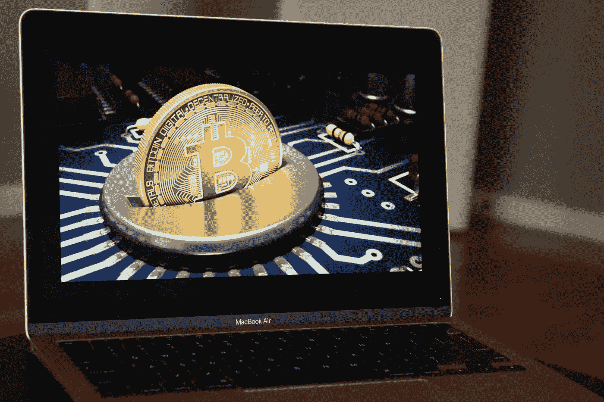

# 用 Python 创建 NFT 集合的数据科学家指南

> 原文：<https://betterprogramming.pub/the-data-scientists-guide-to-creating-an-nft-collection-in-python-de1b98163875>

## 我称之为 Atmos Portals，这是一个仅通过使用 Python 创建的有趣项目。



Atmos 门户—世界收藏(作者提供照片)

不可替代的代币或 [NFT](https://en.wikipedia.org/wiki/Non-fungible_token) 最近成了一个时髦词，最后，我屈服了，跳上了 NFT 这股潮流，想看看像我这样一个没有艺术技能的普通人是否能在市场上卖出一些东西。

NFT 市场发展迅速，一些收藏品如 [Bored Ape 游艇俱乐部](https://opensea.io/collection/boredapeyachtclub)的总销售额超过了 10 亿美元，这非常令人惊讶。

在某些情况下，NFT 是可以在区块链上买卖的数字艺术品。我对区块链已经有点熟悉了，它基本上是系统中发生的所有交易的分散分类账。我开始想知道他们如何将图像和视频形式的数据放入这个区块链，因为这将是一个挑战。这个问题的解决方案是通过使用一种叫做[的星际文件系统](https://en.wikipedia.org/wiki/InterPlanetary_File_System)找到的。这是一种分散式存储机制，文件存储在点对点文件共享网络中，其工作方式类似于 BitTorrent。

好吧，这太酷了！

我心想，只是为了好玩，我能不能做一个 NFT 的收藏，卖点东西。因此，我做了一个实验，仅仅利用我所拥有的专业知识和知识来创作一个系列，这并不完全是在创作艺术。因为我无论如何都不是艺术家，这很棘手！

在这篇文章中，我将概述我纯粹通过使用 Python 和对互联网的一些理解参与制作 NFT 艺术收藏的所有细节。

# 这个想法


照片由[弗雷德里克·梅迪纳](https://unsplash.com/@frederickjmedina?utm_source=unsplash&utm_medium=referral&utm_content=creditCopyText)在 [Unsplash](https://unsplash.com/s/photos/idea?utm_source=unsplash&utm_medium=referral&utm_content=creditCopyText) 上拍摄

开始任何项目的第一件事是对你想做什么有一个好的想法。我目前是气候变化领域的一名数据科学家，所以我对气候数据有一些经验，并对其进行了一些分析。

根据我的研究，我注意到市场上对气候领域的探索不多，所以我决定想出一些有趣的东西是个好主意。

全球变暖是人类不得不面对的最大问题之一。几十年来的人为排放促成了这个全球变暖的故事，我想，我能不能捕捉到这个故事在几年间的演变。

幸运的是，与气候相关的数据集可以免费下载和使用。这是一个好的开始！

# **数据集**



照片由[里卡多·雷森德](https://unsplash.com/@rresenden?utm_source=unsplash&utm_medium=referral&utm_content=creditCopyText)在 [Unsplash](https://unsplash.com/s/photos/grid-globe?utm_source=unsplash&utm_medium=referral&utm_content=creditCopyText) 上拍摄

[哥白尼](https://en.wikipedia.org/wiki/Copernicus_Programme)是一个由欧盟及其机构管理的地球监测项目。他们提供了一个名为[气候数据存储](https://cds.climate.copernicus.eu/#!/home)的 API 来下载与任何气候变量相关的任何数据。我选择了**温度**，这是气候和气候分析中最重要的变量之一。此外，全球变暖可以很容易地用温度向外行人解释。

现在，从 API 检索数据集就像运行几行代码一样简单。

首先，我必须使用`pip install cdsapi`安装 python 包，并在这个[网站](https://cds.climate.copernicus.eu/user/register?destination=%2F%23!%2Fhome)上注册以获得凭证。设置好环境后，只需运行下面的代码就可以获得与您想要的任何气候变量相关的数据。

```
import cdsapi
client = cdsapi.Client()

client.retrieve("name-of-the-dataset", 
               {
                "select the necessary attributes"
               }, 
                "target-file")
```

虽然过程非常简单，但气候文件通常非常大。我喜欢使用 NetCDF 格式(在气候科学中广泛使用),其中数据是网格数据的形式，即地理坐标(纬度和经度)。

`[netcdf4](https://unidata.github.io/netcdf4-python/)`或`[Xarray](https://xarray.pydata.org/en/stable/)`是处理这种网格数据集的一些有用的 python 库。

# 数据处理

我选取了 1979 年到 2021 年的气温数据(地表以上 2 米处的气温)(共 43 年的数据)。事实上，这些数据是如此之大，以至于我花了几个星期才全部处理完。

使用这个全局数据集，我设计了两种情况，即:

1.  **全球分析**:计算 43 年的全球日平均气温
2.  **国别分析**:计算一些国家的日平均气温，如中国、德国、法国、英国、印度、美国等。

为了计算国家的平均温度，我们必须将国家的 shapefile 遮蔽到网格数据上，并裁剪掉多边形内的部分。

# Atmos 门户(艺术)



全球日平均气温(1979 年至 2021 年)(作者图片)

对于一个数据科学家来说，使用数据的艺术生成可以只是一种可视化。我就是这么做的。我试图捕捉 43 年间每天的温度模式，看看是否会出现一些有益和有趣的东西。

它做到了！

上图以不同的颜色显示了全球日平均气温值(紫色代表冬季的低温，橙色代表夏季的高温)。x 轴代表从 1 月到 12 月的月份，y 轴代表从 1979 年到 2021 年的年份。简单地说，图像的左上角是 1979 年 1 月，右上角是 1979 年 12 月。左下角是 2021 年 1 月，右下角是 2021 年 12 月。

该图像显示了较冷温度和较暖温度之间的差异，并且最近几十年(从 2020 年到 2021 年)比以前(尤其是夏天)要暖和得多。这表明了多年来全球气温的上升。

为了将这种信息可视化转化为艺术，我使用了不同类型的调色板。这产生了一些很酷的图案，你可以在这里看到，第一批已经上市了！

Atmos Portals 是 atmospheric portals 的缩写，是气候指标的艺术表现:**温度**。可视化看起来有点像某个地方的门户，因此选择了这个名称:)

> 免责声明:这篇文章中写的一切都是我的观点，可能反映也可能不反映实际情况。

# 用于创建此项目的工具

以下是我用来实现这个项目的工具列表:

1.  数据集—来自哥白尼计划
2.  Python 库，如 Xarray、Pandas、Matplotlib、Geopandas、Shapely、Rasterio、Cdsapi
3.  用于标志设计的 Adobe Photoshop、Canva
4.  Metamask 带多边形区块链的加密货币钱包
5.  Opensea — NFT 市场

网上已经有很多关于如何创建你自己的 NFT 项目的教程了，所以我没有详细介绍如何设置钱包和铸造 NFT。

如果你想制作自己的 NFT，那么一个想法是研究生成模型，如 GANs，但这些模型需要 GPU 和高处理能力。

# 关于 NFT 艺术的思考



由 [Unsplash](https://unsplash.com/s/photos/nft?utm_source=unsplash&utm_medium=referral&utm_content=creditCopyText) 上的 [NisonCo PR 和 SEO](https://unsplash.com/@nisoncoprseo?utm_source=unsplash&utm_medium=referral&utm_content=creditCopyText) 拍摄的照片

NFT、数字所有权和智能合同的想法很有趣。我喜欢我们如何倾向于去中心化的生态系统，并使用工具来创造这样的东西(如加密货币、NFT 等)。但与此同时，它也有一些缺点。

为了铸造 NFT，我们将图像元数据添加到区块链上，这需要消耗能量(就电力和处理能力而言)，随着对加密艺术的需求越来越大，这可能会产生显著的碳足迹。以太坊，一种被广泛用于出售和交易 NFT 的加密货币，其耗电量相当于[哈萨克](https://digiconomist.net/ethereum-energy-consumption)的耗电量。

有一些关于如何让铸造过程变得更环保的想法。我希望看到密码市场在未来几年变得更加环保。

# 结论

作为一名技术发烧友，我想探索一下 NFTs 的世界，看看都在大肆宣传些什么。

作为一名数据科学家，我创建了一个由气候数据支持的信息丰富的 NFT 集合。嗯，气候变化是真实的，全球气温有话要说！

总而言之，仅仅通过使用 Python 编程语言和它的库来创建一些独特的、信息丰富的东西(实际上看起来很酷),这是一次愉快的经历。对于数据科学家来说，使用各种工具创造数字艺术有很多可能性，我刚刚展示了一个这样的工具。因此，你不必成为一个艺术家来创造一个 NFT，你只需要跳出框框去思考！

这里有一个链接，链接到我在 [OpenSea](https://opensea.io/collection/atmos-portals-of-world) 的收藏，如果你有兴趣看看它是如何工作的。

如果你看到了这篇文章的这一部分，感谢你的阅读和关注。

```
**Want to Connect?**Reach me at [LinkedIn](https://www.linkedin.com/in/rohithteja/), [Twitter](https://twitter.com/rohithtejam), [GitHub](https://github.com/rohithteja) or just [Buy Me A Coffee](https://www.buymeacoffee.com/rohithteja)!
```