# 打造红宝石的权威指南

> 原文：<https://betterprogramming.pub/the-definitive-guide-for-creating-ruby-gems-2663a3f581ce>

## 毕竟，一个成功的 gem 让 Ruby 程序员的生活更加轻松

探索 Ruby 语言的简单之美时，很难想到有什么改进可以让程序员的生活更轻松。然而，这种情况比您想象的要多，而且这些改进经常以 Ruby gems 的形式与他人分享。

gem 是一个打包的库或应用程序，可以用一个叫做 RubyGems 的工具安装。只要你的 Ruby 版本至少是 1.9，RubyGems 就已经和 Ruby 一起安装了。

一些最有用的宝石是 Bundler、Rake 和 Minitest，它们都有数百万的下载量和同样多的快乐用户。gem 的标志是它能够使 Ruby 程序员的生活变得更容易；如果一个想法有能力做到这一点，它应该与 Ruby 社区的其他人分享。

对于那些有想法但不知道从哪里开始的读者，这篇文章是为你准备的。

# 创造宝石

首先，找到存放宝石的目录。在决定将它存储在哪里时，请记住将目录初始化为 Git 存储库是一个明智的想法。

在我的电脑上，我会将该目录存储在我的文档文件夹中，并将其命名为`hello_gem`。

接下来，在`hello_gem`目录中导航并创建一个名为`hello.gemspec`的文件。不要担心，我们很快就会检查并解释这个文件。

创建另一个名为`lib`的目录，并在该目录中创建一个名为`hello.rb`的文件。这是理解一个 gem 的结构的第一个关键部分:`lib`目录是存储一个人的包的代码的地方。流行的惯例是只有一个与 gem 同名的 Ruby 文件。这个文件也负责你的 gem 的代码和 API。

这里有一张我的目录的图片，用于双重检查:

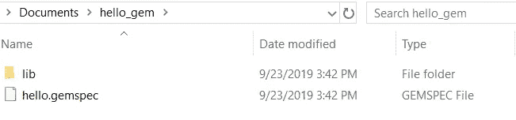

hello_gem 目录

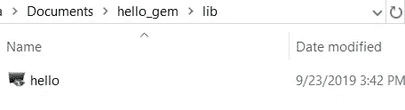

lib 目录

出于本指南的目的，Ruby gem 中的代码很简单。一些关于文件路径的概念会变得复杂，所以保持尽可能简单的代码来弥补这一点是合理的。

打开`hello.rb`文件并创建一个`Hello`类。这个类现在将有一个类方法`greeting`，这个方法将调用`puts`方法，并将`“Hello world!”`作为它的参数。

同学们好！

代码很简单，但它足以检查 gem 的功能。

导航回我们目录的根目录并打开`hello.gemspec`。

`gemspec`储存了大量的数据。作者、版本、包含的文件，甚至更多都在其中定义。`Gem`是 Ruby 类，`Specification`是包含特定宝石信息的[类](https://docs.ruby-lang.org/en/2.5.0/Gem/Specification.html)。

编辑`hello.gemspec` 以匹配下面的要点，尽管带有`authors`、`email`、`homepage`和`date`实例变量的正确信息。对于那些已经将这个项目初始化为 Git 存储库的人来说，主页也可以是一个 GitHub 链接。

实例方法`name`被赋予了字符串`“hello_2019_unique”`。将字符串的`unique`部分改为独特的，这样它就不会与另一个宝石同名，因为这将导致`push`问题。

多好的宝石啊！

让我们建造并安装`Hello`宝石。在命令行中运行以下命令:`gem build hello.gemspec`

成功构建后，读者将会看到以下消息:

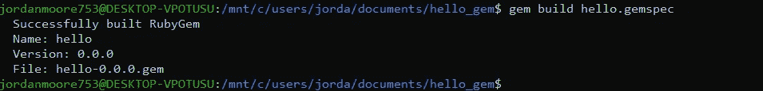

你好宝石建成了。

建好了，就该装宝石了。运行以下命令:

`gem install hello_2019_unique-0.0.0.gem`

希望读者会看到下面的消息:

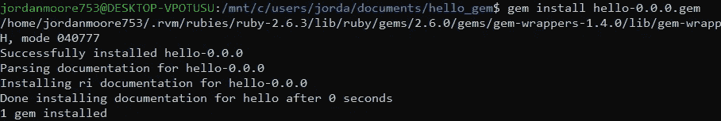

已成功安装。

挑战就要结束了；让我们把`irb`中的`Hello`宝石`require`出来，看看是否有效。下图包含了本文至此处应该看到的控制台输出。

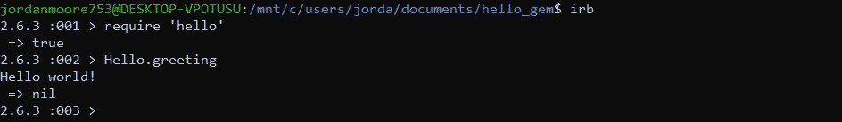

现在我们用油做饭！

接下来，我们将`require`更多的文件，仔细检查`files`实例变量，并使用文件路径。

# 需要更多文件

显然，你的宝石应该不仅仅包括说“你好”的能力为了创建和包含更多的文件，必须在`lib`目录中创建一个与`lib`目录中的 Ruby 文件名相匹配的新目录。导航到`lib`目录并执行该操作。

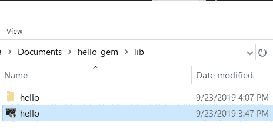

hello 目录在 lib 里面。

这是 RubyGems 的另一个约定:用于 gem 的附加文件位于与`lib`中的 Ruby 文件名相匹配的目录中。导航到`hello`目录并创建一个名为`goodbye.rb`的文件。

下面的要点包含了应该在他们的`Goodbye`类中实现的代码。

接下来，要求`hello.rb`中的`goodbye.rb`。

现在 hello.rb 可以访问 Goodbye 类了。

还记得如何在`gemspec`中包含更多文件吗？再看一下要点，注意文件存储在什么数据结构中。

不能追加到`files`实例方法；相反，必须给它分配一个`array`。另外，不要在这个列表中包含目录，因为在构建过程中目录会自动从 gem 中删除。

大多数宝石都比这个例子大得多，也复杂得多。想象一下，一个 gem 有 50 多个 Ruby 文件分散在嵌套的目录中。如果不用手写，我们如何分配所有这些文件呢？

`Dir[]`类方法就是最好的答案之一。使用`Dir[]`类方法，可以使用文件模式来匹配和包含`lib`的所需文件及其所有嵌套目录。`Dir[]`的返回值是一个数组，这很好，因为我们需要给`files`分配一个数组。[使用前，请阅读更多关于`Dir[]`的](https://ruby-doc.org/core-2.6.4/Dir.html#M002316)。

我们来看一些[文件匹配模式](https://ruby-doc.org/core-2.5.1/File.html)。

根据前面的链接，`*`匹配任何文件。如果我们在`*`后面包含一个文件扩展名，比如`.rb`，那么这个模式现在匹配所有以`.rb`结尾的文件。这个模式将用于匹配和收集我们想要的文件。

`**`模式对于将正确的文件分配给`files`也是至关重要的。这种模式递归地匹配目录，扩展地匹配文件，这意味着如果使用正确，我们可以在`lib`的所有嵌套目录中搜索我们希望包含在 gem 中的文件。

为了测试`**`的递归方面，导航到`lib`中的`hello`目录，并创建一个名为`third_layer`的新目录。在`third_layer`目录中，创建一个名为`example.rb`的文件。不需要在这个文件中包含任何代码，因为它只是用于演示目的。

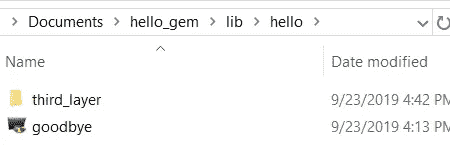

这是在 lib 里面的 hello 目录中。

再次打开`hello.gemspec`。导航到最后一行，向下输入到新的一行。让我们用一个`p`方法调用来测试一下`Dir[`。尝试从`lib`输出我们想要包含的所有文件。如果任何读者希望自己尝试使用`Dir[]`，不要向下滚动，因为下一段和图片包含了包含来自`lib`的所有文件的解决方案。

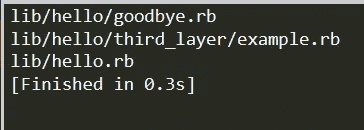

这是 Dir[]之后的文件中包含的内容的输出。

读者可以通过调用“p”方法来测试这一点。

如这个例子所示，`Dir[]`是一个非常有用的类方法。为了进一步测试这个`Dir[]`方法，创建一个扩展名为`.txt`的文件，并将其与`.rb`文件一起包含在`files`中。有几种不同的方法可以做到这一点，即使使用`Dir[]`。尽量具体一点！

现在所有正确的文件都包括在内了，是时候测试一下`hello.rb`了。转到命令行，启动下面一行:`irb -Ilib -rhello`

稍微解释一下是合适的。`-I`是指定`$LOAD_PATH`目录的选项。在这种情况下，它使用`lib`作为`$LOAD_PATH`目录。`-r`选项正在运行文件`hello.rb`并要求当前`irb`会话中的 gem。有更多的选项可以用来修改`irb`会话，如果感兴趣，请查看`IRB`模块[文档](https://docs.ruby-lang.org/en/2.2.0/IRB.html)。

命令行的输出应该如下图所示。

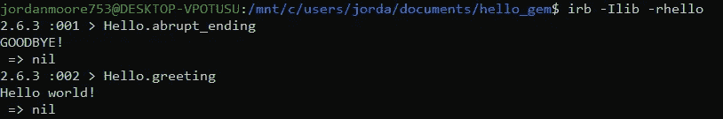

现在可以从 irb 中的 Hello 调用这些方法。

如果任何读者想要这个更新版本的`build`和`install`，请务必在 gemspec 中更新`version`。

版本号 0.0.1！

将代码分离到不同的文件中，并添加逻辑有序的目录，对于创建一个代码对外人有意义的 gem 来说是不可或缺的。此外，理解应用程序中的路径有助于精心设计全面的测试。

# 添加可执行文件

类似于我们如何在命令行中编写`irb`并执行该程序，我们可以在我们的 gem 中包含一个`executable`文件，并用一条命令运行 gem。Gems 通过向外壳路径显示一个或多个可执行文件来做到这一点。

为此，导航至`hello_gem`。然后，发出以下三个命令:

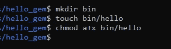

这些命令创建 bin 目录和我们的可执行文件。

这三个命令做了以下工作:创建目录`bin`，其中包含可执行文件。然后，第二个命令在`bin`中创建文件`hello`。最后，`chmod`代表更改模式，在这种情况下，使用`+x`修饰符更改文件的操作。

接下来，在文本编辑器中打开`hello`。为了让这个`executable`真正工作，我们需要在它的顶部添加一个`shebang`，它将指示一个特定语言的可执行 shell 脚本的开始。确保`hello`与以下代码匹配。

这是 bin 目录中 hello 的代码。

关闭`hello`并再次打开命令行。我们将在`gemspec`中要求之前测试`executable`。在命令行中运行以下命令:`ruby -Ilib ./bin/hello`

或者，可以不使用`-Ilib` : `ruby ./bin/hello`来运行命令

因为可执行文件的名称是`hello`，所以通过调用相同的名称来执行可执行文件。测试成功运行后，是时候将可执行文件包含在`hello.gemspec`中了。数组`executables`应该被附加到上，与数组`files`形成鲜明对比，后者应该被赋值给。

更新了可执行文件 hello 的 gemspec。

如果任何读者希望`build`和`install`新的 gem，不要忘记再次更改版本号。在安装新的 gem 之后，不要忘记在命令行中输入`hello`来测试它。我们可以用一个词来称呼我们的程序，这有多酷？

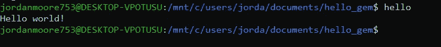

你好世界！

# 把宝石推给 RubyGems

一旦 gem 处于可供他人使用的状态，你就可以`push`将 gem 转到 RubyGems 供他人下载。

首先，创建一个 [RubyGems](https://rubygems.org/) 账户，注意:这听起来很疯狂，但是尽量不要包含特殊字符，如 *$、%、*或*！*密码中。RubyGems 很难认证在命令行中使用这些字符的密码，所以一开始就不使用它们会更容易。还有其他方法可以获得安全的密码，比如改变大写和小写字母、拼写错误的单词等等。

接下来，在命令行中运行以下命令。

`curl -u your_username [https://rubygems.org/api/v1/api_key.yaml](https://rubygems.org/api/v1/api_key.yaml) > ~/.gem/credentials; chmod 0600 ~/.gem/credentials`

此命令为帐户下载特定的 API 密钥。调用该命令的计算机随后与该特定帐户相关联。代替`your_username`的应该是读者的用户名。

一旦 API 设置完毕，`push`gem 向 RubyGems 发出以下命令:

`gem push hello-0.0.your_version.gem`

就是这样！任何使用 RubyGems 的人都可以下载这个 gem。

# 包扎

这篇文章的目标是尽可能多地消除创建第一个宝石的常见障碍。制作一个坚固的宝石有许多固有的基本实践，比如 [TDD](https://thoughtbot.com/playbook/developing/test-driven-development) ，使用 Rakefile 实现任务自动化，等等。这些都是较大的概念，不可能在一篇文章中涵盖。

学习如何创造东西的最好方法之一是对它进行逆向工程。在这种情况下，您可以通读一个 gem 的文件、类和方法，以获得对制作 gem 的逻辑和代码的绝对理解。此外，人们实际上可以重写和重构代码。

为此，我建议从逆向工程一个简单的应用程序开始，不要像 Bundler 或 Rubocop 那样。我最近创建了一个名为 [EasyPortfolio](https://github.com/jordanmoore753/EasyPortfolio) 的 gem，它为软件工程师求职者创建了一个 Sinatra 支持的 Portfolio 页面。对于第一次制作宝石的人来说，这种宝石很容易理解，但也很复杂，足以让你看到宝石所能展现的力量。

总之，记住一个成功的 gem 的标志:让 Ruby 程序员的生活变得更容易的能力。祝好运和成功，红宝石士兵。创造美好的东西！