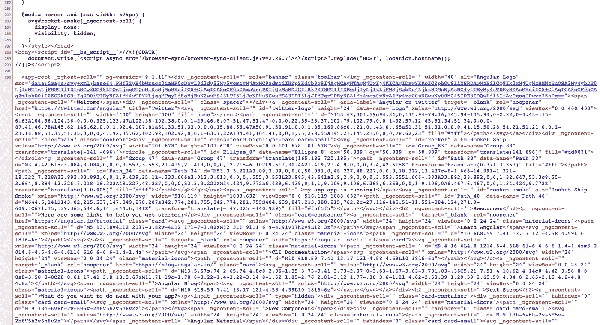

# 2020 年角搜索引擎优化的权威指南

> 原文：<https://betterprogramming.pub/the-definitive-guide-to-angular-seo-in-2020-6f3562e110b7>

## “SEO 不再是游戏系统；这是关于学习如何按规则行事”——乔丹·泰彻

图片来源:作者

前端 web 开发生态系统已经发展了。大大小小的公司/社区每天都在努力让它变得更好。当我说 2020 年的前端开发将围绕单页面应用程序(SPAs)时，你不会感到惊讶。许多框架利用该技术来帮助我们更好地构建。我们已经看到了水疗在过去十年中的发展，Angular 是该领域的重要参与者。

Angular 已经存在了将近五年。开发人员社区已经用它创建了大量的应用程序，它仍然是开发人员的首选。协作和社区不断努力为我们带来更好的工具和生态系统，让开发人员的工作不那么痛苦。

说到水疗，什么都好，除了 SEO。在 Angular 创建 *SEO 友好的*spa 并不容易！大多数搜索引擎爬虫从不执行 JavaScript，只爬行*页面源。*这使得 spa 中的 SEO 变得非常困难。

# 为什么 SEO 很重要？

虽然付费广告、社交媒体和其他在线平台可以为网站带来流量，但大部分在线流量是由谷歌等搜索引擎驱动的。

SEO 也是仅有的在线营销渠道之一，如果设置正确，随着时间的推移，它可以继续获得回报。如果你提供了一个坚实的内容，值得为正确的关键字排名，你的流量可以随着时间的推移滚雪球，而广告需要持续的资金来发送流量到你的网站。

优化您的网站将有助于向搜索引擎提供更好的信息，以便您的内容可以被正确索引并显示在搜索结果中。

在本文中，我们将介绍一些工具和技巧，让Ángular 应用程序变得 SEO 友好。我将解释常见的实践和我一路上学到的东西。我们走吧！

# 帮助你的工具！

让我们列出一些工具和实践，来确保你的 angular 应用程序是 SEO 就绪的。

## 1.[角万向](https://github.com/angular/universal) (SSR)

从文档中:

> ngular universal 是一种在服务器上渲染角度应用的技术。一个普通的 Angular 应用程序在浏览器中执行，响应用户动作在 DOM 中呈现页面。Angular Universal 在服务器上执行，生成静态应用程序页面，这些页面稍后会在客户端上引导。这意味着应用程序通常呈现得更快，让用户有机会在完全交互之前查看应用程序布局。
> 
> — [角度文件](https://angular.io/guide/universal)

如前所述，爬虫只根据应用程序的页面源来评估页面。典型的 Angular 应用程序页面源代码如下所示:

典型的 angular 应用程序页面源

如您所见，内容在页面源代码中是不可见的。我们在文件末尾有多个 JavaScript 捆绑文件，它们将在页面加载时执行，并将数据呈现给浏览器。

这就是 Angular universal 的用武之地。这个工具执行相关的 JavaScript 文件，并向客户端提供一个编译好的*index.html*页面，其中包含渲染的内容。现在，当爬虫点击 URL 时，这个包含内容的页面被接收并准备好进行评估。

这是 Angular universal 服务器端呈现的应用程序源代码的样子:

Angular 通用 SSR 页面源码

你可以在这里阅读更多关于 Angular universal 和 SSR [的内容。](https://angular.io/guide/universal)

## 2.[标题](https://angular.io/api/platform-browser/Title)和[元](https://angular.io/api/platform-browser/Meta)标签

元标签是描述页面内容的文本片段。Meta 标签不会出现在页面本身，而是出现在页面的源代码中。元标签本质上是一些小的内容描述符，帮助告诉搜索引擎网页是关于什么的。它们在社交分享中最为重要，因为几乎所有的社交媒体平台都使用这些标签来预览链接。

您可以使用来自[@ angular/platform-browser](https://angular.io/api/platform-browser)的`Meta`类，以便于在每个页面上呈现 meta 标签。您可以在页面加载时设置一个标签，并根据需要进行更新。

使用从[@ angular/platform-browser](https://angular.io/api/platform-browser)导入的`Title`类可以动态呈现`title`标签。

点击阅读更多关于渲染元标签[的内容。](https://www.digitalocean.com/community/tutorials/angular-meta-tags)

## 3.[schema.org](https://schema.org/)规格

模式结构化数据是提供描述页面内容的附加元数据的一种方式。这是首选方式，因为 Google 会根据这些规范突出显示页面。

下面是一个食谱页面结构化数据的简单示例:

您可以将`[ngx-json-ld](https://www.npmjs.com/package/ngx-json-ld)`包用于您的 Angular 应用程序，轻松实现这一点！这个包非常轻，很容易实现。

参考[schema.org](https://schema.org/)了解所有可用的模式，并查看[这篇](https://coryrylan.com/blog/angular-seo-with-schema-and-json-ld)文章了解更多信息。

## **4。规范的 URL**

规范 URL 有助于搜索引擎将各个 URL 的信息(如链接)整合到一个权威的 URL 中。它通过提供一个准确的 URL 来完成对页面的授权。避免规范 URL 的重复也很重要。例如:

`<link rel=”canonical” href=”[https://www.tesla.com/](https://www.tesla.com/)" />`

您可以使用[文档注入器](https://angular.io/api/common/DOCUMENT)添加一个规范 URL，如下所示:

## **5。惰性加载**

你的 SEO 分数很大程度上取决于页面加载速度。保持较低的初始页面加载时间以使用户停留在页面上是至关重要的。通常情况下，五秒钟以下是阻止用户的合适的初始加载时间。

众所周知，角度应用程序体积庞大。angular 团队正在尽最大努力获得更小的包尺寸，但它仍然很笨重。这意味着我们的 Angular 应用程序的初始加载时间可能会更慢，这可能会严重影响您的 SEO 性能。

这就是延迟加载的用武之地。惰性加载是一种将应用程序模块分解成小块的技术，这样就可以按需惰性地下载模块。

例如，如果你有一个`homepage`和`contact page`，你可以把它分解成两个模块，然后缓慢加载。您可能有多个`contact page`的包和组件，它们不需要在初始加载时下载到浏览器中。

延迟加载可以显著提升应用程序的性能，并导致更快的初始加载性能。点击了解更多关于延迟加载[的信息。](https://angular.io/guide/lazy-loading-ngmodules)

## 6.渐进式网络应用(PWA)

渐进式 web 应用程序(PWA)是一种具有一系列功能(类似于原生应用程序)的 Web 应用程序，可以为用户提供类似应用程序的体验。PWA 使 web 应用程序可以作为本机应用程序添加到用户的移动(或桌面)主屏幕上，甚至不必经过应用程序部署过程。

在 Angular 中实现 PWA 是小菜一碟——它提供了开箱即用的支持。PWA 的 SEO 方面主要在离线缓存上。一旦用户访问我们的页面，数据就会缓存在设备上。下一次，这些离线数据有助于更快地服务于页面，并使用户体验更好。

`ng add @angular/pwa — project *project-name*`

这一行命令添加了 PWA 功能，您可以将这些功能配置到您的角度应用程序中。一旦用户访问你的应用程序，就会有一个离线版本的应用程序可用

点击阅读更多关于在角度[中实施 PWA 的信息。](https://angular.io/guide/service-worker-getting-started)

## 7.预渲染

预渲染是一种预先将页面编译成静态文件的技术，以便在客户端获得更快的初始加载时间。

可以通过使用 angular universal 的预渲染功能来实现这一点。

SSR 和预呈现之间的区别在于，前者在使用 node.js 服务器发出请求时动态呈现`index.html`文件，而后者则预先呈现，因此`index.html`页面可以作为静态资产。如果数据更新不太频繁，那么预渲染是一个不错的选择。

我写了一篇关于如何在 Angular 中预呈现以及它如何帮助 SEO 的文章——在这里找到。

# 更多需要记住的事情

*   在整个应用程序中使用较小的图像。
*   确保对所有图像使用`alt`标签。
*   避免内嵌样式，使用样式表。
*   避免使用废弃的标签(比如``)。
*   使用谷歌分析。
*   确保你有一个用户友好的`/404`页面。
*   尝试在初始加载时向服务器发出最少的请求。

更多类似的文章👇

 [## Bharath Ravi | javaScript 文章

### 有能力的文章来提升你的网络技能。javaScript 全栈开发者 Bharath Ravi 的个人博客

bharathravi.com](https://bharathravi.com/) 

黑客快乐！