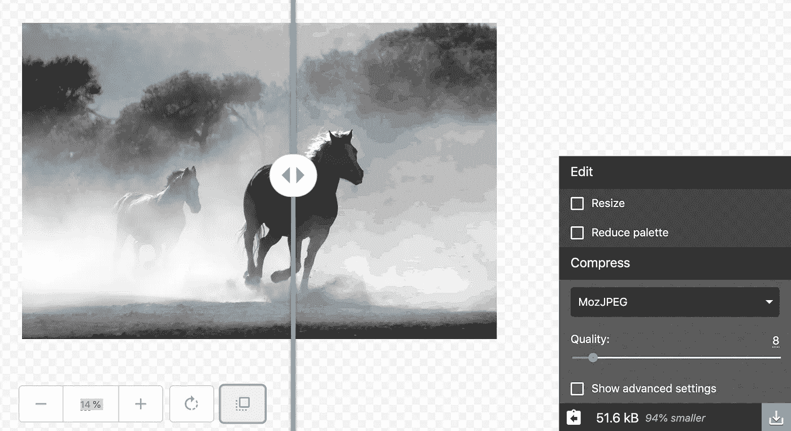
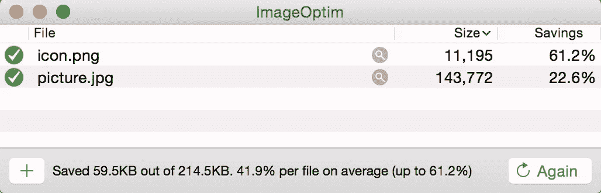

# 提高 Web 应用程序性能的权威指南

> 原文：<https://betterprogramming.pub/the-definitive-guide-to-boosting-your-web-application-performance-2b172574f37f>

## 一个有用的工具和资源的书签列表，可以提高你的速度和效率


格伦·卡斯滕斯-彼得斯在 [Unsplash](https://unsplash.com/?utm_source=unsplash&utm_medium=referral&utm_content=creditCopyText) 上拍摄的照片

如果你的网站在三秒钟内没有加载，谷歌会把它标记为慢。想到这一点很可怕，因为今天大量的网站实际上都很慢。人类即将登上火星，而地球上的网站仍然是通过拙劣的实践建立和维护的，导致整个互联网上的网站运行缓慢。除非你正在构建一个进步的 web 应用程序，否则你的网站被认为很慢的可能性很高。

所以解决方法很简单:不要建网站，建一个进步的 web app！

通过这样做，你已经成功了一半。现在要赢得剩下的一半，你需要指导，你需要工具。在我不断追求在 [Hyperware](http://Hyperwarex.com) 构建高质量的快速网络应用的过程中，我学到了一件事:如果你寻找，互联网会向你扔出成千上万的提示和工具，但只有少数几个对完成工作真正有用。找到它们是一项艰巨的任务。

这篇文章是我个人认为有用的经过试验和测试的工具和优化技巧的最终集合，还有一些我在为企业构建渐进式 web 应用程序时仍然会参考的有用文章。

当你有更好的事情要关注时，继续寻找事情是很痛苦的。这就是为什么我为你做这个脏活，并试图写一篇值得书签的文章！

给你，最好的工具:

*   优化或压缩图像
*   检查网站性能
*   提升您的 Web 应用程序性能

# **优化或压缩图像**

## Squoosh

[Squoosh](https://squoosh.app/) 是我用过的最好的优化工具。我真希望我能早点发现它。Squoosh 是由 Google 工程师构建的，但最棒的是，当你设置质量等级时，你可以看到优化和未优化图像之间的实时差异。Squoosh 易于使用，让你清楚地知道压缩后的图像会是什么样子。



## ImageOptim

ImageOptim 是一个简单易用的图像优化器。它会自动缩小图像的大小，而不会损失图像的原始质量。ImageOptim 有一个友好的拖放界面和一个多文件上传选项，因此它非常用户友好。虽然 ImageOptim 只适用于 Mac，但对于 Windows 用户来说， [FileOptimizer](https://sourceforge.net/projects/nikkhokkho/) 是一个很好的选择。



# **检查网站性能**

网站绩效评分工具不仅仅是 100 分中的一个数字——它们应该被用来反复地发现和修复网站的薄弱部分。

## 灯塔

谈到了解网站性能，没有什么工具比 [Lighthouse](https://developers.google.com/web/tools/lighthouse/) 更好。90+的性能分数是 web 应用程序的绝对基准。我强烈推荐阅读以下文章，以便更好地了解谷歌灯塔:

[](https://developers.google.com/web/tools/lighthouse/) [## 灯塔|网站开发者工具|谷歌开发者

### 了解如何设置 Lighthouse 来审核您的 web 应用程序。

developers.google.com](https://developers.google.com/web/tools/lighthouse/) 

专业提示:使用 [Lighthouse chrome 扩展](https://chrome.google.com/webstore/detail/lighthouse/blipmdconlkpinefehnmjammfjpmpbjk?hl=en)可以更快地审计任何网页。

## GTmetrix

除了 Lighthouse 之外，GTmetrix 可能是你唯一需要的工具来进一步检查你的网站上任何可能的修复。它显示了提高网页速度以及页面加载时间和总页面大小的相关机会。

# **提升您的 Web 应用性能**

1.  以前总是调用 CSS 文件。js 文件。
2.  在你的 HTML 文件中尽量少用<link rel="“preload”">或< link rel= “prefetch”>，除非你有一个键请求需要提前加载。
3.  捆绑销售对于需要不断更新的应用程序来说是很好的，比如新闻应用程序。对于小型应用程序，最好服务于单个。js 和。css 文件，这将减少 HTTP 请求的数量。
4.  使用 Pagespeed 模块。PageSpeed 模块是开源服务器模块，可以自动优化您的站点。静态宿主用户可以将下面的代码放在他们的。启用页面速度模块。

```
<IfModule pagespeed_module>
   ModPagespeed on
   ModPagespeedEnableFilters extend_cache
</IfModule>
```

[](https://developers.google.com/speed/pagespeed/module/) [## 页面速度模块|谷歌开发者

### PageSpeed 模块是开源服务器模块，可以自动优化您的站点。

developers.google.com](https://developers.google.com/speed/pagespeed/module/) 

5.缩小或压缩。js 和。css 文件。为此，可以使用各种在线工具(例如 [minifier](https://www.minifier.org/) )。如果你使用[网络包](https://webpack.js.org/)，那么你的文件将会在生产构建时自动缩小！

6.如果您将 Webpack 用作模块捆绑器，请使用 Webpack 优化插件，如 [UglifyJs](https://www.npmjs.com/package/uglifyjs-webpack-plugin) 、 [ModuleConcatenate、](https://webpack.js.org/plugins/module-concatenation-plugin/)和 [Splitchunks](https://webpack.js.org/plugins/split-chunks-plugin/) 。

7.使用 [Webpack Bundle Analyzer 插件](https://www.npmjs.com/package/webpack-bundle-analyzer)了解哪些模块在应用的生产版本中占用了多少空间。减少未使用或很少使用的模块，这些模块会在您的包中占据大量空间。

# **一些关于提高 Web 应用程序性能的额外文章**

有能替你干脏活的工具真好。这是开发者热爱 Webpack 的原因之一，也是他们不了解 Webpack 工作原理的原因之一！

以下内容是对性能优化世界的深入探究。你会明白网站速度的方式、内容和原因。花点时间，通过这些内容学习浏览器渲染和网站速度的基础知识。

## 使用 Chrome DevTools 优化网站速度

## 浏览器渲染优化——谷歌的免费课程

[](https://www.udacity.com/course/browser-rendering-optimization--ud860) [## 浏览器渲染优化| Udacity

### 本课程将揭开浏览器渲染管道的神秘面纱，让您轻松构建高性能的 web…

www.udacity.com](https://www.udacity.com/course/browser-rendering-optimization--ud860) 

## 谷歌渐进式网络应用指南

[](https://developers.google.com/web/ilt/pwa/) [## 渐进式网络应用培训|网络|谷歌开发者

### 我们访问互联网的方式已经改变。随着智能手机和移动设备的增长，我们看到数百万…

developers.google.com](https://developers.google.com/web/ilt/pwa/) 

## 了解 Webpack 中的代码拆分和捆绑包拆分

[](https://hackernoon.com/the-100-correct-way-to-split-your-chunks-with-webpack-f8a9df5b7758) [## 用 Webpack 正确地分割你的块

### 找出向用户提供文件的最佳方式可能是一件棘手的事情。有这么多不同的场景…

hackernoon.com](https://hackernoon.com/the-100-correct-way-to-split-your-chunks-with-webpack-f8a9df5b7758) 

我相信以上所有的信息将会极大地帮助你提高你的 web 应用程序的性能。由于互联网上的事情变化很快，每当我遇到其他有用的东西，我都会更新这篇文章。敬请期待！