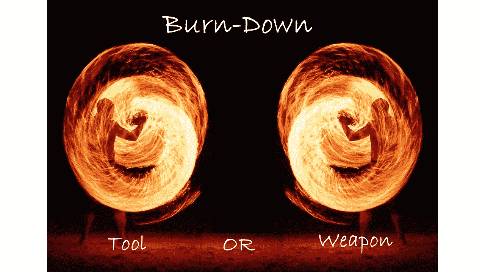
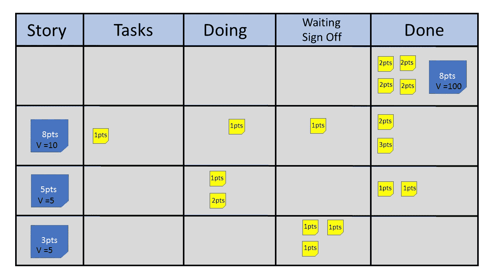
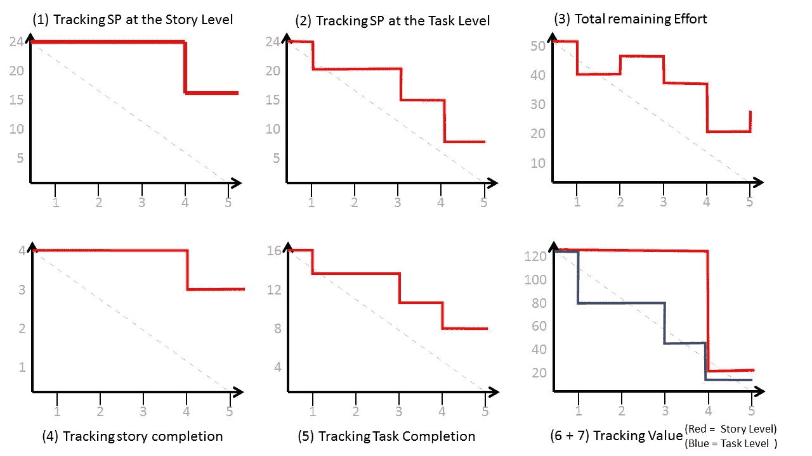

# 你使用燃尽图的方式对你有帮助还是阻碍？

> 原文：<https://betterprogramming.pub/the-definitive-guide-to-burn-down-charts-a176db096294>

## 燃尽图是工具还是武器？

使用燃尽图就像玩火；你可能会感到温暖，也可能会被严重烧伤

燃尽图已经成为 Scrum 的同义词。虽然本意是作为一种工具，但它们往往成为一种武器。如果使用不当，他们可以迅速摧毁一个团队。如果不能正确理解，它们甚至会变得一无是处。你对燃烧的使用是创造了还是破坏了团队内部正在发生的事情的清晰性？

# **起源和目的**

《T2》燃尽图起源于千年之交的[肯·施瓦布](https://en.wikipedia.org/wiki/Ken_Schwaber)。他的目的是为 scrum 团队提供一个简单的工具包，在冲刺阶段使用。在发明后的几年里，它得到了普及和广泛使用。燃尽图的核心是一个简单的图表。它在垂直 y 轴上显示剩余的工作量，在水平 x 轴上显示经过的时间。然后在左上角和右下角之间画一条直线。这条线代表冲刺阶段的理想进度。

这个图表是为一个单一的任务设计的:监控团队在实现 sprint 或其他一些定义的目标方面的进展。最初的概念使用总的估计小时数作为纵轴，天数作为横轴。

我们能否达到目标是燃尽图回答的唯一问题。

任何从事开发工作的人都知道，准确的评估几乎是不可能的。一旦你开始着手一项任务，你就进入了学习阶段。这几乎总是会导致你的估计之外的发现。所以完成的估计需要增加。从计算的早期开始，团队就无法准确地估计 IT 工作量。这甚至是 1968 年第一次北约信息技术会议的议程项目。

考虑这个例子。你估计需要八个小时才能完成。工作了四个小时后，你相信还有八个小时的工作剩余。这是在 IT 环境中开发的现实。燃尽图根据剩余时间跟踪每天结束时要完成的新的总估计值。然后，团队将使用它来判断在给定剩余工作和剩余时间的估计总数的情况下，他们是否仍然能够实现 sprint 目标。

以这种方式使用燃尽图需要团队定期重新估计剩余的总工作量。如果他们不这样做，燃尽图就变得毫无价值。燃尽图已经存在了 20 年，它们已经发展到可以更好地反映我们目前的工作方式。他们也被传统的管理者劫持，用来监视和控制团队，把他们从一个有用的团队工具变成了压迫的武器。

# ***管理爱情图表***

传统的管理思想牢记了[彼得·德鲁克](https://en.wikipedia.org/wiki/Peter_Drucker)的一句名言:

> “你无法管理你无法衡量的东西。”

这在估计值和实际值之间建立了一个看似重要的联系。当这两种方法一起使用时，你就有了一种管理机制。良好的管理会让你缩小差距。这提供了更大的可预测性，这对每个人都有好处。

燃尽图似乎是这项工作的理想工具。图表显示了与理想值的偏差。如果实际情况低于理想情况，那么你比预期做得更好。如果现实偏离理想，你就落后了。该图表至少每天更新一次，以便管理层能够迅速采取措施纠正任何偏差。

也可以使用燃尽图中的数据来确定长期趋势。这些可用于设定和跟踪持续改进的目标。随着数字工具的广泛使用，燃尽图的自动化生产使得数据更加容易获取。甚至可以使用这些数据来比较不同团队的表现。这种逻辑导致燃尽图在许多组织中被武器化。

**团队内使用的烧毁=工具**

**团队外使用的烧毁=潜在武器**

回到彼得·德鲁克的原话——他澄清了这句话:

> "除非成功被定义和追踪，否则你无法知道自己是否成功."

我们现在可以看看燃尽图在这些方面代表了什么。我们将 scrum 中每个 sprint 的成功定义为我们是否达到了 sprint 的目标。燃尽图跟踪实现这一目标的进度。由于 scrum 团队是自组织的，团队成员是唯一能够指导和纠正完成的工作的人。他们每天开会讨论这个话题，并根据需要做出反应，以确保目标可以实现。Scrum 中不存在外部管理。与团队之外的人分享燃尽数据有助于提高透明度和公开性。

scrum 中的透明性和开放性不是被管理的邀请。

# 燃尽图的基本事实

我们在 Scrum 中使用的每一种工具或实践都有其优点和缺点。只有了解这些局限性，我们才能意识到好处。燃尽图的最大缺陷是认为它们可以孤立存在。

该数据是一个 sprint 中所有项目的组合。因此，要了解正在发生的情况，您需要结合燃尽图来查看各个项目的状态。如果无法获得这些支持数据，燃尽图只能在冲刺阶段的最后提供有意义的信息。这意味着它只存在于图上的一个点。

一个独立的燃尽图能提供的唯一有意义的信息是冲刺目标是否已经实现。这通过实际的线穿过水平 x 轴来证明。只有当您选择了要在垂直 y 轴上使用的正确度量时，这才是正确的。甚至这一点也很可能被否定，这并不罕见。

燃尽图只有一个有意义的点。连这个点选不好 y 轴也会丢。

# 燃尽图在运行

燃尽图的总体形状和效用主要取决于为 y 轴选择的度量。最初的概念使用时间(小时)作为 y 轴，但这在今天很少以任何有意义的方式使用。估计时间的困难是众所周知和理解的。因此，趋势是远离绝对测量，转而使用基于相对概念的测量。使用时间进行评估通常表明传统的管理思想仍然在你的组织中占主导地位。

所有作为例子给出的燃尽图都是基于这个 scrum 板的数据

上面简化的 scrum 板显示了五天冲刺结束时的状态。通过查看白板，大多数 scrum 大师能够对应该回归的主题做出明智的判断。下面的六个燃尽图显示了 sprint 期间的相同工作进度。

这些图表是创造了清晰还是扭曲了清晰？

从这些图表中可以清楚地看出，这对车队来说不是一次好的冲刺。单独看任何一张图表，有可能做出明智的判断吗？它们都展示了由同一个团队完成的相同工作。这种多样性完全取决于决定跟踪什么是重要的。

以上措施都是我在执教球队时多次看到的例子。有些人纯粹是因为虚荣心而被选中，因为这让团队在经理面前看起来很好。选择其他的是因为它是工具中的一个选项。你所做的决定应该基于哪个措施对团队有帮助。当你考虑到敏捷的一个基本要素时，很少有好的选择。

敏捷中的工作是二元的:要么 100%完成，要么不完成。99%完成等同于 0%完成。

1.  在故事级别跟踪 SP ( [故事点](https://www.mountaingoatsoftware.com/blog/what-are-story-points))。这是少数几个好的选择之一，因为它计算的是 100%完成的工作。
2.  在任务级别跟踪 SP(故事点)。当团队花费很大比例的冲刺来完全完成每个故事时，这是很常见的。每项任务都被分配了总故事 SP 值的一部分。任务完成后，燃尽会更新。这给人一种进步的更好印象。这是传统管理思维驱动你交付的标志。因为这不符合“要么 100%要么全无”的原则，所以这是一个糟糕的选择。这种风格的燃尽图破坏了一个有意义的点，因为你无法判断你是否真的完成了任何故事。
3.  总剩余工作量。这张图表展示了最初的概念。这里需要注意的关键点是，在每天结束时，剩余的总工作量可能会上升，也可能会下降。由于不断重新估算的开销和在小时内估算的困难，这是一个**糟糕的选择**。一些团队仍然在使用它，作为一个内部工具，它会非常有帮助。它对团队以外的任何人都没有价值。我经常看到时间消耗燃尽的变化。在这种情况下，scrum master 跟踪每个团队成员在项目上工作的小时数。然后他们在燃尽图上画出这一点:如果人们加班，那么你高于理想，如果他们不加班，那么你低于理想。当团队之间共享资源时，这是很常见的。这通常也被称为“保存时间表”
4.  跟踪故事完成情况。这是一个很好的选择，因为它计算的是 100%完成的工作。
5.  跟踪任务完成情况。这是一个**糟糕的选择**，因为你没有坚持 100%或没有规则。采用这种燃尽方式的原因和问题与方案 2 中概述的相同。
6.  在故事级别跟踪价值。从表面上看，这听起来是最好的选择，因为 Scrum 是关于创造价值的。这里要记住的是，你所追踪的价值是不真实的。[真正的价值只存在于你将产品交付给真正的用户的时候](https://productcoalition.com/the-one-metric-that-rules-them-all-6de95b22c99b?source=friends_link&sk=b911ec42db13c19b0f44b288ce89afd9)。这里的值是预期值，可能与实际值相差很大。使用这个**是一个很好的选择**，因为它比使用故事点或仅仅使用故事提供了更好的洞察力。从 scrum board 和 burndown 图表中可以看出，尽管团队只交付了一个故事，但它占了总潜在价值的大约 90%。虽然这是一个很好的选择，但很少使用，因为分配有意义的值是一项困难的任务。
7.  任务级别的跟踪值。出于与选项 2 和 5 相同的原因，这被认为是一个**糟糕的选择**。

# 结论

根据我的经验，大多数使用燃尽图的团队之所以这样做，是因为他们仍然保留着传统管理思想的残余。图表被用作团队内部或远离团队的经理的伪报告和进度跟踪。

敏捷宣言指出面对面的交流是传递信息最有效的方式。当使用 Scrum 时，我们应该鼓励直接交流。像[吉拉](https://www.atlassian.com/software/jira)这样的工具的广泛使用使得燃尽图的创建变得容易，使得 scrum 大师和管理者认为他们必须使用它们。你需要问自己的问题是，“我们是否在利用燃尽来帮助我们实现冲刺目标？”数量惊人的忽视冲刺目标概念的团队仍然虔诚地使用燃尽图。

仅仅因为你知道敏捷实践并不意味着你需要使用它。

只有在理解 scrum 板上的信息时，燃尽图才有真正的价值。为什么要为他们费心呢？用 scrum 板就行了。如果团队之外的人想知道你做得怎么样，让他们来找你。教他们阅读你的 scrum 板。

我鼓励我指导的所有高管和高级经理花时间四处走走，看看公告板。得知首席执行官对团队的工作感兴趣，这对士气很有帮助。对于 C 级和高级管理人员来说，注意到团队注意到的障碍或问题，然后在每天的混乱之前消除它们，这种情况也并不少见。如果他们相信烧毁图表才是最重要的，这种事情就永远不会发生。

除了燃尽图，还有其他方法可以让你评估实现冲刺目标的可能性。试着在你板上的故事上使用笑脸。“高兴”意味着有信心 100%完成。“不开心”意味着它肯定不会完成。介于两者之间意味着我们遇到了问题，但仍然认为我们将在冲刺结束时取得 100%的成绩。

真正的敏捷来自于理解你为什么要做一件事，并且有足够的勇气脱颖而出。真正的敏捷不是维持现状，而是挑战现状。

# 结束注释

燃尽图仅用于监控实现冲刺目标的进度。你参加 sprint 的每个项目都有助于实现 sprint 目标吗？如果不是，那么这些应该包括在燃尽图上吗？