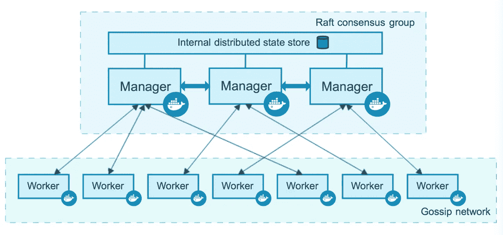
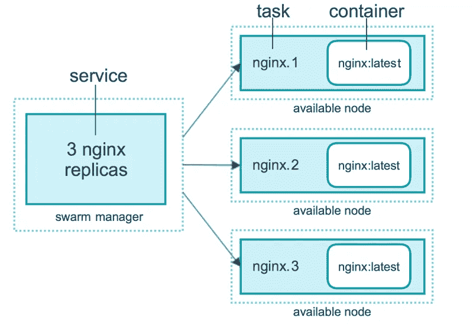
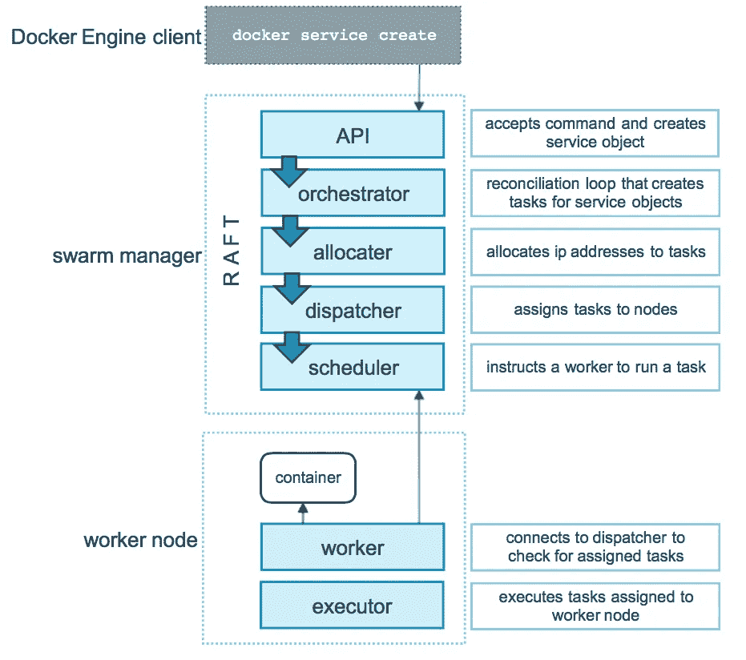
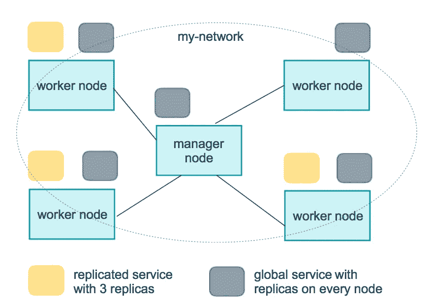
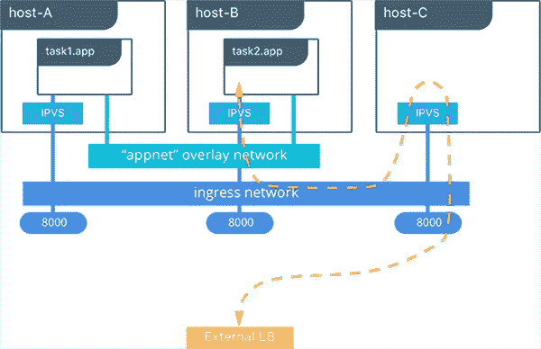
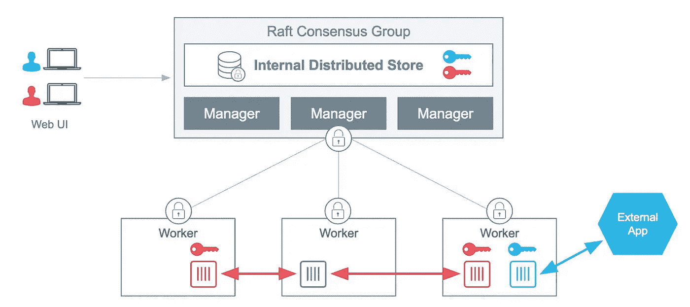
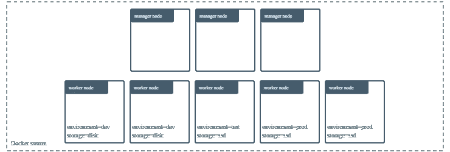
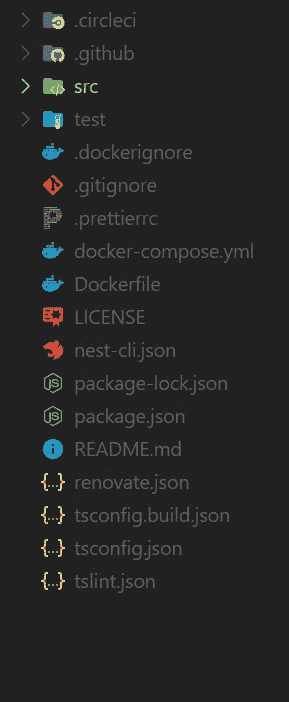
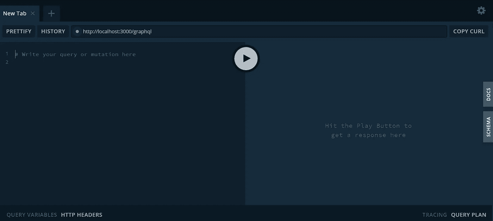

# Docker Swarm 的权威指南

> 原文：<https://betterprogramming.pub/the-definitive-guide-to-docker-swarm-a37f78d39fb3>

## 关于 Docker Swarm 以及如何使用它来扩展和安全维护您的 Docker 项目，您需要了解的一切


图片由 [Flickr 上的](https://www.flickr.com/photos/atbaker/3190753344)[亚当·贝克](https://www.flickr.com/photos/atbaker/)r

随着应用程序需要越来越多的计算资源和接近 100%的正常运行时间，如果没有某种管理系统，就很难维护和扩展您的软件。这就是 Docker Swarm 发挥作用的地方。Docker Swarm 提供了一种简单的方法来扩展和维护你的容器和服务。

本指南将向您展示所有重要的概念和命令以及配置文件的结构。在本文的最后，它还将给出一个真实的例子，说明如何部署一个真实的应用程序。

# 为什么要关心 Docker Swarm？

在我们进入蜂群的技术细节之前，让我们先讨论一下为什么有人会使用它。

## 负载平衡

Swarm 有一个内置的负载平衡器，可以让你指定如何在不同的节点之间分配服务和容器。您还可以为外部负载平衡服务公开端口。

## 集成到 Docker 引擎中

Swarm 直接集成到 Docker CLI 中，不需要任何额外的编排软件或其他工具来创建或管理 swarm。

## 缩放比例

Swarm 允许你定义每个服务要运行的任务数量。这个数字可以用一个命令来改变，这个命令由群管理器处理。

Swarm 允许您增量应用服务更新，这意味着它一次更新特定数量的副本，并且您的服务将始终保持运行——甚至在更新时。

# 什么是蜂群？

Docker Swarm 是一个集群管理和协调工具，可以轻松扩展和管理您现有的 Docker 服务。

一个*群*由多个 Docker 主机组成，这些主机以所谓的群模式运行，并充当*管理者*(管理成员关系)或*工作者*(运行服务)。给定的 Docker 主机可以是管理者、工作者，或者可以执行这两种角色。

在集群中创建服务时，您需要定义服务的最佳状态(副本数量、服务端口、网络和存储资源等)。Docker 将通过重新启动/重新调度不可用的任务以及平衡不同节点之间的负载来试图保持这种期望的状态。

# 节点

节点是参与群的 Docker 引擎的实例。您可以在单个设备上运行一个或多个节点，但是生产部署通常包括分布在多个物理设备上的 Docker 节点。



[码头工人群体节点](https://docs.docker.com/engine/swarm/how-swarm-mode-works/nodes/)

## 管理器节点

管理节点将传入的任务分配和调度到工作节点上，维护集群状态，并执行协调和集群管理功能。管理节点也可以选择为工作节点运行服务。

集群管理任务包括:

*   维护集群状态
*   调度服务
*   为 HTTP API 端点提供群体模式服务

由于以下原因，您的集群中应该始终有多个管理器节点:

*   保持高可用性
*   无需停机即可轻松从管理节点故障中恢复

这就是为什么 Docker 建议您根据项目的可用性需求实现奇数个节点。

**注意:** Docker 建议一个群最多有七个管理节点。

## 工作节点

工作者节点也是 Docker 引擎的实例，其唯一目的是按照管理者节点的指示执行容器和服务。

要将您的应用程序部署到 swarm，您至少需要一个管理器节点。默认情况下，所有管理器节点也是工作节点。为了防止调度器将任务放在多节点群中的 manager 节点上，您需要将 availability 设置为`Drain`。

# 服务

一个*服务*是在节点上执行的任务的定义。这是用户与群体互动的主要根源。

当您创建服务时，您可以指定要使用的容器映像以及要在运行的容器中执行的命令。您还可以为服务定义其他选项，包括:

*   要公开的端口
*   CPU 和内存限制
*   要在群集中运行的映像副本的数量
*   滚动更新策略

下面是一个 HTTP 服务器在三个副本上平衡负载的示例:



[具有三个副本的 Docker 群服务](https://docs.docker.com/engine/swarm/how-swarm-mode-works/services/)

如您所见，该服务有三个不同的任务，每个任务只调用一个容器。任务表示调度程序可以放置容器的位置。一旦容器是活动的，调度器就识别出任务处于`Running`状态。

## 任务调度

一个*任务*携带一个 Docker 容器和在容器内部执行的命令。这是蜂群的原子调度单元。管理节点根据服务中副本集的数量将任务分配给工作节点。

当创建或更新服务时，orchestrator 通过调度任务来实现所需的状态。每个任务都是一个插槽，调度程序通过生成一个容器来填充它——这是任务的实例化。现在，当其中一个容器运行状况检查失败或崩溃时，orchestrator 会创建一个新的复制任务，生成一个新容器来替换失败的容器。

下图显示了 swarm 模式如何接受服务并为工作节点调度任务。



[Docker 任务调度](https://docs.docker.com/engine/swarm/how-swarm-mode-works/services/)

## 复制和全球服务

有两种不同的方法可以部署服务，复制和全局。

*复制服务*指定您想要运行的相同任务(副本)的数量。然后，这些副本将被拆分到不同的工作节点上，每个副本提供相同的内容。

*全局服务*是一种在集群中的每个节点上运行一个任务的服务，不需要预先指定数量的任务。全局服务通常用于监视代理或您希望在每个节点上运行的任何其他类型的容器。

这是一个三服务副本和一个全局服务的可视化表示。



[Docker 副本可视化](https://docs.docker.com/engine/swarm/how-swarm-mode-works/services/)

# 入门指南

既然您已经了解了 Docker Swarm 的关键概念，我们可以继续学习创建和管理集群的基础知识。

## 装置

Swarm 几乎可以在任何操作系统上运行，并且非常容易安装，所以让我们开始吧。

**Windows 和 Mac:**

Compose 包含在 Windows 和 Mac 桌面安装中，不必单独安装。安装说明可在此处找到:

**Linux:**

如果你使用物理 Linux 机器或云托管服务作为主机，只需遵循 Docker 提供的[安装说明](https://docs.docker.com/install/)。

## 创造一个蜂群

在你的机器上安装 Docker 的第一步是创建一个蜂群。为此，我们需要运行以下命令。

```
docker swarm init --advertise-addr <MANAGER-IP>
```

`MANAGER-IP`是群节点管理器将用来广告群集群服务的 IP。(如果您使用 Docker Desktop for Mac 或 Docker Desktop for Windows 来测试单节点群，只需不带参数地运行`docker swarm init` 。)

## 向群集添加节点

创建完 swarm 集群后，我们现在可以使用上述命令输出提供的 Docker 命令添加一个新的节点 worker。

```
docker swarm join --token SWMTKN-1-41r5smr3kgfx780781xxgbenin2dp7qikfh9eketc0wrhrkzsn-8lbew6gpgxwd5fkn52l7s6fof 192.168.65.3:2377
```

该节点将作为工作者节点加入群。如果您想授予它管理员权限，您需要提升它或使用另一个 invite 令牌。

可以使用以下命令显示 invite 令牌:

```
docker swarm join-token manager
```

## 查看当前节点

您的群中当前节点的状态可以使用`node ls`命令来验证。

```
docker node ls
```

从该命令的输出中，您将看到您的节点是活动的，可以使用了。

您可以将节点升级或降级为管理者或工作者角色。如果某个特殊节点不可用，并且您需要替换它，这将非常有用。

```
# Promote node to manager 
docker node promote docker-node

# Demote node to worker 
docker node demote docker-node
```

您也可以使用 update 命令来更改角色。

```
docker node update --role manager docker-node
```

## 离开蜂群

一个节点可以自己离开群体或者被管理节点移除。

```
# Leaving the swarm 
docker swarm leave #Removing a node from the swarm 
docker node rm worker1
```

## 部署服务

在创建了一个群并将您的节点添加到其中之后，您可以继续在其上运行服务。

```
docker service create --replicas 4 --name hellogoogle alpine ping google.com
```

这里，我们使用`service create`命令和以下选项创建一个服务:

*   `replicas` —该标志指定运行实例的期望状态(在本例中为`4`
*   `name` —定义服务的名称

之后，您可以使用`service ls`命令列出所有正在运行的服务:

```
docker service ls Output: ID NAME MODE REPLICAS IMAGE PORTS uebs1viyktap hellogoogle replicated 4/4 alpine:latest
```

## 扩展服务

现在您已经有了一个运行在 swarm 上的服务，您可以扩展容器和服务的数量。

```
docker service scale <SERVICE-ID>=<NUMBER-OF-TASKS> # For our example 
docker service scale hellogoogle=10
```

该命令会将副本数量缩放至`10`。

## 检查服务

您可以使用`inspect`命令获得服务的详细信息。

```
docker service inspect SERVICE_NAME
```

还可以通过使用额外的标签(如`— pretty`标签)来定制输出，以使输出更具可读性。

## 删除服务

可以使用`rm`命令删除服务。

```
docker service rm hellogoogle
```

## 更新服务

Docker Swarm 还允许您对正在运行的服务进行滚动更新。滚动更新有以下优点:

*   没有停机时间(因为它一次只更新特定数量的副本)
*   发生错误时，可以暂停更新

**基本更新:**

使用`docker service update`命令执行更新:

```
# Create a service 
docker service create --name nginx --replicas 3 --update-delay 10s nginx:mainline # Updating the image 
docker service update --image nginx:stable nginx
```

`**Update-order**` **:**

定义新容器是否在旧容器被终止之前启动。

```
docker service update -d --update-order start-first nginx
```

`**Parallelism**` **:**

这个标志将告诉 Swarm 它将并行更新多少任务。

```
docker service update --update-parallelism 3 nginx
```

## 定义回滚

Docker Swarm 允许您自动回滚到以前的服务版本。

```
docker service rollback nginx
```

当更新过程中出现错误时，它们也可以自动执行。

```
docker service update --detach=false --update-failure-action rollback nginx
```

欲了解更多信息，请访问[官方文档](https://docs.docker.com/engine/reference/commandline/service_update/)。

## 耗尽一个节点

*耗尽可用性*阻止一个节点从集群接收新任务。它还会停止该节点上运行的所有任务，并在另一个具有活动`availability`的可用节点上启动副本任务。

```
docker node update --availability drain worker1
```

**检查节点:**

您可以检查该节点以查看它的`availability`:

```
docker node inspect --pretty worker1
```

**将其更新回活动状态:**

在您的节点上完成所需的更改并准备好再次启用它之后，将其更新回`active`。

```
docker node update --availability active worker1
```

## 路由网格

*路由网格*是一个集群范围的传输层(L4)负载均衡器，它将集群中的所有传入请求路由到节点上可用容器的已发布端口。它允许所有群节点接受服务发布端口上的连接。



[Docker 蜂群路由网](https://success.docker.com/article/ucp-service-discovery-swarm)

您可以使用`— publish`标志(或者简称为`-p`)发布一个端口:

```
docker service create -p 80:80 --name nginx --replicas 3 nginx:mainline
```

有关如何绕过路由网格并配置外部负载平衡器的更多信息，可在[官方文档](https://docs.docker.com/engine/swarm/ingress/)中找到。

## 服务日志

日志对于容器化的应用程序来说是一个非常重要的话题，Docker swarm 也处理这个话题。

**获取服务的日志:**

获取服务的日志与获取单个容器的日志非常相似。

```
docker service logs hellogoogle
```

**如下日志:**

您还可以使用 `— follow`标志获得日志的实时视图。

```
docker service logs --follow hellogoogle
```

您还可以使用一个[定制日志驱动程序](https://docs.docker.com/v17.09/engine/admin/logging/overview/#configure-the-default-logging-driver)或者使用更多的标志定制通过`[docker service logs](https://docs.docker.com/engine/reference/commandline/service_logs/)`命令得到的输出。

# 使用机密管理敏感数据

秘密是一段不应该在网络上传输或不加密存储的数据。Docker 提供了一种服务来集中管理此类数据，并将其安全地传输给那些需要访问它的容器。



工人节点上的 Docker 群集敏感数据

可以通过命令行使用以下命令来创建、检查和删除机密。

## 管理秘密

我们可以使用`**secret create**` 命令创建一个秘密，该命令有两个参数:秘密的名称和秘密本身。

```
echo "Secret" | docker secret create my_secret -
```

创建密码后，您可以检查它或显示您机器上可用的所有密码。

```
# List all secrets 
docker secret ls 
# Inspect a specific secret 
docker inspect SECRET_NAME
```

最后，您可以使用`secret rm`命令删除一个秘密。

```
docker secret rm my_secret
```

## 将秘密传递给服务

可以在创建服务时或在容器运行时使用以下命令将机密添加到服务中。

在创建服务时，`— secret`标签可用于添加秘密。

```
docker service create --name="nginx" --secret="my_secret" nginx:latest
```

使用 service-update 命令上的`— secret-add`和`— secret-rm`标签可以添加和删除正在运行的服务的秘密。

```
docker service update --secret-rm="my_secret" nginx
```

查看 [Docker secrets](https://docs.docker.com/engine/swarm/secrets/) 文档了解更多信息。

# 资源有限

限制服务可以访问的资源是容器编排工具的一个重要部分。Swarm 通过提供可以添加到您的服务命令中的标签使这变得容易。

*   `— limit-cpu` —以十进制数为参数，限制服务的 CPU 资源
*   `— limit-memory` —将字节数作为参数—例如 2G —并将内存使用限制在该值
*   `— reserve-cpu` —为服务保留特定数量的 CPU 资源
*   `— reserve-memory` —为服务保留特定数量的内存资源

以下是如何使用这些标签的示例:

```
docker service create --name=nginx --limit-cpu 0.1 --limit-memory 1G nginx:latest
```

您可以使用`inspect`命令检查服务的局限性。

```
docker service inspect --pretty nginx
```

关于限制服务资源的更多信息可以在[文档](https://docs.docker.com/config/containers/resource_constraints/)中找到。

# 标签

在拥有大型集群的情况下，向节点和服务添加标签会非常有帮助，并使过滤之类的任务变得更加容易。



[码头工人群体标签](https://docs.docker.com/v17.12/datacenter/ucp/2.2/guides/admin/configure/add-labels-to-cluster-nodes/)

标签可以用来给一个已经存在的节点添加一个新标签。

```
docker node update --label-add <key>=<value> <node-id>
```

标签也可以被添加到服务和容器中，我不会在这篇文章中深入讨论，但是你可以在[官方文档](https://docs.docker.com/v17.12/datacenter/ucp/2.2/guides/admin/configure/add-labels-to-cluster-nodes/)或 [docker 服务命令](https://docs.docker.com/engine/reference/commandline/service_create/#set-metadata-on-a-service-l-label)文档中找到更多信息。

# Docker 堆栈文件

Docker Stack 是现有 Docker-Compose 文件的扩展，它允许您为您的群配置定义部署选项——比如副本的数量或服务的资源限制。

如果你还没有使用 Docker Compose 的经验，我建议你先看看这篇文章。

## 创建堆栈

如前所述，Docker Stack 是 Docker-Compose 文件的扩展，它只是让你为你的 Swarm 部署定义一些额外的属性。这些属性可以使用组合文件中的`deploy`键来定义。

重要属性包括:

*   `replicas` —定义服务的副本数量
*   `update_config` —定义服务的更新方式，例如并行度和延迟
*   `labels`
*   `restart_policy`
*   `resources`

这是一个堆栈部署的示例:

关于`deploy`关键字可用选项的更多信息可以在[这里](https://docs.docker.com/compose/compose-file/#deploy)找到。

## 管理堆栈

可以通过运行`[docker stack deploy](https://docs.docker.com/engine/reference/commandline/stack/)`命令并提供您的堆栈文件来执行堆栈。

```
docker stack deploy -c docker-compose.yml nginxtest
```

您还可以使用`ls`和`ps`命令列出您的所有堆栈或特定堆栈的服务。

```
# List all stacks 
docker stack ls 
# List the services of a specific stack 
docker stack ps STACK_NAME
```

移除堆栈类似于移除服务，可以使用`rm`命令来完成。

```
docker stack rm STACK_NAME
```

# 例子

现在我们已经学习了蜂群理论，让我们来看看我们刚刚谈到的一些魔法的实际运用。为此，我们将部署一个已经包含 Docker-Compose 文件的 NestJS GraphQL 应用程序，这样我们就可以专注于群配置。

该项目包含一个本地图像，该图像必须存储在注册表中，然后文件才能作为群集运行。如果你不知道什么是注册中心或者为什么我们需要注册中心，我推荐你阅读 Docker 文档中的这篇文章。

让我们从用 GitHub 中完成的样板文件克隆存储库开始。

```
git clone [https://github.com/TannerGabriel/nestjs-graphql-boilerplate.git](https://github.com/TannerGabriel/nestjs-graphql-boilerplate.git)
```

这将为您提供以下文件夹结构:



Nestjs GraphQL 样板文件夹结构

如上所述，项目已经包含了一个`docker-compose.yml`文件，应该是这样的。

现在，我们需要对该文件进行一些更改，以便将自定义 Node.js 图像上传到注册表。(我们将设置一个本地注册表用于测试目的。)

## 将图像推送到注册表

首先，我们需要向 Node.js 服务添加一个 image 标记，并提供应该保存它的注册表(在我们的例子中是`localhost:5000`)。

```
services: nodejs: image: 127.0.0.1:5000/nodejs
```

现在，我们将使用以下命令创建本地注册表:

```
docker service create --name registry -p 5000:5000 registry:2
```

注册表运行后，我们可以继续使用`push`命令将本地映像推送到注册表中。

```
docker-compose push
```

## 添加群组配置:

有了映像，我们可以继续将群配置添加到 Docker-Compose 文件中。

好了，让我们通过遍历代码来理解这里发生了什么:

*   `deploy`关键字用于提供群体将使用的配置
*   之后，我们添加一些我们上面讨论过的选项——例如，`replicas`、`resources`或`restart_policy`。

## 部署服务

就是这样。我们已经完成了 Docker 文件，现在可以继续运行应用程序了。这是使用以下命令完成的:

```
docker stack deploy --compose-file docker-compose.yml stackdemo
```

如终端输出所示，您的服务现在正在运行，您可以通过在命令行中写入`docker stack ls`或访问`localhost:3000/graphql`来检查它。您应该会看到类似这样的内容:



Nestjs GraphQl 游乐场

# 结论

你一路走到了最后。我希望这篇文章能够帮助您理解 Docker Swarm，以及作为一名开发人员，您如何使用它来改进您的开发和部署工作流。

## 来源

*   [Docker 文档](https://docs.docker.com/)
*   [Docker 博客](https://www.docker.com/blog/)
*   [码头工人成功中心](https://success.docker.com/)