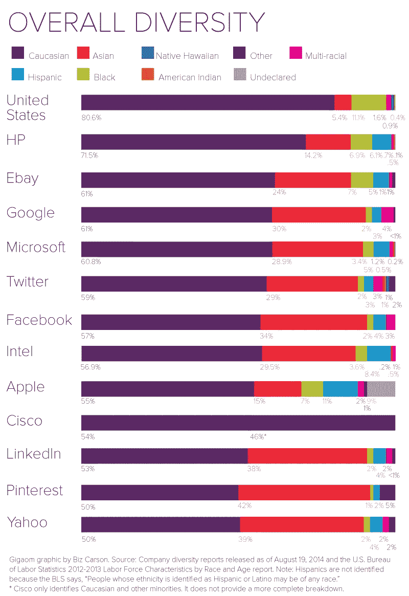

# 下一代创业者在未来十年的 DEI 责任

> 原文：<https://betterprogramming.pub/the-dei-responsibility-of-the-next-generation-of-startup-founders-over-the-next-decade-4135a6f46521>

## 通过早期对工作场所多样性、公平和包容的承诺，推动技术的系统性变革

图片鸣谢:[https://championsofdiversity . info/2019/03/07/lace-of-diversity-in-tech-house-hearing-explores-harms-solutions/](https://championsofdiversity.info/2019/03/07/lack-of-diversity-in-tech-house-hearing-explores-harms-solutions/)

在过去十年中，工作场所多样性、公平和包容(DEI)越来越多地成为科技公司讨论的前沿话题。这在很大程度上是由于一系列告密者公开讲述了他们在科技领域遭受歧视和骚扰的负面经历。从 Ellen Pao 于 2012 年[起诉她当时的雇主 Kleiner Perkins cau field&Byer](https://medium.com/r?url=https%3A%2F%2Ftechcrunch.com%2Ftag%2Fpaovskleiner%2F)性别歧视和职场报复，到 [Susan Fowler 于 2017 年指控优步一名经理性骚扰和歧视](https://www.theguardian.com/technology/2017/feb/20/uber-urgent-investigation-sexual-harassment-claims-susan-fowler)，到 [Yulia Zamora 于 2017 年指控 SoFi](https://legacy.northbaybusinessjournal.com/industrynews/7460082-181/sofi-sex-harassment-lawsuit) 一名经理性骚扰、歧视和报复。

这些只是过去十年中针对科技公司的骚扰和歧视案件的沧海一粟。有一点是明确的:科技公司的保守派在很大程度上辜负了代表性不足的员工。在公平和公正的工作经历方面，他们没能给少数族裔员工带来好处。虽然有理由修复这些文化，但我们必须思考如何从投入资源修复腐败的工作场所文化的思维模式转变为科技工作场所从第一天起就具有包容性的现实。毕竟，预防胜于治疗，坦率地说，少数族裔雇员应该得到更好的待遇。

虽然科技公司越来越多地努力纠正错误值得一些赞扬，但人们越来越理解并清醒地认识到，事后改变工作场所文化是一场艰苦的战斗，需要大量深思熟虑的努力、高管支持和资金支持。即便如此，进展也极其缓慢。2014 年，谷歌报告称，该公司有 61.3%的白人和 69.4%的男性。快进到 2019 年，谷歌的白人比例为 54.4%，男性比例为 68.4%。在这个问题上花费了 2 亿多美元之后，谷歌的多样性指数几年来几乎没有变化。对于那些试图改善有毒的工作场所文化的科技公司来说，这在很大程度上是正确的。作为一个行业，如果我们想在未来十年让少数科技公司做得更好，我们就必须更加深思熟虑地从头开始打造下一代科技公司。工作场所的包容性不能是事后的想法。它必须融入下一代科技公司的结构中。

这凸显了下一代科技创始人的责任，即确保即使在他们筹集第一轮资金并开始扩大公司规模之前，他们对工作场所的做法也是有条不紊的。他们必须考虑建立一个多元化和包容性的工作场所，无论种族、性别、性取向、年龄、能力(精神和身体)和阶级，都支持员工。这就是我们如何避免再花十年时间重复过去十年的 DEI 问题。

除了科技创始人，创业投资者也扮演着重要的角色。由于像阿尔兰·汉密尔顿、德尔·约翰逊和麦基弗·康威尔等人的努力，风险投资行业越来越意识到为什么我们需要支持少数族裔创始人，并改善创始人社区的多样性。像 Backstage Capital、Harlem Capital 和 Lightship Capital 等公司已经形成了围绕支持代表性不足和资源不足的创始人的投资论文。

这导致了一个范式的转变，在过去的六个月里，从机构投资者那里获得资金的黑人创始人比过去五年还多。越来越多的机构投资者开始看到投资代表性不足的创始人的社会和商业优势。最近，[通过谷歌](https://startup.google.com/blackfoundersfund/)支持了 75 名黑人种子期创始人，每人获得了 10 万美元的支票，这再清楚不过了。这一倡议是由另一个著名的变革力量朱厄尔·伯克-所罗门领导的。

这是朝着正确方向迈出的一大步；然而，我们不能就此止步。我们不能就此止步！为了推动少数族裔在科技领域的体验得到真正的系统性改善，风投必须利用他们的影响力，将工作场所 DEI 放在他们投资组合中创始人的首要位置。尽管风险投资公司在做出投资决策时会评估产品、客户获取和上市策略，但他们也必须确保他们投资的创始人在扩大规模时会认真思考如何建立包容性的文化。当他们努力在销售、招聘和营销方面帮助他们的投资组合公司以及投资者时，必须优先考虑用工作场所文化支持他们的投资组合公司。

它必须从第一天起就融入公司的 DNA，投资者不能不在这一点上督促他们的创始人。投资者在做出投资决策以及评估其投资组合公司的表现时，必须将工作场所文化作为一个重要的衡量标准。沉默是共谋的声音。如果在这个十年结束时，工作场所的歧视、骚扰和不公平仍然是科技领域的一个主要话题，那么投资者将为充满有毒工作场所文化的公司创始人负责。

根据美国人口普查局的数据，到 2044 年，美国将成为一个少数民族占多数的国家，白人占全国人口的比例不到 50%。随着这一重大转变的临近，我们必须确保工作场所的歧视、骚扰和不公平不会演变成美国的人道主义危机。正如我们已经认识到的那样，这些事情在发生后很难改变，因此我们必须作为一个行业团结起来，确保未来十年的结果是我们引以为豪的。

我相信科技工作场所会有一个公平的未来。然而，为了使这一梦想成为现实，我们都必须尽自己的一份力量来实现这一目标。作为投资者、创始人、员工、经理和关联公司，在创造未来公平对待所有员工的工作场所的过程中，我们任何人都不能成为旁观者。