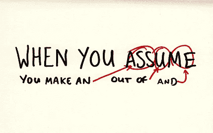

# 代码评审的注意事项

> 原文：<https://betterprogramming.pub/the-dos-and-don-ts-of-code-reviews-77032ba3a30c>

## 通过更健康的代码评审文化来减少团队摩擦

在 [Unsplash](https://unsplash.com?utm_source=medium&utm_medium=referral) 上由[米米·蒂安](https://unsplash.com/@mimithian?utm_source=medium&utm_medium=referral)拍摄的照片

代码审查是开发过程的重要部分。他们帮助维护代码的完整性、质量、风格，防止错误，甚至帮助我们向他人学习。代码评审的最大障碍是，它们通常是以非个人的方式完成的——例如在 GitHub、Bitbucket 或您在团队中使用的任何版本控制平台上留下评论。

因为代码评审是通过文本来完成的——我们写作的方式、我们选择的词语、我们阅读或写作时的心情或任何事情都很容易与我们的队友产生摩擦。为了避免这一点，我们必须注意我们如何进行代码评审。因此，我编制了一份清单，列出了在代码评审期间应该做和不应该做的事情。

# 作为评论者

这里列出了在审查他人代码时应该做和不应该做的行为。

## Do 的

*   首先，要有礼貌。
*   保持谦逊，提供你的帮助。
*   如果它不是错误的，并且解决方案是基于偏好和意见的，那么就随它去吧——除非你的团队在如何解决某些问题上有特定的风格规则。
*   **当你有疑问时，要求澄清。**
*   突出代码中好的部分，而不仅仅是错误。人们应该为他们的工作受到表扬。
*   如果你需要澄清一个大问题，直接找老板。代码评审大部分是异步的和书面的。一个快速的电话可以帮助迅速解决疑问。
*   有一份要找的东西的清单。这将有助于加速和简化审查过程(例如，检查样式、协议、命名约定、代码是否有测试等等)。你甚至可以使用像 linter 这样的工具来帮助你减少一些复习工作。
*   写下你希望别人写给你的评论。
*   花点时间检查代码。你队友的工作就靠你来完成。给予它应有的重视。
*   另一件很棒的事情是由[hkon mdal](https://medium.com/u/5e4d2d116943?source=post_page-----77032ba3a30c--------------------------------)在[评论](https://medium.com/@hakon.amdal/one-of-my-most-effective-tricks-in-code-reviews-is-to-replace-all-occurrences-of-i-me-and-you-78dc9d17e65c)中分享的:

> 我在代码评审中最有效的技巧之一是用我们代替所有出现的我和你。这样一个小技巧改变了人们的态度，从有人正在仔细检查和批评我的工作到我正在得到反馈，这样我的团队就可以提供最好的服务和应用程序！。

## 不要

*   避免使用“总是”或“从不”这样的词语。
*   这可能是显而易见的，但是，不要侮辱人。
*   不要用夸张的说法。
*   避免笑话和讽刺。书面文字很容易被误解。
*   不要想当然。

https://www.pinterest.com/pin/46161964907511477/

*   避免责备他人。
*   不要留下类似“改变这一点”、“这是错误的”、“找到另一种解决方案”等评论。要有建设性，提供你的帮助，并给出建议。

# 作为作者

作为代码的所有者，您可以做一些事情来简化团队成员的审查过程。

## Do 的

*   要有礼貌。
*   感谢人们的帮助。
*   对不完全理解的评论提问。
*   如果有人提出了一个你不同意或不理解的解决方案，试着和那个人安排一次会面，把它说出来。
*   在没有看到所有上下文的情况下，对阅读时可能太复杂而难以理解的代码部分进行澄清。一些解决方案跨越多个对象，代码评审可能不会以容易建立联系的方式呈现它们。
*   有好的和有意义的提交消息。
*   您在打开代码评审后所做的更改应该有自己的提交。这有助于审阅者了解基于反馈的更改。
*   尝试回答尽可能多的评论，并在必要时给予感谢。承认某人的评论并不意味着你同意，它只是意味着你阅读了它并感谢反馈。

## 不要

*   尽量不要把评论当成人身攻击。他们审查的是你的代码，而不是你个人。
*   和复习的时候一样，不要侮辱人。
*   不要假设。(见上图)
*   如果评论看起来像是侮辱或攻击，退后一步，再读一遍。你可能误解了。如果你觉得需要澄清，直接给评论者写信。
*   避免笑话和讽刺。
*   不要说“这是我从这个文件中复制的”这样的话来推卸责任。或者，“这个人也是这么做的。”有时，错误会被忽略，但这不应该成为继续犯错的先例。总是努力写出更好的代码。

# 结论

你可以做更多的事情来改善你给出和接受评价的方式，但是有了这个列表，你将会找到更好的方法。

你可以做的一件事是和那位同事讨论这篇文章，他可能会检查不要做的事情清单上的所有选项。通过让自己变得更好来帮助他们变得更好。人不是光合作用就能提高的。