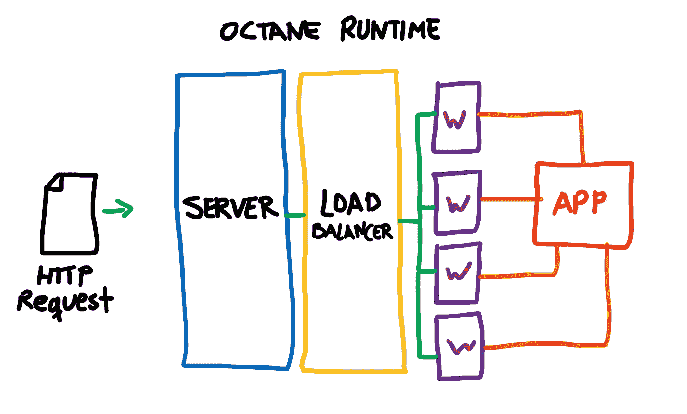

# 用 Laravel 辛烷编码的缺点

> 原文：<https://betterprogramming.pub/the-downsides-of-coding-with-laravel-octane-17f4a7a4ea85>

## 不修改代码就不会有最高的性能


在 [Unsplash](https://unsplash.com?utm_source=medium&utm_medium=referral) 上由 [SpaceX](https://unsplash.com/@spacex?utm_source=medium&utm_medium=referral) 拍摄的照片。

Laravel Octane 是几周前宣布的[,承诺在每秒处理的请求方面将框架推向月球。直到今天(beta 版)](https://laravel-news.com/laravel-octane)[才公开给大家测试](https://laravel-news.com/laravel-octane-beta)，与第一方 Laravel 包兼容(如 [Nova](https://nova.laravel.com/) 或[望远镜](https://laravel.com/docs/8.x/telescope))开箱。

Laravel Octane 推动边界的工作方式本质上很简单:它不是“启动”每个请求的应用程序，而是完全执行***一次，并将其保存到内存的共享部分。一旦完成，Octane 将产生多个 PHP 工作器，它们将接收这个共享的应用程序实例。这些进程同时处理多个请求，而不是一个。***

***正如你们中的许多人所知，PHP 本质上是一个单线程进程，即使在 [PHP 纤程](/a-look-at-the-new-php-8-1-fibers-feature-979489399918)到来之后，它仍然是单线程进程。Laravel Octane 不使用 PHP 纤程，但是它在一个定制的 HTTP 服务器上运行应用程序，对 PHP 有更严格的控制。对于后者，需要[走鹃](https://roadrunner.dev/)或 [Swoole](https://www.swoole.co.uk/) 。***

***惊人的性能确实伴随着一些代码警告。***

# ***一个实例来统治他们***

***如果你解决了问题，你就太棒了。但是对于那些仍然迷路的人来说，这是它如何工作的一个非常简化的版本:***

******

***一个非常业余和简化的例子，如何拉韦勒辛烷工程***

***当服务器启动时，应用程序通过注册和引导所有服务来启动，甚至包括那些标记为“延迟”的服务，我们称之为“引导”然后，这个新实例在所有 PHP 工作人员之间共享。这与普通 PHP 进程的工作方式相反。通常，应用程序会在每次请求进入和响应发出时启动并销毁。***

***我将引用这篇关于 Laravel Octane 如何工作的[精彩而广泛的潜水 Laravel 文章](https://divinglaravel.com/laravel-octane-bootstrapping-the-application-and-handling-requests)——特别是应用程序和服务单件是如何分发的——这将立即清除您的思维:***

> ***容器中的绑定可以注册为单件，这些特殊的绑定在应用程序的生命周期中只解析一次。解析后的实例将存储在容器缓存中，相同的实例将在应用程序的生命周期中重用。***
> 
> ***(…)实例通过调用`$app->resolve('singleton')`或`$app->make('singleton')`来解析。因此，如果您在服务提供者的`boot`或`register`方法中**解析**任何单例，这些单例将持续存在。在处理请求时被解析的单例不会持久，当在 Octane 下运行时，它们会在每个请求上被构造。你不需要担心这些。"***

***因为应用程序已经被引导了，所以应用程序以极快的速度工作，因为不需要再次引导。现在，想象一下恶作剧:一个服务单体将为来自任何人的所有请求保存相同的数据！[这也适用于配置存储库和容器本身](https://github.com/laravel/octane#dependency-injection--octane)。胡说。***

***如果您想破坏 Laravel Octane，您甚至可以通过为每个请求将数据堆积到一个`Class`静态属性中来进行简单的内存泄漏。***

```
***MyLeaker::$pileUp = Str::random(100);***
```

# ***牢记 Laravel 辛烷编码***

***既然你知道它是如何工作的，那么就很容易理解应用程序作为一个整体，在所有请求的所有方面都是相同的。在引导中全局地改变状态将会在所有请求上反弹，除此之外，它将只对当前请求起作用。一旦请求发出，应用程序并不会死亡，而是会立即为下一个进入服务器的请求服务。***

***记住这一点，如果你打算用 Laravel Octane 创建一个应用程序或者创建一个承诺相同的包，这里是我的建议:***

*   ***如果你希望它们只被解析一次，并且在不同的请求中保持不变，那么注册单例是安全的。***
*   ***如果您希望从配置中获得不变性，那么注入配置是安全的。***
*   ***注入容器来解析在 bootstrap 中注册的服务是安全的，但不要添加或修改其中的内容并期望它持久化。***
*   ***总是尝试使用`request()`外部控制器。***
*   ***永远不要使用静态属性。尽可能使用常数。***

***简而言之，引导时的应用程序状态不同于请求时的应用程序实例。此外，单例不应该直接绑定到请求。***

# ***结论***

***虽然 Laravel Octane 不会以任何方式造成破坏，但作为一名开发人员，您将不得不仔细检查您的依赖项是否存在 Laravel Octane 不兼容性——尤其是那些处理许多单例的依赖项。***

***我认为告诉开发者你的代码已经被修改，以便以非破坏性的方式使用 Laravel Octane 是很方便的。我甚至将我的储存库标记为“Laravel Octane Compatible ”,一旦修改，人们可以更快更安全地进入。***

******

```
***[](*https://github.com/laravel/octane*)***
```

***至于其他方面，Laravel Octane 不是必需的，因为许多应用程序瓶颈都与未优化的数据库查询、缓慢的会话存储或缓慢的外部 API 请求有关。像往常一样，对你的应用程序进行基准测试，检查速度慢的原因，因为 Laravel Octane 可能只会给你带来更多的头痛而不是解决方案。***