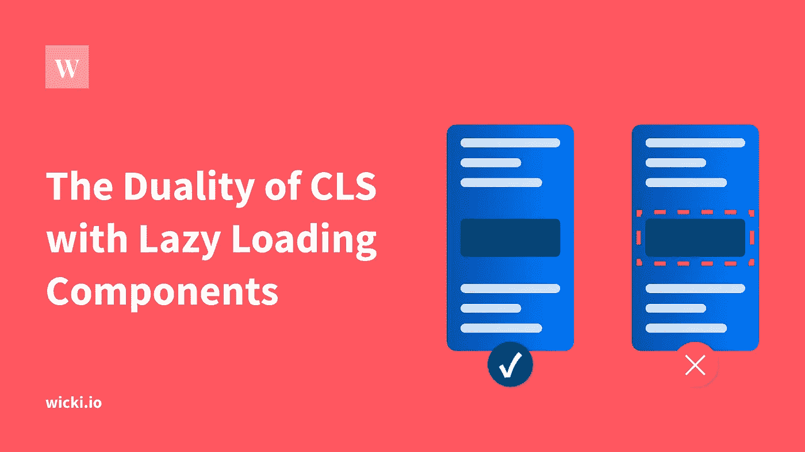

# 具有惰性加载分量的 CLS 的对偶

> 原文：<https://betterprogramming.pub/the-duality-of-cls-with-lazy-loading-components-c0a0e06eabf8>

## 构建优化的 web 应用

当你优化你的 web 应用程序时，你的目标是让用户体验更好:这意味着通常通过传输和解析更少的数据来“更快”。但是注意:同样的 web 应用程序在较慢的连接上可能会导致累积布局偏移(CLS ),但是在较快的连接上运行时没有 CLS。

如果你想重温一下网络的核心要素，我在[这篇文章](https://wicki.io/posts/2021-07-core-web-vitals/)中用 gif 图解释了它们。

> **TL；博士:**较慢的连接*会*导致 CLS，因为你在 wifi 连接上看不到它。
> 
> 要么根本不要延迟加载组件，要么等待 js 文件被加载和挂载。

# 二元性

慢速与快速连接:相同的网络应用程序，不同的 CLS。

我们假设一个 web 应用程序在较慢的连接上加载相同的内容，只是慢了*。不幸的是，懒惰的可加载组件并不总是这样。*

*对于惰性可加载组件，我们处理两个`asyncnesses`:*

1.  *异步 API 响应(JSON)*
2.  *异步延迟加载组件(JS)*

*如果 API 响应(1)比动态加载的 JS (2)快会怎样？如果您延迟加载位于 web 内容中间的组件会怎么样？你在上面谷歌截图中看到的这些问题的答案将会用 CLS 惩罚你。*

# *CLS 测量*

*我已经看到了很多关于核心网站的困惑，尤其是 CLS。*

*与其他核心网络指标不同的是，CLS 被持续测量，并且*被累计*计入得分。对于一个经典的 SPA 网络应用程序，这意味着谷歌将保留每条路线的 CLS 分数。*

*CLS 有以下特点:*

*   *每次路由更改后，CLS 重置为 0*
*   *在任何用户交互之后，您将获得 500 毫秒的宽限期，在此期间，CLS 不会被考虑在内*

***真实用户的测量** : Chrome 用户直接向谷歌发送核心网络重要指标。它不是一个在抓取网站时捕捉这些指标的 Googlebot。*

*这些真实的用户测量被收集为[现场数据](https://web.dev/lab-and-field-data-differences/#field-data)并流入谷歌的[症结报告](https://developers.google.com/web/tools/chrome-user-experience-report)。*

*这意味着你需要考虑现实世界:*

*   *如果你有很多来自印度的流量，但是你的服务器在世界的另一端，你的 LCP(最大内容油漆)可能会受到影响。*
*   *如果你有很多来自中国的流量，很可能一些服务被中国的互联网服务提供商屏蔽了，无法加载。这可能会在您的内容中导致不必要的 CLS。*

# *解决方法*

*我们需要完全控制在什么时间向用户显示什么。考虑到二元性，我们需要知道以下几点:*

*   *API 请求还在加载吗？*
*   *异步组件还在加载吗？*

*骨架加载器是等待 API 请求和异步组件都准备好的理想方式。*

# *解决方案 1:根本不要延迟加载组件*

*最快且最不容易出错的解决方案是传递延迟加载组件。在大多数情况下，通过延迟加载节省的千字节数不足以抵消它可能导致的 CLS。如果您的性能预算允许，请使用此解决方案。*

*假设我们有一个 Vue web 应用，有 10%的登录用户。*

*如果没有代码分割，我们会将`<HugeComponent>`的 JS 发送给 90%不需要它的用户。这会影响 LCP 和 FID。*

*通过代码分割，我们将把`<HugeComponent>`的 JS 打包到 additional-comps.js 块中，只在需要的时候通过网络发送。*

*有两个标准可以帮助您决定是否应该延迟加载组件:*

*   *`<HugeComponent>`的大小*
*   *多久向用户呈现一次`<HugeComponent>`*

*如果您得出的结论是您的性能预算紧张，您需要延迟加载组件，请参见解决方案 2。*

# *解决方案#2:等待组件的加载和安装*

*如果您的组件没有被大多数用户使用，并且会增加很多捆绑包，那么看看这个解决方案。*

*等待异步组件被延迟加载和挂载可能很棘手。您需要渲染组件，但是安装会在以后进行。以下是如何做到这一点的要点。*

*如果我们不使用`display: hidden`作为`<HugeComponent>`上的加载状态，我们永远不会触发异步组件的加载。因此，永远不会到达第 28 行，并且`isLoading`状态将永远停留在`false`上。*

# *结论*

*当你在谷歌搜索控制台[中因为 CLS 而丢失绿色网址，并且你自己无法重现时，试着用较慢的连接调试你的网络应用。](https://search.google.com/search-console)*

*所以如果你使用懒惰的可加载组件，很有可能成为 CLS 二元性的受害者。*