# 通过 Apple 设备访问 Windows 桌面的最简单方式

> 原文：<https://betterprogramming.pub/the-easiest-way-to-access-your-windows-desktop-through-apple-devices-ed3f6edc0dc3>

## 使用 macOS 和 iOS 设备远程管理您的资源


[天一马](https://unsplash.com/@tma)在 [Unsplash](https://unsplash.com/) 上拍照。

由于对社会活动和工作场所的进一步限制，鼓励员工和学生呆在家里。然而，预计许多人会在家继续工作。虽然有些人可以使用自己的计算机或设备完成工作，但其他人却很难访问他们的计算机、服务器或位于工作场所的共享资源。

考虑到这个最现代的问题，本文将帮助您组织您的远程访问工作场所资源的在家工作设置。本文将演示如何通过任何 Apple 设备(MacBook、iPhone 或 iPad)设置和保护到位于工作场所的 Windows 计算机的远程连接。

虽然这不是一个麻烦的过程，但许多人认为这是一个复杂的行动路线。不要担心。按照简单的步骤一个接一个地进行成功的远程连接。

这些步骤可以分为三大主题:

1.  设置您的 Windows 电脑。
2.  设置您的远程登录设备(macOS 或 iOS)。
3.  开始连接。

本文将引导您完成这些任务，您将能够无忧无虑地管理您的远程资源。

# 设置您的 Windows 计算机

第一项工作是在你的办公室或工作站安装 Windows 电脑。在离开工作站之前，您需要遵循这些步骤，并准备 Windows 计算机从远程位置进行连接。

如果你的 Windows 电脑运行的是[Windows 10 Fall Creators update(1709)](https://blogs.windows.com/windowsexperience/2018/01/11/windows-10-fall-creators-update-1709-fully-available/)或更高版本，那么提供从远程苹果设备访问你的 Windows 电脑的最简单方法就是使用设置下的远程桌面选项。不要担心:如果您使用的是 Windows 7 或 Windows 10 的早期版本，您可以使用一个单独的可下载应用程序来提供类似的功能和验证。

## Windows 10 秋季创建者更新(1709)或更高版本

*   在 Windows 电脑上，选择*开始*，然后点击左侧的*设置*图标。

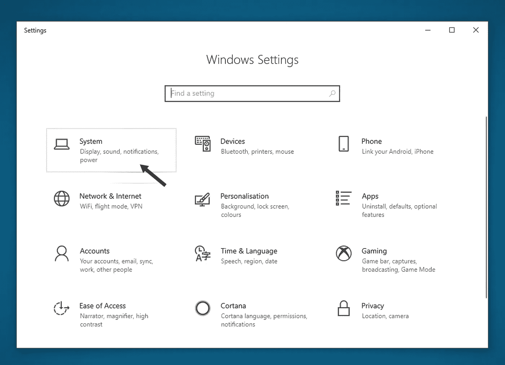

系统设置组

*   选择*系统*组，然后选择*远程桌面*项。

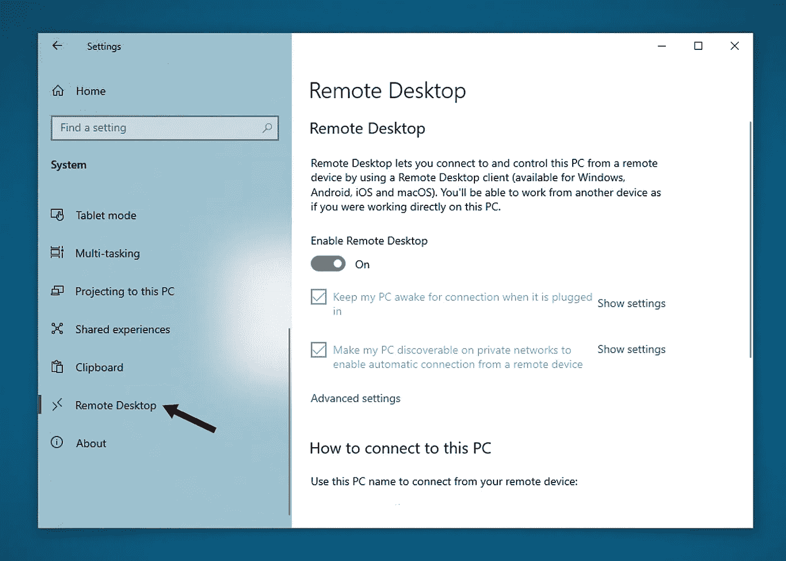

远程桌面部分

*   点击滑块启用*远程桌面* 选项。

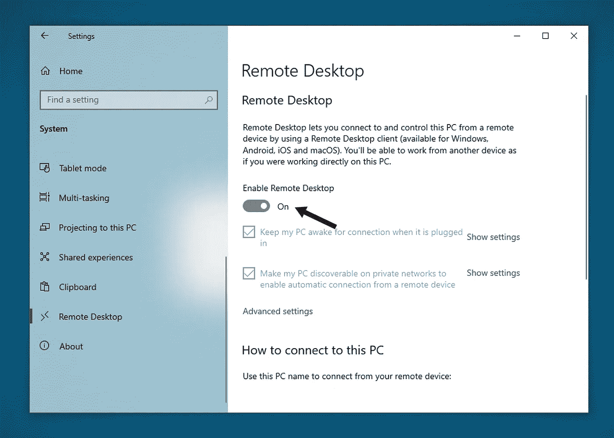

启用远程桌面

*   应该唤醒 Windows 计算机，以便随时进行连接。为此，点击*显示设置*启用。

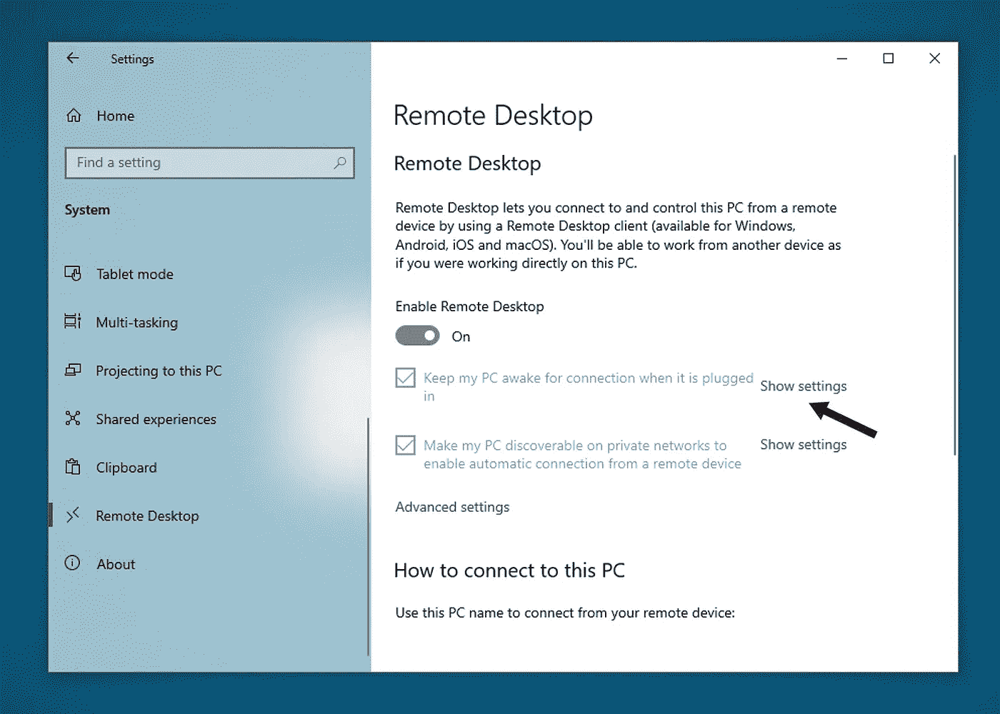

可选设置配置

*   要授权需要连接的用户，使用*选择可以远程访问这台电脑的用户*。

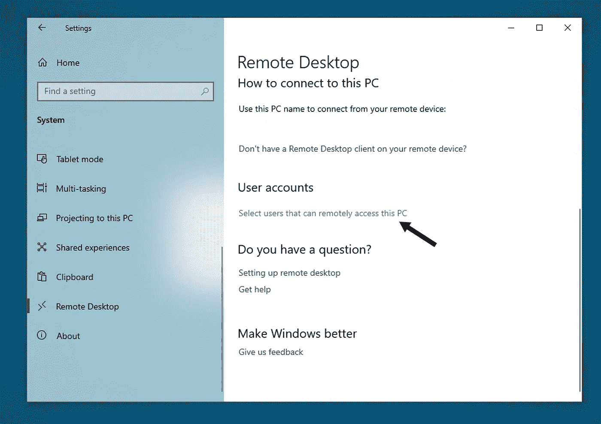

授权用户帐户

*   在*如何连接到这台电脑*下记下这台电脑的名称。您将需要它来通过远程客户端访问。

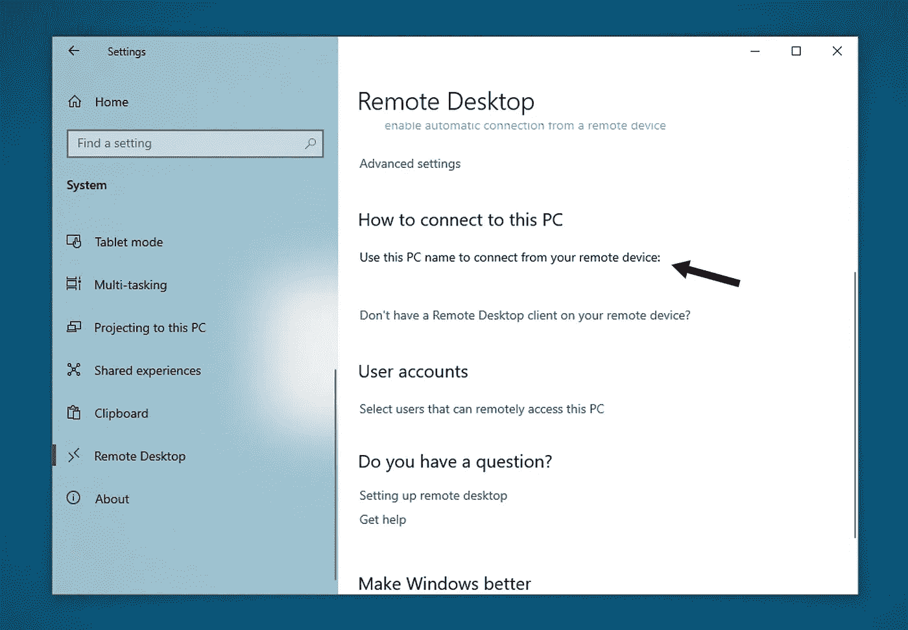

复制电脑名称

## Windows 7 或 Windows 10 的早期版本

下载并运行[微软远程桌面助手](https://www.microsoft.com/download/details.aspx?id=50042)。

[](https://www.microsoft.com/en-us/download/details.aspx?id=50042) [## 远程桌面助手

### 在您想要远程连接的 Windows PC 上，下载 Microsoft 远程桌面助手来配置您的 PC…

www.microsoft.com](https://www.microsoft.com/en-us/download/details.aspx?id=50042) 

安装后，Microsoft 远程桌面助手会更新您的系统设置以启用远程进入，并保证您的计算机对连接保持警惕。另外，请检查您的防火墙是否允许远程桌面连接。

现在，您的流程的第一个作业已经完成。这并不像你们中的一些人之前想象的那么难。

请记住[来自微软](https://docs.microsoft.com/en-us/windows-server/remote/remote-desktop-services/clients/remote-desktop-allow-access)的这条消息:

> 请注意，当您启用对远程桌面的访问时，您将授予管理员组中的任何人以及您选择的任何其他用户远程访问他们在计算机上的帐户的能力

为了保证您工作站的安全，请验证每个可以访问您的 Windows 计算机的帐户都配置了可靠的密码。

# 设置您的远程登录设备

本节将说明如何在 Apple 设备(macOS 或 iOS 设备)上设置远程客户端，以连接之前设置的 Windows 电脑。如果您正在使用任何其他设备(Windows、Android 等。)而不是 Apple one，您可以简单地下载并在您的设备上安装 Microsoft Remote Desktop 客户端，并按照相同的说明设置客户端。仅为演示目的，此处说明 macOS 和 iOS 设备。

## 对于 macOS 设备

*   从 [Mac 应用商店](https://apps.apple.com/us/app/microsoft-remote-desktop-10/id1295203466)下载并安装微软远程桌面客户端。

[](https://apps.apple.com/us/app/microsoft-remote-desktop-10/id1295203466) [## 微软远程桌面 10

### 使用 Microsoft Remote Desktop for Mac 连接到远程电脑或您的虚拟应用程序和桌面

apps.apple.com](https://apps.apple.com/us/app/microsoft-remote-desktop-10/id1295203466) 

*   点击*应用程序*上的图标，启动微软远程桌面客户端。

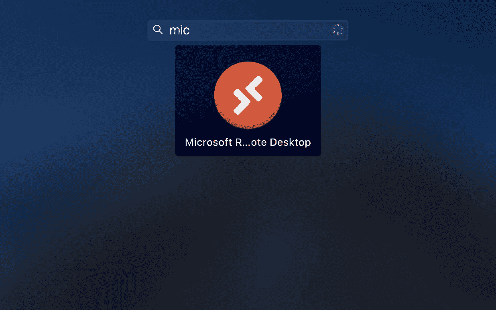

Microsoft 远程桌面应用程序

*   在顶栏中，点击 *+* ，然后点击 *PC* 。

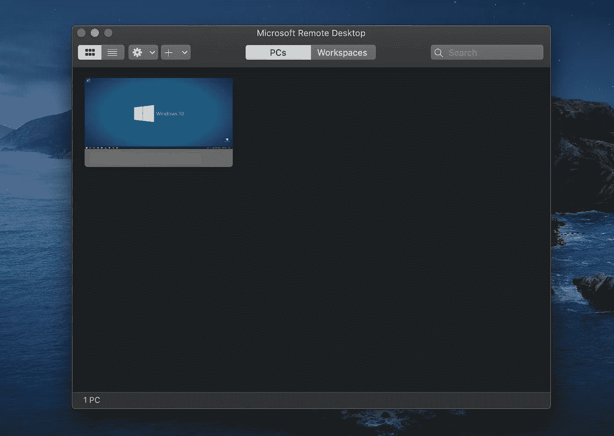

Microsoft 远程桌面界面

*   输入以下信息:

```
**PC name** — *This can be a Windows computer name (found in the System settings), a domain name, or an IP address. You can also add port information to the end of this name, like MyDesktop:3389.***User account** — *Add the user account you use to access the remote PC.
For Active Directory-joined computers or local accounts, use one of these formats: user_name, domain\user_name, or* [*user_name@domain.com*](mailto:user_name@domain.com)*.*
```

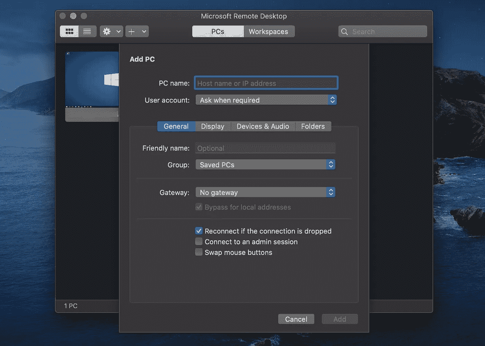

使用电脑名称和用户帐户添加电脑

*   此外，您还可以为连接自定义这些选修设置:(更多详细信息，请参考[这篇博文](https://blogs.windows.com/windowsexperience/2018/01/11/windows-10-fall-creators-update-1709-fully-available/))。

```
- Set a friendly name
- Add a Gateway
- Set the sound output
- Swap mouse buttons
- Enable Admin Mode
- Redirect local folders into a remote session
- Forward local printers
- Forward Smart Cards
```

*   点击*添加***T5，完成设置过程。**

## 对于 iOS 设备

*   从 [iOS 应用商店](https://aka.ms/rdios)下载并安装微软远程桌面客户端。

[](https://apps.apple.com/app/microsoft-remote-desktop/id714464092) [## 微软远程桌面

### 使用 Microsoft Remote Desktop for iOS 连接到远程电脑或虚拟应用程序和桌面，这些应用程序和桌面可通过您的…

apps.apple.com](https://apps.apple.com/app/microsoft-remote-desktop/id714464092) 

*   点击主屏幕上的图标，启动 Microsoft 远程桌面客户端。
*   在连接中心，点击 *+* ，然后点击*桌面*。
*   输入以下信息(您也可以为 iOS 设备配置上述其他可选设置):

```
**PC name** — *This can be a Windows computer name (found in the System settings), a domain name, or an IP address. You can also add port information to the end of this name, like MyDesktop:3389.***User account** — *Add the user account you use to access the remote PC.
For Active Directory-joined computers or local accounts, use one of these formats: user_name, domain\user_name, or* [*user_name@domain.com*](mailto:user_name@domain.com)*.*
```

*   点击*保存* 完成设置。

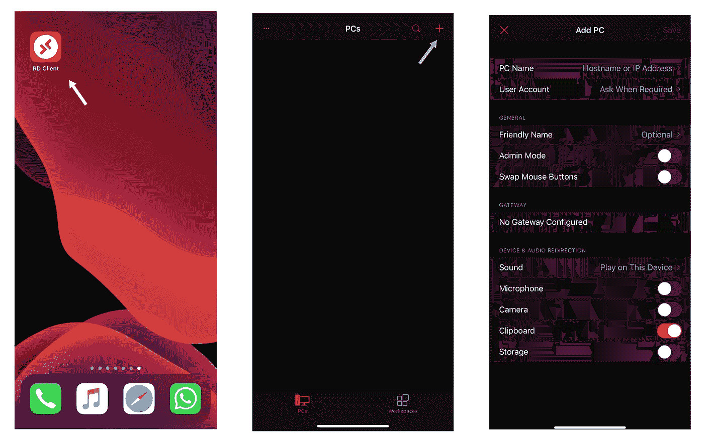

使用 iOS 设备添加远程电脑

# 开始连接

完成上述两项任务后，您就差不多完成了该过程，并准备好随时从远程设备连接到您的办公室或工作站 Windows 计算机。现在，您只需要从远程设备连接到 Windows 计算机。

在开始连接到 Windows 计算机之前，您应该连接到已经连接了 Windows 计算机的网络。您可以通过以下两种方法实现这一点:

1.  使用 Windows 计算机连接到同一个本地网络。在大多数情况下，这是不可用的，我们需要第二个选项从任何地方连接。
2.  使用虚拟专用网络(VPN)将远程设备连接到 Windows 计算机已经连接的网络。为此，您可以采用简单的 VPN 客户端，如 Cisco AnyConnect。

在您连接到 Windows 计算机所连接的网络后，您只需打开 Microsoft 远程桌面应用程序，并通过以下步骤开始连接:

*   在远程设备上打开 Microsoft 远程桌面应用程序。
*   远程资源将显示在应用程序的界面中。
*   点击带有电脑名称的图像，选择您之前保存的需要连接的远程资源。

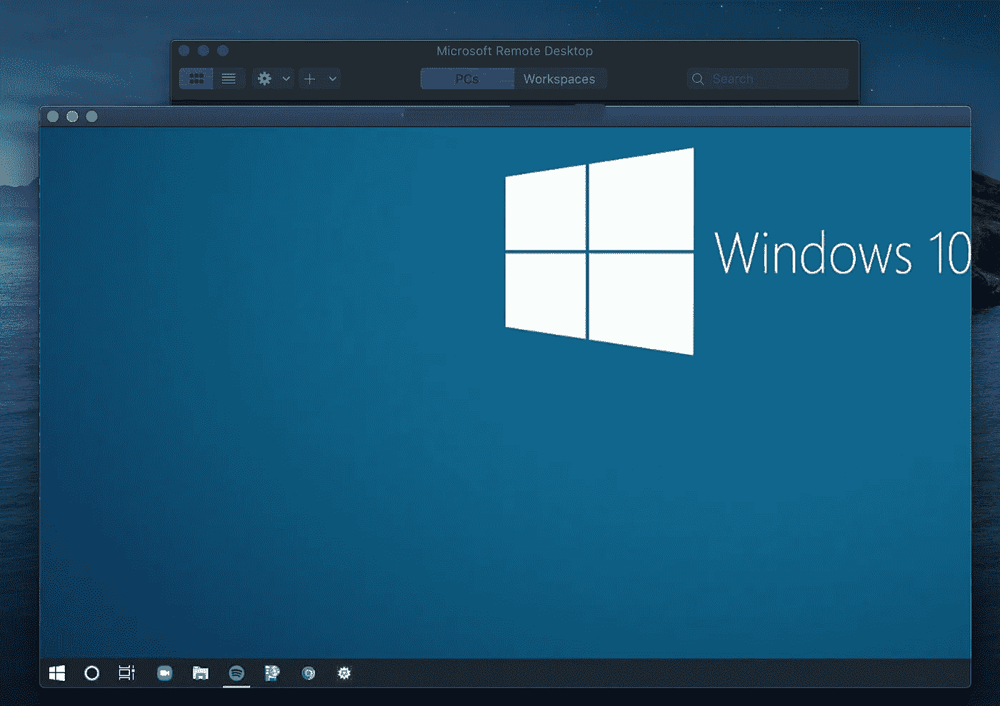

通过 macOS 设备访问 Windows 电脑

完成这最后一步后，您就连接到了远程 Windows 计算机。您可以参考[微软文档](https://docs.microsoft.com/en-us/windows-server/remote/remote-desktop-services/clients/remote-desktop-mac)了解更多详细的定制和配置。

干杯！

# 资源

[](https://docs.microsoft.com/en-us/windows-server/remote/remote-desktop-services/clients/remote-desktop-clients) [## 远程桌面客户端

### 适用于:Windows 10、Windows 8.1、Windows Server 2019、Windows Server 2016、Windows Server 2012 R2 您可以使用…

docs.microsoft.com](https://docs.microsoft.com/en-us/windows-server/remote/remote-desktop-services/clients/remote-desktop-clients) [](https://www.howtogeek.com/221001/how-to-set-up-your-own-home-vpn-server/) [## 如何设置自己的家庭 VPN 服务器

### 虚拟专用网络(VPN)非常有用，无论你是在世界各地旅行，还是只是在一个地方使用公共 Wi-Fi…

www.howtogeek.com](https://www.howtogeek.com/221001/how-to-set-up-your-own-home-vpn-server/) [](https://www.cisco.com/c/en_au/products/security/anyconnect-secure-mobility-client/index.html) [## 思科 AnyConnect 安全移动客户端

### 让您的员工能够随时随地使用公司笔记本电脑或个人移动设备工作。任意连接…

www.cisco.com](https://www.cisco.com/c/en_au/products/security/anyconnect-secure-mobility-client/index.html)