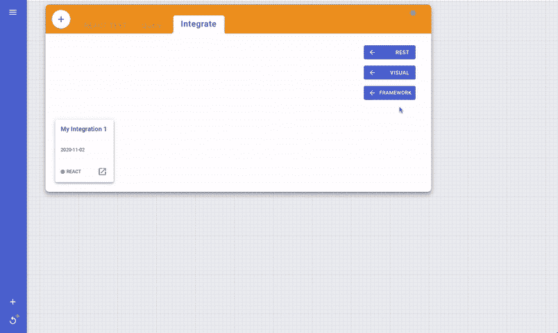
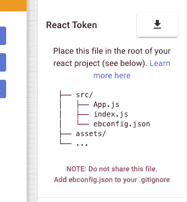

# React 和 React 本机应用程序使用无服务器数据库的最简单方法

> 原文：<https://betterprogramming.pub/the-easiest-way-to-use-a-serverless-database-with-your-react-and-react-native-apps-ec2633b46f92>

## 看看 Easybase，以及如何在您的项目中使用它


由[约书亚·阿拉贡](https://unsplash.com/@goshua13?utm_source=medium&utm_medium=referral)在 [Unsplash](https://unsplash.com?utm_source=medium&utm_medium=referral) 拍摄

无服务器数据库如今非常流行。这在很大程度上是由于这种无处不在的前端框架的新浪潮，包括 Vue、Angular、React 等等。这些模块允许开发新手将他们的想法转化为现实世界的生产应用程序。其中一个重要的方面是能够在多种平台上启动应用程序。

这些无服务器技术堆栈允许工程师在其开发工作流程中保持敏捷。今天我们将研究 [Easybase 的](https://easybase.io) React 库，它在 React 应用中创建一个有状态的可编辑数组数据库。这个库在 React 和 React Native 上都工作得很好。

# 创建有状态且可编辑的数组数据库的步骤

## 1.创建新的 React 集成



登录到您的 Easybase 帐户，转到 Query 选项卡，并创建一个 REACT 集成。如果您没有 Easybase 帐户，补充计划将涵盖许多使用案例。您可以使用表格的上传数据对话框通过 JSON 或 CSV 上传数据。

## 2.安装 npm 库

唯一的额外依赖是 easybase-react npm 模块。要安装它，导航到 React 项目并执行`npm install easybase-react`。包很小 [(33.9kbs 缩小)](https://bundlephobia.com/result?p=easybase-react@1.2.4)。[阅读此处的文档。](https://github.com/easybase/easybase-react)

## 3.将 ebconfig.json 复制到项目的根目录中

导航到抽屉的 React 令牌部分并下载您的令牌。



下载文件并将其复制到与您的 1 文件相同的目录中。

**注意:**在集成抽屉中，确保您已经启用了您的集成的读写权限。在本地主机服务器上测试应用程序时，也要启用 testing 参数。在启动您的应用程序之前，将访问数据库和您保存的查询的 IP 和 web 地址放在允许列表中。

## 4.将您的应用程序包装在 EasybaseProvider 组件中

`EasybaseProvider`为您的所有子组件提供了`useEasybase()`钩子的功能，它包含了所有用于与您的数据交互的有状态函数。对于熟悉 React 钩子和提供者模式的人来说，这应该是一个熟悉的工作流。

## 5.使用 Frame()映射 React 组件

在容器组件中，我们需要将我们的`Frame()`映射到反应组件。这些组件可以包括在改变时直接改变`Frame()`或`Frame(index)`的控制。当一个项目被更改时，调用`sync()` 将您的更改同步到数据库并重新呈现您的元素。如果需要，您可以等待`sync()`函数，但这不是必需的，因为如果`Frame`发生变化，`EasybaseProvider`组件将重新呈现其子组件。

当我们的元素第一次安装在`useEffect()`中时，我们将`Frame`的大小设置为`length` 10。这是将从您的云数据库收集的对象的长度约束。结合使用`offset`参数，您可以在 React 应用程序中实现分页。

在 return 语句中，我们将`Frame()` 元素映射到一个名为`Card`的自定义 React 组件。请记住，`Frame()`返回一个对象数组，而`Frame(index)`将返回该索引处的一个单独的对象。在更改了数组中的任何项目后，调用`sync()`会将您的更改推送到云中，并从不同的源中下载任何更改。这些项可以直接编辑，也可以通过向数组中传递一个索引来编辑。

每当用户直接操作数组中的对象时，就应该调用`onChange()`回调。更改将与相应的索引、列名和新值一起传递给该函数。最后，我们调用`sync()`将更改推送到我们的数据库。在您的本地副本和远程引用之间的数组规范化之后，如果两者之间有差异，将执行`useFrameEffect()`。

**注意:**如果`sync()`观察到您的本地副本中的任何更改或者远程发生的更改，`Frame()`将被设置为标准化数组，然后运行`useFrameEffect()`来警告元素`Frame`已经更改。

easybase-react 的`Frame()`对于 react 组件的声明性非常友好。EasybaseProvider 框架的生命周期操作如下:

```
Frame Is Synchronized **->**
useFrameEffect() runs **->**
Edit Frame() **->**
Call sync() **->**
Frame Is Synchronized **->**
useFrameEffect() runs
```

# 结论

easybase-react 库允许您通过与云数据库同步的有状态、可编辑的数组来访问您的数据。将这个库包含在现有的 React 和 React 原生项目中非常容易。`useFrameEffect`回调以一种很好地适应 React 组件挂钩并遵循 React 约定的方式集成了数据库。

阅读更多: [Easybase + React 演练](https://easybase.io/react/)，[无服务器技术](https://www.infoworld.com/article/3406501/what-is-serverless-serverless-computing-explained.html)。

[阅读此处的文档](https://github.com/easybase/easybase-react)。

> “你建了，他们就来了。”