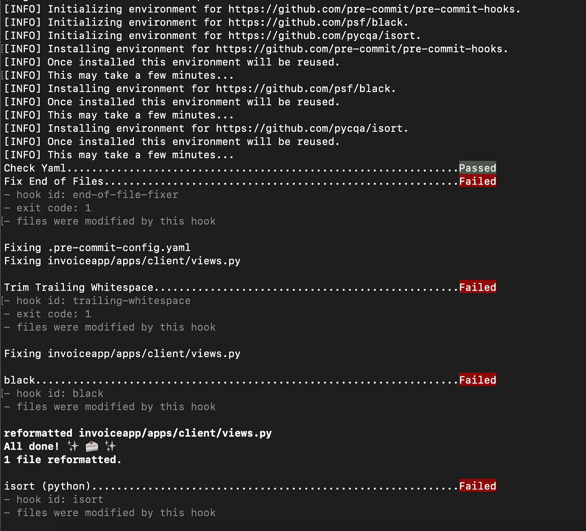
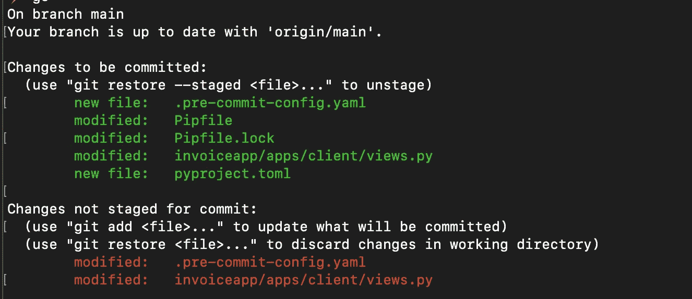
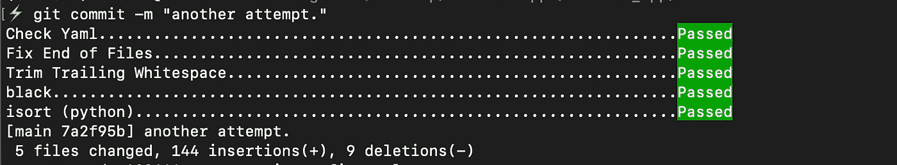

# 简单的 Python 自动代码格式化指南

> 原文：<https://betterprogramming.pub/the-easy-python-auto-code-formatting-guide-e8300c82797b>

## 只需设置一次*，在提交时编写并自动格式化您的代码——使用这些工具没有任何麻烦。*

**

*[杰瑞米·托马斯](https://unsplash.com/@jeremythomasphoto?utm_source=medium&utm_medium=referral)在 [Unsplash](https://unsplash.com?utm_source=medium&utm_medium=referral) 上拍照*

*Python 易于阅读和理解的语法使其成为当今最流行的编程语言——这是有充分理由的。Python 的各种用例是如此的多样化，以至于软件工程、机器学习和数据科学都有不同的复杂用法。*

*在编写干净的 Python 代码时，最容易被忽视的也是最基本的领域之一包括对良好的格式和代码检查的需求。*

*可以说，在生活的每个方面都自动化的今天，代码审查中的这个特定步骤也可以很容易地完成，而不需要太多的人工努力。*

*有一些工具可以帮助你节省一些宝贵的时间和精力，而不是每次在 git 提交之前格式化你的代码。*

*以下是其中的一些*

*   *预提交挂钩，*
*   *黑色*
*   *伊索特*

*让我们一步一步地学习如何为一个 Python 项目设置它们。*

# *安装和使用提交前挂钩*

*预提交钩子完全按照它在 tin 上所说的那样做——它们运行某些脚本来检查您的代码是否有错误，尾随空白，运行一些格式化工具，以及在代码审查过程中进行许多其他有用的检查。*

*对我们来说，我们将经历两个重要的挂钩，不包括一些常见的挂钩。*

*让我们先安装库(我假设您已经在使用虚拟环境):*

```
*pip install pre-commit*
```

*安装后用这个检查版本，它应该为您输出版本作为健全性检查:*

```
*$ pre-commit --versionpre-commit 2.17.0*
```

***事情是这样的:**为了以简单的方式设置自动格式化工具，您需要在您的根项目目录中有一个特定的 git 配置文件。*

*我们现在就去做吧。*

## *设置配置文件*

*根据文档，在我们的项目中，我们需要一个名为“`**.pre-commit-config.yaml**`”的预提交配置文件。*

*完成之后，让我们介绍一下代码片段，它告诉我们想要包含哪些钩子。我们现在想要的两个钩子是在每次提交之前在我们的 python 文件上运行: **black** 和 **isort** 。*

*这是他们的设置:*

*所以，让我们分别看看这几行:*

*   *第 5–7 行:前三个`id`行是这样做的:第一行尝试加载所有 yaml 文件以验证它们的语法，第二行确保文件以一个新行结束，并且只有一个新行，最后一行检查尾随空格。*
*   *第 8–10 行:这是`black`的挂钩设置。它可以自动格式化你的 Python 代码，现在在整个行业中它的使用非常普遍。*
*   *第 12–16 行:这是为`isort`设置的钩子，它是一个在我们的代码中自动排序导入的库，所以我们不需要手动排序。*

*现在，为了将它们附加到我们的 git 配置中，让它们在每次提交之前运行，我们再运行一个命令:*

```
***$** pre-commit install
pre-commit installed at .git/hooks/pre-commit*
```

*至此，我们已经成功地完成了项目的预提交挂钩的设置！到目前为止非常简单，对吗？*

*我们现在就去设置`**black**`和`**isort**`！幸运的是，只用一个配置文件就可以做到这一点。*

# *安装和设置 black 和 isort*

*安装这两个库也非常简单:*

```
*pip install black isort*
```

*布莱克将其用法定义为:(来自其精彩的书面文件):*

> ****黑色*** 通过产生尽可能小的差异来加快代码审查。不管你在读什么项目，黑化的代码看起来都一样。一段时间后，格式变得透明，您可以专注于内容。*

*isort 还将其用法简单定义为:*

> ***isort** 是一个 Python 实用程序/库，用于按字母顺序对导入进行排序，并自动按类型分成几个部分。*

*这里是我们需要为他们的设置制作的唯一文件:一个`**pyproject.toml**`文件。*

*这是我们想放进去的内容:*

*当然，线长可以根据您自己或您的工作偏好而改变，black 提供的许多其他可配置变量也是如此。*

*你可能会问，为什么我们要显式地使用这个特定的文件？以下是提供的理由:*

> *[PEP 518](https://www.python.org/dev/peps/pep-0518/) 将`pyproject.toml`定义为一个配置文件，用于存储 Python 项目的构建系统需求。*

*因此，实际上，项目根目录中的这个文件允许您为整个项目使用一个“**全局**”代码检查/修订配置。*

*让我们继续测试他们吧！*

# *测试我们的预提交挂钩*

*当您在几个文件中编写或编辑了一些代码后，继续按照这个简单的过程来测试我们附加的钩子是否如预期的那样工作。*

*首先，我们需要在终端中添加带有我们的`**git add .**`的文件，或者您想要添加的任何文件组合。*

*我正在我现有的 **Django** 项目中测试这个。*

*现在，让我们运行`**git commit -m “a message here”**`。您将看到类似这样的内容:*

**

*作者图片—第一次运行预提交挂钩*

*这意味着我们的文件已经被预提交钩子所做的格式化修改了。*

*当你现在运行命令`**git status**` 时，你会看到这样的东西:*

**

*按作者排序的图像—由挂钩运行修改的文件*

*所以`**views.py**`文件有一些行被执行的钩子修改了。去看看吧。*

***这确保不会自动提交您修改的文件，并让您查看一次，以确保所有更改都是正确的。***

*作为一个有意的步骤，**预提交**永远不会修改我们的版本化代码的暂存区域。因为我们运行的任何钩子都可能有错误，撤销是一个巨大的痛苦 ***在*** 提交之后，我们得到了一个额外的机会来查看是否一切正常。*

*现在，让我们继续添加并再次提交文件:*

```
*git add .
git commit -m "your message here"* 
```

*您现在将看到类似这样的输出:*

**

*图片作者—所有挂钩通过！*

*这太棒了！我们已经成功地提交了应用了更改的代码！*

# *一些遗言和参考*

*我希望这篇快速教程很好地介绍了如何使用预提交钩子轻松地自动格式化代码，并且不需要手动干预。*

*以下是我使用过的一些资源，我也建议您阅读更多关于我在本文中提到的所有内容的信息:*

*   *[黑色文件](https://black.readthedocs.io/en/stable/usage_and_configuration/the_basics.html#configuration-via-a-file)*
*   *[其他文件](https://pycqa.github.io/isort/index.html)*
*   *[预提交挂钩文件](https://pre-commit.com)*
*   *GitHub 的一个问题解释了为什么额外的提交步骤如此必要。*

*感谢您的阅读！:)*