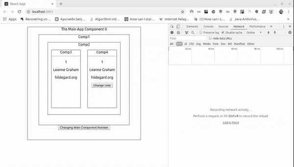
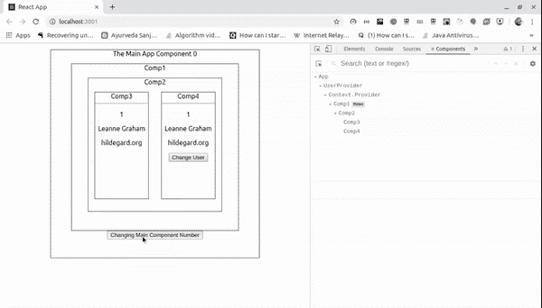

# React 中优雅的上下文模式

> 原文：<https://betterprogramming.pub/the-elegant-context-pattern-in-react-a32dda91f46a>

## 组合 React 上下文提供者和 useContext 挂钩，以便它们可以方便地使用和重用


由 [Paulius Dragunas](https://unsplash.com/@paulius005?utm_source=medium&utm_medium=referral) 在 [Unsplash](https://unsplash.com?utm_source=medium&utm_medium=referral) 上拍摄的照片

# 介绍

React 中的上下文用于共享组件树的全局数据，比如经过身份验证的用户或首选主题，而无需将这些数据作为道具传递。这里我们不会讨论 React Context API 的基础知识，而是看看如何优雅地使用它。

## 我们将开发的应用程序



```
function App(props) {
  const [number, setNumber] = useState(0);
  const changeNumberHandler = () => {
  setNumber(c => c + 1)
  }
  return (
   <div className="App">
    The Main App Component {number}
    <UserProvider> {/* Our Custom Provider */}
      <Comp1 />
    </UserProvider>
    <button onClick={changeNumberHandler}>
      Changing Main Component Number
    </button>
   </div>
  );
 }

// comp1 renders
<Comp2 />
// ... which renders ...
<Comp3 />
<Comp4 />
```

这里我们将使用`[https://jsonplaceholder.typicode.com/users](https://jsonplaceholder.typicode.com/users)/{userId}`来获取`userId`的用户。我们将使用`Math.random()`生成一个从 1 到 10 的随机数，我们将把它用作`userId`。获取结果后，我们将把结果提供给`Comp3`和`Comp4`。除此之外，我们还将提供一个函数来改变`userId`并获取新`userId`的结果。

# 浏览上下文

## React.createContext 上下文

创建一个新的上下文对象，用于在不使用 props 的情况下将值传递给组件树。

```
const MyContext = React.createContext(*defaultValue*);
```

## **语境。提供商**

提供者允许消费 React 组件订阅上下文更改。

```
<MyContext.Provider value={*someValue*}>
```

每当值属性更改时，作为提供者后代的所有使用者都将重新呈现。

## 使用上下文挂钩

它可以用于接受上下文对象并返回当前上下文值的功能组件中。

```
const value = useContext(MyContext);
```

# 自定义提供程序和挂钩

我们将创建一个自定义提供者(`UserProvider`)，它将用于向每个后代提供值。为了使用这个值，我们将创建一个定制钩子(`useUser`)。

user.js

这里我们给了`undefined`作为上下文的默认值。一般来说，只要我们试图在组件中使用上下文对象的值，而该组件不是该上下文对象的提供者的后代，就会使用该默认值。

我们给`UserContext.Provider`的`value`道具一个数组。这个数组有`user`状态的值和一个函数`changeUser`，这个函数计算一个从 1 到 10 的随机数，并把它存储在一个叫做`random`的状态中。

我们在`useEffect`钩子中对端点进行 Ajax 调用，该钩子在其依赖数组中只有`random`状态。这意味着这个效果只有在我们的`random`状态改变时才会执行。

在 return 语句中，我们正在编写主要的上下文提供者逻辑，它将把值传递给作为其后代的所有消费者。

```
<UserContext.Provider value={data}>
  {children}
</UserContext.Provider>
```

在我们的定制提供者之后，我们创建了我们的定制钩子。在这个钩子中，首先我们使用一个`useContext`钩子来获取上下文对象的值。之后，为了防止在任何非后代组件中意外使用我们的自定义钩子，我们将检查使用`useContext`获得的值是否等于在创建上下文对象期间给定的`defaultValue`。在我们的例子中，这个默认值是`undefined`。如果值是`undefined`，那么我们可以说我们的定制钩子用于任何非后代组件。

```
//undefined is given as default value
const UserContext = React.createContext(undefined);
```

然后，从我们的自定义钩子，我们返回获得的上下文值。

# 逮到你了

我们知道，Provider 的所有后代组件将随着 value prop 的更改而重新呈现，并且即使它们已经使用了`PureComponent`、`shouldComponentUpdate`或`React.memo`，它们也不能退出更新。

此外，当提供者的父级重新呈现时，消费者中可能会有一些无意的呈现。

让我们在 Comp1 中使用`React.memo`,这样就不会因为 App 组件的变化而在 Comp3 及其子组件中出现意外的渲染。

comp1.js

app.js

App 组件有一个按钮。点击它更新`number`状态。



现在我们可以在上面的图像中观察到，Comp3 和 Comp4 正在被重新渲染，尽管我们在 Comp1 中使用了`React.memo`，而 Comp2 没有被重新渲染。

这是因为我们在 Provider 中使用数组作为价值支柱。

```
const data = [user, changeUser]
return (
  <UserContext.Provider value={data}>
    {children}
  </UserContext.Provider>
)
```

因此，每当 App 组件被重新呈现时，我们的`UserProvider`组件也会被重新呈现。这将为我们的`changeUser`函数和`data`数组创建新的引用，这将触发所有消费者的重新呈现。

为了克服这个问题，我们将使用`useCallback`作为我们的`changeUser`函数，使用`useMemo`作为我们的`data`数组。

```
const changeUser = useCallback(() => {
  const randomNumber = Math.floor(Math.random() * 10 + 1);
  setRandom(randomNumber);
}, [])const data = useMemo(() => ([
  user,
  changeUser
]), [user, changeUser])
```

# 使用

user.js

comp3.js

comp4.js

comp2.js

Comp3 和 Comp4 正在使用`useUser`钩子。另外，当点击按钮时，Comp4 正在调用`changeUser`函数。当`changeUser`被调用时，Comp3 和 Comp4 中的数据都被改变。由于 React 上下文，这一切都是可能的。

# 参考

[](https://reactjs.org/docs/context.html) [## 上下文反应

### 上下文提供了一种通过组件树传递数据的方法，而不必每次都手动传递属性

reactjs.org](https://reactjs.org/docs/context.html) [](https://reactjs.org/docs/hooks-reference.html#usecontext) [## 钩子 API 参考-反应

### 钩子是 React 16.8 中的新增功能。它们允许您使用状态和其他 React 特性，而无需编写类。这个…

reactjs.org](https://reactjs.org/docs/hooks-reference.html#usecontext)