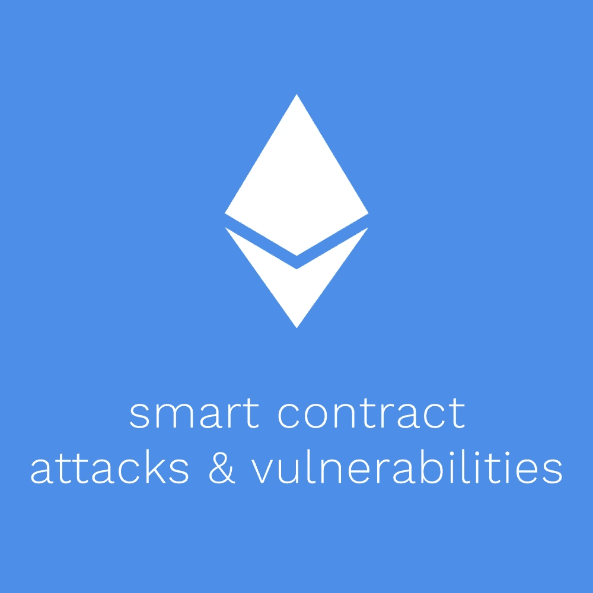
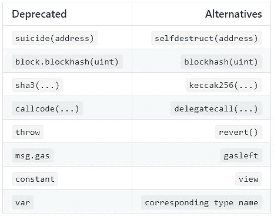

# 智能合约攻击和漏洞百科全书

> 原文：<https://betterprogramming.pub/the-encyclopedia-of-smart-contract-attacks-vulnerabilities-dfc1129fdaac>

## 深入探讨智能合约安全性

以太坊上的应用程序管理金融价值，使得安全性变得绝对重要。作为一项新生的实验性技术，智能合约肯定受到了不少攻击。

为了帮助防止进一步的攻击，我构建了一个几乎所有已知攻击和漏洞的列表。尽管此列表可能涵盖了已知的攻击，但仍会定期发现新的漏洞，因此，这应该只是您作为工程师研究智能合约安全性的开始。

这个列表也可以在 [GitHub](https://github.com/KadenZipfel/smart-contract-attack-vectors) 上找到。

# 攻击

在本节中，我们将了解可用于利用智能合约漏洞的已知攻击。

## 前端运行又名事务排序依赖

Concordia 大学认为抢先交易是“一个实体从优先获得关于即将进行的交易和交易的特许市场信息中受益的行为过程。”这种对市场未来事件的了解会导致剥削。

例如，知道将发生对特定代币的非常大量的购买，不良行为者可以提前购买该代币，并在过大的购买订单提高价格时出售该代币以获利。

抢先攻击长期以来一直是金融市场的一个问题，由于区块链的透明性质，这个问题在加密货币市场再次出现。

由于这个问题的解决方案因合同而异，因此很难防范。可能的解决方案包括批量交易和使用预提交方案(即允许用户稍后提交详细信息)。

## 带阻塞气体限制的 DoS

在以太坊区块链，所有的街区都有气体限制。阻塞气体限制的好处之一是它可以防止攻击者创建无限的事务循环，但是如果事务的气体使用量超过此限制，事务将会失败。这可能以几种不同的方式导致 [DoS 攻击](https://consensys.github.io/smart-contract-best-practices/known_attacks/#dos-with-block-gas-limit)。

**无界运营**

块气体限制可能是一个问题的情况是向一组地址发送资金。即使没有任何恶意，这也很容易出错。仅仅是因为有太多的用户需要支付，就可能使汽油限额达到最大，从而阻止交易成功。

这种情况也可能导致攻击。假设一个坏人决定创建大量地址，每个地址从智能合同中获得少量资金。如果操作有效，事务可以被无限期地阻塞，甚至可能阻止进一步的事务通过。

解决这个问题的有效方法是在当前的推式支付系统上使用拉式支付系统。要做到这一点，将每笔支付分成自己的交易，并让收款人调用该函数。

如果出于某种原因，您真的需要遍历一个长度不确定的数组，至少要预计到它可能会占用多个块，并允许它在多个事务中执行，如下例所示:

来自 [Consensys](https://consensys.github.io/smart-contract-best-practices/known_attacks/#dos-with-block-gas-limit) 的示例

**块馅**

在某些情况下，您的契约可能会受到 block gas 限制的攻击，即使您没有遍历未指定长度的数组。攻击者可以通过使用足够高的天然气价格来填充几个区块，然后才能处理交易。

这种攻击是通过以非常高的气价发布几笔交易来完成的。如果天然气价格足够高，并且交易消耗足够多的天然气，它们可以填满整个街区，并阻止其他交易被处理。

以太坊交易要求发送者支付汽油以阻止垃圾邮件攻击，但在某些情况下，可能有足够的动机进行这种攻击。例如，在赌博 Dapp fomo 3d 上使用了块填充攻击。该应用程序有一个倒计时定时器，用户可以通过最后一个购买钥匙来赢得头奖——只是每次用户购买钥匙时，定时器都会延长。一名攻击者买了一把钥匙，然后连续填满接下来的 13 个街区，这样他们就可以赢得头奖。

为了防止这种攻击的发生，仔细考虑在应用程序中加入基于时间的操作是否安全是很重要的。

## 带有(意外)恢复的 DoS

当您试图向用户发送资金时，函数中可能会发生 DoS(拒绝服务)攻击，而该功能依赖于资金转账的成功。

在资金被发送到由不良行为者创建的智能合同的情况下，这可能是有问题的，因为他们可以简单地创建退回所有付款的回退功能。

例如:

来自[议会](https://consensys.github.io/smart-contract-best-practices/known_attacks/#dos-with-unexpected-revert)的例子

正如您在本例中所看到的，如果攻击者从一个具有回退功能的智能合同中出价，将永远无法退还所有付款，因此，没有人能够出价更高。

如果没有攻击者在场，这也是有问题的。例如，您可能希望通过遍历数组向一组用户付费，当然，您希望确保每个用户都得到适当的付费。这里的问题是，如果一次支付失败，该功能被还原，没有人支付。

来自[议会](https://consensys.github.io/smart-contract-best-practices/known_attacks/#dos-with-unexpected-revert)的例子

解决这个问题的有效方法是在当前的推式支付系统上使用拉式支付系统。要做到这一点，将每笔支付分成自己的交易，并让收款人调用该函数。

来自[议会](https://consensys.github.io/smart-contract-best-practices/known_attacks/#dos-with-unexpected-revert)的例子

## 强行发送以太合同

有时，用户不希望发送以太网到智能合同。不幸的是，在这种情况下，有可能绕过合同回退功能，强行发送以太网。

来自 [Consensys](https://consensys.github.io/smart-contract-best-practices/known_attacks/#forcibly-sending-ether-to-a-contract) 的示例

虽然看起来任何易受攻击的契约的事务都应该被恢复，但实际上有几种方法可以强制发送以太网。

第一种方法是在将易受攻击的契约地址设置为受益人的契约上调用`selfdestruct`方法。这是因为`selfdestruct`不会触发回退功能。

另一种方法是预先计算契约的地址，并在契约部署之前将以太网发送到该地址。令人惊讶的是，这是可能的。

## 气体净化不足

Griefing 是视频游戏中经常出现的一种攻击类型，恶意用户以一种非故意的方式玩游戏来打扰其他玩家，也称为 trolling。这种类型的攻击也用于阻止交易按预期执行。

这种攻击可以在接受数据并在另一个契约的子调用中使用数据的契约上进行。这种方法常用于多重签名钱包和交易中继器。如果 subcall 失败，要么整个事务被还原，要么继续执行。

让我们以一个简单的延期合同为例。如下所示，relayer 契约允许某人在不执行交易的情况下进行和签署交易。这通常在用户不能支付与交易相关的汽油费用时使用。

来自 [Consensys](https://consensys.github.io/smart-contract-best-practices/known_attacks/#insufficient-gas-griefing) 的示例

执行事务的用户，*转发器，*可以通过使用刚好足够事务执行的 gas，而不是足够 subcall 成功的 gas，来有效地审查事务。

有两种方法可以防止这种情况。第一种解决方案是只允许可信用户中继交易。另一个解决方案是要求货代提供足够的气体，如下图所示。

来自 [Consensys](https://consensys.github.io/smart-contract-best-practices/known_attacks/#insufficient-gas-griefing) 的示例

## 可重入

可重入是一种攻击，当契约函数中的一个 bug 允许一个函数交互进行多次时，这种攻击就会发生。如果被恶意使用，这可以用来从智能合约中榨干资金。事实上，可重入性是 DAO hack 中使用的攻击媒介。

**单功能重入**

当易受攻击的函数与攻击者试图递归调用的函数相同时，就会发生单函数可重入攻击。

来自 [Consensys](https://consensys.github.io/smart-contract-best-practices/known_attacks/#reentrancy) 的示例

在这里，我们可以看到余额仅在资金转移后才被修改。这使得黑客可以在余额被设置为 0 之前多次调用该函数，从而有效地耗尽智能合约。

**跨函数重入**

跨功能重入攻击是同一过程的更复杂版本。当易受攻击的函数与攻击者可以利用的函数共享一个状态时，就会发生跨函数可重入。

来自 [Consensys](https://consensys.github.io/smart-contract-best-practices/known_attacks/#reentrancy) 的示例

在这个例子中，黑客可以通过调用回退函数`transfer()`来利用这个契约，在`withdraw()`函数中的余额被设置为 0 之前转移花费的资金。

**防止重入**

在智能合约中转移资金时，使用`send`或`transfer`而不是`call`。使用`call`的问题与其他函数不同，它没有 2300 的气体限制。这意味着`call`可以在外部函数调用中使用，可以用来执行可重入攻击。

另一个可靠的预防方法是*标记不可信的函数*。

来自[议会](https://consensys.github.io/smart-contract-best-practices/known_attacks/#reentrancy)的例子

此外，为了获得最佳安全性，请使用*检查-效果-交互模式*。这是订购智能合约功能的简单经验法则。

该函数应以*检查开始，例如`require`和`assert`语句。*

接下来，应该执行契约的*效果*——例如，状态修改。

最后，我们可以执行与其他智能契约的*交互*——例如，外部函数调用。

这种结构对于可重入性是有效的，因为契约的修改状态将防止不良参与者执行恶意的交互。

来自 [Consensys](https://consensys.github.io/smart-contract-best-practices/known_attacks/#reentrancy) 的示例

因为在执行任何交互之前余额被设置为 0，所以如果递归调用契约，那么在第一个事务之后就没有什么要发送的了。

# 脆弱点

在本节中，我们将了解已知的智能合约漏洞以及如何避免这些漏洞。这里列出的几乎所有漏洞都可以在[智能合同弱点分类](https://swcregistry.io/)中找到。

## 整数溢出和下溢

在 solidity 中，整型有最大值。例如:

`uint8` = > 255

65535

`uint24` = > 16777215

`uint256` = > (2^256) - 1

当超过最大值(溢出)或低于最小值(下溢)时，可能会出现上溢和下溢错误。当你超过最大值时，你回到零，当你低于最小值时，你回到最大值。

因为较小的整数类型——如`uint8`、`uint16`等。—最大值越小，越容易导致溢出；因此，应该更加谨慎地使用它们。

很可能，解决溢出和下溢错误的最佳方案是在执行数学运算时使用 [OpenZeppelin SafeMath 库](https://github.com/OpenZeppelin/openzeppelin-contracts/blob/master/contracts/math/SafeMath.sol)。

## 时间戳依赖性

由`now`或`block.timestamp`访问的块的时间戳可以由挖掘器操作。当使用时间戳执行契约函数时，有三个需要考虑的事项。

**时间戳操作**

如果试图使用时间戳来产生随机性，矿工可以在块验证的 15 秒内发布时间戳，使他们能够将时间戳设置为一个值，以增加他们从该函数中受益的几率。

例如，彩票应用可以使用块时间戳来挑选一组中的随机投标人。矿工可以参加抽奖，然后将时间戳修改为给他们赢得抽奖的更大几率的值。

因此，时间戳不应被用来制造随机性。

**15 秒规则**

以太坊的参考规范“黄皮书”没有规定多少数据块可以随时间变化的限制，它必须大于其父数据块的时间戳。也就是说，流行的协议实现拒绝未来时间戳超过 15 秒的块，所以只要您的时间相关事件可以安全地变化 15 秒，使用块时间戳是安全的。

**不要使用** `block.number` **作为时间戳**

您可以使用`block.number`和平均阻塞时间来估计事件之间的时间差。但是阻塞时间可能会改变和破坏功能，所以最好避免这种使用。

## 通过 tx.origin 授权

`tx.origin`是 Solidity 中的一个全局变量，它返回发送事务的地址。务必不要使用`tx.origin`进行授权，因为其他合同可以使用回退功能调用您的合同并获得授权，因为授权地址存储在`tx.origin`中。考虑这个例子:

来自[实体文件](https://solidity.readthedocs.io/en/develop/security-considerations.html#tx-origin)的示例

这里我们可以看到`TxUserWallet`合同用`tx.origin`授权`transferTo()`功能。

来自[实体文件](https://solidity.readthedocs.io/en/develop/security-considerations.html#tx-origin)的示例

现在，如果有人欺骗你发送以太网到`TxAttackWallet`合同地址，他们可以通过检查`tx.origin`找到发送交易的地址来窃取你的资金。

为了防止这种攻击，使用`msg.sender`进行授权。

## 浮动杂注

选择一个编译器版本并坚持使用它被认为是最佳实践。使用浮动 pragma，可能会意外地使用过时或有问题的编译器版本部署协定，这可能会导致错误，使您的智能协定的安全性处于危险之中。对于开源项目，pragma 还会告诉开发人员应该使用哪个版本来部署您的合同。所选择的编译器版本应该经过彻底的测试，并考虑已知的错误。

可以接受使用浮动 pragma 的例外情况是库和包。否则，开发人员将需要手动更新 pragma 以在本地编译。

## 功能默认可见性

函数可见性可以指定为公共、私有、内部或外部。重要的是要考虑哪种可见性最适合您的智能合同功能。

许多智能合同攻击是由于开发人员忘记或放弃使用可见性修饰符而引起的。默认情况下，该函数被设置为公共的，这可能会导致非预期的状态变化。

## 过时的编译器版本

开发人员经常发现现有软件中的错误和漏洞，并进行修补。因此，尽可能使用最新的编译器版本很重要。在这里可以看到过去编译器版本的错误。

## 未选中的调用-返回值

如果未检查低级调用的返回值，则即使函数调用引发错误，执行也可能继续。这可能会导致意想不到的行为，并打破程序逻辑。调用失败甚至可能是由攻击者引起的，攻击者可能会进一步利用该应用程序。

在 Solidity 中，您可以使用低级别的呼叫，例如`address.call()`、`address.callcode()`、`address.delegatecall()`、`address.send()`，或者您可以使用合同呼叫，例如`ExternalContract.doSomething()`。低级别的调用永远不会抛出异常——相反，如果遇到异常，它们将返回`false`，而契约调用将自动抛出。

在使用低级调用的情况下，请确保检查返回值以处理可能失败的调用。

## 无保护的乙醚停药

如果没有适当的访问控制，不良行为者可能会从合同中撤回部分或全部乙醚。这可能是由于错误命名了一个旨在作为构造函数的函数，从而使任何人都有权重新初始化协定。为了避免这个漏洞，只允许由那些被授权的人或者按照预期的方式来触发取款，并适当地命名您的构造函数。

## 无保护自毁指令

在有`selfdestruct`方法的合同中，如果缺少或没有足够的访问控制，恶意参与者可以自毁合同。重要的是要考虑自毁功能是否绝对必要。如果有必要，考虑使用多重授权来防止攻击。

这种攻击被用于[奇偶攻击](https://www.parity.io/a-postmortem-on-the-parity-multi-sig-library-self-destruct/)。一个匿名用户找到并利用了“库”智能合同中的一个漏洞，使自己成为合同所有者。攻击者随后开始自毁合同。导致资金被封在 587 个唯一钱包里，共持有 513，774.16 以太。

## 状态变量默认可见性

开发人员显式声明函数可见性很常见，但声明变量可见性却不常见。状态变量可以有三个可见性标识符之一:`public`、`internal`或`private`。幸运的是，变量的默认可见性是内部的，而不是公共的，但是即使您打算将一个变量声明为内部的，明确一点也很重要，这样就不会出现关于谁可以访问该变量的错误假设。

## 未初始化的存储指针

数据以`storage`、`memory`或`calldata`的形式存储在 EVM 中。很重要的一点是，这两者被很好地理解并正确初始化。不正确地初始化数据存储指针，或者干脆不初始化它们，都可能导致契约漏洞。

从 Solidity `0.5.0`开始，未初始化的存储指针不再是一个问题，因为带有未初始化存储指针的契约将不再编译。尽管如此，理解在某些情况下应该使用什么样的存储指针仍然很重要。

## 断言违例

在 Solidity `0.4.10`中，创建了以下函数:`assert()`、`require()`和`revert()`。在这里，我们将讨论 assert 函数以及如何使用它。

正式地说，`assert()`函数意味着断言不变量；非正式地说，`assert()`是一个过分自信的保镖，保护你的合同，但在这个过程中偷走你的汽油。正常运行的契约永远不会到达失败的断言语句。如果您到达了一个失败的 assert 语句，您要么没有正确使用`assert()`,要么您的契约中有一个 bug 使其处于无效状态。

如果在`assert()`中检查的条件实际上不是一个不变量，建议你用一个`require()`语句替换它。

## 使用不推荐使用的功能

随着时间的推移，Solidity 中的函数被弃用，往往被更好的函数所取代。不要使用不推荐使用的函数，这很重要，因为这可能会导致意想不到的效果和编译错误。

这里有一个不推荐使用的函数和替代函数的列表。许多替代方法都是简单的别名，如果用来替代已被否决的对应方法，不会破坏当前的行为。

弃用的函数和替代函数

## 向不受信任的被呼叫者委派呼叫

`Delegatecall`是消息调用的特殊变体。除了目标地址在调用契约的上下文中执行，并且`msg.sender`和`msg.value`保持不变之外，它几乎与常规消息调用相同。本质上，`delegatecall`委托其他契约来修改调用契约的存储。

由于`delegatecall`给了合同如此多的控制权，所以只对可信的合同使用它是非常重要的，比如你自己的合同。如果目标地址来自用户输入，请确保验证它是一个受信任的契约。

## 签名延展性

通常，人们认为在智能合同中使用加密签名系统可以验证签名的唯一性；然而，事实并非如此。以太坊中的签名可以在没有私钥的情况下被修改并保持有效。例如，椭圆密钥加密包含三个变量— *v* 、 *r* 和 *s —* ，如果以正确的方式修改这些值，您可以使用无效的私钥获得有效的签名。

为了避免签名延展性的问题，永远不要在已签名的消息哈希中使用签名来检查以前签名的消息是否已被契约处理，因为恶意用户可以找到您的签名并重新创建它。

## 不正确的构造函数名

在 Solidity `0.4.22`之前，定义构造函数的唯一方法是用契约名创建一个函数。在某些情况下，这是有问题的。例如，如果一个智能协定以不同的名称重用，但构造函数没有改变，那么它只是一个常规的可调用函数。

现在有了现代版本的 Solidity，您可以用`constructor`关键字定义构造函数，有效地消除了这个漏洞。因此，这个问题的解决方案就是使用现代的 Solidity 编译器版本。

## 隐藏状态变量

在坚固性中可能会使用同一个变量两次，但这可能会导致意想不到的副作用。这对于处理多个合同来说尤其困难。举以下例子:

隐藏状态变量的示例

这里我们可以看到`SubContract`继承了`SuperContract`，变量`a`被定义了两次不同的值。现在，假设我们使用`a`来执行`SubContract`中的一些功能。从`SuperContract`继承的功能将不再工作，因为`a`的值已被修改。

为了避免这种漏洞，我们必须检查整个智能合约系统的模糊性。检查编译器警告也很重要，因为只要它们在智能契约中，它们就可以标记这些歧义。

## 来自链属性的随机性的弱来源

在以太坊中，有一些应用程序依赖随机数生成来保证公平性。然而，在以太坊中随机数的生成非常困难，有几个陷阱值得考虑。

使用像`block.timestamp`、`blockhash`和`block.difficulty`这样的链属性似乎是一个好主意，因为它们经常产生伪随机值。然而，问题在于矿工修改这些值的能力。例如，在一个累积奖金数百万美元的赌博应用程序中，矿工有足够的动机生成许多可供选择的区块，只选择将为矿工带来累积奖金的区块。当然，像那样控制区块链是要付出很大代价的，但是如果赌注足够大，这肯定是可以做到的。

为了避免在随机数生成中进行挖掘操作，有一些解决方案:

*   承诺方案，如 RANDAO，一种由 DAO 中的所有参与者生成随机数的 DAO
*   通过 oracles 获得外部资源—例如，Oraclize
*   使用比特币区块哈希，因为网络更加分散，区块开采成本更高

## 缺少对签名重放攻击的保护

有时在智能合同中，有必要执行签名验证以提高可用性和汽油成本。但是，在实现签名验证时需要考虑。

为了防止签名重放攻击，契约应该只允许处理新的散列。这可以防止恶意用户多次重放另一个用户的签名。

为了使签名验证更加安全，请遵循以下建议:

*   存储由契约处理的每个消息散列，然后在执行该函数之前对照现有消息散列检查消息散列
*   在哈希中包含协定的地址，以确保消息仅在单个协定中使用
*   永远不要生成包含签名的消息哈希。参见“签名延展性”

## 需求违反

`require()`方法旨在验证条件，比如输入或契约状态变量，或者验证外部契约调用的返回值。为了验证外部调用，输入可以由调用者提供，也可以由被调用者返回。如果被调用方的返回值违反了输入，可能是以下两种情况之一出错:

*   提供输入的合同中有一个错误。
*   要求条件太强。

要解决这个问题，首先要考虑需求条件是否太强。如有必要，削弱它以允许任何有效的外部输入。如果问题不是需求条件，那么在提供外部输入的契约中一定有一个 bug。确保此合同不提供无效输入。

## 写入任意存储位置

只有经过授权的地址才有权写入敏感存储位置。如果在整个合同中没有适当的授权检查，恶意用户可能会覆盖敏感数据。然而，即使存在对写入敏感数据的授权检查，攻击者仍然能够通过不敏感数据覆盖敏感数据。这可能使攻击者能够覆盖重要的变量，如合同所有者。

为了防止这种情况发生，我们不仅希望通过授权需求来保护敏感数据存储，还希望确保对一个数据结构的写入不会无意中覆盖另一个数据结构的条目。

## 不正确的继承顺序

在可靠性中，可以从多个来源继承，如果没有正确理解，可能会引入模糊性。这种模糊性被称为*钻石问题:*如果两个基础契约具有相同的功能，应该优先考虑哪一个？幸运的是，Solidity 很好地处理了这个问题——只要开发人员理解解决方案。

Solidity 为菱形问题提供的解决方案是使用反向 C3 线性化。这意味着它将从右到左线性化继承，因此继承的顺序很重要。建议从更一般的合同开始，以更具体的合同结束，以避免出现问题。

## 函数型变量的任意跳转

Solidity 支持函数类型。这意味着 function 类型的变量可以分配给具有匹配签名的函数。然后，可以像调用任何其他函数一样，从变量中调用该函数。用户不应该能够改变函数变量，但在某些情况下，这是可能的。

如果智能合约使用某些汇编指令，例如，`mstore`，攻击者可能能够将函数变量指向任何其他函数。这可能使攻击者能够破坏合同的功能，甚至可能耗尽合同资金。

由于内联汇编是一种在低级别访问 EVM 的方式，它绕过了许多重要的安全功能。因此，重要的是，只有在必要和正确理解的情况下才使用汇编。

## 存在未使用的变量

尽管这是允许的，但最好避免使用未使用的变量。未使用的变量会导致一些不同的问题:

*   计算量增加(不必要的气体消耗)
*   错误或畸形数据结构的指示
*   降低代码可读性

强烈建议从代码库中移除所有未使用的变量。

## 意外的乙醚平衡

因为总是有可能向契约发送以太网—请参见“强制向智能契约发送以太网”—如果一个契约假定了特定的平衡，它就容易受到攻击。

假设我们有一个契约，如果契约中存储了任何以太，它将阻止所有函数的执行。如果恶意用户决定通过强制发送以太网来利用这一点，他们将导致 DoS，使合同不可用。由于这个原因，永远不要对契约中的平衡使用严格的等式检查是很重要的。

## 未加密的秘密

以太坊智能合约码随时可以读取。照此处理。即使您的代码没有在 Etherscan 上验证，攻击者仍然可以反编译，甚至只是检查进出它的事务来分析它。

这里的一个问题的例子是有一个猜谜游戏，用户必须猜一个存储的私有变量来赢得契约中的以太。当然，利用这一点是非常微不足道的(你不应该尝试，因为它几乎肯定是一个更加棘手的蜜罐合同)。

这里的另一个常见问题是在 Oracle 调用中使用未加密的外链秘密，比如 API 密钥。如果可以确定您的 API 密钥，恶意行为者可以简单地为自己使用它，或者利用其他途径，例如耗尽您允许的 API 调用并迫使 Oracle 返回错误页面，这可能会也可能不会导致问题，具体取决于合同的结构。

## 错误合同检测

有些契约不希望其他契约与之交互。防止这种情况的常见方法是检查调用帐户中是否存储了任何代码。然而，在构造期间发起调用的契约帐户还不会显示它们存储了代码，从而有效地绕过了契约检测。

## 畅通的区块链信实公司

许多合约依赖于在一定时间内发生的呼叫，但以太坊可以在相当长的时间内以相当低的成本被垃圾邮件发送非常高的 Gwei 交易。

例如，Fomo3D(一种倒数游戏，其中最后一个投资者赢得头奖，但每次投资都会给倒数计时增加时间)被一个用户赢得，该用户在一小段时间内完全阻塞了区块链，不允许其他人投资，直到计时器超时，他才获胜(见“阻塞气体限制的 DoS”)。

现在有许多赌台管理员赌博合同依靠过去的区块散列来提供 RNG。这在很大程度上并不是一个可怕的 RNG 来源，它们甚至解释了在 256 个块之后发生的哈希修剪。但在那个时候，他们中的许多人干脆放弃了赌注。这将允许某人在许多这些功能相似的合同上下注，并以一定的结果作为他们所有人的赢家，检查赌台管理员的提交，如果它仍然待定，则简单地阻塞区块链，直到修剪发生，他们可以获得他们的赌注回报。

## 与标准不一致

就智能合约开发而言，遵循标准很重要。标准是为了防止漏洞而设置的，忽略它们会导致意想不到的后果。

以币安最初的 BNB 代币为例。它作为一种 ERC20 令牌进行营销，但后来有人指出它实际上并不符合 ERC-20，原因如下:

*   它阻止发送到 0x0
*   它阻止了 0 值的转移
*   它没有为成功或失败返回真或假

担心这种不正确实现的主要原因是，如果它用于需要 ERC-20 令牌的智能契约，它会以意想不到的方式运行。它甚至可能永远被锁定在合同中。

尽管标准并不总是完美的，而且有一天可能会过时，但它们会促成最安全的智能合约。

# 结论

如您所见，有许多方法可以利用您的智能合约。在构建之前，充分了解每个攻击媒介和漏洞至关重要。

特别感谢 [RobertMCForster](https://github.com/RobertMCForster) 的诸多优秀贡献。

# 进一步阅读

*   https://github.com/ethereum/wiki/wiki/Safety
*   【https://swcregistry.io/ 
*   [https://eprint.iacr.org/2016/1007.pdf](https://eprint.iacr.org/2016/1007.pdf)
*   [https://www.dasp.co/](https://www.dasp.co/)
*   [https://consensys.github.io/smart-contract-best-practices/](https://consensys.github.io/smart-contract-best-practices/)
*   [https://github.com/sigp/solidity-security-blog](https://github.com/sigp/solidity-security-blog)
*   [https://solidity.readthedocs.io/en/latest/bugs.html](https://solidity.readthedocs.io/en/latest/bugs.html)