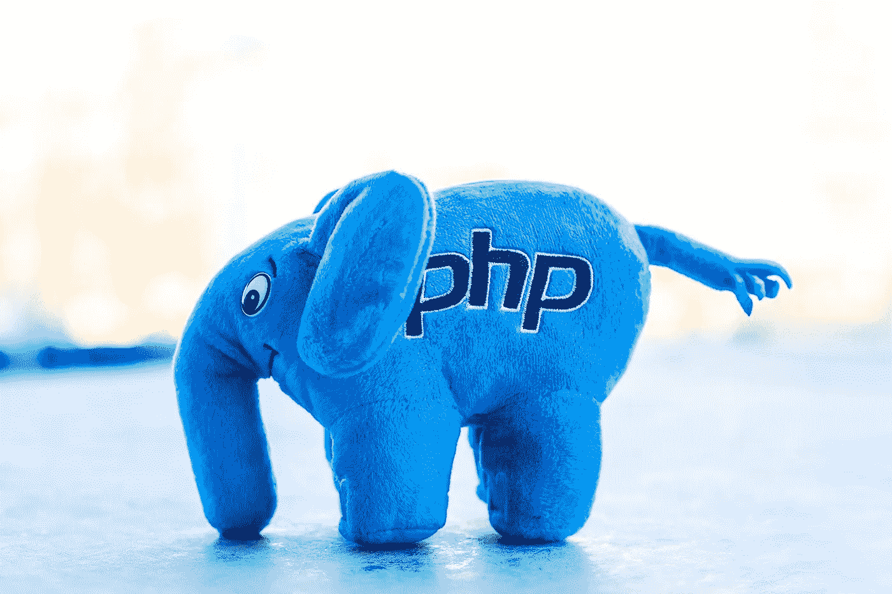
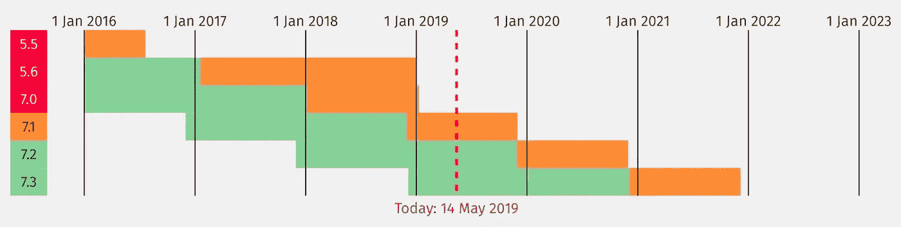
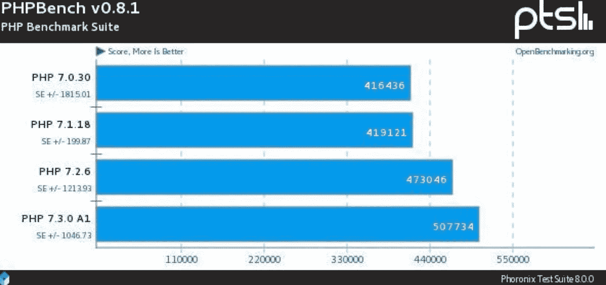
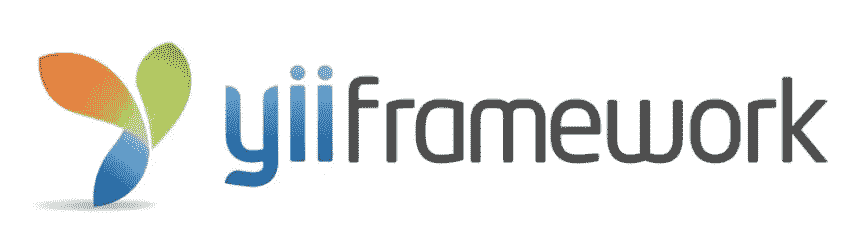
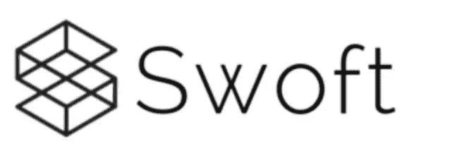
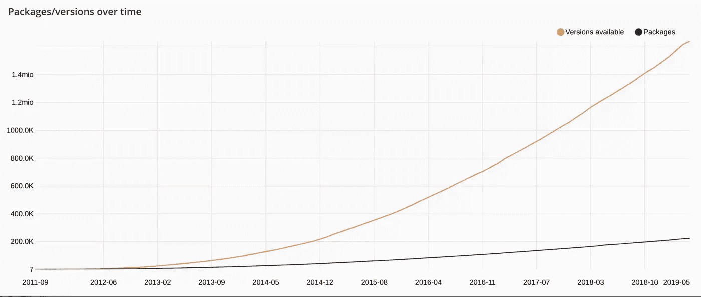

# PHP 的终结？

> 原文：<https://betterprogramming.pub/the-end-of-php-18ba209dbc6d>

## 看一看 PHP 的框架及其未来

近几年的一个热门话题是 PHP 是否正在失去领先地位甚至走向末路。毕竟，许多互联网公司正在尝试其他语言。一些语言极大地吸引了我们的注意力。Golang 以花冠而闻名。Java 最适合完美的生态系统。而 Python 精于计算和人工智能。但是可以肯定的是，PHP 不会进入它的坟墓。

我们将在以下几节中进行分析:

*   PHP 的发展
*   PHP 框架
*   包装学家

# PHP 的发展

PHP 一直在前进。很多优秀的程序员都投身于 PHP 的开发。因此，几乎每年都会发布新版本的 PHP。7.3 的版本是 2018 年发布的，7.4 会在 2019 年底出来。

PHP 的发展是惊人的。7.0 重构 PHP 的内核。随着新 zend 引擎的加入，PHP 的性能提高了两到三倍。

# PHP 框架

一门语言是否足够强大，与其框架密切相关。有一些框架，比如 Laravel 和 Yii，多年来一直是开发人员和项目的最爱。同时，Swoft 虽然是一个新的框架，却吸引了我们的注意力，促使我们去研究它。

# 拉勒韦尔

Laravel 是一个基于 PHP 的 web 框架，使用其重要而优雅的语法来构建高端 web 应用程序。它附带了强大的工具集，并提供了应用程序架构。此外，它还包含了 ASP.NET MVC、CodeIgniter、Ruby on Rails 等技术的各种特性。这是一个开源框架。

它通过节省时间来方便开发者，并帮助减少从头开发整个网站时的思考和计划。除此之外，Laravel 还帮助向您的应用程序引入基本的安全性。

因此，它的所有特性都可以加快你的 web 开发速度。如果有人熟悉 PHP 的基础知识和一些中级 PHP 脚本，那么 Laravel 可以更容易地完成您的工作。

学习资源:

*   Laravel 5.4 从零开始(Laracasts)
*   与 Laravel 和 Vue 一起创建任务列表

# Yii

[Yii](https://github.com/yiisoft/yii2) 是一个通用的 Web 编程框架，这意味着它可以用于使用 PHP 开发各种 Web 应用程序。由于其基于组件的架构和复杂的缓存支持，它特别适合于开发大型应用程序，如门户、论坛、内容管理系统(CMS)、电子商务项目、RESTful Web 服务等。

# Swoft

[Swoft](https://github.com/swoft-cloud/swoft) 是一个 PHP 高性能微服务协程框架。已经出版多年，已经成为 PHP 的不二之选。它可以像 Go 一样，内置协程 web 服务器和通用协程客户端，常驻内存，独立于传统的 PHP-FPM。还有类似的 Go 语言操作，类似于 Spring Cloud 框架的灵活注解。

# 包装学家

要想知道这个行业是否仍然喜欢 PHP，一个方法就是观察它的生态系统:打包者。如下图所示，PHP 开发者的数量以指数增长模式迅速增长。到目前为止，packagists 的数量已经达到了 223，217 台，总装机数量大约为 14，827，204，847 台。PHP 的生态系统重构越来越快。

# 结论

PHP 不会踏入它的坟墓。你应该看一看，仔细考虑一下。