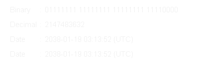

# Unix 时代的终结:会发生什么？

> 原文：<https://betterprogramming.pub/the-end-of-unix-time-what-will-happen-1b1a25ec1c20>

日期回滚将如何影响计算机系统？


在 [Unsplash](https://unsplash.com?utm_source=medium&utm_medium=referral) 上由 [Aron 视觉](https://unsplash.com/@aronvisuals?utm_source=medium&utm_medium=referral)拍摄的照片

自从有时间以来，人们就觉得有必要记录时间。从简单的刻在岩石上的刻痕到像巨石阵这样的天文钟，我们一直在尝试新的更精确的方法来表现时间的流动。快进几千年，我们就在这里，在我们的每个电子设备中携带着高精度的时钟。

如果你只是有点好奇，你可能想知道你的电脑或手机如何处理时间的流动，并以人类可读的格式来表达它。

# 什么是 Unix 时间？

为了理解计算领域中的时间系统，我们必须首先谈论纪元。在年代学中，一个纪元是时间上的一个瞬间，被选择作为一个特定的日历纪元的起点，从这个起点开始计算时间。例如，大多数国家都采用耶稣基督的诞生作为他们日历的起始年。

回到计算领域，类 Unix 系统同意将它们的纪元定在 1970 年 1 月 1 日，即世界协调时 0:00:00。这个日期被任意选择作为计算时间的参考时刻。其他系统，如微软的 Windows，从 1601 年 1 月 1 日开始计时，因为这是设计 Windows NT 时[公历](https://en.wikipedia.org/wiki/Gregorian_calendar)周期的第一年([微软博客](https://devblogs.microsoft.com/oldnewthing/20090306-00/?p=18913))。

Unix 时间标准测量自其出现以来经过的秒数，尽管许多现代实现提供了更高的精度，高达几纳秒。

## 代表时间

在计算机系统中，时间通常被表示为一个整数或浮点数字，它随着计算机的[实时时钟](https://en.wikipedia.org/wiki/Real-time_clock) (RTC)的每一次滴答而不断增加，RTC 是一种测量时间流逝的电子设备。

然而，时间如何存储在存储器中取决于具体的系统实现。大多数 32 位类 Unix 系统以 32 位(4 字节)有符号整数存储时间，因此能够表示 136 年的范围，从 1901 年到 2038 年。其他 32 位实现使用无符号整数，可以表示 2106 年之前的年份，但不能处理纪元之前的日期。

现代个人使用设备运行 64 位操作系统，该操作系统使用 64 位有符号值来跟踪时间，并能够表示从现在起大约 2920 亿年后的日期，顺便说一下，这比宇宙的估计年龄大得多。

## 时间的尽头

时钟迟早会达到系统所能表示的最高时间值。最迫在眉睫的溢出日期是 32 位有符号整数基系统，计划于 2038 年 1 月 19 日 03:14:07 UTC。一秒钟后，计算机将回落到 1901 年 12 月 13 日，世界协调时 20:45:52。

这种行为是由于在添加下一秒时发生的[整数溢出](https://en.wikipedia.org/wiki/Integer_overflow)。当算术运算产生的数值超出可以用给定位数表示的范围时，就会发生整数溢出，在 32 位有符号日期的情况下是-2 到 2。

日期回滚到 1901 年的原因是有符号整数使用它们的[最高有效位](https://en.wikipedia.org/wiki/Bit_numbering)来判断它们是正(0)还是负(1)。下面你可以看到一个很好的关于溢出如何影响日期的直观解释。记住，最左边的位代表二进制数的符号。



有符号整数溢出导致日期回滚(来自[维基百科](https://upload.wikimedia.org/wikipedia/commons/e/e9/Year_2038_problem.gif))

不幸的是，这个整数溢出不仅会影响屏幕上显示的日期，还会导致许多意想不到的行为。现在让我们探索几个场景。

首先想到的问题是无法正确测量时间。例如，让我们测量在时间回滚时执行某个操作需要多长时间:

输出是:

```
It took -4294967290 seconds to complete the task.
In human-readable terms: -49711 days, 17:31:50
```

虽然这个函数只花了 6 秒钟执行，但我们得到了一个明显错误的测量值-49，711 天。如您所见，这个 bug 会给许多应用程序带来很多问题。

休眠负时间增量会使您的程序无限期等待，从而导致永无休止的拒绝服务，您可以通过运行以下简单的 C 代码片段看到这一点:

此外，负时间戳可能会欺骗版本控制系统，认为回滚后创建的某个文件或资源比 2038 年之前创建的任何文件或资源都旧。这可能会导致各种错误，包括无法更新数据存储和各种奇怪的同步问题。

# 结论

尽管出现了这些灾难性的情况，所有关键系统都将被 64 位体系结构所取代，或者采用一种变通方法来缓解可能无法取代的旧系统的问题。

32 位无人维护软件呢？不幸的是，回滚后它可能不再可用，或者您可以将系统日期设置回 1970 年，然后就到此为止。无论如何，你不应该在有任何重要性的系统中使用未经维护的软件。

然而，一些具体的问题可能会出现在利用时间的嵌入式 32 位系统中，例如家用电器或旧汽车中的计算机。这些设备可能会停止工作，你对此无能为力。

我希望你喜欢这篇文章。

感谢阅读！