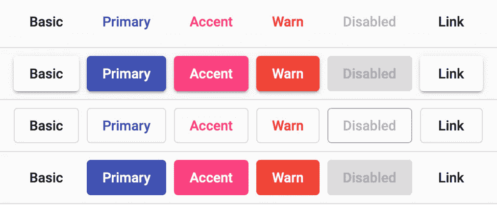
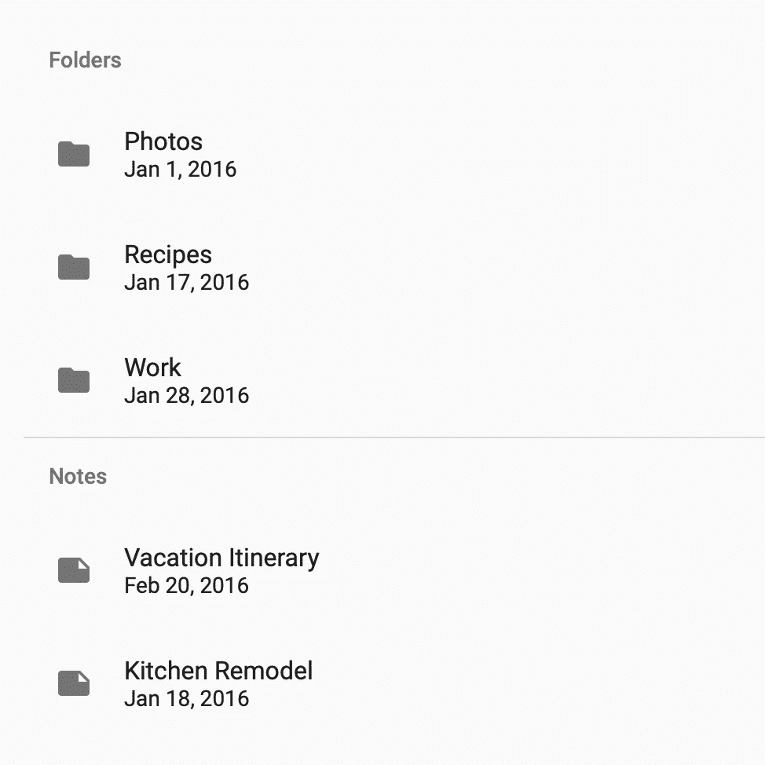

# 基本角度备忘单

> 原文：<https://betterprogramming.pub/the-essential-angular-cheat-sheet-1f677e5bc83>

## 开发 Angular 应用程序时需要的所有命令和代码片段的 10 分钟总结

照片由[miko aj](https://unsplash.com/@qmikola?utm_source=medium&utm_medium=referral)在 [Unsplash](https://unsplash.com?utm_source=medium&utm_medium=referral) 拍摄

有了无数的编程语言和开发框架，开发人员应该知道如何使用其中的多种。实际上，你可以擅长不同的框架和语言，但是除非你是天才，否则很难记住每种工具的所有指令、代码片段和操作方法。

这就是为什么我喜欢小抄，也是为什么我要给你带来我的第四本小抄——这次是 Angular 的。

与 React 和 Vue.js 一起， [Angular](https://angular.io) 是顶尖的 web 前端框架之一，也是我最有信心的一个。为了更有效地使用它，我精心制作了一份备忘单，今天我很自豪地与你分享。

# 创建并运行项目

首先，在我们的工作环境中安装了 [Node.js](https://nodejs.org/en/download/) 和 [Angular CLI](https://angular.io/guide/setup-local#install-the-angular-cli) 之后，让我们从 CLI 创建一个项目:

创建完成后，我们可以使用以下任何命令构建和部署应用程序:

# 安装一个库

大多数情况下，您需要安装外部库来帮助您开发 Angular 应用程序。第一种方法是最值得推荐的，因为它不仅会安装库，还会为您完成所有的配置。不幸的是，并不是所有的库都与此兼容，所以最好知道两种方法:

# 创建并实例化一个组件

*组件*是角度架构的基石。它们是可重用的实体，具有类型脚本定义的逻辑、HTML 定义的布局和一些 CSS 定义的美学。默认情况下，所有 Angular 应用程序都带有一个名为`app`的主组件，位于`src/app`文件夹中。它在应用程序启动时呈现。

下面的命令在文件夹`*/*src/app/my-component/`中创建了一个名为`myComponent`的新组件及其相应的 TypeScript、HTML 和 CSS 文件。将该组件实例化到另一个组件的 HTML 布局中再简单不过了:

# 按指定路线发送

*路由*是 Angular 或 React 之类的单页面应用程序(SPA)开发框架最重要的方面之一。通过路由，你可以在你的应用程序中引入屏幕之间的导航(实际上是角度组件之间的导航)。

首先你要在`app-routing.module.ts`文件中定义路线，这个文件很可能是 Angular 在你初始化项目的时候为你创建的。

然后，在主组件 HTML 文件(`app.component.html`)中，如下所示实例化路由器:

要将用户重定向到任何已定义的路线，您只需使用一个`routerLink`指令，如下例所示:

# 数据绑定

角度组件在三个文件中定义:布局(视图)的 HTML 文件、逻辑(控制器)的 TypeScript 文件和样式的 CSS 文件。

单向数据绑定是一种机制，用于呈现控制器中定义的视图对象(属性绑定)，并允许视图调用控制器中的方法(事件绑定)。让我们在下面的组件中看看这些概念的实际应用:

在组件控制器(TypeScript 类)中，声明了一个名为`currentUser`、类型为`User`(在另一个 TypeScript 类中定义)的变量。从组件视图(HTML 文件)中，使用`{{ object }}`符号，其属性`name`和`age`被呈现在布局中。这被称为*属性绑定。*

注意在逻辑中如何定义了一个叫做`loadNextUser()`的方法。通过事件绑定，使用`(event)=”call” notation`，每当视图中定义的按钮被点击，方法`loadNextUser()`将被触发。

还有一种叫做*双向数据绑定的东西，*使用符号`[(object)]`，在视图和控制器之间建立了双向关系，因此控制器对绑定对象的任何更改都将在视图中再现，反之亦然。在本文后面的模板驱动表单部分，您将看到这个概念的实际应用。

# 结构指令

*结构化指令*允许开发者以一种非常快速和简单的方式在 HTML 模板中包含一些代码逻辑，以便决定一个 HTML 元素何时以及需要渲染多少次。

在上面的代码片段中，使用的三个基本结构指令是`ngIf`、`ngFor`和`ngSwitch`。

# 模板引用变量

在组件的模板中，我们可以给 HTML 元素分配一个引用，这样我们就可以从 DOM 中的其他元素访问它的内容。如果这对你来说听起来像是胡说八道，不要担心，通过下面的例子你就会明白了:

这对理解模板驱动的表单很重要，这将在本文后面讨论。

# 具有灵活布局的响应式布局

如今，对每个网站来说，响应都是必须的。用户希望网站能够在智能手机、平板电脑和电脑上正常呈现，因此需要一个库来创建一个响应性的布局。[灵活布局](https://github.com/angular/flex-layout)是角度的首选解决方案:

用 npm 安装好之后，别忘了导入到`imports`数组里面的`src/app/app.module.ts`文件中。现在，您可以使用 HTML 模板中的`fxLayout`和`fxFlex`标签来创建响应式组件。

在这个例子中，响应式布局是用`fxLayout`标签定义的，在这里我们指定元素是必须按行还是按列布局。正是在这里，我们还找出了一些额外的属性，如元素对齐或元素之间的间隙。对于布局内部的元素，使用了`fxFlex`标签。注意我们如何使用点来定义特定窗口大小的属性(e**sm**all，e**x**tra-**s**mall，**g**rea**t**er than**sm**all……)。

# 角状材料

[Material](https://material.io) 是 Google 创建的一个设计框架，它广泛存在于 Android 生态系统中。由于 Angular 也是由 Google 创建的，所以 Material 是事实上的设计库，为开发人员提供了大量漂亮且易于实现的组件、样式、图标和布局。

上面的命令(如果你在项目初始化助手被要求安装 Angular Material 时说不，你只需要使用它)将为你的应用程序设置一个漂亮的配色方案，并为你提供一组现成的组件，如按钮，工具栏，列表等等。

## 小跟班

首先，将`MatButtonModule`导入到`src/app`中的`app.module.ts`文件中，并添加到 imports 数组中:

现在，您可以在应用程序的任何组件的 HTML 布局中添加材料按钮:

不同类型的材料按钮。图片来源于 [material.angular.io](https://material.angular.io) 。

有关`MatButton`的更多信息，请查阅[官方文档](https://material.angular.io/components/button/overview)。

## 卡片

在`app.module.ts`文件中导入`MatCardModule`后，我们来看看如何创建[物料卡片](https://material.angular.io/components/card/overview):

材料卡示例。图片来自 [material.angular.io](https://material.angular.io) 。

代码可能看起来有点复杂，但实际上非常简单。它创建了一个带有标题(标题、副标题和头像)、正文和一组按钮的卡片。

## 列表

和上面的例子一样，导入`MatListModule`后，可以创建一个[物料清单](https://material.angular.io/components/list/overview):

材料清单示例。图片 via[material . angular . io](https://material.angular.io)。

看看在这个例子中如何使用`ngFor`结构指令:对于在组件中定义的数组`employers`的每个对象，创建一个`mat-list-item`，使用单向数据绑定显示雇主的图像、姓名和年龄。

## 工具栏

导入`MatToolbarModule`后，可以在一个组件内实例化一个[材质工具栏](https://material.angular.io/components/toolbar/overview):

这是上面工具栏的样子。图片来自 [material.angular.io](https://material.angular.io) 。

看第二个`span`元素。看到`flex-spacer`类了吗？这是一个灵活的间隔，所以菜单按钮和`My App`跨度将对齐工具栏的左侧，而收藏夹和共享按钮将对齐右侧。让我们在组件或全局 CSS 中定义它:

这里我们使用了另一个叫做`[mat-icon](https://material.angular.io/components/icon/overview)`的材料资源。这是一个很大的图标库，所以如果你感兴趣，完整的列表在这里。

# 形式

web 上到处都是表单:从登录或注册屏幕到联系页面，表单是从用户那里获取数据的最方便的方式。

在 Angular 中[有两种形式](https://angular.io/guide/forms-overview#choosing-an-approach) : *模板驱动*和*反应式。*前者更容易使用，但后者更推荐用于大型表单，提供更健壮的输入验证。让我们看看如何创建一个非常简单的注册表单，通过这两种方法提交用户名、电子邮件和密码。

## 模板驱动的表单

首先，将`FormsModule`导入到`app.module.ts`文件中。下一步是定义一个字典来存储用户提交的数据，并定义一个方法来处理提交的数据。这些都是在组件控制器中完成的。

然后，使用[材料输入元素](https://material.angular.io/components/input/overview)，为您的表单定义模板:

看看在第二行中，当定义表单时，一个事件绑定被用来告诉 Angular 当用户点击提交按钮时哪个组件方法必须被调用。在同一行中，模板引用变量用于根据表单验证状态启用或禁用提交按钮。

对于每个表单字段(`username`、`email`和`password`，您必须定义一个[材料表单字段](https://material.angular.io/components/form-field/overview#error-messages) ( `mat-form-field`)，它将一个[材料输入](https://material.angular.io/components/input/overview) ( `input matInput`)，用户将在其中键入、选择或选择并回答，以及一个[材料错误](https://material.angular.io/components/form-field/overview#error-messages) ( `mat-error`)，以防输入无效。

输入双向绑定到控制器中定义的`user`字典的相应键。您还必须定义一个模板引用变量，以便仅在输入有效时显示`mat-error`。

最后，定义了一个提交按钮，如果表单没有被正确填写，这个按钮将被禁用，这将调用方法`onSubmit()`，因为它已经在表单定义的开始处设置好了。

## 反应形式

首先，在创建表单之前，必须用 TypeScript 类定义表单的模型:

然后，在将`ReactiveFormsModule`导入到`app.module.ts`文件中的`imports`数组后，您必须创建放置表单的组件。与模板驱动的表单相比，在这种方法中，所有的表单逻辑都在控制器中实现。您还会注意到，使用这种技术时，输入验证更加精确:

简而言之，您必须将表单声明为一个`FormGroup`对象，并实例化您之前创建的模型类的一个对象。然后使用自动注入的`FormBuilder`，您必须创建表单，为每个字段设置所需的验证，并指定每次表单中的数据更改时必须调用的函数。

在这种情况下，该函数将迭代所有字段，检查数据是否有效，并在数据无效时显示相应的错误消息。

正如我们对模板驱动的表单所做的那样，我们再次使用素材库来布置表单，但这次是在控制器中执行验证任务。

# 与外部 API 的通信

我们刚刚看到了如何创建一个表单，现在该怎么办呢？表单最常见的用例是向用户请求一些数据，然后使用 HTTP 将数据发送给某个服务器。使用 HTTP 与外部 API 通信是每个 web 开发人员的基本要求。

然而，在深入这个问题之前，我们应该回顾一下其他一些概念，比如服务、承诺和可观察性，以便更好地理解 HTTP 请求在 Angular。

## 服务

您可以将*服务*视为没有 UI 的组件——因此，它们只包含一个类型脚本文件。

他们通常执行从后端获取数据或处理用户输入等任务。尽管这些任务可以在一个组件中完成，但是让组件尽可能简单，利用服务来完成所有复杂的任务是一个更好的方法。服务可以在一行代码中自动注入到组件中，因此它们也是一种非常好的代码回收方式。

现在我们必须告诉 Angular 将这个服务注入到所有请求它的应用程序组件中，所以让我们将它添加到`app.module.ts`文件的`providers`部分:

要在我们应用程序的任何组件中使用它，您只需在构造函数中请求它:

## 承诺

*Promises* 是一个用于[异步编程](https://en.wikipedia.org/wiki/Asynchrony_(computer_programming))的 JavaScript 机制，其中返回一个待定值，该值可能很快(`resolve`)可用，也可能永远(`reject`)不可用。

最常见的情况是向外部服务器发出请求，在这种情况下，您不会立即得到答复，因为您需要等待请求到达服务器并得到处理，然后才能收到答复。

但也有可能因为服务器或网络故障而收不到答案。为了在这段等待时间内不阻止你的应用程序，Promises 允许你指定当你的请求得到答复或出错时该做什么，同时你可以继续执行你的程序。

这个服务有一个返回承诺的方法:

它由一个组件消耗:

## RxJS 可观测量

[RxJS](https://rxjs.dev) 是 JavaScript 中用于[反应式编程](https://en.wikipedia.org/wiki/Reactive_programming)的库，这是一种异步编程范式，其中存在一个名为`Observable<T>`的实体，该实体包含一个随时间变化的 *T* 类型的值。

我们的应用程序组件可以订阅这个可观察对象，通过实现一个回调来成为*观察者*，这个回调将在值改变时被触发。在讨论反应式表单时，我曾向您展示过一个可观察的例子，当时我们创建了一个名为`onValueChanged()`的函数来对表单字段中的变化做出反应。

可观察对象的主要方法是`subscribe(data => {})`，它使我们能够在数据发生变化时要求 Angular 通知我们。还有许多其他有趣的函数可以链接在一起，比如`map`、`pipe`、`filter`、`delay`等。—但我们不会在这里讨论它们。如果你有兴趣，可以查看一下 [RxJS 文档](https://rxjs.dev/api)。

## HTTP 请求

在回顾了这些概念之后，理解 Angular 中的 HTTP 请求再简单不过了。Angular 通过`@angular/common/http`库内置了对 HTTP 请求的支持。`[HttpClient](https://angular.io/api/common/http/HttpClient)`类是 JavaScript `[XMLHttpRequest](https://developer.mozilla.org/docs/Web/API/XMLHttpRequest)`对象的基础，并返回一个可观察对象，其服务器响应主体编码为指定类的对象。

假设我们想从本地部署的 API 向`[http://localhost:1234/items](http://localhost:1234/items,)`发出 GET 请求，该请求将返回商店中销售的商品列表:

第一步是创建一个类来模拟这些商店商品:

然后，在`app.module.ts imports array`中导入了`HttpClientModule`之后，创建一个服务来处理到这个 API 的连接:

正如您所看到的，我们从构造函数中直接注入了`HttpClient`，然后我们定义了一个检索条目`(getItems(): GET request`的方法和一个上传新条目的方法(`addItem(): POST request`)。请注意，在这两种情况下，Angular 不会处理 GET 响应或 POST 请求的 JSON 主体，而是会处理这些内容，并允许我们直接处理自己创建的类。

现在，我们可以从应用程序的任何组件中注入该服务，并使用其方法返回的可观察值:

# 结论

我希望你喜欢这个小抄。我知道我没有涉及一些有角度的主题，比如动画、模块或属性指令，但是我不想让这篇文章太长。欢迎任何问题和建议，在说再见之前，我将把我在 Medium 上发布的其他小抄留给大家:

 [## Bash 的基本备忘单

### 掌握 Linux 和 macOS 终端所需的所有命令

better 编程. pub](/the-essential-bash-cheat-sheet-e1c3df06560)  [## 基本 Docker、Dockerfile 和 Docker 组成备忘单

### 所有基本的 Docker CLI、Dockerfile 和 Docker 在一个地方编写命令，并带有简单的示例

better 编程. pub](/the-essential-docker-dockerfile-and-docker-compose-cheat-sheet-8bf1c42876c1)  [## 我们都需要的 MySQL 备忘单

### 你总是忘记的所有重要的 MySQL 命令

better 编程. pub](/the-mysql-cheatsheet-we-all-need-d1af0377bdc6)