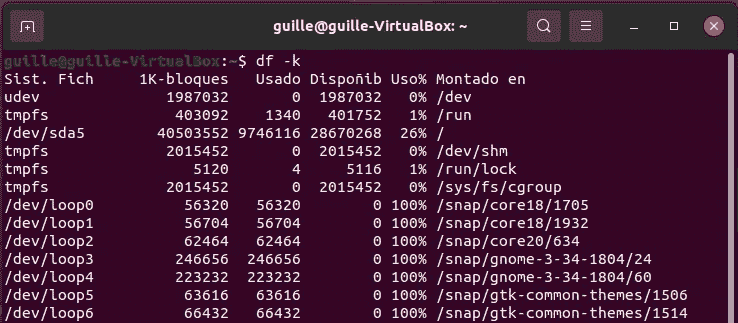

# Bash 的基本备忘单

> 原文：<https://betterprogramming.pub/the-essential-bash-cheat-sheet-e1c3df06560>

## 掌握 Linux 和 macOS 终端所需的所有命令

照片由 [Sai Kiran Anagani](https://unsplash.com/@_imkiran?utm_source=medium&utm_medium=referral) 在 [Unsplash](https://unsplash.com?utm_source=medium&utm_medium=referral) 上拍摄

无论你是软件开发人员、数据科学家、IT 基础设施经理，还是仅仅是一个极客，知道如何在 Linux 和 macOS 中使用终端都是必须的。问题是要记住的命令太多了。除非你有惊人的记忆力，否则你需要不时地在互联网上搜索这个或那个命令。

为了给你提供一些宝贵的时间，在给你带来了一个 MySQL 和一个 Docker 备忘单之后，今天我将与你分享最常用和最有用的 shell 命令。

# 基础知识

## 命令帮助

不记得`cp`的参数了？`mkdir`命令有哪些选项？然后寻求帮助:

## 管道

将一个命令的输出通过管道传输到另一个命令的输入，或者将其写入文件，这通常很有用:

## 过滤输出

有时命令的输出太长。在这种情况下，您可能想用`more`或`less`命令将它分成几页，或者只是用`grep`打印包含特定单词或句子的行:

## 清洁屏幕

终端中的文本太多？只需键入`clear`并恢复任务中的焦点。

# 该系统

## 关于系统的信息

使用以下命令，您可以轻松获得有关您的计算机的所有详细信息:

## 运行流程

以下命令概述了系统中正在运行的所有进程。在 macOS 和一些 Linux 发行版中，`htop`没有安装——在使用它之前，您需要用默认的软件包管理器(macOS 中的 [Homebrew](https://brew.sh) )安装它:

Linux 中的 *htop* 命令

## 更改用户

当您打开终端窗口时，您键入的所有命令都将由您的当前用户运行。但是，您经常需要以特权用户的身份运行它们，因此了解如何在 shell 中切换用户非常重要。

## 复制并粘贴到剪贴板

您可以通过选择文本并点击 *Ctrl + C* 或 *Ctrl + V* 从/向终端复制和粘贴文本。但是，在某些情况下，您可能希望直接访问剪贴板。正如您在下面看到的，无论是在 Linux 还是 macOS 中，这都再简单不过了！

# 变量和路径

您可以通过两种方式在您的计算机外壳中定义变量:实时地——通过在终端中键入相应的命令——或者通过在您的主目录中的`.bashrc`文件中定义它们，这样它们就可以永远存在。

另一个有趣的工具是`alias`——长命令的快捷键。让我们看看如何创建一个:

对于那些不知道的人来说，路径是系统将在其中查找可执行文件的目录列表，因此您只需键入其名称就可以运行它们，而不需要知道它们在哪里。我们可以在路径中添加一个文件夹，并使用以下命令获取可执行文件所在的目录:

# 文件和目录

## 更改当前目录

为了在文件系统的目录之间移动，你只需要知道如何使用命令`cd`。

## 列出目录的内容

`ls`命令是显示目录中的文件和文件夹及其属性的重要工具。

## 从互联网下载文件

`wget`命令是下载远程文件到你电脑的最简单的方法。

使用 *wget* 下载文件

## 创建目录

想要创建文件夹吗？然后使用`mkdir`命令。

## 复制、移动和删除

您通常在文件浏览器中执行的复制、移动和删除操作，也可以在终端中执行。

## 权限和所有者

分别用`chmod`和`chown`改变文件或目录的权限和所有者。

## 搜索文件

不记得 contacts.json 文件在哪里？您想列出文件夹中的所有 PDF 文件吗？使用`find`命令，您可以做到这一点以及更多。

## 计算文件的 SHA256 校验和

当您从互联网下载任何软件时，建议通过检查其 SHA 校验和来验证是否已正确下载，这很容易从终端完成:

## 压缩和解压缩 TAR/ZIP 文件

无论是 TAR 还是 ZIP 文件，您都可以从终端解压缩它。并从现有文件夹中创建一个:

## 自由空间

你想知道你的硬盘里还有多少可用空间吗？还是在外部驱动器中？还是在当前目录下？命令有所有这些问题的答案。

我的电脑中的可用空间

# 读取文件

从终端上，我们不仅可以看到文本文件的内容，还可以进行大量的分析，比如根据内容对行进行过滤和排序，计算行数、字数和字符数，如果文件是表格格式，还可以选择列。让我们看看所有这些都在起作用:

我知道终端里有很多更有用的命令，但是我不想把这篇文章写得太长。

我希望你喜欢这个小抄。如果你有任何问题或建议，不要犹豫发表评论！