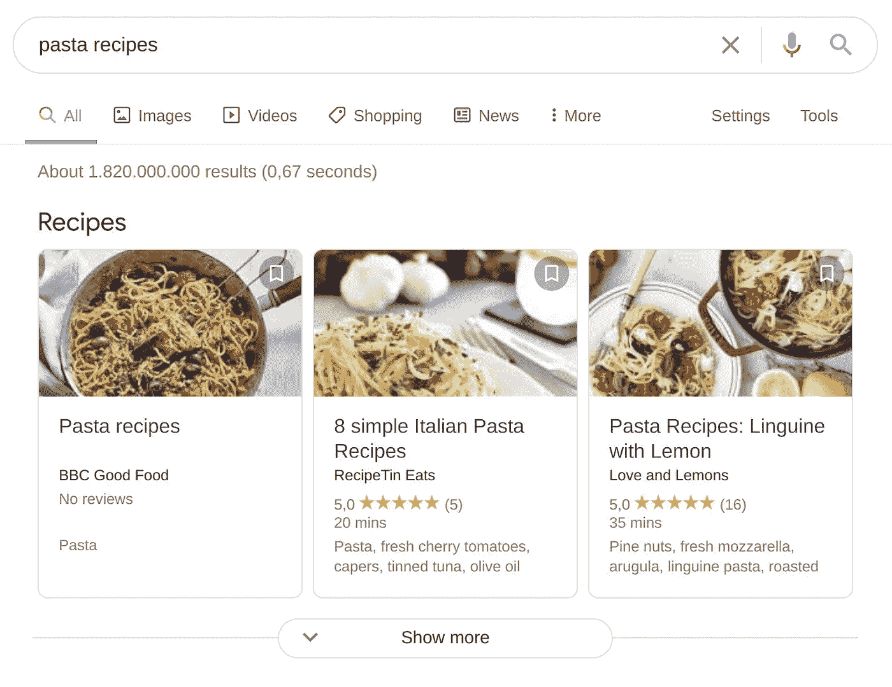

# 网站开发者 SEO 基本指南

> 原文：<https://betterprogramming.pub/the-essential-guide-to-seo-for-web-developers-374e152f5a60>

## SEO 的关键概念以及如何将它们应用到你的网站中


由 [Unsplash](https://unsplash.com?utm_source=medium&utm_medium=referral) 上的 [Le Buzz](https://unsplash.com/@le_buzz?utm_source=medium&utm_medium=referral) 拍摄。

web 开发人员的职责不仅仅是设计和开发应用程序。除了向应用程序添加正确的功能，你还必须采取主动行动，确保用户会接受它。

负责 SEO 就属于这一类。

如果你想让你的应用程序在搜索引擎排名中表现良好，那么在开发应用程序时融入 SEO 技术是每个 web 开发者必须要做的事情。

这本针对 web 开发人员的 SEO 基本指南将在不到 10 分钟的时间内让您了解开发 web 应用程序时应该使用的最新 SEO 技术。

首先，对于那些不完全熟悉 SEO 概念的人来说，让我们来看一下基础知识。

# SEO 是什么，为什么需要它？

SEO 代表搜索引擎优化。这个术语本身就表明了 SEO 到底是什么。

当你在浏览器搜索框中键入一些搜索关键词时，搜索引擎必须决定如何显示结果，哪些网页将列在前 10 个结果中，接下来是哪些网页。

如果你想吸引那些寻找与你所提供的内容相似的内容的用户，尽可能靠近搜索结果列表的顶端是让他们访问你的网站的最佳选择。

搜索引擎算法使用搜索引擎已经存储的关于每个网页的数据来决定哪些网页提供最接近用户的关键字正在寻找的内容。

SEO 的目的是让搜索引擎算法相信你的网页包含了用户正在寻找的内容。

除了网页的内容，排名算法更喜欢将提供最佳用户体验的网站显示在结果页面的顶部。

将这两个需求结合起来，你就需要在开发过程中负责网站 SEO 方面的 web 开发人员。

作为开发人员，你的责任在于 SEO 的技术方面，这需要一些代码的更改、添加和调整来进行优化。

既然基础知识已经涵盖，让我们开始浏览网页开发人员的基本 SEO 技巧。

# 添加相关的 HTML 元标签

搜索引擎爬虫查看网页上的某些 HTML 标签来识别它所提供的内容的类型。与 SEO 最相关的两个标签是标题和描述标签。

如果你是自己写一个网站的 meta 标签，你需要考虑关键词的作用。

## 什么是关键词？

在搜索引擎术语中，关键词是用户在浏览器搜索框中输入的短语。

为了吸引搜索引擎用户访问你的网页，你首先需要确定用户寻找的关键词，这些关键词与你提供的内容相似。

一旦你确定了相关的关键词，你就应该在网页的内容中使用它们。

使用识别关键词的最重要的地方是网页的标题标签和`H1`标签。

你也应该使用`H2`里面的关键词以及其他标题和段落。但是，它们对搜索引擎排名算法的影响比前面提到的那些要小。

注意不要在网页上过度使用关键词。排名算法认为过度使用关键词是试图误导算法，并因此惩罚你。

关键词和单词的比例是多少比较好？这是一个价值百万的问题。

## 标题标签

将关键字放在 title 标签中最有效的位置是在其开头。如果这是不可能的，在标题的任何地方使用关键字。

一个优化的 title 标签不应该超过 60 个字符，包括空格和其他特殊字符。

```
<title>Introduction to SEO for beginners</title>
```

## 元描述标签

描述标签对排名算法的结果没有太大的影响。但是因为你提供的描述是显示在 SERP 上，让用户对网页上的内容有一个概念，所以它应该被写来强迫用户点击你的网页的链接。

```
<meta name="description" content="A short description that describes the content in the web page">
```

## Robots.txt 文件和 Robots 元标记

使用`robots.txt`文件告诉搜索引擎不要抓取文件中指定的页面。通常，阻止爬虫访问特定网页是为了防止爬虫的请求淹没应用程序的服务器。只有当减少发送到服务器的请求数量对网页的性能至关重要时，才这样做。

还可以防止抓取网站上不重要的页面。

您可以使用`robots.txt`文件来阻止网页在 Google 或类似的搜索引擎上被索引。但这并不完全成功。如果有另一个页面链接到当前页面，它仍然可以被索引。

如果你想一劳永逸地将一个页面从索引中移除，那么在页面的 HTML 代码中添加`noindex` robots meta 标签。

```
<meta name="robots" content="noindex">
```

# 关注和不关注链接

爬虫通常在它已经访问的页面中爬行链接的页面。

有时，您可能希望阻止链接的网页与您的站点相关联，或者不从当前页面对其进行爬网。在这种情况下，您可以传递`nofollow`作为`rel`属性的值。

```
<a href="https://example.com" rel="nofollow">
```

然而，[谷歌宣布](https://developers.google.com/search/blog/2019/09/evolving-nofollow-new-ways-to-identify)自 2020 年以来，他们一直使用`nofollow`只是作为一个提示，而不是一个规则。因此，使用`nofollow`只会向谷歌暗示你不希望链接的页面被抓取。谷歌可能会也可能不会决定按照你的意愿去做。

如果你不想让爬虫跟踪你的任何链接，你可以在你的 meta robots 标签上使用一行指令。

```
<meta name="robots" content="nofollow">
```

# 结构数据

您可能已经看到过搜索结果页面有时是如何以特殊格式显示结果的。例如，如果你用谷歌搜索“意大利面食谱”，结果页面会显示一些特殊的卡片，上面有不同食谱页面的链接。



谷歌搜索结果卡示例

Google 和大多数其他搜索引擎使用网页中提供的结构化数据来检索数据，以便显示像这样的特殊功能。

用于编写结构化数据的词汇与 schema.org 的[中定义的词汇非常相似。但是，您应该参考搜索引擎的文档来了解它所接受的确切格式。如果你正在为谷歌优化，你可以使用](https://schema.org/)[谷歌丰富的结果测试](https://search.google.com/test/rich-results)来测试和验证你的结构化数据。

现在，让我们看看如何在我们的网页上使用结构化数据来为 Google 提供关于其内容的正确信息。

如果我们的网页是一个菜谱页面，您可以使用以下结构化数据(以 JSON-LD 格式编写)来提供菜谱的名称、作者、评级和其他相关数据:

除了 Recipe，Google 还提供了一些其他的功能类型，包括文章、FAQ、书籍、招聘和本地商业。参考 [Google 的开发人员文档](https://developers.google.com/search/docs/guides/search-gallery)，了解不同结构化数据格式和内容类型的更多细节。

# 页面加载速度

页面加载速度是为用户提供更好的用户体验的主要方面之一。

谷歌在 2018 年进行的一项调查发现，当页面加载时间从 1 秒增加到 3 秒时，反弹的概率增加了 32%，当页面加载时间从 1 秒增加到 5 秒时，反弹的概率增加了 90%。

由于页面速度对于用户体验的重要性，谷歌开始在其排名算法中将其作为排名因素。现在，页面加载速度的提高是你的网页在谷歌搜索结果中排名靠前的一个原因。

虽然让你的网页快速加载是很重要的，但是让用户感觉它加载得很快也是很重要的。您必须减少在页面上显示某些内容的时间，以便在其他内容在后台加载时吸引用户的注意力，并让用户感觉您的页面加载速度更快。

Google 的 Lighthouse 是衡量你网站表现的一个很好的工具。它的性能评分并不仅仅基于完美网络条件下的实际页面速度。它影响着你的网站在糟糕的 3G 连接下的表现。Lighthouse 是一个很好的工具，可以用来测量实际用户对页面加载时间的感受。

您可以使用几种方法来提高网页的加载速度:

*   缩小 CSS、JavaScript 和 HTML。
*   减少重定向的数量。
*   利用浏览器缓存。
*   优化图像尺寸。
*   利用懒加载。
*   利用 od 谷歌的[加速移动页面(AMP)](https://developers.google.com/search/docs/advanced/guidelines/amp) 。

# 移动友好

由于大多数在线内容都采取了移动优先的方式，谷歌也采取行动将网页的移动友好性纳入其排名算法。

一个移动友好的网站为移动用户提供了更好的用户体验。随着通过手机访问网络的用户数量达到历史最高水平，改造您的 web 应用程序以更好地为移动用户服务应该是显而易见的。

有三种主要的方法可以让你的网站更适合移动设备。

## 使用响应式设计

将您当前的设计转换为响应式设计将对您现有的代码基础产生最小的影响。

您可以设置新的 viewport meta 标签，并调整 CSS，使其更灵活地适应不同的屏幕分辨率，从而使 web 设计更具响应性。

## 使用动态设计

动态设计在检测到请求内容的用户代理类型后，为移动和桌面用户提供不同的 HTML 内容。与响应式设计相比，它需要付出更多的努力来实现，因为它需要为移动用户和桌面用户提供不同的呈现页面。

## 使用移动子域

一些 web 应用为移动用户使用单独的子域。通常，子域的名称类似于 mobile.example.com 或 m.example.com。这种方法需要更多的时间和精力来实现。一般不建议中小型网站使用，尤其是当你的网站没有两个不同版本的时候。

# 结论

虽然担心 SEO 可能看起来超出了 web 开发人员的工作描述，但我希望这篇文章能够说服您，考虑 SEO 是向您的客户交付完整的 web 应用程序所必须的。

虽然这篇文章提到了 web 开发人员应该关注的 SEO 的最重要的方面，但是其他几个技术因素也会影响排名算法的决策。

作为 web 开发人员，掌握 SEO 的下一步，您可以研究更多技术性的 SEO 实践，并使用它们来让您的网站在搜索结果页面中排名靠前。

感谢阅读！