# 基本 IdeaVim 插件

> 原文：<https://betterprogramming.pub/the-essential-ideavim-plugins-f939b4325180>

## 精选插件列表，提升您的 IdeaVim 体验


贾斯汀·摩根在 [Unsplash](https://unsplash.com?utm_source=medium&utm_medium=referral) 上的照片

我已经使用 [IdeaVim](https://github.com/JetBrains/ideavim) 和 JetBrains IDEs(例如 Pycharm)进行个人项目和工作有一段时间了。我认为我可以很放心地说，它取代了我以前的 Vim/Neovim 设置，特别是对于大型项目。当然，我仍然使用 Neovim 从终端编辑配置文件，但除此之外，都是 IdeaVim。

当我从 Neovim 切换过来的时候，我首先整理了一个重要的重映射列表，我在[我的上一篇文章](https://towardsdatascience.com/the-essential-ideavim-remaps-291d4cd3971b)中分享了这个列表，它得到了很多关注(准确地说是 6K 次浏览),这让我感到惊讶，并激励我继续做这个。在这篇文章中，我分享了我每天使用的 IdeaVim 插件列表，以使体验更好。

我在这篇文章中添加了动画 gif，因为我相信它们描绘了一幅更好的画面，并且让你更容易理解每个插件做了什么。但是，在某些情况下是不够的，在一个帖子中解释所有错综复杂的细节会使它太长。作为额外的材料，我开始发布[视频](https://www.youtube.com/playlist?list=PLYDrCnplQfmG2aoNeu5_RP3GfcBiD1wl7)，对每个插件进行更详细的描述。

作为背景，我使用 Neovim 大约三年，作为我的主要编辑。然而，我意识到我正在花费宝贵的时间更新我的配置，而不是为我的项目增加价值，当我的配置在处理时间关键的任务时变得一团糟时，这令人难以置信地沮丧。此外，一些功能是次优的(在我看来)。如果你对我为什么更详细地切换到 IdeaVim 感兴趣，请查看这篇文章。

# 开始之前

这篇文章不是每个插件文档的复制粘贴。相反，抱着你不应该仅仅因为一个插件受欢迎就添加它的想法，我试图解释每个插件是做什么的或者它试图解决什么问题。然后，告诉你如何设置它。之后用一些例子说明如何使用。

此外，如果你是 IdeaVim 的新手(例如，你不知道你的`ideavimrc`文件在哪里)，查看一下[这篇文章](https://amine-elhattami.medium.com/destination-ideavim-day-1-the-basics-793a514af57f)，它一步一步地介绍了基础知识。然后，你可以按照[这篇文章](https://towardsdatascience.com/the-essential-ideavim-remaps-291d4cd3971b)来配置快捷键。

此外，我知道 IdeaVim 并不完美，但它给了我所需要的灵活性，尤其是因为我不是 Vim 超级用户。

最后，如果某些东西在早期版本中不工作，我将使用 IdeaVim 版本 [1.9.3](https://plugins.jetbrains.com/plugin/164-ideavim/versions/stable/151325) 。

# 轻松运动

Easy Motion 是我最喜欢的插件之一。它模仿 [vim-easymotion](https://github.com/easymotion/vim-easymotion) ，它的目标非常简单:它让你以最少的击键次数跳到源代码中你想要的地方。

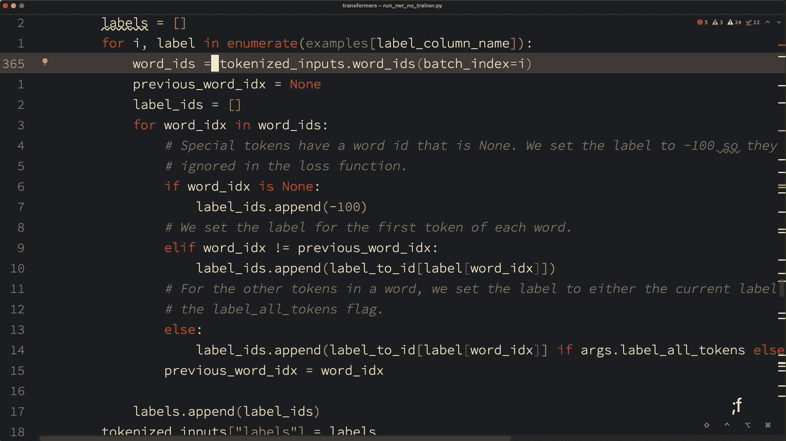

图片由作者提供。

在编写代码时，您可能会遇到需要跳转到特定位置的情况。使用 IdeaVim 时，您有两个主要选项(当然，不使用鼠标)。首先，您可以使用行号或相对行号跳转到目标单词所在的行。然后，使用`f`命令(字符搜索)。其次，您可以利用搜索功能。

尽管上述两种方法都可以完成工作，但它们都有一些局限性。如果目标字符在第一个方法中不是唯一的，那么在到达目标单词之前，您可能需要跳过所有先前出现的字符。在第二种方法中，您可能需要键入整个目标单词或至少其中的重要部分，并且您不能使用模糊搜索(除非您使用 regexp)。

Easy Motion 通过一个非常直观的界面让你在源代码中跳跃。此外，您可以将此功能用作运动。例如，下面的 GIF 显示了如何在视觉模式下使用 Easy Motion 进行选择。

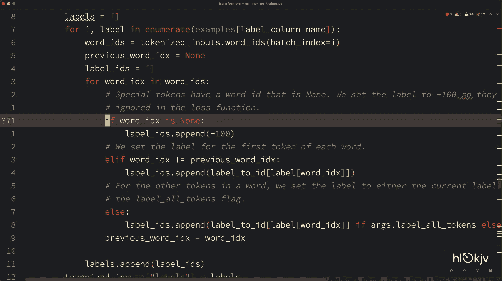

作者图片

## 设置

首先，从 IDE 插件设置中安装 [IdeaVim-EasyMotion](https://plugins.jetbrains.com/plugin/13360-ideavim-easymotion/) 和 [AceJump](https://plugins.jetbrains.com/plugin/7086-acejump/) 插件。然后，将下面的代码片段添加到您的`.ideavimrc`文件中。

```
Plug 'easymotion/vim-easymotion'
map <leader>F <Plug>(easymotion-s)
map <leader>f <Plug>(easymotion-f)
```

`easymostion-s`和`easymotion-f`分别让你向后和向前搜索，它们是我唯一使用的两个。然而，如果你需要更精细的功能，比如跳到单词的开头而不是结尾，你可以使用 [80 个支持的简单动作命令](https://github.com/AlexPl292/IdeaVim-EasyMotion#supported-commands)。

## 使用

当你点击你映射的一个快捷方式并开始输入后，插件会添加标签，覆盖所有与你输入的字符匹配的单词(见上面的 GIF)。这些标签是唯一的，一旦您键入它们，您的光标将跳转到标签所标记的位置。

# 纳特树

NERDTree 插件允许您使用 vim 风格的键绑定来导航项目窗格。它模仿 [NERDTree](https://github.com/preservim/nerdtree) 。

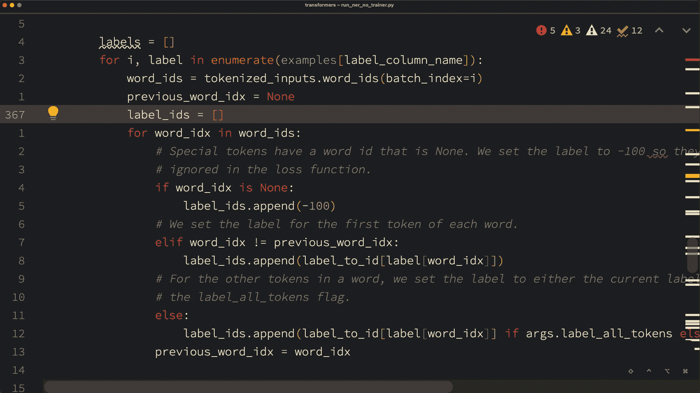

作者图片

您可以使用默认快捷键(command-1)打开没有此插件的项目面板。但是，您需要使用箭头键四处移动，这将使您的手离开主行，并使用上下文菜单来访问可用的功能。另一方面，NERDTree 允许使用 vim 风格的键绑定。此外，除了上下文菜单的功能之外，NERDTree 还提供了一些额外的功能，比如在项目窗格中保持焦点的同时打开选定的文件。

## 设置

对于基本设置，将以下代码片段添加到您的`.ideavimrc`文件中:

```
Plug 'preservim/nerdtree`
map <c-t>   :NERDTree<CR>
```

此外，您还可以映射其他命令:

*   `:NERDTreeToggle`:切换项目窗格，而不是同时使用打开和关闭命令。
*   `:NERDTreeClose`:从编辑器中关闭项目窗格。
*   `:NERDTreeFind`:触发项目窗格中的模糊搜索。但是，值得一提的是，在工程窗格上输入内容会启动搜索。然而，由于像`j`、`k`和`o`这样的多个键被映射到不同的命令，所以您不能使用这种方法来查找以这些字母开头的文件或文件夹，这就是您需要使用`:NERDTreeFind`的地方。
*   `:NERDTreeRefreshRoot`:刷新根文件夹，以反映磁盘上的最新变化。

## 使用

一旦工程窗格展开(如果它是关闭的)并获得焦点，您就可以使用多个快捷方式来执行所有操作。我经常使用下面的快捷键，但是你可以查看[文档](https://github.com/JetBrains/ideavim/wiki/NERDTree-support)来获得完整的列表。

*   `j/k`:上上下下。
*   `q`:关闭工程窗格。
*   `P`:跳转到根节点。
*   `o`:打开文件或目录。
*   `go`:打开文件，但关注项目窗格。
*   `s`:以新的垂直分割方式打开选中的文件。

# 包围

surround 插件模仿 [vim-surround](https://github.com/tpope/vim-surround) ，顾名思义，帮助处理周围的单词或行。它使得添加、改变或移除环境变得容易。

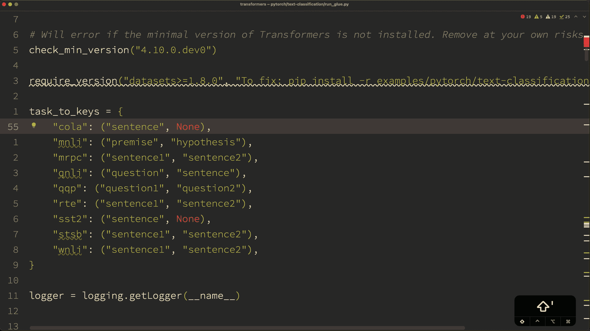

图片由作者提供。

这个插件在处理源代码时很有用，但对于 HTML 或 XML 这样的标记语言(带标签的语言)更有用。例如，我在下面的 GIF 中用`<b>`标签将“English”括起来。注意，插件使用了正确的结束标签`</b>`。而且，它还能正确处理标签属性(`<h4 align=”center”>`)。

我在处理 markdown 文件时也使用这个插件，它帮助我将单词加粗、斜体等。

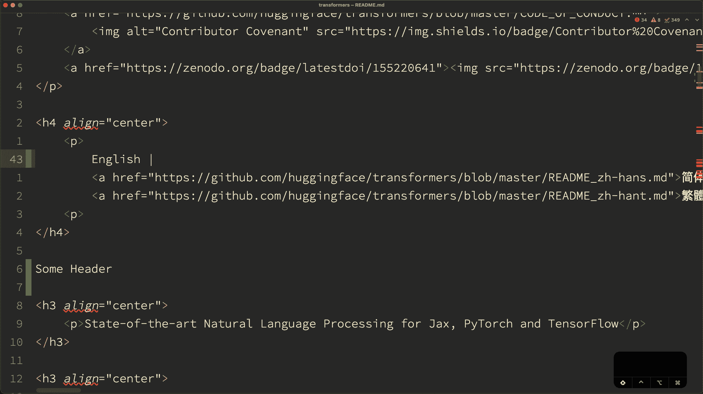

图片由作者提供。

## 设置

设置很简单，您只需要将插件添加到您的`ideavimrc`中。插件会自动添加命令。

```
Plug 'tpope/vim-surround'
```

## 使用

这个插件在正常模式下增加了四个主要命令

*   `cs`:至 **c** 更换 **s** 四周。
*   `ds`:将 **d** 删除 **s** 边框。
*   `ys`:添加 **s** 周边。
*   `S`:包围当前选择的文本。

以下是我平时常用的一些命令。但是，您可以查看[文档](https://github.com/tpope/vim-surround)了解更多信息:

*   `cs”’`:将双引号改为单引号。
*   `ds”`:删除最近的双引号周围。
*   `ysiw<b>`:用`<b>`标签包围当前单词(`iw`表示内部单词。)

# 多个光标

多光标模仿[vim-多光标](https://github.com/terryma/vim-multiple-cursors)插件，顾名思义，它允许以 vim 方式使用多个光标。

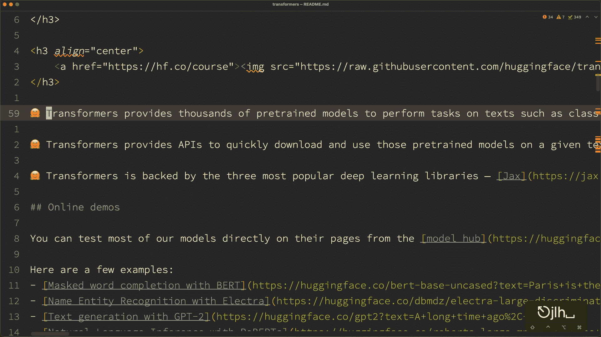

图片由作者提供。

我使用这个插件在代码和非代码文件中执行批量编辑。然而，我不依赖这个插件来重命名变量或函数，因为 IDE 的重构特性更适合。此外，如果您需要替换整个文件中的特定单词，这个插件不是最佳选择，因为您可以使用搜索和替换功能。然而，我发现当重构特性不可用时，在当前范围内更改某些内容非常有用，比如在文本文件中。

如果你有点创意，这个插件会更有帮助。例如，我在下面的 GIF 中的第一个数组项目前添加了一个空格，这有助于创建多个光标，放置在每个单词前以添加相同的前缀。

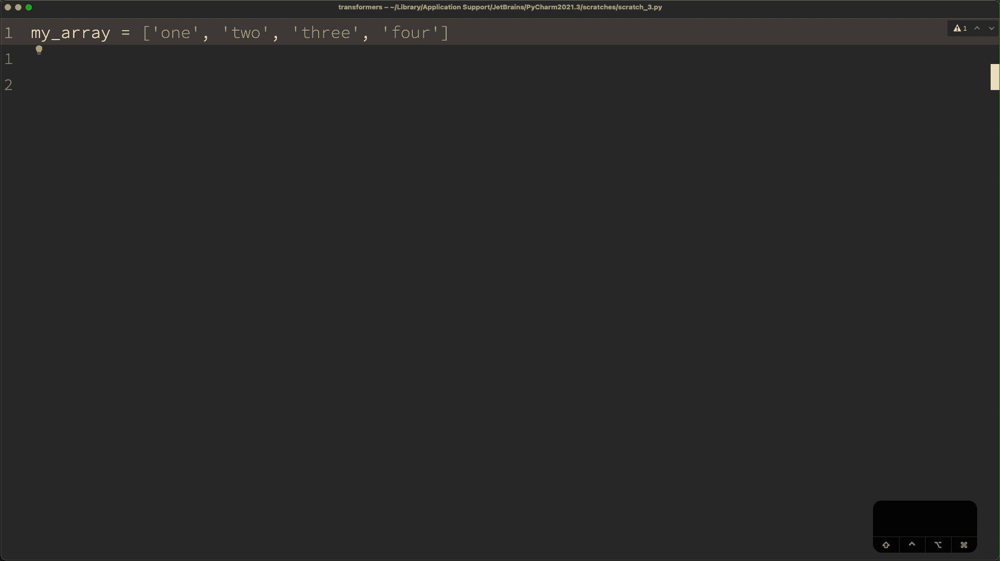

## 设置

要使用这个插件，请将以下内容添加到您的`ideavimrc`文件中。

```
Plug 'terryma/vim-multiple-cursors'
```

默认情况下，这个插件使用 ALT 键自动映射命令。然而，您可以使用您的`ideavimrc`中的`map`命令来重新映射它们(例如`map YOU_MAPPING <A-n>`)。

## 使用

这个插件在正常模式下增加了三个主要命令

*   `<ALT-n>`:启动多光标模式，选择当前单词，或选择下一个出现的单词。
*   `<ALT-x>`:取消选择当前事件，转到下一个事件。
*   `<ALT-p>`:取消选择当前事件，转到上一个事件。
*   `C-c` / `Esc`:退出模式

# 评论

注释插件模仿[vim-commentation](https://github.com/tpope/vim-commentary)，并支持用 vim 动作注释代码。

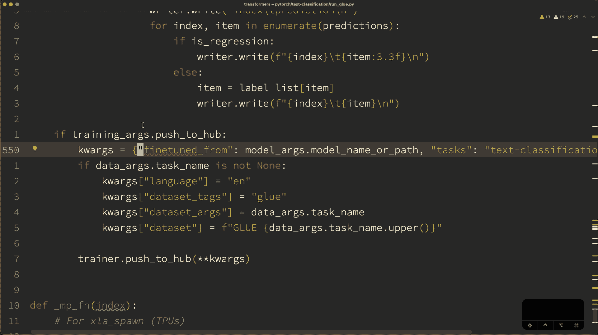

图片由作者提供。

这个插件对于注释一行是没有用的，因为原生 IDE 注释特性正是这样做的。然而，当你把它和任何 vim 运动结合起来时，这个插件会大放异彩。例如，上面的 GIF 显示了如何用一个命令注释整个部分或几行，而不用先选择它们。

## 设置

设置很简单，您只需要将插件添加到您的`ideavimrc`中。插件会自动添加命令。

```
Plug 'tpope/vim-commentary'
```

## 使用

这个插件在正常模式下增加了三个主要命令

*   `gcc`:注释当前行。
*   `gc` +动作:使用动作进行注释。
*   `gc`:注释选中的文本。

以下是我经常使用的一些命令，但请记住，您使用任何 vim 动作:

*   `gc2j`:注释当前行和下面两行。
*   `gc2k`:注释当前行和上面两行。
*   `gcap`:评论当前段落。
*   `gcii`:注释当前缩进部分(需要 indent-object 插件)。
*   `gcae`:注释整个文件(需要 textobj-entire 插件)。

# 交换

exchange 插件模拟了 vim-exchange，使得交换文本块变得更加容易。

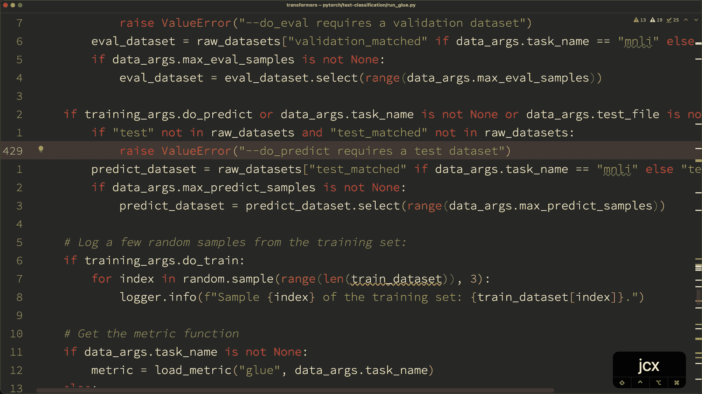

图片由作者提供。

没有这个插件，交换两个文本块如下。首先，你需要切断第一个区块，去第二个位置，并通过它。然后，您需要复制第二个块，回到第一个位置，并通过它。如果两个区块相距很远，这项任务可能会变得很乏味。然而，exchange 插件让你一步到位。

## 设置

设置很简单，你只需要将插件添加到你的`ideavimrc`中。插件会自动添加命令。

```
Plug 'tommcdo/vim-exchange'
```

## 使用

这个插件在正常模式下增加了三个主要命令

*   `cx` + motion:选择第一个区块进行交换，或者选择第二个区块进行交换。
*   `cxx`:与 cx 相似，但用于当前线路。
*   `X`:类似于 cx，但用于选择文本。
*   `cxc`:取消待兑换。

总之，使用`cx`、`cxx`或`X`命令选择第一个块。然后使用其中一个命令选择第二个块并执行交换。

您不需要使用相同的命令来选择块。例如，您可以使用`cx`选择第一个块，使用`X`选择第二个块。用能更快完成工作的那个。

# Vim 缩进对象

这个插件模仿了 [vim-indent-object](https://github.com/michaeljsmith/vim-indent-object) ，并基于缩进层次定义了一个文本对象。

提醒一下，Vim 中的文本对象是一个逻辑对象，可以与任何命令一起使用。例如，当使用`dw`删除一个单词时，`w`标记该单词的文本对象。

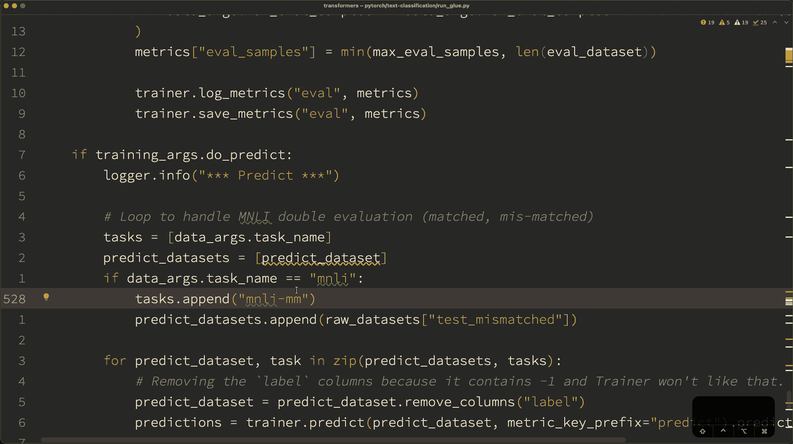

图片由作者提供。

对于像 Python 这样使用缩进来定义代码块的语言来说，indent text 对象非常方便。例如，在 C++中，您可以使用`%`来选择`if`块内的指令，因为所有指令都在`{}`内。然而，`%`在 Python 中不工作，因为没有定界符，这也是这个插件的亮点。

## 设置

设置很简单，您只需要将插件添加到您的`ideavimrc`:

```
Plug ‘michaeljsmith/vim-indent-object’
```

## 使用

这个插件增加了三个文本对象:

*   `ii`:缩进等级。
*   `ai`:缩进层次加上上面一行
*   `aI`:缩进等级上下加一行。

以下是我在使用 Python 代码时经常使用的一些示例:

*   `gcii`:注释同一缩进层次内的所有指令。
*   `cxii`:交换一个缩进等级。
*   `dai`:删除一条 if 语句及其所有指令。

# Argtextobj

这个插件模拟了 [argtextobj.vim](https://www.vim.org/scripts/script.php?script_id=2699) ，与 indent 对象相似，它为参数添加了一个新的文本对象。

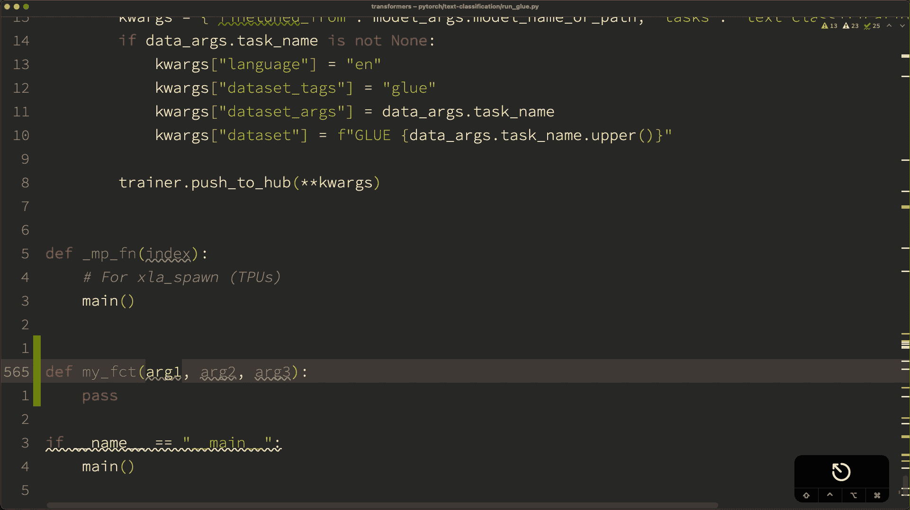

图片由作者提供。

你可以使用单词 selection ( `vw`)和 arg 文本对象做同样的事情。但是，一个优点是选择参数时不考虑光标的位置。与`vw`相反，您首先需要转到参数的开头。在`vw`命令不起作用的情况下，使用 Python 中的命名参数(例如`fct(param=value)`)也很有用。

## 设置

要使用这个插件，请将以下内容添加到您的`ideavimrc`文件中。

```
Plug 'vim-scripts/argtextobj.vim'
```

默认情况下，该插件仅对函数参数有效。但是，如果您将下面的配置添加到您的`ideavimrc`中，您可以使用它来选择列表中的项目或 Java 中的通用类定义。

```
let g:argtextobj_pairs="[:],(:),<:>"
```

## 使用

这个插件增加了三个文本对象:

*   `aa`:参数周围。为第一个参数或前一个参数选择参数和下一个逗号。
*   `ia`:仅参数。

以下是使用 arg text 对象的一些示例:

*   `daa`:删除一个参数
*   `cia`:更改参数
*   `vai`:选择一个参数

# Textobj 整个

这个插件模拟了 [vim-textobj-entire](https://github.com/kana/vim-textobj-entire) ，与缩进对象相似，它为整个文件添加了一个新的文本对象。

这个文本对象的唯一好处是不管光标在什么位置，都可以对整个文件应用命令。例如，要选择没有该插件的文件内容，必须先转到顶部，然后从顶部到底部进行选择。

## 设置

要使用这个插件，请将以下内容添加到您的`ideavimrc`文件中。

```
Plug 'kana/vim-textobj-entire'
```

## 使用

这个插件增加了三个文本对象:

*   `ae`:整个文件，前后有空行。
*   `ie`:没有前后空行的参数。

以下是使用 arg text 对象的一些示例:

*   `vae`:选择所有文件内容。
*   `dae`:删除所有文件内容。

# 替换为寄存器

这个插件模拟了 [ReplaceWithRegister](https://github.com/vim-scripts/ReplaceWithRegister) ，并允许你使用寄存器的内容来替换任何文本。

当你的剪贴板在没有使用黑洞注册的情况下删除了一些东西后被覆盖时，这个插件是有用的。

## 设置

要使用这个插件，请将以下内容添加到您的`ideavimrc`文件中。

```
Plug 'vim-scripts/ReplaceWithRegister'
```

## 使用

这个插件定义了两个命令:

*   [count]["x] `grr`:用寄存器 x 的内容替换[count]行。
*   {Visual}["x] `gr`:用寄存器 x 的内容替换选择。

例如，`"2gr`会用 2 号寄存器的内容替换当前选中的文本。

# 高亮美国佬

这个插件模仿了 [vim-highlightedyank](https://github.com/machakann/vim-highlightedyank) 并在你复制(猛拉)某些东西时充当视觉反馈。

如果你习惯于在复制之前选择文本，这是没有用的。然而，当你使用动作来复制文本时，这是很好的。比如用`y2j`代替`v2d`，然后用`y`。

## 设置

要使用这个插件，请将以下内容添加到您的`ideavimrc`文件中。

```
Plug 'machakann/vim-highlightedyank'
```

此外，您可以使用`let g:highlightedyank_highlight_duration = DURATION_IN_MILLISECONDS`参数修改高亮持续时间(-1 表示持续)。您也可以使用`let g:highlightedyank_highlight_color = "rgba(160, 160, 160, 155)"`调整背景颜色。

## 使用

当您复制一段文本时(`y`命令)，该文本会在设定的持续时间内高亮显示。

# 临终遗言

这篇文章分享了我经常在任何 JetBrains IDE 上使用 IdeaVim 的插件列表。

如果我给你一个建议，试着理解你为什么使用一个特定的插件。如果没有，你会花时间设置它，然后永远不会使用它。所以随便挑吧。

# 参考

*   [Github JetBrains/idea vim—idea vim 源代码](https://github.com/JetBrains/ideavim)
*   [亲爱的维姆 I :q](https://medium.com/r?url=https%3A%2F%2Famine-elhattami.medium.com%2Fdear-vim-i-q-5df03b763ae4)
*   基本的想法仍然存在
*   第四天[评估想法第一天:基础知识](https://amine-elhattami.medium.com/destination-ideavim-day-1-the-basics-793a514af57f)
*   [IdeaVim 演播列表](https://www.youtube.com/playlist?list=PLYDrCnplQfmG2aoNeu5_RP3GfcBiD1wl7)
*   [IdeaVim Easymotion 插件](https://plugins.jetbrains.com/plugin/13360-ideavim-easymotion/)
*   [IdeaVim AceJump 插件](https://plugins.jetbrains.com/plugin/7086-acejump/)
*   [IdeaVim NerdTree 文档](https://github.com/JetBrains/ideavim/wiki/NERDTree-support)
*   [Github tpope/vim-surround—vim-surround 源代码](https://github.com/tpope/vim-surround)
*   [Github terryma/vim-多光标-vim-多光标源代码](https://github.com/terryma/vim-multiple-cursors)
*   [Github tpope/vim-commentation—vim-commentation 源代码](https://github.com/tpope/vim-commentary)
*   [Github vim-scripts/ReplaceWithRegister—ReplaceWithRegister 源代码](https://github.com/vim-scripts/ReplaceWithRegister)
*   [argtextobj.vim](https://www.vim.org/scripts/script.php?script_id=2699)
*   [Github macha kann/vim-highlighted yank—vim-highlighted yank 源代码](https://github.com/machakann/vim-highlightedyank)
*   [Github kana/vim-text obj-entire—vim-text obj-entire 源代码](https://github.com/kana/vim-textobj-entire)
*   [Github michaeljsmith/vim-indent-object—vim-indent-object 源代码](https://github.com/michaeljsmith/vim-indent-object)

```
**Want to Connect?**Follow me on [Twitter](https://twitter.com/amine_elhattami), where I regularly tweet about software development and machine learning.
```