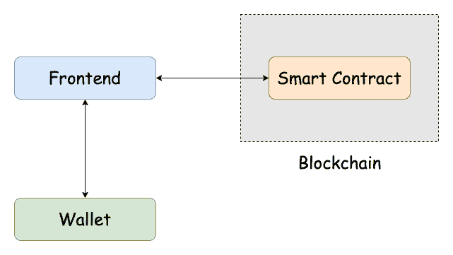

# 开发者必须知道的基本 Web3 工具和技术

> 原文：<https://betterprogramming.pub/the-essential-web3-tools-and-technologies-developers-must-know-e0cce016ee98>

## 智能合同、区块链、加密钱包等等

分散式应用架构

Web3 是 Web 的下一代。与由静态网页组成的 Web1 和为我们带来网络应用和网络平台的 Web2 不同，Web3 由建立在区块链上的分散网络组成。

对 Web3 开发人员的需求很大，因为相对而言，目前很少有开发人员是该领域的专家。所以，如果你是一个已经建立的 Web2 工程师，想要进入 Web3，你会从哪里开始呢？需要了解哪些基本概念，需要学习哪些工具和技术？

在本文中，我们将探索 Web3，为什么它很重要，以及它与 Web2 有何不同。然后，我们将看看有抱负的 Web3 开发人员应该熟悉的技术堆栈。

# Web3 101

在我们深入研究 Web3 应用中使用的技术之前，让我们首先了解 Web3 是什么以及它为什么重要。

Web3 的五个关键特性是去中心化、区块链、安全性、可伸缩性和隐私性。在 Web3 的去中心化世界中，区块链技术和其他协议从根本上改变了数据存储、分发和访问的方式，同时提供了一个本地事务层。Web3 的流行用例是去中心化金融(DeFi 和加密货币)、通过称为 DAOs 的去中心化治理进行投票，以及作为所有权证明的不可替代令牌(NFT)。

这听起来可能有点愤世嫉俗，但 Web3 背后的很多动机是基于用户、公司和政府之间信任的侵蚀。

在分散金融中，用户将资金存放在自己的私人钱包中，进行交易，而无需与中央机构互动，也无需依赖政府的法定货币。

基于区块链的投票应用将使所有投票数据透明，任何人都可以轻松验证，因此你不必再相信当权者选举得到了公平处理。这就是 Web3“不可信”的原因:该技术是透明的，并受到加密技术的保护，因此没有必要盲目信任机构。

NFTs 可用于提供任何给定数字资产(如音乐或艺术)的所有权证明，并允许您更直接地支持创作者。

所有这些例子都涉及不再依赖中央当局或中介机构的核心活动。

需要注意的是，Web3 并不是要取代 Web2，就像 Web2 没有取代 Web1 一样。静态网站仍然在网络上占有重要的位置，比如那些来自 Web1 的网站。尽管 Web3 越来越受欢迎，使用率越来越高，但 Web2 应用仍将有一席之地。

# 分散式应用程序

我们现在对 Web3 是什么以及为什么去中心化的概念很重要有了一个大致的概念，但是 Web3 应用实际上是什么样子的呢？

嗯，它们看起来很像 Web2 应用程序！分散式应用程序，也称为“d apps”(或“dapps”)，由一个前端 UI 组成，它与部署在区块链上的“智能合约”(一个小程序代码)进行交互。在进行交易或向区块链写入数据时，前端还可以与用户的钱包进行交互。与 Web2 应用程序的关键区别在于，智能合约和区块链取代了由个人或公司拥有和维护的典型服务器和数据库。

分散式应用架构

# 定义 Web3 技术堆栈的技术

那么，实际上如何构建一个去中心化的 app (dapp)？好消息是，您可以从您已经拥有的编程技能和经验开始！我们已经知道 dapp 有一个前端，所以这意味着你需要了解 HTML、CSS 和 JavaScript。除非你喜欢用普通的 JavaScript 构建你的应用程序，否则你可能也想使用框架或库，比如 Angular、React 或 Vue。对于已经精通这些技术的前端开发人员来说，这是一个好消息。

现在，让我们来看看你需要专门为 Web3 学习的一些语言、工具和框架:

[**Solidity**](https://soliditylang.org/) 是一种编程语言，用于编写在以太坊区块链上运行的智能合约。它看起来像是 C++、Python 和 JavaScript 的混合体。如果你现在已经学习了一些编程语言，那么你就会知道学习一门新的语言会越来越容易。由于大多数智能合同都涉及某种形式的货币交易，遵循[适当的标准](https://docs.openzeppelin.com/)和[安全最佳实践](https://consensys.net/blog/developers/solidity-best-practices-for-smart-contract-security/)是至关重要的。

[**Truffle**](https://trufflesuite.com/docs/truffle/) 是一个帮助你编写、测试和部署智能合约的框架。Truffle 网站将其描述为“使用以太坊虚拟机(EVM)的区块链的开发环境、测试框架和资产管道。”与 React 帮助您构建 JavaScript 应用程序一样，Truffle 也可以帮助您处理智能合约。使用 Truffle 并不是绝对必要的，但是这个框架将极大地帮助你，因为它抽象出了一些开发复杂性。对于 VS 代码用户来说，[VS 代码扩展的松露](https://trufflesuite.com/blog/build-on-web3-with-truffle-vs-code-extension/)使得开发生命周期更加容易。

[**Ganache**](https://trufflesuite.com/docs/ganache/) 是个人区块链，用于本地开发和测试智能合约。它使开发人员能够用几个简单的命令创建以太坊区块链的本地实例。就像您在本地主机或测试环境中开发 Web2 应用程序而不是在生产环境中一样，Ganache 也允许您在本地进行 Web3 开发。

[**Web3.js**](https://web3js.readthedocs.io/) 是一个用于与以太坊交互的 JavaScript 库。您可以在前端应用程序中使用 web3.js 来做一些事情，比如连接到用户的钱包，授予对智能合约的访问权限，以及调用智能合约上的函数。智能合约可以通过 CLI 或 UI 访问，因此 web3.js 可以帮助您从 UI 使用智能合约。

[**MetaMask**](https://metamask.io/) 是一款 Web3 钱包，可以配合其浏览器扩展或手机应用使用。我们以前提到过钱包，但还没有真正描述它们是什么。钱包为您的数字资产提供了一个接口。你用只有你自己知道的私钥来保护内容。MetaMask 为用户提供了一种安全的方式来连接到基于区块链的应用程序，并通过他们的钱包与他们进行交互。对于开发者来说，钱包需要部署智能合约并与之交互。通常情况下，你必须将你的私钥放在你的代码中，但是 [Truffle Dashboard](https://trufflesuite.com/blog/introducing-truffle-dashboard/) 使你能够将你的元掩码钱包连接到你的项目，而无需暴露你的密钥。

[**Infura**](https://infura.io/) 是一家基础设施提供商，用于连接以太坊和其他区块链以及 IPFS 等分散存储网络。不涉及太多细节，任何与区块链的交互都需要通过 JSON-RPC 或 websockets 访问节点。Infura 提供了基础设施，因此您不必在自己的机器上启动自己的节点。如果您确实想运行自己的节点，Infura 也可以作为后备。Infura 还提供了一个开发套件和工具包，包括监控、度量、日志、事务管理和其他用于构建 dapps 的特性。这是对我们已经讨论过的其他技术的进一步抽象，使 Web3 开发更加容易。

兴奋地挖掘所有这些吗？简要介绍了这些技术之后，您就可以开始构建您的第一个 dapp 了！外面有很多很棒的教程，每一个都可能使用大部分(或者全部)这些技术。为了帮助你开始，ConsenSys 团队提供了几十个“[松露盒](https://trufflesuite.com/boxes/)”，它们是样板模板，你可以用来启动你的第一个项目。如果你正在寻找一种[结构化的方式来为 Web3 做准备，去看看 ConsenSys Academy](https://consensys.net/academy/) 。

# 结论

Web3 是互联网的下一次发展，支持下一代软件。区块链是更加透明的技术，不仅通过消费者的采用，而且通过主要机构的采用，已经成为主流。

了解什么是 Web3 技术以及如何构建它将会给你打入市场带来优势。

对于那些已经有强大的 Web2 基础的有抱负的 Web3 开发人员，我希望到现在为止，你对自己已经掌握的知识有一个良好的开端感到自信！花些时间学习上面的技术，你会比你想象的更快做好准备。