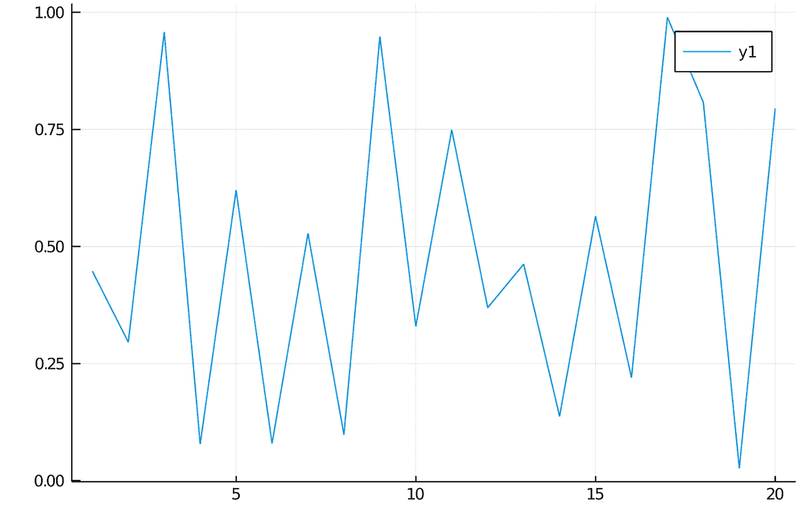
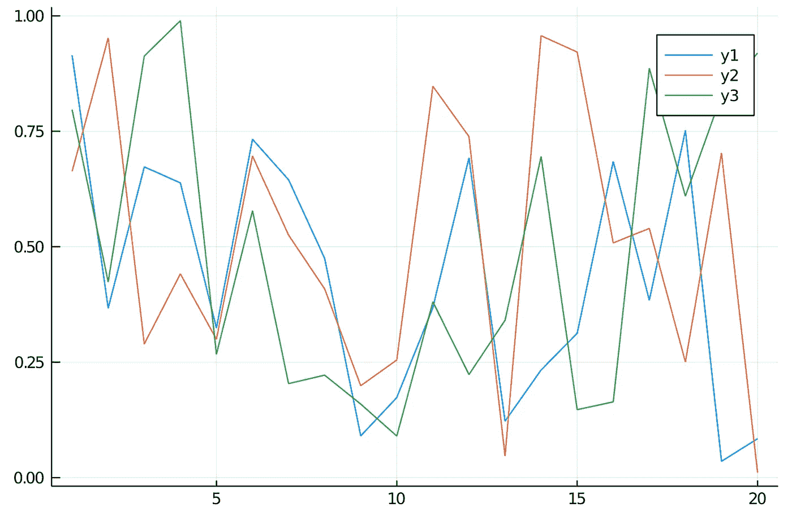
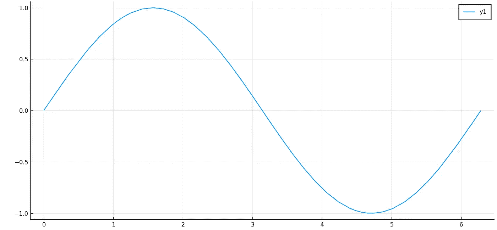
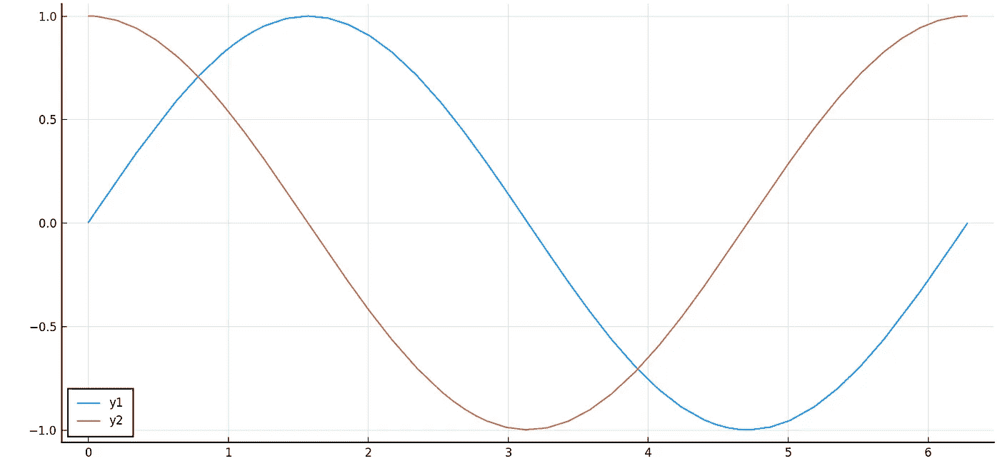

# 朱莉娅神话世界简介

> 原文：<https://betterprogramming.pub/the-fabulous-world-of-julia-5e3f270ef999>

## Python 程序员的 Julia 基础


爱上朱莉娅:作者的形象

2019 年，当我开始学习如何建立神经网络和涉足 NLP 时，我才开始意识到 Python 的真正多功能性。易用性、大量可供选择的库以及它们在科学计算中的应用，使得 Python 成为一个容易的选择。现在，我知道有一整类 r 的从业者，我并不反对 r，我自己也用过。但不知何故，对我来说，R 中的命令似乎没有 Python 中的命令直观，所以我坚持使用 Python。当我听说朱莉娅的时候，我想知道所有的宣传是关于什么的。然后我听到了标语:

> 看起来像 Python，感觉像 Lisp，运行起来像 C (Fortran)

引起我注意的是:

*   看起来像 Python:语法与 Python 惊人地相似，用它编码也一样简单。
*   像 C 一样运行:Julia 的运行时性能堪比 C。

我没有计算机科学背景，所以我从来没有听说过 Lisp。然而，除了被吹捧为高计算性编程的未来之外，吸引我的是它看起来像 Python。

对于 Python 爱好者和实践者来说，这是一个好消息:
您可以通过使用`PyCall`库来使用 Julia 中的所有 Python 库！

## **这一切对我们意味着什么？**

好吧，这只是意味着如果你曾经祈祷过一个易于使用并且运行速度超快的编程语言，你的祈祷得到了回应！

## **朱莉娅能用来做什么？**

Julia 是为高级计算编程而构建的，但它也可用于一般编程。

## 哪里可以找到学习朱莉娅的资源？

现在有大量的可用资源。我从 Julia Acadmedy 的[免费教程](https://juliaacademy.com/courses/375479/lectures/5745676)开始。还有一个叫做 Julia 编程语言的 [Youtube 频道](https://www.youtube.com/user/JuliaLanguage)，有来自 Julia 学院的讲座，也有麻省理工学院的首次 Julia 讲座。如果你熟悉 Python，Julia 将是一门容易掌握的语言。

## 试玩怎么样？

变量和关键字:在 Julia 中声明变量类似于在 Python 中声明变量:

```
#Declaring a variable
x = 7#Getting datatype
typeof(x)  #output: Int64
```

但是，不能给关键字赋值。它们是保留的，所以不能变异:

```
#Keyword
pi   #output: π = 3.1415926535897...#Assigning new value to keyword
pi=9  #output: cannot assign a value to variable MathConstants.pi from module Main
```

让我们执行一些基本操作:

```
#Addition
7+3.7  
#output: 10.7#Multiplication
5.7*9.1  
#output: 51.87#Subtraction
54-73   
#output: -19#Division
11/13   
#output: 0.8461538461538461#Quotient
div(11,13)
#output: 0#Remainder
11%13
#output: 11#Exponent
3^6
#output: 729
```

继续进行逻辑运算:

```
#AND
3 & 7
#output: 3 (AND operation on binary expression of 3 and 7)#OR
3 | 7
#output: 7 (OR operation on binary expression of 3 and 7)#XOR
3 $ 7
#output: 4 (XOR operation on binary expression of 3 and 7)
```

然而，要小心使用字符和字符串——在这里，您选择的引用变得很重要。例如:

```
#Define characters using single quotes ('')
key = 'k'
typeof(key)
#output: Char#String cannot be expressed using single quotes ('')
p = 'purple'
#output: syntax: invalid character literal#Express strings using double quotes ("")
p = "purple"
typeof(p)
#output: String
```

此外，还有其他按位运算，如:

```
# Bitwise shifting
8 >> 1
#output: 4Binary expression of 8 is 1000 while that of 4 is 0100\. Shifting 1000 by one unit to the right, we get 0100\. Hence 8 >> 1 gives 4\. Similarly:16 >> 3
#output: 28 << 1
#output: 1616 << 3
#output: 128
```

## 但是代数在哪里？

很高兴你问了！

```
#Polynomial equations
x=7#The Python Way
2*x^2 + 3*x + 5
#output: 124#The Julia Way
2x^2 + 3x + 5
#output: 124
```

这还不是全部。Julia 以优雅的方式帮助您处理复杂的数字:

```
#Complex Number
x = 3 + 5im (in Julia, **i** is represented by **im**)
typeof(x)
#Complex{int64}#Real and Imaginary parts
real(x)
#output: 3imag(x)
#output: 5#Operations on complex numbers
x * 2
#output: 6 + 10imy = 7 + 9i
x * y
#output: -24 + 62im
```

虚数可以被认为是极坐标，因此对于 a + bi，半径的大小= sqrt(a + b)，角度θ= arctan(b/a)。

```
#Radius and Angle
x = 3 + 5im
angle(x)
#output: 1.0303768265243125abs(x)
#output: 5.830951894845301
```

## **让我们使用一个 Julia 包，看看它是如何工作的**

我们将使用`Plots`包来绘制随机数的图形:

```
using Pkg
Pkg.add("Plots")using Plots
data = rand(20) #generates 20 random numbers between 0 and 1
f = plot(data)
```



20 个随机数的图形

您也可以在单个图表中绘制多个数据系列:

```
data = rand(20,3) #generates 3 sets of 20 random numbers between 0 and 1
f = plot(data)
```



在单个图表中绘制多个数据系列

此外，您可以向现有图中添加另一条线:

```
plot!(f,2*rand(20))
```


将 y4 添加到之前的图中

## 给我看看蟒蛇！

说到绘图，`PyPlot`是`Plots`包中最好的基于 Python 的后端选项之一。让我们导入`Pyplot`包。

```
Pkg.add("PyPlot")
```

现在让我们画出函数 Sin(x)在区间 0 到 2*pi 上的图形。

```
Plots.pyplot()
f = plot(sin,0,2*pi)
```



区间[0，2*pi]上的正弦曲线

让我们试着一起绘制两个图形:

```
f = plot([sin,cos],0,2*pi)
```



区间[0，2*pi]上的正弦和余弦曲线

现在让我们使用`PyCall`包导入一个 Python 库。首先，我们将`PyCall`包添加到 Julia:

```
Pkg.add("PyCall")
```

让我们从 Python 导入`Math`包:

```
math = pyimport("math")
math.sin(math.pi/2)
#output: 1.0
```

简单的语法让我沉迷于探索 Julia！我渴望尝试机器学习应用。

我会用这种编程语言的美来发布我的更新！