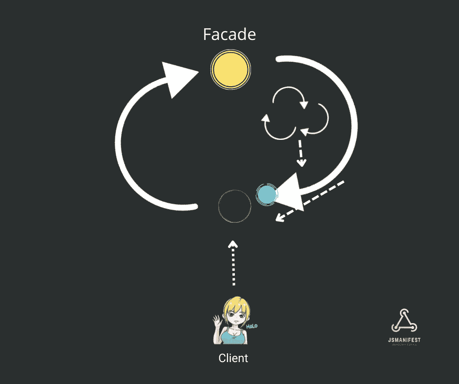

# JavaScript 中的外观设计模式

> 原文：<https://betterprogramming.pub/the-facade-design-pattern-in-javascript-d3843853b238>

## 解开复杂性

在用 JavaScript 开发应用程序时，经常会遇到冗余代码，这让我们质疑它对价值的积极影响。冗余是开发人员经常试图避免的一种常见做法，因为过多的冗余很容易导致不愉快的开发体验，如代码大小的增加以及代码可维护性的降低。

解决这个问题的一个好方法是外观设计模式。在本文中，我们将回顾`Facade`以及它是如何有效解决类似问题的模式。

除了减少冗余之外，facade 模式在定义更高级的接口方面也做得很好，该接口将几个接口统一成更优雅的接口，目的是进一步简化事情。它通常用于将不必要的复杂代码部分包装成一个简单的结构，这样客户就不用对他们不关心的步骤负责。

让我们假设我们正在构建一个简单的游戏，我们的第一个实现将是一个`Human`类的定义。我们代码的其他部分期望这个人类类包含几个身体部分作为属性:`Eye`、`Ear`、`Arm`、`Leg`、`Feet`、`Nose`、`Mouth`、`Neck`和`Stomach`:

现在让我们定义一个`Profile`类，它有一个用于设置其配置文件字符的方法，名为`setCharacter`:

当然，在真实的场景中，它会比这个长几十倍，所以请记住，我们只关注模式和它通过只显示相关代码所解决的问题。

我们在`setCharacter`函数的开头包含了一个`validateCharacter`,因为它是任何软件验证构建部分的必要组件，以确保错误不会在不知不觉中发生。这也恰好是展示`Facade`有用性的一个很好的设置。

下面是实现过程:

因此，在我们的`validateCharacter`调用中，它继续检查人体的每个部分，如果至少有一个身体部分缺失，就会抛出一个错误。

让我们试着像客户一样使用我们的代码:

运行代码将导致错误:

那么，客户端如何解决这个问题呢？轻松点。他们只需要构建每一个身体部分，并负责使它们存在于实例中。代码如下:

现在我们的代码运行无误。然而，如果你亲自动手，你可能会注意到你只关心创建一个角色和个人资料，所以我们在这里遇到了一些不愉快的问题:

1.  代码更长
2.  代码更复杂
3.  该代码对于客户端来说不是很容易使用(与最初的三行代码相比)
4.  冗余—多个领域都有冗余。对冗余的一个沉重打击是在我们的代码中反复提到`"bob"`。
5.  我们把球交给了客户(换句话说，我们强迫代码的用户负责构造和传递每一个身体部分)。很多时候，这是一件好事——我们希望赋予客户端代码发号施令的能力，这种情况并不少见。但这种情况就大不一样了。如果他们选择直接创建概要文件，并且只处理概要文件的特性，那么让他们做这些工作是没有意义的。

现在，让我们制作我们的`Facade`，并定义它将如何为客户解决我们不愉快的问题:

我们的`Profile`变成了`Facade`本身，并且有效地封装了身体部分的每一个实现作为后备，这样客户端代码只需要关注`Profile`提供的接口。

我们不仅给他们选择跳过不必要的步骤来构建和设置每个身体部分，而且我们也给他们选择完全控制，如果他们想自己做的话。

另外，请注意，我们代码的用户与`Profile`公开的接口紧密耦合。

这里有一个来自实现 facade 的[要点](https://gist.github.com/codejets/336fbed7e83a80e3c283)的例子。本例中模式的目的是将多个操作封装到一个调用中。从业务逻辑的角度来看，这可以表示客户端代码执行在线电子书购买的接口，其中客户端并不真正关心书是如何购买的——它只需要一个 API 来负责向用户执行“保存”和“发送”行为。代码如下:

然后，客户机代码使用这个接口(facade ),不需要担心实现细节。代码如下:

# 现实世界的类比

让我们以杂货店为例。当你购买食品杂货时，收银员会告诉你要支付的商品价格，你可以选择用现金或信用卡支付。虽然这两种支付方式不同，但最终都达到了相同的目的。

如今，自新冠肺炎疫情以来，一种新的、流行的支付方式是[点击支付](https://www.shopify.com/retail/tap-to-pay)，这又是一种不同的方式，因为我们不再需要刷卡或兑换某种形式的货币。

这是 facade 模式的等价物，它为做同样事情的用户提供了一种新的支付方式(一个新的接口)。

# 真实世界的代码示例

## [ts-morph](https://github.com/dsherret/ts-morph)

我最喜欢的开源项目之一是 ts-morph。该库充当 TypeScript 编译器 API 的包装器，以提供“一种更简单的方式来以编程方式导航和操作 TypeScript 和 JavaScript 代码。”原始的 TypeScript 编译器 API 很容易变得复杂，因此 ts-morph 封装了这些复杂性，并公开了一个全新的易于使用的接口供客户端代码使用。我经常使用 ts-morph，所以我可以在个人层面上保证，这使得使用 TypeScript API 进行开发变得更加容易。

# 适配器和飞锤模式之间的差异

## 外观与适配器

有时候 facade 设计模式会被误认为是`Adapter`设计模式。但是不同之处在于，`Facade`可能会公开一个全新的接口供客户端使用，而`Adapter`的目的是在寻求扩展新的属性或行为时向后兼容以前的接口。

## 门面 vs 轻量级

在 facade 中，为客户端代码提供了一个接口来处理整个对象系统(可以包含相同对象的新副本),而 flyweight 模式中的客户端提供了一个接口来生成相同时要共享的对象，这是一种有效的内存保存方法。

# 结论

我希望你发现这是有价值的。以后多多关照！