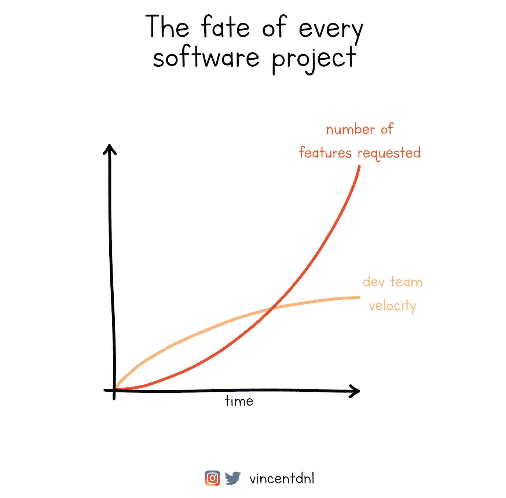
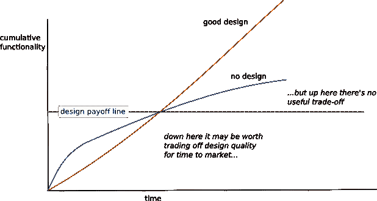

# 质量和速度之间的错误权衡

> 原文：<https://betterprogramming.pub/the-false-trade-off-between-quality-and-speed-7f0f9e93fdd>

## 让我们深入探讨为什么即使是最好的团队也要用质量换取速度，以及如何帮助团队避免这样做。

成长中的软件工程团队面临的主要风险之一是团队生产力的下降。这种下降源于几个因素，从跨多种沟通途径进行沟通的需求增加，到为最大限度地降低企业及其客户的风险而需要遵循的额外流程。

我不变地观察到的一件事是，即使在最好的团队中，团队在某个时候开始与速度斗争，因为软件的内部质量已经恶化到新功能的构建比以前花费更多时间的程度。

文森特·德尼尔

我已经看到这种情况发生，甚至在整个团队都接受构建高质量软件的想法的情况下，他们得到了管理层的支持。然而，在某些时候，他们开始挣扎。

在这篇文章中，我想深入探讨为什么会发生这种情况，技术领导者和管理者可以做些什么来防止这种情况，以及合理的替代方案是什么样子的。

# 什么是质量？

当我们谈论质量时，澄清质量的含义是很重要的，因为这个术语可能有多种含义。例如，让我们考虑这个简单的问题:

> “以下哪一款车质量更高？”

*   [法拉利 SF90 Stradale](https://www.ferrari.com/en-EN/auto/sf90-stradale)

照片由[阿德里安 N](https://unsplash.com/@anewevisual?utm_source=unsplash&utm_medium=referral&utm_content=creditCopyText) 在 [Unsplash](https://unsplash.com/s/photos/ferrari-sf90?utm_source=unsplash&utm_medium=referral&utm_content=creditCopyText) 拍摄

*   [大众高尔夫](https://www.volkswagen.co.uk/en/new/golf.html)

马丁·卡特勒在 [Unsplash](https://unsplash.com/s/photos/vw-golf?utm_source=unsplash&utm_medium=referral&utm_content=creditCopyText) 上拍摄的照片

没有一个合适的质量定义，很难回答这个问题。

谈论质量时的一个常见错误是*将质量与功能的可用性*混为一谈。法拉利 SF90 可能比大众高尔夫拥有更多的功能，或者在一些功能上有更好的表现，但这不应被解释为质量更好。

在软件开发中有许多可用的质量定义，但是对于这个博客，我将坚持以下的定义。我将**高质量软件**定义为:

1.*正确*:软件确实做了它应该做的事情，这可以通过测试来验证；
2。*安全*:保护软件免受恶意使用；
3。*可维护性*:软件易于更改和操作；
4。*它为用户做了正确的事情*:软件对用户有积极的影响。

# 为什么质量会随着时间的推移而变差？

当你问一个工程团队为什么代码库的质量下降了，最常见的原因如下:

*   我们有一个严格的截止日期，我们需要走捷径；
*   这是一个很小的功能，只会被一群用户使用；
*   我以后会有时间解决质量问题；
*   这是新产品，我们还不知道用户会不会喜欢；
*   利用我们将要节省的时间，我们可以添加一些额外的功能；
*   我们有许多对业务至关重要的功能要开发；
*   我们的利益相关者可以接受为了更快的交付而降低质量。

所有这些原因似乎都指向一个潜在的假设，即通过牺牲*质量*来获得*速度*的维度——更快的交付，同时交付更多的功能。

这一点都不奇怪——在软件开发的世界里，我们经常面临权衡，每个决定都有一系列的正面和负面。通常没有只有正面的选项，而选择是关于我们愿意容忍哪些负面来换取正面。

但是当我们谈论**质量**和**速度**时，我相信这是一个*错误的权衡*，理解为什么是使团队能够交付高质量软件的关键。

总的来说，一些团队认为通过交换质量来获得速度是可能的。马丁·福勒将此定义为[可交易质量假说](https://martinfowler.com/bliki/TradableQualityHypothesis.html):

> 质量是可以交易的，通过降低质量，我们可以在成本、范围或速度的其他方面获得收益。

但是为什么人们会认为这是真的呢？

这个假设是基于这样一个假设，即由于软件的内部结构不能被用户直接观察到，我们可以*降低系统的内部质量，以获得工程能力*，然后我们可以投资于向产品添加更多的功能，从而提高开发速度。

但是这种思维方式导致了两个大问题。

首先，当你用质量换取速度时，你得到的是更少的速度，而不是更多。

在当前的服务开发世界中，产品被构建为长期服务，随着时间的推移不断发展，以适应用户的需求。因此，大多数产品开发工作都发生在现有代码库和现有产品的环境中。

这有两个重要的后果。

首先，如果我们花更多的时间修改现有的代码库，而不是编写新的代码，那么软件构建速度的主要贡献者就变成了变更的成本:在确保软件按预期工作的同时，实现新的需求有多容易/困难？任何降低变更成本的事情都会对软件构建的速度产生很大的影响。低质量增加了未来变化的成本，因此增加了开发新特性的时间。

第二，低质量减少了开发团队关注新特性的可用带宽。bug 和其他操作问题阻碍了用户完成他们的工作，开发团队的大部分精力都消耗在处理问题上，团队无法专注于改进产品。

产品开发中低质量的累积效应意味着，从长远来看，开发低质量的软件比开发高质量的软件越来越昂贵。马丁·福勒在他的[设计耐力假说](https://martinfowler.com/bliki/DesignStaminaHypothesis.html)中对此进行了非常准确的描述。马丁指的是设计，但在我看来，这个假设也适用于质量:

> 无设计的问题是，由于没有在设计上投入精力，代码库会退化，变得更难修改，这降低了生产力，这是生产线的梯度。好的设计使其生产力更加稳定，因此在某个点(设计收益线)上，它超越了非设计项目的累积功能，并将继续做得更好。

图片:[https://Martin Fowler . com/bliki/images/designstaminagraph . gif](https://martinfowler.com/bliki/images/designStaminaGraph.gif)
图:[马丁·福勒](https://martinfowler.com/bliki/DesignStaminaHypothesis.html)

在某一点之前，低质量可以提高团队的速度，但这一点在产品生命周期中比人们预期的要早得多——几周而不是几个月。在大多数情况下，在项目生命周期的大多数阶段，构建低质量的软件比构建高质量的软件要慢。

第二，用质量换取速度形成了一个自我强化的循环，导致质量越来越差。

如果我们重复应用可交易的质量假设，我们很快就会进入一个很难证明任何质量投资的情况:如果质量阻止我们添加新功能，并且不能为用户提供任何好处，那么我们为什么要优先考虑其他事情而不是继续添加新功能呢？

一旦这种思维方式被接受，整个团队就会陷入一场向底层的竞赛中:没有人愿意被看作是团队中最慢的开发人员，更有甚者，质量被用来换取更慢的速度。

# 另一种选择是:关注持续的速度

速度在软件开发中显然很重要。一般来说，一个更快的团队将能够在一个产品上执行更多的迭代，这将提高团队对客户需求以及产品如何满足这些需求的理解。或者，在市场允许的情况下，速度更快的团队将能够享有先发优势。

为了避免陷入质量可交易的陷阱，我的建议是采用速度的定义，将速度和质量结合在一起。我多年来一直使用的一个方法是持续速度。

持续速度衡量软件开发团队现在和未来的速度。当我评估一项工作或评估一项技术设计时，我不仅仅关注我们能多快地构建它，还关注这项工作在现在和将来对团队速度的影响。如果工作使我们的团队速度变慢，那么就不应该允许发货。

为了让团队采取持续的速度心态，作为技术领导者，你可以做一些事情。

## 建立一种所有权文化

开发团队需要感觉到他们对软件的质量负责，并且他们有权决定如何执行项目或者定义产品。

如果涉众被允许确定项目是什么以及需要多长时间来构建，那么团队就不会成功，质量也会受到影响。

这一点可能有点争议，因为你可能会认为如果允许团队定义某件事情需要多长时间，他们将永远不会发布任何东西。但与直觉相反的是，如果你雇佣了一个关注工作质量的专业工程师团队，并为他们提供合适的背景和信息，他们将能够定义一个适合业务的高质量解决方案。

## 坚持高标准

质量在所有软件系统中都是至关重要的。在我们的世界中，原型有成为永久解决方案的强烈趋势，所以我们需要确保所有部署到产品中的代码都应该是高质量的。以下是您应该设定标准的一些领域:

*   拥有描述软件对用户的影响的度量标准，以及能够告诉你什么时候让事情变得更糟的度量标准；
*   对交付生产的每个变更进行同行代码评审，对较大的设计进行设计评审；
*   实施快速安全审查程序；
*   严格测试单元、集成、端到端和性能测试的组合；
*   设计您的故障模式，以便您可以控制系统在出现故障时的反应。

我在过去成功使用的一个技巧是，对于团队正在处理的任何工作项目，都有一个清晰的 Done 定义，并且将质量检查作为其中的一部分。

## 将质量融入你的评估和计划中。

众所周知，对软件项目的评估是不准确的，一个落后于预计交付日期的团队可能会感到将评估视为截止日期的压力，并牺牲质量来回到目标上。正如我们之前看到的，这通常会导致团队的速度进一步降低。

尽管估算是不准确的，但是我们可以通过留出足够的时间来提高它们的质量，不仅是为了编写代码，也是为了确保更高质量产品的所有活动，比如代码评审、设计评审和安全评审。

所有这些活动都需要时间，将它们纳入项目计划中是很重要的。

# 结束语

在软件开发的世界中，我们在生活的其他领域中经历的通常的成本和质量之间的权衡并不以大多数人期望的方式工作，并且以质量换取成本的方式思考会导致效率更低的软件开发过程。

更高的质量降低了变更的成本，并帮助开发团队专注于提供新的价值，而不是不断地与错误和问题作斗争。

从持续速度的角度考虑，可以让我们看到质量就是速度，如果我们想确保更快的交付，这是我们永远不应该交易的东西。