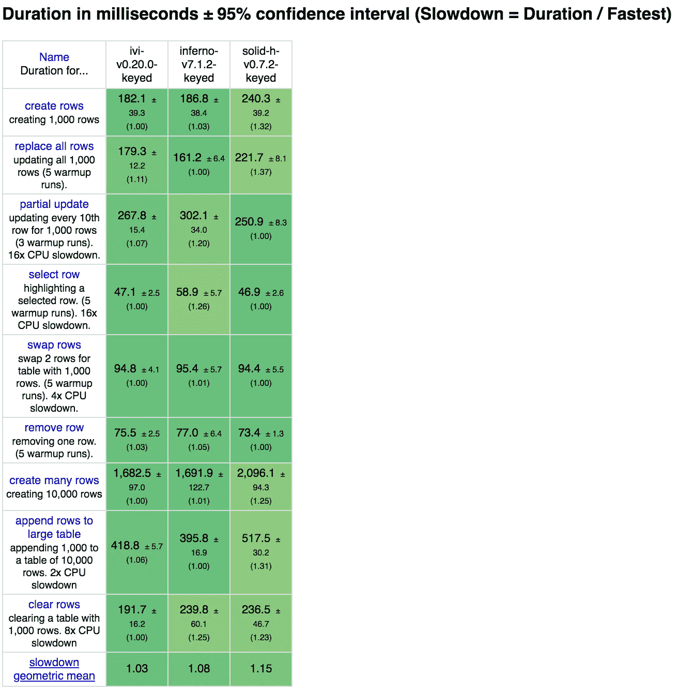
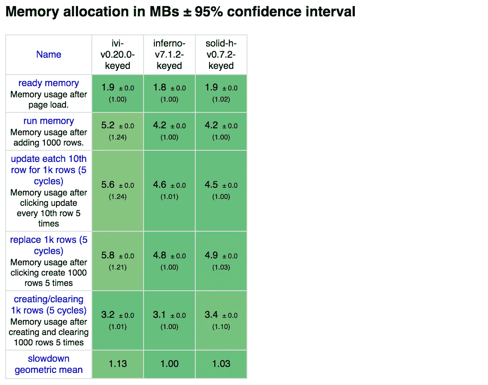
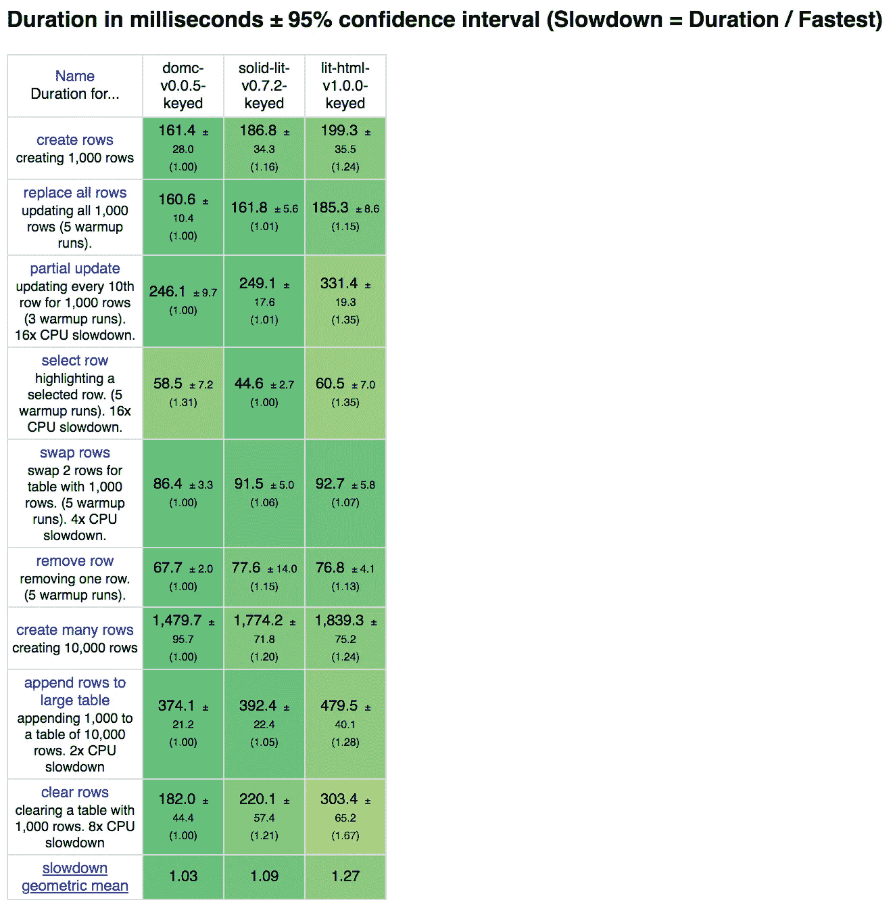
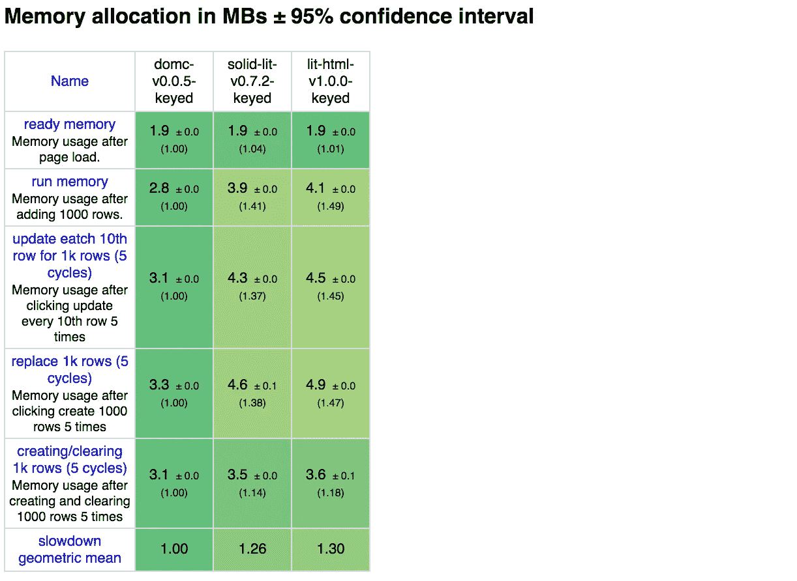
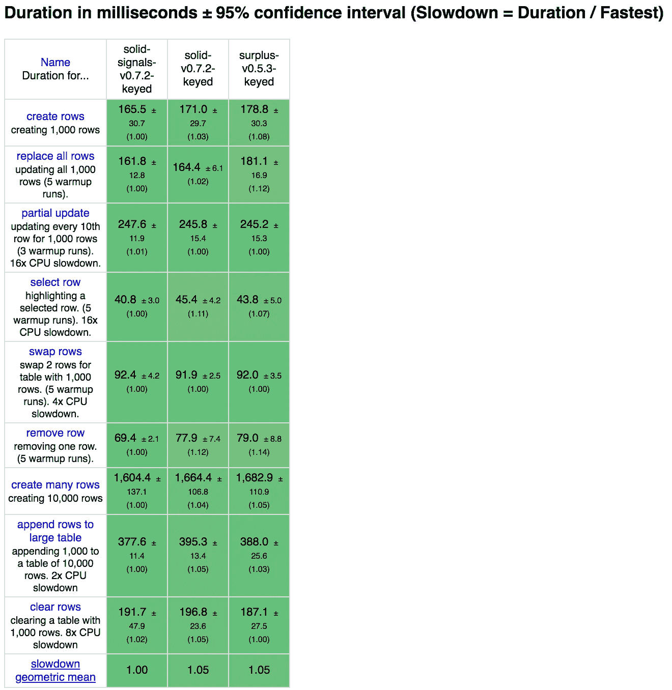
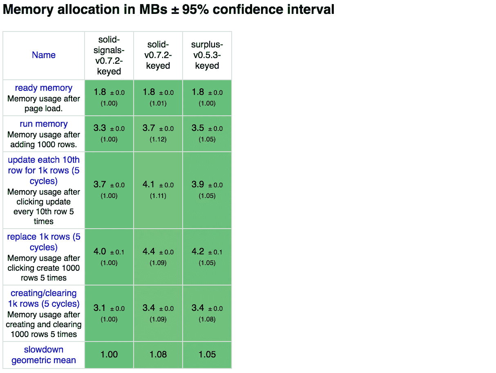
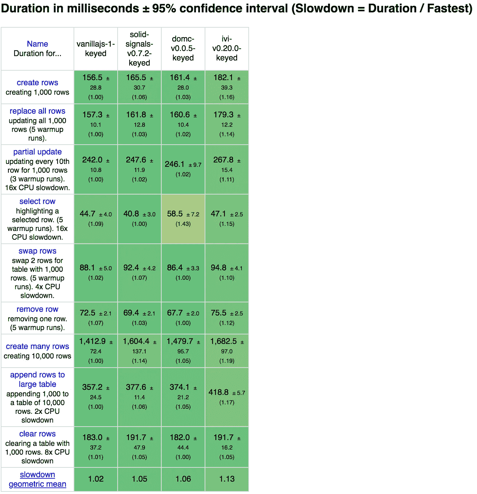
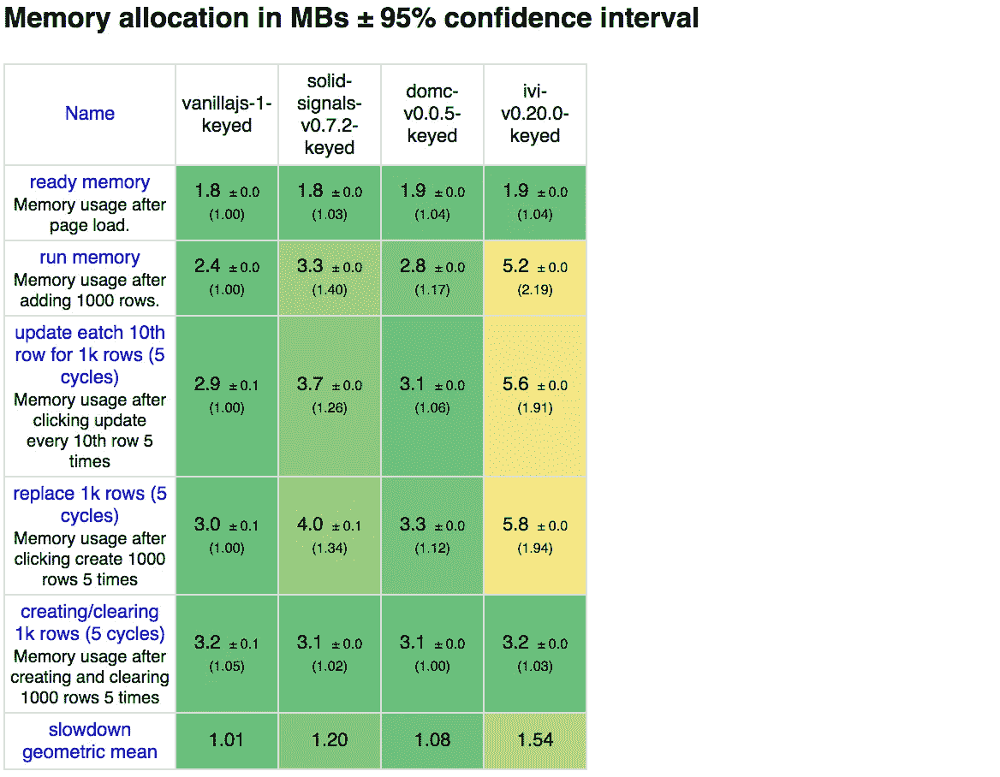
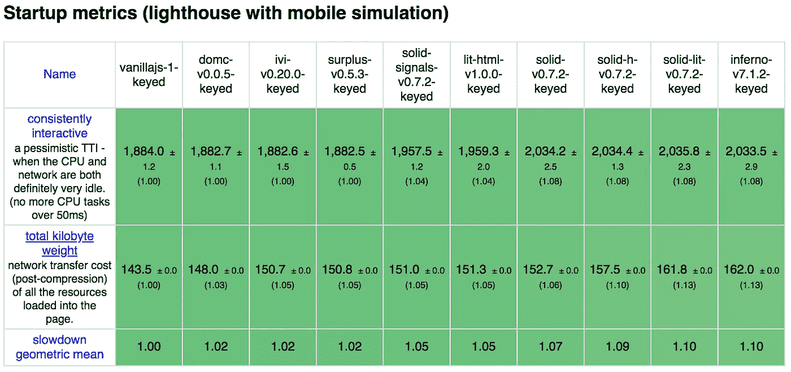

# 呈现 DOM 的最快方法

> 原文：<https://betterprogramming.pub/the-fastest-way-to-render-the-dom-e3b226b15ca3>

## 虚拟 DOM、标记的模板文字或细粒度的可观察对象是最快的吗？


来自 rawpixel.com

在撰写 [Solid](https://github.com/ryansolid/solid) 的时候，我有机会观察了许多不同的库，试图在基准测试中最大化性能。事实是 DOM 本身通常是最大的瓶颈。这意味着，归根结底，完全不同的方法可能表现相当。我看到每周都有新的库冒出来，每一个都从这里或那里取一点，把它们完美地组合在一起，过一段时间后，就很难理解其中的一些内容了。

现在不要误解我，我喜欢看到这些想法走到一起，但它们都有权衡和成本，有时在人体工程学方面，大多数时候在性能方面。人们对这些决定的全部影响还没有完全了解，但我想分享一些我观察到的情况。

# 比较

[JS 框架基准](https://github.com/krausest/js-framework-benchmark)是 JavaScript UI 框架的最佳通用基准。对于这个测试，因为我在玩变体，所以有必要在本地运行所有东西，而不是使用官方结果。结果因机器而异，因为我运行的是一台功能较弱的机器，所以在我们测试时，性能会下降得更明显。

我们将采用我认为每种渲染方法中最好的来说明具体决策的开销。我将通过使用 Solid 支持多种渲染技术的能力来做到这一点，以便在我们改变不同变量时并列不同的成本，并将其与使用类似技术的库的最佳示例进行比较。让我们看看竞争对手。

## 实心变体:

1.  [**实心**](https://github.com/ryansolid/solid) —这是股票 ES2015 代理版本，具有简洁的 setter 语法，在细粒度变化检测的基础上馈入 DOM 模板节点克隆。它通过预编译的 JSX 模板来实现这一点。 **(** [**代码**](https://github.com/ryansolid/js-framework-benchmark/blob/solid-variations/frameworks/keyed/solid/src/main.jsx) **)**
2.  [**固态信号**](https://github.com/ryansolid/solid) —这个版本与上面的相同，但是避开了原始信号的代理的便利性。它使实现变得更重，但是它留下了更小的包和更好的性能。 **(** [**)代码**](https://github.com/ryansolid/js-framework-benchmark/blob/solid-variations/frameworks/keyed/solid-signals/src/main.jsx) **)**
3.  [**solid-lit**](https://github.com/ryansolid/solid) —该版本避开了 JSX 预编译，通过及时标记模板文字运行时编译来实现 DOM 模板节点克隆。 **(** [**)代号**](https://github.com/ryansolid/js-framework-benchmark/blob/solid-variations/frameworks/keyed/solid-lit/src/main.js) **)**
4.  [**solid-h**](https://github.com/ryansolid/solid) —该版本使用 HyperScript 动态翻译为`document.createElement`。但是在其他方面使用与其他相同的实体实现。 **(** [**代码**](https://github.com/ryansolid/js-framework-benchmark/blob/solid-variations/frameworks/keyed/solid-h/src/main.js) **)**

## 其他图书馆:

1.  [**【domc**](https://github.com/Freak613/domc)—这个微渲染库被设计成在变更管理中做尽可能少的工作，同时在 DOM 模板节点上最大化地使用从 index.html 水合的定制运行时 HTML 字符串 DSL。 **(** [**代码**](https://github.com/ryansolid/js-framework-benchmark/tree/solid-variations/frameworks/keyed/domc) **)**
2.  [**盈余**](https://github.com/adamhaile/surplus) —这个库使用细粒度的变化检测，用预编译的 JSX 模板创建一系列`document.createElement`。Solid 使用相同的底层变更管理库。 **(** [**)代码**](https://github.com/ryansolid/js-framework-benchmark/tree/solid-variations/frameworks/keyed/surplus/src) **)**
3.  [**IVI**](https://github.com/localvoid/ivi)**——你可能听说过 Inferno，但这个库是虚拟 DOM 的真正巅峰。它使用带有钩子的 HyperScript Helpers-esque API。 **(** [**)代号**](https://github.com/ryansolid/js-framework-benchmark/blob/solid-variations/frameworks/keyed/ivi/src/main.js) **)****
4.  **[**lit-html**](https://github.com/Polymer/lit-html)**—不是同类型的第一个库，但却是性能最好的。它在运行时使用带标签的模板文字输入 DOM 模板节点。 **(** [**代码**](https://github.com/ryansolid/js-framework-benchmark/blob/solid-variations/frameworks/keyed/lit-html/src/index.js) **)******
5.  ****[**魔族**](https://github.com/infernojs/inferno)**——最快的 React 克隆和最快的虚拟 DOM 库之一。它使用带有特殊指令的 JSX 来指示如何获得最佳性能。 **(** [**代码**](https://github.com/ryansolid/js-framework-benchmark/tree/solid-variations/frameworks/keyed/inferno/src) **)********

****您最喜欢的一些库可能不在那里，但本质上这种组合反映了您将在这些库中看到的所有技术的高度优化版本。你可以把这看作是今天你的图书馆潜力的最好指标。如果你有兴趣看流行库的比较，我推荐[这个比较](https://medium.com/@ajmeyghani/javascript-frameworks-performance-comparison-c566d19ab65b)。****

****一个值得注意的缺席，我想补充的是一个 Web 程序集条目。不幸的是，在这一点上，WASM 条目本质上是普通的实现，没有更高级的数据驱动的抽象。最快的只能放在中间。因此，可以肯定地说，WASM 有一些潜力，但我们还没有达到。****

# ****结果呢****

## ****HyperScript (inferno，ivi，solid-h)****

****HyperScript 是一种将视图表示为函数组合(通常是 h 或 React.createElement)的方式。例如:****

```
**h('div', {id: 'my-element'}, [
  h('span', 'Hello'),
  h('span', 'John')
])**
```

****这是虚拟 DOM 库拥有的类别。即使他们使用 JSX 或其他模板 DSL，最终也会被转换为每元素呈现方法。这适合在每个渲染周期在 JS 中构建一个虚拟 DOM 树，但是正如这里所示，它也可以用于在 Solid 的情况下构建一个反应依赖图。****

********

****如您所见，虚拟 DOM 库在这里要快得多。创建反应图的开销在这里很大。请注意基准测试#1、#2、#7、#8 和#9 的差异。相反，Solid 在测量部分更新的其余基准测试中稍快一些。****

********

****记忆不太确定。Inferno 和这个版本的 Solid 几乎不分上下，而更高性能的 ivi 使用更多的内存。这是 Solid 最占用内存的版本，但值得注意的是这里的内存使用量有多接近。****

****这是经典的 VDOM 与细粒度的比较。细粒度的预先采取措施，以更好地执行更新。如果这是故事的结尾，那就很容易解释 VDOM 在过去几年的统治地位了。可以说，如果您使用细粒度的 HyperScript，那么使用虚拟 DOM 可能会更好。****

## ****字符串模板(domc，lit-html，solid-lit)****

****这里的每个图书馆都有一些共同点。它们基于克隆模板元素进行渲染，在运行时执行，不使用虚拟 DOM。然而，每一个都有不同的做法。DomC 和 lit-html 做自顶向下的区分，类似于虚拟 DOM，而 Solid 使用细粒度的反应图。Lit-html 将模板分成几个部分。DomC 和 Solid just in time 将模板编译成单独的代码路径，用于创建和更新。****

********

****这个类别的性能范围最广，DomC 是最快的库之一，lit-html 是最慢的。固体垃圾就在狼群的中间。DomC 证明了保持代码简单可以带来令人难以置信的性能。它唯一的缺点是#4，因为它是通过叶节点的差分来工作的，结构越深，开销越大。这已经足够快了，但我们需要验证它如何扩展。Solid Lit 比 Solid HyperScript 性能更好。在运行时，即时编译消除了创建 reactive-graph 的大部分缺点，让它在 ivi(最快的虚拟 DOM 库)前面偷偷摸摸地运行(参见本文末尾的完整性能结果表)。****

********

****有了这一堆记忆好多了。在所有竞争对手中，DomC 的内存占用最小。通过克隆模板元素进行渲染可以节省大量成本。****

****这一组中最有趣的一点是，运行时代码生成比构建阶段的预编译具有最小的性能成本。从这个意义上说，对 lit-html 进行比较可能是不公平的，因为它没有利用这种技术，但公平地说，目前的 lit-html 或类似的库，如 hyperHTML 或 lighterHTML，并不是使用标记模板文字的最佳方式，即使在没有虚拟 DOM 的情况下，也有可能在运行时获得非常好的性能。****

## ****预编译 JSX(实心、实心信号、剩余)****

****现在来看重量级。这些库使用编译时编译的 JSX 到 DOM 和反应式图形指令。与后两类细粒度库不同，初始构建的开销几乎完全消除，这使得它成为这种类型库的理想选择。模板可以是任何东西，但是 JSX 提供了一个清晰的语法树，有助于更好的工具和开发者体验。****

********

****这一组具有最接近的性能结果，但是这里的差异非常重要。所有这 3 个库都在 [S.js](https://github.com/adamhaile/S) 中使用相同的变更管理库。使用固体信号作为基线，展示了如何使用模板元素克隆来观察函数，从而提供最佳性能。Solid 的标准实施增加了使用 ES2015 代理的开销，这会增加所有基准测试的开销。另一方面，Surplus 使用`document.createElement`，它在测试创建许多行#1、#2、#7、#8 的基准测试中有更多的开销。****

********

****内存也是如此。然而，在这种情况下，代理比模板元素克隆有更多的开销。****

****这里的要点是，代理有真正的性能成本，更多的库应该克隆模板元素。另一方面，您可以将代理带来的性能损失视为一项小投资。Solid 的官方实现拥有所有库中最少的实现代码，只有 66 行，甚至比 Svelte 少 13%的非空白字符，Svelte 是一个以编写更少代码而自豪的库。****

## ****同类最佳(domc、ivi、solid-signals、vanillajs)****

****接下来，我们将每个类别的获胜者与用普通 JavaScript 编写的极其高效的手工版本进行比较。这里的好处是，每个类别中的最佳代表了每个流行的变更管理方法。你甚至可以从这些库中找出与 big 3 的相似之处。实心→ Vue，DomC →角形，ivi →反应。也就是说，如果你把它们剥离到它们的渲染器，去掉 60-200 kb 的代码。****

****那么我们怎么公平呢？****

********

****DomC 和 Solid 在这里很接近，ivi 也不逊色，但 DomC 通常更快。它比普通版本的开销小得多，但是对于嵌套的部分更新来说效率较低。这个基准本身并不能完全区分这些方法。任何声称虚拟 DOM 很慢或者有不必要开销的人都应该检查一下自己。大多数图书馆永远不会有这种性能。****

********

****有了内存，DomC 再次显示了它的占地面积有多小。细粒度的 Solid 在内存使用方面领先虚拟 DOM ivi。****

****从这些结果中得出的最有趣的结论可能是，不管使用什么方法，这些库的开销都比普通的 JavaScript 版本小得多。这些库都很快。****

## ****捆绑大小****

****最后，我想说一下包的大小，因为我觉得这个领域得到了太多的关注。最近的“真实世界”基准测试几乎把所有的注意力都放在了这些指标上。是的，包的大小很重要，并且与性能有直接关系，但是这有多大的区别呢？我怀疑代码加载开销的变化比大小有更大的影响。****

********

# ****结论****

****像往常一样，这种比较的结果从来都不是结论性的。重要的是旅程以及我们在旅途中学到的东西。在这种情况下，我们看到 DOM 本身是最大的性能瓶颈。以至于没有明确的最佳技术。****

> ****但只能有一个。****

********

****克里斯托弗·兰伯特饰演高地人****

****不，事情没那么简单。DOM 并不慢。虚拟 DOM 速度不慢。但我想善有善报。我承认，是 React 对虚拟 DOM 性能的夸夸其谈首先把我引入了这个领域。对周围意见的无知令人愤怒。****

****类似地，最近“虚拟 DOM 很慢”的合唱也是不明智的。渲染一个虚拟的 DOM 树并区分它与不这样做相比会有很大的开销，但是不这样做是不是可以扩展呢？如果您必须处理数据快照呢？****

****我所看到的是每条规则都有例外。一般来说，预编译是与细粒度反应库配合使用时最快的方法，但是 DomC 两者都不能匹配性能。原生 JavaScript 方法，比如用带标签的模板文字克隆模板元素，可能是 lit-html 中一家大公司(Google)支持的最高效的方法。然而，它是这一批中最慢的，甚至不是使用这些技术的最有效的方法。Svelte 可能是围绕“卓越”性能的最响亮的社区，图书馆甚至无法在这个人群中竞争。****

****因此，即使反应式编程占了上风，也不意味着所有的反应式库都很快，或者基准就是一切。考虑到这种比较的深度，我认为真正的收获是有快速库和慢速库。尽管我们很想把这归因于一些先进的技术，但我们仍然受到所有这些技术的物理限制。****

****在单个图表上测试的所有库:****

********