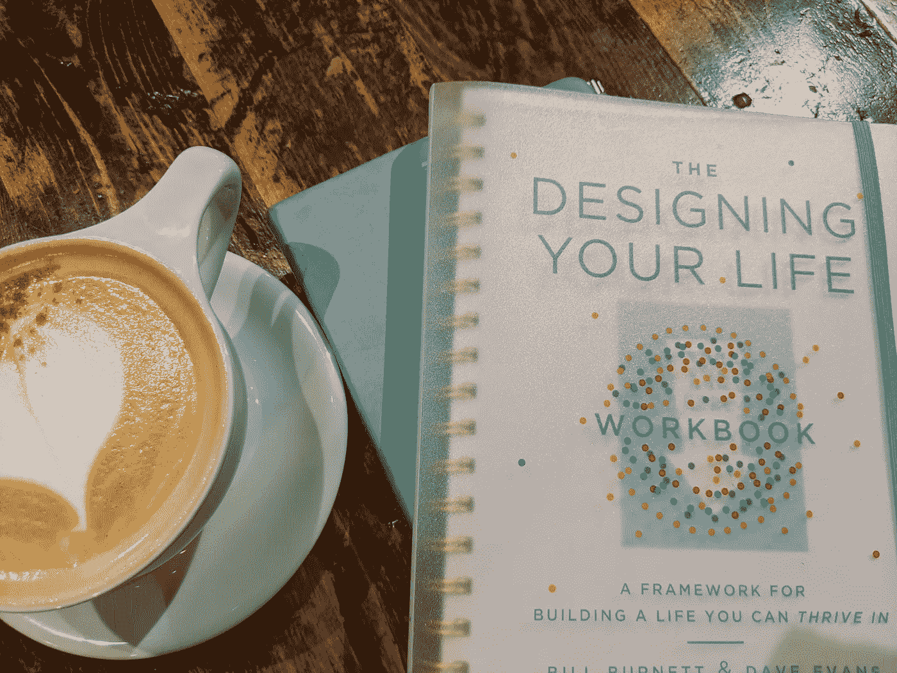
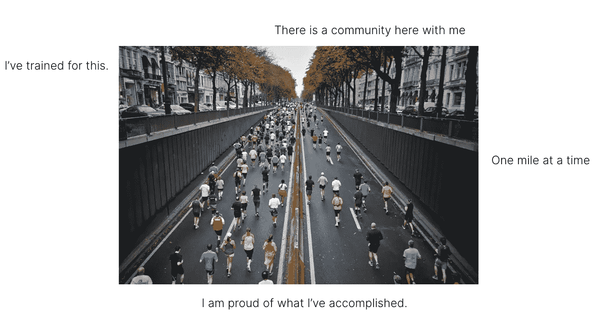

# 回想我在管理层的第一年

> 原文：<https://betterprogramming.pub/the-first-year-of-management-72cb60de318e>

## 给新工程经理的提示和技巧

作者图片

我从没想过要当经理，但每个人总是提起这件事。在我的第一次绩效评估中，我的经理建议这是一条可能的职业道路，当我更换团队时，新经理经常会问我是否有这个想法。我记得我被冒犯了，因为我认为这意味着他们认为我更像一个领导者，而不是一个技术领导者。我以为他们在说我不是一个好的软件工程师。我越来越坚定地认为我永远不会成为一名经理。

回想起来，我意识到我在这些谈话中做了一些假设。那时候，我相信:

1.  管理人员不像软件工程师那样有技术含量/受尊敬
2.  一旦你成为经理，你就再也不能回到软件工程师的岗位上了
3.  擅长一件事意味着你不可避免地会在其他事情上更差

根据我的经验，这些说法是错误的，或者至少不总是正确的，但我反对成为一名经理，因为我相信它们。

但在接下来的四年里，我发现自己越来越被类似经理的活动所吸引:

*   成为实习生的首选，即使我不在他们的团队，他们也想谈论团队问题
*   指导几个实习生和软件工程师，并指导他们的同事第一次晋升
*   创建团队和办公室范围的流程改进
*   非常关心留住人才，并支持团队成员在公司找到他们成功的地方

[真诚媒体](https://unsplash.com/@sincerelymedia?utm_source=medium&utm_medium=referral)在 [Unsplash](https://unsplash.com?utm_source=medium&utm_medium=referral) 上拍摄的照片

直到有一天，我才意识到管理的重要性。我参加了一次内部会议上的一个关于科技职业道路的小组讨论。其中一个小组成员和我有着相同的经历。她在该公司实习了大约四年，并担任了工程师。然后，她过渡到管理层，做了几年经理后，她又过渡回高级工程师。其中一个主持人问了她一个困扰我的问题:

> “你是如何从经理转型回工程师，并成为高级工程师的？你担心你可能已经失去了工程技能吗？”

这位专家的回答改变了我的整个职业道路:

> “为什么你会认为我不能回去做工程师？我做了四年工程师。”

我脑子里突然灵光一闪，我意识到我之所以不考虑管理，是因为我害怕一旦离开工程，就再也回不去了。我为什么要这么做？当然，我会再次成为一名工程师，我已经是一名工程师了。如果我今天能做好我的角色，几年后当我有更多经验时，我肯定能再次做好我的角色。没有了这种恐惧的阻碍，我意识到工程管理有很多令人喜欢的地方，它似乎是我的下一个最佳选择。

我开完会回来，和我的经理分享了我的计划。她非常支持我们，并告诉我们团队需要一位新经理。在多年没有考虑它之后，我的准备和机会完美地结合了。那是 2018 年 10 月，到了 2019 年 1 月，我正在管理一个五人团队。

[istockphoto](https://www.istockphoto.com/photo/open-door-in-a-room-gm514927316-88330245)

# 第 1-3 个月

我的第一个团队有五名工程师:

*   一个已经在团队里呆了一年多的 SDE
*   一个从另一个团队转来的 SDE
*   两名新员工
*   一名实习生

因为这个团队太年轻了，所以我担任了团队第一年的技术负责人。我审查了大部分代码审查，就具体的技术解决方案向团队提供建议，回答关于代码库的问题，并帮助团队调试问题。我知道从长远来看这是不可持续的，我需要在团队中建立这些技能，但从短期来看，这让我可以在帮助团队成长的同时开始管理。这有助于这个新团队拥有我作为软件工程师构建的功能，所以我不需要增加代码库并同时学习成为一名经理。我尽可能推荐这种方法。

这段时间，别人愿意给我的每一个机会，我都说好。为了给我的新团队留下最好的印象，我为每一次一对一做了过度的准备。我的团队面临紧急任务，我努力想知道什么是紧急的，什么是次要的。

我的团队加入了一些新的模糊的项目，我觉得我不知道任何事情的答案，我突然对人们的职业生涯负责。太吓人了。我感到一种令人麻痹的想要变得完美的需求，这是我至今仍在挣扎的事情，我被会议的数量淹没了。我需要做的事情太多，而时间却这么少。回顾我那时的子弹日记，我总是做得太多了。难怪我会有压力。但我很高兴我把时间投入到学习和拥抱新的经历中，因为这在今年晚些时候有了回报。

## 头三个月会发生什么

1.  感觉又像是一名新员工——你将从一名独立可靠的 IC 变成一名需要经常寻求帮助的人。你要学的东西太多了，当你的团队向你寻求帮助时，你不知道答案。没关系。
2.  冒名顶替综合症——当你意识到你的同事现在是其他经理，其中许多人有几十年的管理经验时，这可能会很吓人。虽然有些公司有初级经理的职位，但你通常与更高级的经理处于同一级别。尽管每个人都支持我，理解我是新来的，但我记得在我的前几次工程经理会议或代表我的团队参加大型会议之前，我感到压力很大。我想把工作做好，但我觉得我已经落后了。
3.  平衡技术领导工作和管理是很棘手的。感觉好像你永远没有时间进行代码审查，你可能忍不住要工作很长时间来跟上进度。随着你的成长，你会变得更擅长分清主次和委派任务，而不会总是感到有压力。

## **学习**

在这最初的三个月里，我尽可能地沉浸在学习中。以下是我的主要建议:

## 书

*   朱莉·卓(Julie Zhuo)的《经理人的形成》(The Making of a Manager)——这可能是我在转型期间读过的最喜欢的一本书。
*   卡米尔·福尼尔(Camille Fournier)的《经理之路》(The Manager ' s Path)——有一句台词在转变过程中确实引起了共鸣:“如果你的团队更需要一名经理，而不是一名工程师，那么你必须接受，作为一名经理意味着，根据定义，你不能成为一名工程师。”这提醒了我，当我在探索管理时，我应该全力以赴成为一名管理者。我敢肯定，许多人会不同意，但这体现了我所向往的工程管理类型，在这种类型中，你不会让技术工作盖过人员管理工作。重要的是给自己时间去管理，而不仅仅是成为一个有经理头衔的工程师。
*   帕特里克·兰西奥尼的《痛苦工作的三个迹象》(有时被称为《员工敬业度的真相》)这是一本非常实用和有趣的经理书籍，因为它是通过一个寓言来讲述的。这给了我一个在早期 1x1 应用的框架。我带着敬业度的三个概念，问了与它们相关的一对一的问题，每周轮换到下一个主题。当我有时在领导 1x1 时感到失落时，有一个框架是很好的。

## **LinkedIn 学习课程**

*   [从专业技术人员转为经理](https://www.linkedin.com/learning/transitioning-from-technical-professional-to-manager/)
*   [给予和接受反馈](https://www.linkedin.com/learning/giving-and-receiving-feedback/)
*   [从 IC 到经理的转变](https://www.linkedin.com/learning/transitioning-from-individual-contributor-to-manager/)
*   [传递员工反馈](https://www.linkedin.com/learning/delivering-employee-feedback-5/)
*   [新经理基金会](https://www.linkedin.com/learning/new-manager-foundations-2/)

## 对过渡的建议

*   利用你的优势——在这个致力于创新和学习的时代，记住你还有很多可以提供的。无论是对公司代码库的了解，在公司的深层网络，在另一个团队的经验，甚至是特定的技能，如同理心，对细节的关注，组织等。即使在学习的时候也要把这些优势带进来。你会感觉更好，其他人也会从你的专业知识中受益。
*   拥抱转变——你只有一次成为新经理的机会。拥抱它，不要怨恨它。这是你成为新人、学习和毫无歉意地寻求帮助的时候了。
*   了解你的团队——如果你不爱你的团队，看不到和你一起工作的每个人的价值，这一切是怎么回事？了解你团队中的每个人，问很多问题，了解什么激励他们，什么让他们兴奋，什么让他们沮丧，以及他们想在哪些方面做得更好。寻找你可以争取的快速胜利和长期胜利，这将改善他们的公司体验。人们通常说，一旦你成为经理，你的团队就会成为你的同级经理，但我不同意。你的团队就是你的*团队*，你管理的人。不要忘记这一点。
*   做真实的自己——成为公司最有价值的经理是很诱人的。很容易模仿你最喜欢的经理，复制他们的方法。不要为了与众不同而重新发明轮子，但是记住你的公司信任你成为经理，因为你有重要的技能可以提供。他们希望你成为最好的管理者。即使在你的第一天。

# 第 4-6 个月

三个月过去了，一切都很顺利。我是工程经理。我很好地掌握了我的团队和我们正在进行的项目。我主持职业对话，评估项目，并代表我的团队参加会议。每天都不再觉得那么有挑战性了。我在做这个。然后，随着一个巨大的团队变更项目，一切都走下坡路了。

回想起来，问题从一开始就很明显。我太专注于这个项目令人兴奋的愿景，我知道这对我团队中想要更大挑战的人来说是一个很好的学习机会。我必须让这个工作。在从异地会议回家的飞机上，我和项目负责人来回聊天，一起评估。1-2 名工程师 8 周。当然可以！我没有问很多问题，没有挑战假设，也没有深究估计。我不知道是否有更好或风险更小的方法来做这件事。规模调整与我们团队的能力配合得很好，我也就到此为止了。

说到底，整个团队花了 24 周的时间。我们甚至让其他团队的一些工程师加入进来，让它上线。每个人都承受着巨大的压力。我压力很大，我没有像一个领导者一样承担责任，推迟截止日期，帮助团队分解工作，而是不断地要求更新，最终我让整个团队感到紧张。许多人认为我没有给出足够的积极反馈，感觉我只关心最后期限。我吓坏了；我让所有人失望了。真是失败。

我几乎放弃了管理，认为我做的弊大于利，并且知道我已经在一个主要方面搞砸了，不仅仅是因为项目交付时间表，而是因为我在困难的时刻没有支持团队。如果我不支持我的团队，这一切是怎么回事？

一个朋友提醒我可以改进，劝我不要放弃。我花时间反思我的行为如何伤害了团队，并真诚地试图从这次经历中改进和成长。三年半后回想起来，这一刻改变了我的整个管理方法，我感到幸运的是，尽管我犯了错误，我的团队还是支持了我。

我很高兴这件事这么早就发生了，但在当时，这太难了。不管是三个月、六个月还是一年，大多数新经理都有失败的时候。我最好的建议是以谦逊的态度对待这种情况和反馈，认真考虑你做错了什么，即使你认为你的意图是积极的，并从经验中学习和成长。毕竟，你还是个新经理。

# **吸取的经验教训**

*   给予比你想象的更多的积极反馈，并以团队成员喜欢的方式给予反馈
*   三次检查估计值，并对出错的情况做出解释
*   小心你的优势变成弱点。作为一名工程师，我总是非常关注最后期限，我的优势之一是生产力/当我说我会做的时候就把事情做完。当我高估自己作为经理的优势，只重视团队在截止日期前完成的工作，而不是达到截止日期所需的其他工作时，我可能会在团队中创造一种有压力的、有时甚至是有害的文化。几乎任何力量都可能发生这种情况，有时，我们作为管理者面临的最大挑战是管理与我们完全不同的人。

## **第 4-6 个月的预期**

*   关键项目的交付
*   性能管理
*   撰写您的第一份推广文档
*   团队成员的移民/签证支持
*   新团队成员入职
*   雇用

## **资源**

*   [提高你作为经理的指导技能](https://www.linkedin.com/learning/paths/improve-your-coaching-skills-as-a-manager) (LinkedIn Learning)
*   来自 LeadDev 的[招聘、入职、留用资源](https://leaddev.com/category/hiring-onboarding-retention)
*   [来自 LeadDev 的指导、辅导和反馈资源](https://leaddev.com/category/mentoring-coaching-feedback)
*   帕特里克·兰西奥尼团队的五大功能障碍

# 第 6-12 个月

[图片来自 unsplash](https://unsplash.com/photos/SYYdTxXH5_4)

大约六个月后，我的第一个团队成员决定离开团队。在整个转移过程中，我都在帮助她的研究团队，并尽可能地给予支持，但她要离开了，我很难过。很难不认为这是个人的失败。

我的团队在我们的路线图上取得了进展。这个失控的项目最终启动了。我们花了几个月的时间来修复我们积累的技术债务，然后在八个国家加大国际发布力度。在年底之前，我们已经扩展了该工具，以涵盖 v2 的新用例。这很令人满意；事情正在好转。我们的工作有了回报。

我开始更积极地处理促销文件。到这个时候，我已经有了一个更大的团队，其中一些已经为 SDE II 做好了准备。我让新的团队成员加入进来，定期给予积极的反馈，并指导团队成员成长。

我很忙，但是很忙。比我的头三个月更容易控制。项目经常是混乱的。我经常在知道自己应该做得更好的情况下离开 1x1，我仍然在很大程度上依赖我的经理，但我是一名工程经理。我在第一年学到了很多，也成长了很多。

## **期待什么**

*   更大的挑战(人员和项目)
*   范围扩大
*   更多的独立性
*   定义和提炼你的管理风格
*   保留变得更加重要
*   艰难的日子和更有收获的日子

## **资源**

*   创建或加入公司内外其他工程经理的网络。拥有可以坦诚相待的经理朋友和可以寻求建议的人是很重要的。做经理有时会感到孤独。依靠你的社区。
*   [留住多元化人才](https://www.linkedin.com/learning/inclusive-tech-retaining-diverse-talent)(我的 LinkedIn 学习课程)，从留住科技行业女性的角度讲述了经理的基本原则。
*   订阅《changingthestory.org 》,了解我最新的经理人资源。

*感谢您的阅读！这个演讲的灵感来自我 2021 年在女同性恋虚拟骄傲峰会上的演讲。如果你想看演讲附带的幻灯片或其他资源，请访问我的网站* *。*