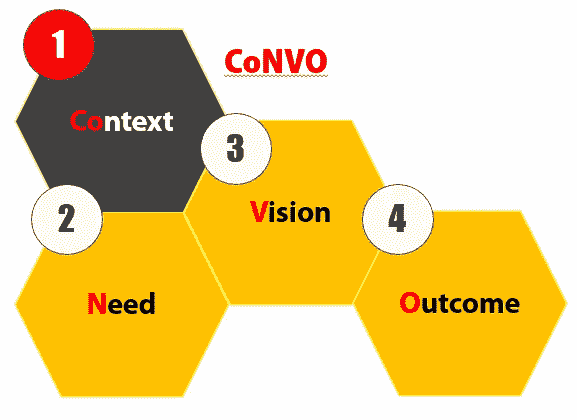
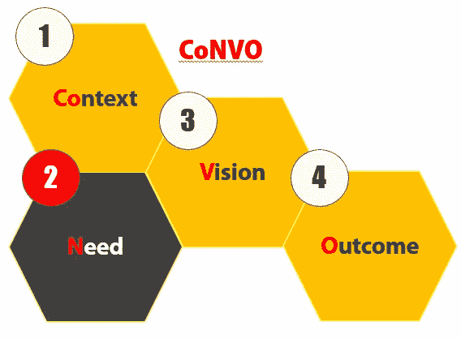
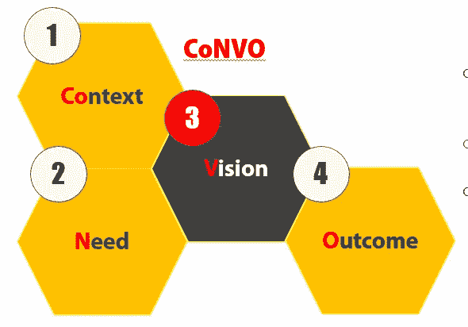
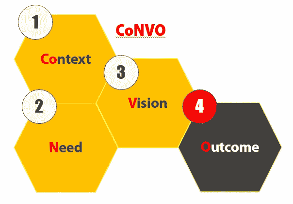

# 项目范围的四个部分

> 原文：<https://betterprogramming.pub/the-four-parts-of-project-scope-2275b47e3a90>

## CoNVO:背景、需求、愿景和结果

哈拉尔德·阿兰德在 [Unsplash](https://unsplash.com/s/photos/honeycomb?utm_source=unsplash&utm_medium=referral&utm_content=creditCopyText) 上拍摄的照片

今天的主题是如何使用 CoNVO 方法正确定义项目的范围。有了一个好的范围，我们就可以勾勒出整个项目中可能面临的目标和问题。因此，我们可以找到一种方法与参与项目的每个人进行有效的沟通。建立信任和防止误解是项目成功的关键。让我们在下一部分了解更多信息。

# 1.会话

项目范围可分为四个不同部分，即:

*   `Context` —项目的背景信息。总之是这个项目存在的主要原因。
*   `Need` —需要解决的挑战或问题。
*   `Vision` —团队将要构建的产品的一瞥。
*   `Outcome` —希望达到的结果，以及项目成功完成后的下一步行动。

## 语境

作者图片

`Context`指该项目的博览会。`Context`可以通过了解我们正在与谁合作以及他们为什么想这么做来定义。最好的方法是确定项目的客户和决策者。`Context`为项目设定整体基调和方向。它还为团队提供了有助于决策的简要背景。

如果你很难想出上下文，试着回答以下问题:

*   我们在和谁合作？
*   他们为什么要这么做？

定义环境包括不断与人们交谈，以了解他们的长期目标。这仅仅是因为目标和使命会随着时间而改变。

## 需要

作者图片

`Need`指我们正在努力解决的问题。它是一个布局，展示了可以改进和添加到产品中的内容，无论是现有产品还是新产品。正确识别需求是困难的，因为你必须清楚地定义利益相关者和目标受众之间的差异。然而，正确地识别需求将会为你节省大量的时间和资源。例如，在数据科学领域，需要的不是构建模型，而是使用您已经构建的模型来解决特定的问题。

为了获得项目的`Need`,你应该做以下事情:

*   提问，倾听，集思广益
*   了解项目的工作流程和过程
*   画图表，列出要做的事情

大多数时候，你只能获得需求的表面层次。你必须深入挖掘，试图找出项目背后的核心。

## 视力

作者图片

愿景是必不可少的，因为它允许团队对最终产品有所了解。简而言之，它定义了产品的外观和感觉以及它的功能。这部分，你需要“秀，不要说。”自然，有好的眼光来源于自己的经历。你可以通过广泛阅读、参加会议和尝试新想法来拓展视野。这需要努力，没有捷径可走。

展示`Vision`最简单的方法是提供产品的实体模型或线框。这两种方法都展示了最终产品的样子，以及作为整体解决方案提供的功能。它应该包括某种形式的测量来决定你的产品是否成功。在这种情况下，可以将其分类为:

*   `Subjective measurement` —主要通过调查和用户反馈完成。
*   `Objective measurement` —依靠从产品端收集的数据进行进一步分析。

## 结果

作者图片

愿景关注的是工作最终会采取什么形式，而结果关注的是当我们完成时会发生什么。它有助于指导我们的下一步行动，将项目具体化为一个完整的产品。因此，我们需要为它制定一个部署计划。它必须包括我们如何将产品推向我们的目标受众。此外，我们必须确定项目的可持续性，以及应该做些什么来保持项目的进行。

你可以通过下面的问题来了解你的项目的`Outcome`:

*   会怎么用？
*   谁会用？
*   我们希望改变什么？
*   谁来维护和支持它？

# 结论

让我们回顾一下今天所学的内容。我们首先简要介绍了定义项目范围的重要性，这可以使用 CoNVO 方法来完成。

`Context`为我们提供项目的说明。它是这个项目的支柱。

`Need` 概述了我们正在努力解决的挑战和问题。

`Vision`让团队中的每个人都了解最终产品的外观和感觉。它降低了它的抽象层次。

`Outcome`在我们完成产品后，有助于指导我们的下一步行动。

一个好的项目范围并不能确保一个成功的产品，但是它可以防止我们关注错误的事情，从而导致不必要的时间和资源的损失。

# 参考

1.  [https://www . oreilly . com/library/view/thinking-with-data/9781491949757/ch01 . html](https://www.oreilly.com/library/view/thinking-with-data/9781491949757/ch01.html)